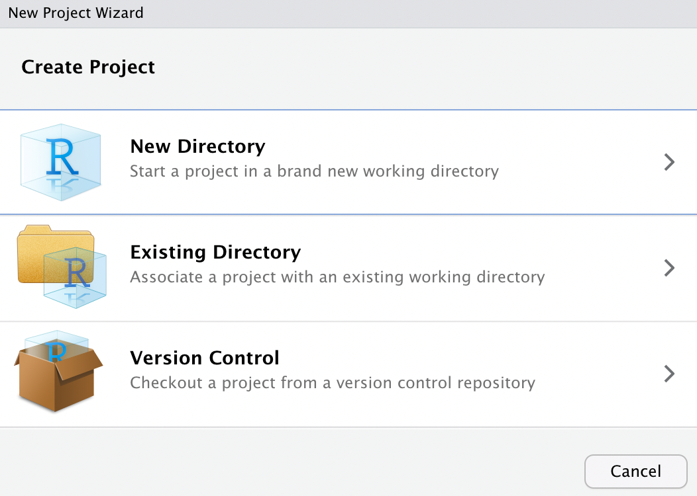

# Class 01. Setting Everything Up

[*subject to updates and corrections*]

## Links for things to install

- https://cloud.r-project.org/ :: R is the programming language that we will be using;
- https://posit.co/downloads/ :: RStudio is an integrated development environment (IDE) for R (In other words, a convenient interface that makes it easier to code in R.)
- https://learnr-examples.shinyapps.io/ex-setup-r/ :: an interactive tutorial on how to install everything, with useful additional explanations.

## Setting Things Up

**Important, like *really-super-duper-important*!!!**:

We will need to set everything up so that it is much easier during the course. Creating folders and subfolders it is crucially important that you create them the exact way it is described below: 1) use only small letters; 2) instead of spaces between words, use “_” (underscore). It is important that you set things up exactly like that. If you make mistakes in naming folders correctly, code that we will be using will most likely not work, because it will not be able to find files that it needs to load and/or save.


**Setting up our main folder:**

- `CADAS-R`
	- Create that folder in “Documents” (one of the default folders both on Mac and Windows); or anywhere else—ideally where you keep all your other folders related to other courses that you are taking; just remember where you create it;
	- In your folder then create the following structure:

```
CADAS-R/
    ├── downloads/
    ├── data/
    │   ├── raw_data/
    │   └── processed_pata/
    ├── literature/
    │   ├── articles/
    │   └── books/
    ├── classes/
    │   ├── class_01/
    │   ├── class_02/
    │   └── class_03/
    ├── pPresentations/
    └── meeting_notes/
```

- `/downloads/`
	- here we will store all the course-related files that you will be downloading;
- `/data/`
	- here we will keep files with our data;
	- we will not really need `/raw_data/` and `/processed_data/`, but, usually, in your own future projects you may want to have such a division, to keep the original data in one folder and data that you have processed (cleaned, updated, etc.) in a different folder;
- `/literature/`
	- This is a way to organize readings, relevant to your project; we will keep here relevant files;
	- Using bibliography managers, like Zotero, is a better option though;
	- Download the following books, and place them in your folder (these are mainly for your reference):
		- <https://www.dropbox.com/s/n1vp6ix87js0j5k/ArnoldHumanities2015.pdf?dl=0>
		- <https://www.dropbox.com/s/zfryoznbkogqssg/HadleyAdvanced2014.pdf?dl=0>
		- <https://www.dropbox.com/s/kh18de2cym65gfi/HadleyGgplot22016.pdf?dl=0>
	- Note, how the names of PDFs are following the same pattern: `AuthorTitleYEAR.pdf`.
- `/classes/`
	- here we will be placing files relevant to specific classes; mainly, these folders will keep the scripts that you will be working on;
- `/presentations/`
	- A folder for your final presentation/project;
- `/meeting_notes/`
	- You may want to store your notes separately;

## Creating a Project

- now that you have created everything, you need to create what is called a “Project” in RStudio. This will create a single file, which you can open in order to load all the necessary settings relevant to our course.
- using “Projects” will help you to keep different research tasks separately and, most importantly, keep all the files relevant to specific tasks well-organized.

So, how to create a project?



1. open RStudio, then, in the main menu, choose: File > New Project (you should then see “New Project Wizard”, as shown below);
1. Select “Existing Directory” > then click on “Browse”, and then select the folder “CADAS-R”, which you created in the first step; click “Create Project” to complete the process.
1. Now, what will happen is that in the tab “Files” in the lower right part of RStudio you will see the contents of the folder “CADAS-R”. There will also be a new file, called `CADAS-R.Rproj`. Later on, you will be able to quickly open your project by double-clicking on that file. When you open the project, R automatically sets the working directory (`setwd()`) to the folder of the project and many things just become much easier.
1. Now, you can add and create new files relevant to your project in the folder “CADAS-R” and they will be easy to find directly from RStudio, using its “Files” Tab, which is usually available in the lower right corner. **Suggestion:** you will benefit greatly from keeping some order in your project folder. For example, keep all the files that you download in a subfolder “downloads”; your your data files in a subfolder “data”, and so on.

## Homework assignments

- Homework (Links will take you to tutorials):
	- http://programminghistorian.org/ is a great resource for learning the basics of practical digital humanities. I encourage you to browse the lessons carefully, just to get a sense of what you can learn to do: http://programminghistorian.org/en/lessons/. Please, read the following assigned lessons carefully. In some cases, it is well worth trying to repeat all the steps on your own computer. I will mark those.
	- **Data organization**: understanding and applying basic principles of data organization will save you a lot of time in the future and will help you to keep your data well organized and easily accessible.
		- James Baker, "Preserving Your Research Data," *Programming Historian 3* (2014), https://doi.org/10.46430/phen0039.
	- **Command Line** is the most foundational tool for anyone interested in doing anything remotely interesting with computers. Unlike graphical-user-interfaces (GIU), here you give commands to the computer by typing them in directly. You will need one of the following two tutorials, depending on whether you use Mac or Windows. You should try to repeat at least some of the commands given in tutorials. These tutorials are a little bit more detailed than what you will need for now; the most important thing for you to understand is how to navigate your computer (i.s., move from one folder to another), copy and move files, create folders, etc.
		- **Mac**. Ian Milligan and James Baker, "Introduction to the Bash Command Line," *Programming Historian 3* (2014), https://doi.org/10.46430/phen0037
		- **Windows**. Ted Dawson, "Introduction to the Windows Command Line with PowerShell," *Programming Historian 5* (2016), https://doi.org/10.46430/phen0054


