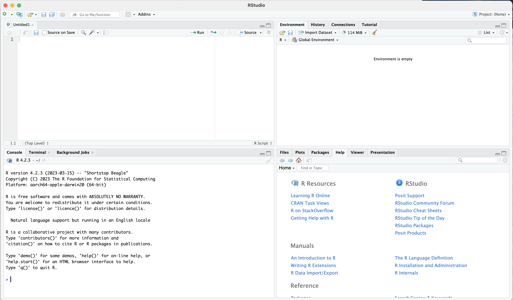

# RStudio, Basic R Commands, Swirl Tutorials

## This Chapter

- Overview of R
- RStudio and its interface;
	-  Describe the RStudio interface and its main components (Console, Script Editor, Environment, and Plots/Packages/Help);
	-  Explain the benefits of using RStudio for R programming;
- File types and projects;
- Basic operators and commands;
- Built-in functions and libraries;
- Basic data structures and when they are used;
- `swirl()` tutorials as homework assignments;

## Overview of R

-   R, its features, and its relevance to historians;
-   R as an open-source programming language and its community;
-   Comprehensive R Archive Network (CRAN);

## RStudio Interface

-  RStudio interface and its main components (Console, Script Editor, Environment, and Plots/Packages/Help)
- The benefits of using RStudio for R programming

||
|:-:|
|Rstudio Interface|

-   top-left:
	- **Open Scripts and Files**: this is where you will be working with your R scripts;
-   bottom-left: 
	- **R console**: this is where you can run R code (without committing it to a script; very handy for quickly testing something);
	- **Terminal**: skipping for now
-   top-right:
	- **Environment**: all active variables are listed here; you can also load data through the “Import Dataset” dialog from here; this tab is useful to keep track of what is loaded into your current state of R; 
	- **History**: here you will find the complete list of commands that you have run already;
	- plus, some other tabs which are not too relevant for now;
-   bottom-right:
	- **Files**: this is your file browser, which is useful when you work with *projects*;
	- **Plots**: all your temporary plots will be appearing here;
	- **Packages**: this is the list of all installed and loaded packages (not the most important tab);
	- **Help**: whenever you invoke help, details will be shown here;
	- **Viewer**: this tab will be showing the results of HTML output; most useful for working with notebooks (next class);
	- plus, some other tabs which are not too relevant for now;

> for a video explanation: <https://www.youtube.com/watch?v=XdgfhqNtje4>

## Main File Types

- main file types: R script, R notebook, and R markdown;
	- R script: contains only R code and comments; most useful for “silent” processing of data and time-consuming analyses that are best run from command line;
	- R notebook (R markdown): allows one to combine executable R code and academic prose; with this format one can create documents that can be regenerated when data is updated
		- *scenario*: you describe some statistical data—on population, for example; in a year or two you get an updated file; your old descriptions may still be true—overall population, distribution of population over years, etc., but the data changed; you can simply regenerate your notebook with new data and all the numbers and graphs will be updated.  
- you can create them from: `File > New File` or the icon with green plus (top left corner);
	- for now, we will try an R script;
	- next class we will start with R notebooks;

## Projects

- RStudio projects make it straightforward to divide your work into multiple contexts, each with their own working directory, workspace, history, and source documents.
- Creating our project:
	- `File` > `New Project`
	- `Existing Directory`
	- choose the directory for the course that we created last time: `CADAS-R` (we agreed that you create it in your “Documents” folder—both Mac ands Windows have such a folder)
	- click `Create Project`
- Using your Project:
	- you now can open RStudio by clicking on the `CADAS-R.Rproj` file in your course folder; this will automatically adjust RStudio settings to that folder
	- in **Files** (bottom-right corner) you will automatically see the folder of your project;
	- you can now use paths relative to your project's folder:
		- review: what are relative and absolute paths?
- Closing your Project:
	- If you did any work with your project and then want to close it, RStudio will ask you if you want to `Save workspace image to ...`, click `Do not save`; while saving may be useful occasionally, in most cases that creates a large temporary file which makes your Rstudio slower.

## Basic Commands

- let's create an R script file in `classes/class_02/` and call it `class_02.R`
	- here is some little filler for our script. Simply copy-paste it into the new script.

```r
# arithmetic operations

3 + 5
3 - 5
3 / 5
3 * 5

# assignment: `<-` or `=`; 
x <- 3 + 5
x

x * 5
x - 5

y <- 3 * 5
y + x

z <- y + x

# = Vs ==

x == y
x = y
x == y

```

- now we can try basic R operations:
	- we can write them in our R script (top-left part of RStudio interface);
	- we can also run them directly in **Console** (bottom-left part of RStudio interface);
	- the main differences are:
		- we can save all our commands in R script, but we cannot do that in console;
		- console, however, is very useful for running commands that we do not want to save (for example, using help commands)
		- R script is most useful when we want to do something complex and we need a series of commands that must run in a specific order; this will be the main use of R scripts (as well as R notebooks);
		- In R script you can execute all commands one after another (as they appear in the script); in console you can execute only one command at a time;
- **basic arithmetic operations**: `+`, `-`, `*`, `/`;
	- let's try some examples from what we pasted into our script;
- **values and variables**:
	- **values**:
		- when we simply typed our commands as we just did we use values, but they are gone as soon as we type the next one; variables allow us to preserve results for later reuse;
	- **variables**:
		- assignment operator (`<-` or `=`) and variable assignment;
		- difference between `=` and `==`;

- **comments**: we can use `#` in front of any line to turn it into a comment; comment means that R will not try to execute it.

## Built-in Functions

Let's add the following few lines to the end of our R script:

```r
# built-in functions

numbers <- c(1, 2, 3, 4, 5, 6, 7, 8, 9)

max(numbers)
min(numbers)
mean(numbers)
sum(numbers)
```

- R comes with some built-in functions, which have this format: `function(arguments)`
	- functions usually pack a few steps that transform and manipulate supplied data (`argument`) and return the result of those manipulations;
- in the code we created a vector (I will explain in a moment what vector is) names `numbers`
- we can try some of the built-in functions and use this variable as an argument. What do you think the following functions will do?
	- `max()` :: ?
	- `min()` :: ?
	- `mean()` :: ?
	- `sum()` :: ?
- functions may take/require a different number of arguments; arguments may be data that you supply and/or some parameters that trigger a specific behavior of a function;
- in order to find out how a specific function works—and what arguments it takes, you can use help function or operator. For example, if we want to get help for the function `mean()`, we can do the following (type and execute):
	- `?mean` (or `??mean` --- this will give broader results);
	- `help(mean)`;
- Thus, help tells us that `mean()` can take the following arguments:
	- `mean(x, trim = 0, na.rm = FALSE, ...)`
- Alternatively, you can always google how to do a certain thing in R...

## Libraries/Packages

-   The concept of R packages and their role in extending R's functionality;
	- you can think of packages as additional programs for R (like MS Word on your computers that gives you a useful tool for writing your papers);
	- packages give you access to more functions;
-   Packages can be installed:
	- using the `install.packages()` function (the name of the library should be in quotation marks);
		- let's install `ggplot2` with this command;
		- let's also install `stringi` with this command;
	- using interface: **Tools > Install Packages**
		- let's install `tidyverse` via the interface;
	- let's also install library `swirl` :: you will need it for your homework;
-   Packages can be loaded using function `library()` (or `require()`);
	- `library(ggplot2)`
	- `library(tidyverse)`
	- `library(stringi)`
- Alternatively, you can call specific functions directly from specific libraries:
	- `stringi::stri_rand_lipsum(2)` :: try this example;
	- this way is sometimes necessary when there are functions with the same name in different loaded packages;
	- you can try to run the following line of code to generate a graph:
		- `ggplot2::ggplot(mtcars) + ggplot2::geom_point(ggplot2::aes(x = mpg, y = hp))`
	- this code becomes simple, if you have loaded the library `ggplot2` in advance:
		- `ggplot(mtcars) + geom_point(aes(x = mpg, y = hp))`


## Values and their types

There are several main types of values in R (these are the most important ones):

- *numeric*: `3` or `3,14`
- *character*: `character` or `"3.14"`
- *logical*: `TRUE` or `FALSE`

You can check the type of value by using `class()` function, suppling the value or the variable as an argument.

You can convert between types:

- `as.numeric()` to convert to numeric; you will not be able to convert to numeric a vector that contains letter characters;
-  `as.character()` to convert to character; any vector can be converted to character;

There are some other types, which we will cover when they become relevant.


## Basic Data Structures and Their Practical Usage

One can say that everything in R revolves around vectors and vector algebra. This is not as scary as it may sound, but it has an extremely profound effect on how everything is done in R. 

A vector is a fundamental data structure that represents a one-dimensional array containing elements of the same data type. Vectors are used to store and manipulate collections of values, such as numbers, characters, or logical values. They are the basic building blocks for more complex data structures like matrices, data frames, and lists.

Unless there is evidence to the opposite, you can assume that a variable/value is a vector. All operations in R work like vector operations, which makes R effective, efficient, and quite elegant.

Vectors in R are versatile and can be used to perform various operations, such as element-wise arithmetic, comparisons, and aggregations. R has a rich set of built-in functions for working with vectors, which makes it a powerful language for data manipulation and analysis.

Keep in mind that the elements of a vector must be of the same type. If you try to combine different types of elements in a vector, R will attempt to coerce the elements to a common type, following a hierarchy of types (logical < integer < double < character). For example, if you combine numeric and character values in a vector, R will convert the numeric values to character values. If you need to store elements of different types, you can use a list, which is a more flexible data structure in R.

### Basic data structures

- vectors;
- matrices;
- dataframes/tibbles;
- lists;

### Main properties of basic data structures

- *single dimension* (x axis):
	- vectors: each vector is a vector
	- a vector can hold data of only one type!
- *two-dimensions* (x-axis: rows, y-axis: columns):
	- matrices:
		- a vector folded into two dimensions; (each element can be accessed as if it were a vector - 1dim coordinates, or as if it were a matrix -- 2dim coordinates;)
		- like a vector, a matrix can only hold data of one type!
	- dataframes / tibbles;
		- columns and rows, where each column is a vector (i.e., must be the same type);
- *heterogeneous*:
	- lists:
		- anything can be an item in a list;

### Most Common Usage of Basic Data Structures:

- **storing data**: most commonly, data frames / tibbles are used for storing data;
	- you will load data into R in a form of a data frame and then you will start your analyses;
- **calculations (modifications, alterations, updates, etc.)**: these are most commonly performed on vectors, or, most commonly, columns of data frames or, in case of matrices, on complete matrices or their columns or rows. Matrices are used almost exclusively for complex calculations (for example, we can use them for identifying groups of individuals with similar characteristics).
- **export of data from complex functions**: list are very convenient to return results of complex functions, since they can hold any types of data structures in a single object; we are not going to use them much (if at all); they become useful after you reach a certain level of complexity in your work with R;

###  Basic Data Structures Examples

#### Vectors

In R, a vector is a one-dimensional array that can store a collection of values of the same type. You can create a vector using the `c()` function, which combines multiple values into a single vector. Here's an example of vectors. (Check what happens with `mixed_vector`).

```r
numeric_vector <- c(10, 20, 30, 40, 50)
character_vector <- c("apple", "banana", "cherry", "date", "fig")
mixed_vector <- c(10, 20, 30, 40, 50, "banana")
```

Print out:

```R
[1] 10 20 30 40 50
[1] "apple"  "banana" "cherry" "date"   "fig" 
[1] "10"     "20"     "30"     "40"     "50"     "banana"
```

#### Matrices

In R, a matrix is a two-dimensional array that can store a collection of values of the same type, organized in rows and columns. You can create a matrix using the `matrix()` function. Here's an example of a numeric matrix:

```R
numeric_matrix <- matrix(c(1, 2, 3, 4, 5, 6), nrow = 2, ncol = 3)
```

Print out:

```R
     [,1] [,2] [,3]
[1,]    1    3    5
[2,]    2    4    6
```

#### Data.frames/tibbles

A data frame is a table-like data structure in R, where each column can contain different types of data, and rows represent observations. A `tibble` (short for "tidy data frame") is a modern version of a data frame, introduced by the `tidyverse` package collection, which offers some improvements over the traditional data frame, such as better printing and subsetting.

```R
# Load required libraries
library(dplyr)
library(tibble)

# Define the data
names <- c("Alice", "Bob", "Charlie")
ages <- c(25, 30, 22)
gender <- c("F", "M", "M")

# Create the data frame
my_dataframe <- data.frame(Name = names, Age = ages, Gender = gender)

# Create the tibble
my_tibble <- tibble(Name = names, Age = ages, Gender = gender)

```

Print out for data.frame:

```R
     Name Age Gender
1   Alice  25      F
2     Bob  30      M
3 Charlie  22      M

```

Print out for tibble:

```R
# A tibble: 3 × 3
  Name     Age Gender
  <chr>  <dbl> <chr> 
1 Alice     25 F     
2 Bob       30 M     
3 Charlie   22 M     

```

#### Lists

In R, a list is a versatile data structure that can store a collection of values, where each element can be of a different type or even another data structure like a vector, matrix, or another list. You can create a list using the `list()` function. Here's an example of a list:

```R
# Define the data
names <- c("Alice", "Bob", "Charlie")
matrix_data <- matrix(c(1, 2, 3, 4, 5, 6), nrow = 2, ncol = 3)
sublist <- list(temperature = 72, weather = "sunny")

# Create the list
my_list <- list(Names = names, Data = matrix_data, Sublist = sublist)
```

Print out:

```R
$Names
[1] "Alice"   "Bob"     "Charlie"

$Data
     [,1] [,2] [,3]
[1,]    1    3    5
[2,]    2    4    6

$Sublist
$Sublist$temperature
[1] 72

$Sublist$weather
[1] "sunny"

```

#### RDS Files

They provide a convenient and efficient way to save and load R objects such as vectors, matrices, data frames, lists, and models. RDS files use a compact representation, which makes them smaller in size and faster to read and write compared to text-based file formats like CSV or TSV.

You can save an R object to an RDS file using the `saveRDS()` function and load an R object from an RDS file using the `readRDS()` function.

RDS files are particularly useful when working with large datasets or complex objects, as they allow for fast and efficient storage and retrieval. However, keep in mind that RDS files are specific to R and may not be compatible with other programming languages or software without additional conversion.

Summary:

- quick and small, because they are binary;
- very handy, because one can use the same command to save/load any data structure;

## Homework with `swirl()`

- Homework assignment: **Swirl Course Tutorials**;
- Swirl Course: `R Programing`(you will be asked to install it in the beginning);
	- other course can be installed with `install_course("name of the course")` (perhaps, the only relevant to us course will be "Exploratory Data Analysis");
- Swirl: start the `R Programming` course; 
- Swirl tutorials to complete:
	- for Lesson 02:
		- Basic Building Blocks;
		- Workspace and Files;
		- Sequences of Numbers;
		- Vectors;
	- for Lesson 03:
		- Missing Values;
		- Subsetting Vectors;
		- Matrices and Dataframes;
		- Logic;
- Swirl commands:
	- `library(swirl)` to load the library;
	- then type `swirl()` to start it;
	- your main course is `R Programming`
	- start it and complete the assigned modules;
	- in the middle of the lesson, you can use `play()` to go into a free mode, if you need to check something in R;
	- type `nxt()` to return to the lesson;
- Swirl Additional Courses:
	- <http://swirlstats.com/scn/title.html>
	- there are some more courses, with quite a few in German and Spanish;
	- recommend you to try for practice;
- **Swirl assignment submission**:
	- when you reach the end of the course, choose yes if you want to receive credit;
	- type in your email;
	- type in XXXXX for your Corsera.org token;
	- then, you will get an error; do not worry, I want you to take a screenshot of this screen and email it to me as your confirmation; (take a screenshot of either your entire screen, or of the entire RStudio screen).
	- in the topic of our email, use the format described in the syllabus;
		- please, send one email per module, that is to say, you will need to send me 4 emails by the next class;
		- I recommend you to do these whenever you have time; it is best to do them not in one go, but rather take breaks between them;

