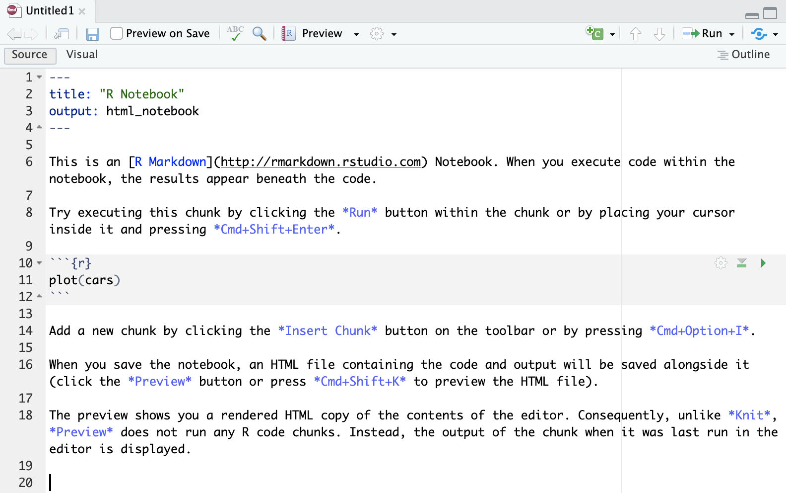
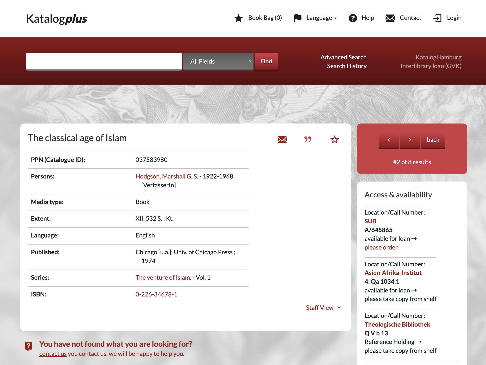

# R Markdown and R Notebooks

## Previous lesson

- ...

## This lesson

- we will start with R notebooks which will become our main format for the class;
- you will be creating them for each class, completing assignments, and generating final document which you will be sending to me as your homework;
- we will need some new packages:
	- `rmarkdown`;
	- `knitr`;
- and some files to get us started:
	- place these three files into the main folder of your project:
		- `bibliography.bib` 
		-  `chicago-author-date.csl`
		-  `chicago-fullnote-bibliography.csl`

## R Notebook/Markdown

Technically, there are two types of R documents: R notebooks and R markdown. R notebooks are supposed to be more interactive, but they also seems to cause too many issues when one tries to generate them. We will focus on R markdown documents. 

R Notebooks/Markdown are complex documents that combine executable R code, formatted text, images, and other elements in a single file. They are a powerful tool for data exploration, analysis, and visualization, as well as for creating reproducible research documents and reports. R Notebooks are a part of the R Markdown ecosystem, which provides a suite of tools for creating dynamic, self-contained documents using the R programming language.

R Notebooks are created and edited using RStudio, a popular integrated development environment (IDE) for R. RStudio provides a user-friendly interface for creating and working with R Notebooks, which are saved as files with the extension `.Rmd`. These files are plain text files that use the Markdown language for formatting text, and R code is embedded using code chunks.

Some key features of R Notebooks include:

1. **YML Header:** this block is always at the very beginning of R notebook. YAML (short for "YAML Ain't Markup Language", or "Yet Another Markup Language") is a human-readable data serialization format used to store metadata and configuration settings for the notebook. YAML is used in the R Notebook's header, which is also known as the YAML front matter or YAML header. This header is placed at the very beginning of the `.Rmd` file and is enclosed between two sets of triple dashes (`---`). The YAML header contains key-value pairs that define various settings and options for the R Notebook, such as the title, author, date, and output format. These settings are used by the `rmarkdown` package to control how the notebook is rendered and displayed.
1.  **Code Chunks**: R code is embedded in the notebook using code chunks, which are enclosed in triple backticks (\`\`\`). These chunks can be executed independently or as part of the entire document, with the results (output, tables, or plots) displayed directly below the corresponding code chunk.
3.  **Inline Code**: R code can also be embedded directly within the text using inline code expressions, which are enclosed in single backticks and start with the letter "r". The result of the inline code expression is inserted directly into the text when the notebook is rendered.
4.  **Rich Text Formatting**: R Notebooks support Markdown syntax for formatting text, which allows you to create well-structured documents with headers, lists, tables, images, and other useful elements.
5.  **Output Formats**: R Notebooks can be rendered into various output formats, such as HTML, PDF, or Microsoft Word, using the `knitr` and `rmarkdown` packages. This makes it easy to share your work with others, even if they don't use R or RStudio.
6.  **Reproducibility**: R Notebooks enable reproducible research by storing the code, data, and results together in a single document. This makes it easy for others to replicate your analyses and build upon your work.

To create a new R Notebook in RStudio, go to the "File" menu, select "New File", and then choose "R Notebook". This will open a new `.Rmd` file with some basic content, which you can edit and customize as needed.

### R Notebook/ YML Header

When you create an R notebook via RStudio interface, it automatically creates a template, which looks like what is shown on the image below. You can save it and generate it (or *knit* it)—an HTML file will appear next to it. You can preview it in “Viewer” (bottom right part of the RStudio interface).

**Important:** the files must be named `Class_03.Rmd` and saved into this folder: `./57528_DH_in_AAS_PUA_R/Classes/Class_03`.

||
|:-:|
|Default R Notebook Template|

Let's modify the YML header in the following manner (but use you name :):

```YML
---
title: "Class 02: R Markdown and R Notebook"
author: "Maxim Romanov"
date: "2023-04-12"
output:
  html_document:
    toc: true
    toc_depth: 3
    theme: "united"
bibliography: ../../bibliography.bib
csl: ../../chicago-author-date.csl
---
```

- Tick [ ] **Preview on Save** (this option is nice for small documents, but you would want to switch it off if your document is too large and takes some time to generate. For now, keep it on.)
- **Preview** menu will change to **Knit** when we change `html_notebook` to `html_document`; in that menu you can choose the format of the document that you want to *knit*;
- The **Gears** menu (next to **Preview**): make sure to choose “Preview in viewer Pane” — your document then will be automatically shown in the bottom-right section of RStudio.

**Note:** You can customize the YAML header to change the appearance and behavior of your R Notebook, as well as to include additional metadata. The `rmarkdown` package documentation provides more information on the available options and settings: [https://rmarkdown.rstudio.com/lesson-1.html](https://rmarkdown.rstudio.com/lesson-1.html)

You can also automatically generate a MS Word file, by changing the YML header to (note that we added `word_document` output  parameters):

```YML
---
title: "Class 02: R Markdown and R Notebook"
author: "Maxim Romanov"
date: "2023-04-12"
output:
  word_document:
    toc: true
    toc_depth: 3
  html_document:
    toc: true
    toc_depth: 3
    theme: "united"
bibliography: ../../bibliography.bib
csl: ../../chicago-author-date.csl
---
```

#### Bibliography and References

**Important!** Make sure to create file `bibliography.bib` and save it to the main folder of your class project.

Note the path in our YML header: `../../bibliography.bib`. What does it mean?

Use the following contents for the `bibliography.bib` file:

```latex
@book{ArnoldHumanities2015,
  title = {Humanities Data in {{R}}},
  author = {Arnold, Taylor and Tilton, Lauren},
  date = {2015},
  publisher = {{Springer Science+Business Media}},
  location = {{New York, NY}},
  isbn = {978-3-319-20701-8}
}

@book{HadleyAdvanced2014,
  title = {Advanced {{R}}},
  author = {Hadley, Wickham},
  date = {2014},
  publisher = {{CRC Press}},
  location = {{London}},
  annotation = {OCLC: 904449443},
  isbn = {978-1-4665-8697-0},
  langid = {english}
}

@book{HadleyGgplot22016,
  title = {Ggplot2: {{Elegant Graphics}} for {{Data Analysis}}},
  author = {Hadley, Wickham},
  date = {2016},
  publisher = {{Springer Science+Business Media, LLC}},
  location = {{New York, NY}},
  isbn = {978-3-319-24275-0}
}
```

As you might have guessed already, `bibliography.bib` is a file with bibliographical information. You can also probably guess that it now contains three references—to the books that we use as references in our course. `*.bib` is a `BibTeX` format for recording machine-actionable bibliographical data: you can probably quite easily understand these records. (You can find a detailed description of this format here: <https://en.wikipedia.org/wiki/BibTeX>).  You can quite easily create such records manually, but in most cases you can actually download them from practically any online library. 

For example, the two screenshots below show you how you can get `bibTeX` data from the online catalog of our UHH Library:

||
|:-:|
|A record in Katalog**_plus_** of the UHH Library|
||
|An export interface: click on BibTeX to download the record|

Unfortunately, records do not always look perfect:

```
@book{
Solr-037583980,
title = {The classical age of Islam},
series = {Hodgson, Marshall G. S. 1922-1968 The venture of Islam.},
author = {Hodgson, Marshall G. S. 1922-1968},
publisher = {Univ. of Chicago Press},
year = {1974},
}
```

You want to change it into something like the following:

```
@book{HodgsonVentureI1974,
  title = {The venture of Islam, Vol 1: The classical age of Islam},
  author = {Hodgson, Marshall G. S.},
  date = {1974},
  publisher = {{University of Chicago Press}},
  location = {{Chicago}}
}
```

The most important part is the KEY (`HodgsonVentureI1974`) — it must be unique and, ideally, easy to remember so that you can use it in the document.

Using `bibTeX` references is very easy: simply add `[@key]` to wherever you want the reference to appear. The complete bibliographical record will be also automatically added at the end of the document. For this reason, make sure that your document ends with the following line (empty line, followed by `# Bibliography` and then followed by another empty line):

```md

# Bibliography

```

##### Collecting Bibliographical References: Zotero + BetterBibTeX

- the best and easiest way to do that is to collect them via Zotero (<https://www.zotero.org/>), although other bibliography managers should be suitable for this purpose;
- with Zotero you can “harvest” bibliographical records from book stores (like Amazon), most digital catalogs (like our UHH Library), as well as journal databases/websites (like JSTOR);
- collected bibliographical data can be then easily exported into BibTeX format using Zotero plugin `better BibTeX` (<https://retorque.re/zotero-better-bibtex/>); in this plugin you can also define how your keys should be formatted, and it will take care of ensuring that every key is unique. 

##### Zotero

Zotero is an open-source reference management software that helps researchers, students, and professionals collect, organize, cite, and share research sources, such as journal articles, books, web pages, and multimedia content. Zotero is particularly useful for managing bibliographies and citations, making it easier to maintain an accurate and up-to-date record of sources used in a research project or academic paper.

Some key features of Zotero include:

1.  **Source Collection**: Zotero can automatically extract bibliographic information from web pages, online databases, and library catalogs, allowing you to quickly add sources to your Zotero library. It also supports importing reference data from other reference management tools, such as EndNote, Mendeley, or BibTeX.
2.  **Organizing and Tagging**: Zotero provides tools for organizing your research sources into collections and sub-collections, which can be shared with collaborators. You can also use tags and notes to further categorize and annotate your sources.
3.  **Citation and Bibliography Generation**: Zotero integrates with popular word processing software like Microsoft Word, LibreOffice, and Google Docs, enabling you to easily insert citations and generate bibliographies in a wide range of citation styles, such as APA, MLA, Chicago, and many others. Zotero's citation engine is built on the open-source Citation Style Language (CSL), which supports thousands of citation styles.
4.  **Collaboration**: Zotero allows you to create group libraries, which can be shared among multiple users for collaborative research projects. Group libraries can be set up with different access and editing permissions, making it easy to manage collaboration among team members.
5.  **File Storage and Synchronization**: Zotero provides cloud-based storage for your library data and attached files, such as PDFs or images, allowing you to access your Zotero library from multiple devices and keep everything in sync. Zotero offers 300 MB of free storage and additional storage plans for purchase.

Zotero is available as a standalone desktop application for Windows, macOS, and Linux, as well as a browser extension for Firefox, Chrome, and Safari. You can learn more about Zotero and download the software from the official website: [https://www.zotero.org/](https://www.zotero.org/)

##### Citation Styles

As you may know, Zotero allows one to dynamically change style of your citations and bibliography. This can be done with R markdown as well. We just need to provide a file with the style that you want to use.

<https://www.zotero.org/styles> is the website where you can find the style that you need. That style needs to be downloaded and placed into the folder of your project, and linked to in the same manner as we did with the `bibliography.bib` file.

I have downloaded the following two styles. Please, download them as well. We will experiment with them.

- [Chicago Manual of Style 17th edition (author-date)](https://www.zotero.org/styles/chicago-author-date) (2022-12-12 04:02:09)
- [Chicago Manual of Style 17th edition (full note)](https://www.zotero.org/styles/chicago-fullnote-bibliography) (2023-03-31 12:44:56)

### Basics of Markdown

Markdown is a lightweight markup language designed for formatting plain text documents in a human-readable and easily-editable way. Created by John Gruber and Aaron Swartz in 2004, Markdown has become a popular choice for authoring web content, documentation, and even academic papers due to its simplicity and ease of use. The main motto of markdown:

> “A Markdown-formatted document should be publishable as-is, as plain text, without looking like it’s been marked up with tags or formatting instructions.” (John Gruber)

The primary goal of Markdown is to make writing for the web as natural and intuitive as possible, while still allowing for basic text formatting, such as headings, lists, bold, italics, links, images, and more. Markdown uses simple punctuation and symbols to represent formatting elements, which makes it easy to learn and write without the need for complex tags or HTML code.

In markdown each structural element is coded explicitly, but in a very simple manner (if compared to HTML, XML, LaTeX, or any other language that is used for similar purposes). Additionally, explicit structural encoding helps to maintain clean structure of a document.

Markdown offers all the features you might possibly need for any kind of writing, including academic writing:

-   Headers of different levels
-   Lists: ordered, unordered, mixed
-   Links
-   Images
-   Block quotes
-   Latex equations
-   Horizontal rules (i.e., horizontal lines to visually break up your content)
-   Tables
-   Footnotes
-   Citations/References (multiple styles)
-   Bibliography
-   Slide breaks
-   Text formatting
	-   Italicized text
	-   Bold text
	-   Superscripts
	-   Subscripts
	-   Strikethrough text

You can download and use this cheatsheet, until you get comfortable with markdown: <https://github.com/rstudio/cheatsheets/raw/main/rmarkdown-2.0.pdf>

RStudio also offers a very nice and detailed presentation of markdown: https://rmarkdown.rstudio.com/lesson-1.html. You can also use this free guide: <https://bookdown.org/yihui/rmarkdown/> (can be also downloaded as a PDF).

Let's try the most important elements of markdown—in the file that we created in the beginning of the class.

- Basics of markdown:
	- simple explicit formatting
	- basic principles: 
	- main elements:
		- YML header;
		- headers;
		- paragraphs;
		- text: bold, italics, strikethrough, superscript, subscript, code;
		- lists;
		- tables;
		- images;
		- executable code blocks;
		- executable inline code;
		- footnotes;
		- bibliography;
			- file; include some references; remaining must be added by the students;
			- collecting;
- generating notebook: HTML and DOCX only; PDF --- try on your own;
- HW:
	- create a notebook for the description of PUA: <https://www.eea.csic.es/pua/info/proyecto.php> (use English version);
		- references: you can find some references here: https://www.eea.csic.es/pua/info/otroscolaboradores.php

## Homework

- complete 4 more modules in `swirl()`:  Missing Values; Subsetting Vectors; Matrices and Dataframes; Logic; 
- create a R notebook and recreate the content of this web page in markdown: <https://www.eea.csic.es/pua/info/proyecto.php>. This will give you some practice with the main elements of markdown syntax and formatting.
	- **NB:** the document does not include some important elements, so, please, at your own discretion, use the following:
		- add a few footnotes;
		- add a few references (you can use the ones from the `bibliography.bib`, but also at least two-three new references.)
	- this task took me about 20 mins to finish; it will take longer for you, but it should not be too much longer. In any case, the goal is to make you practice markdown—it is a very efficient system which is now everywhere and you will benefit greatly, if you know how to use it. With just a little bit of practice you can become proficient in markdown.


