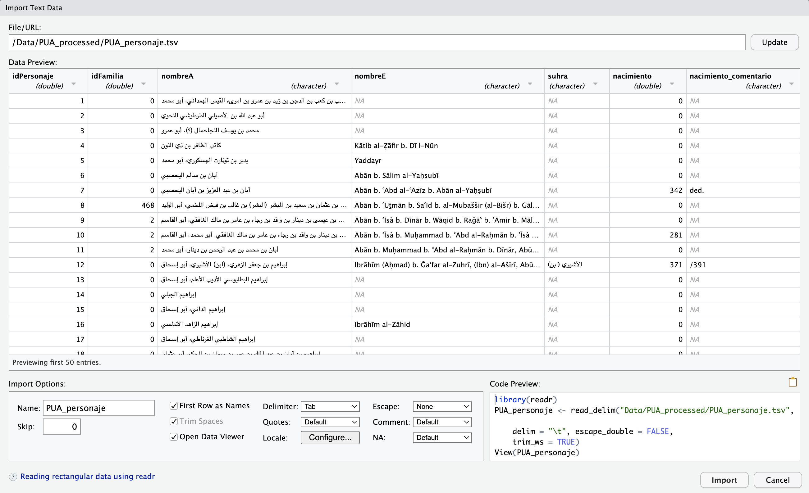
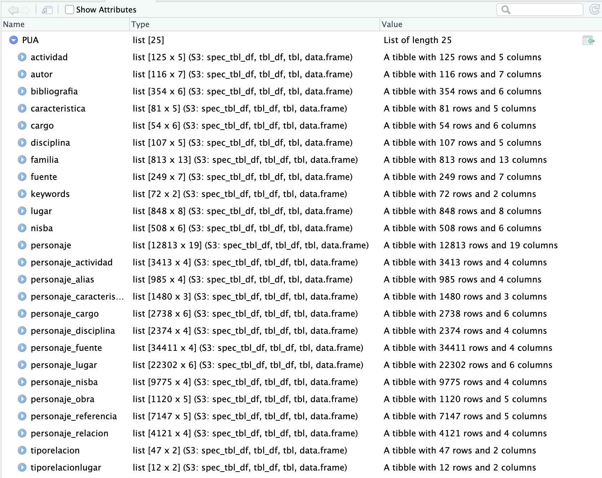
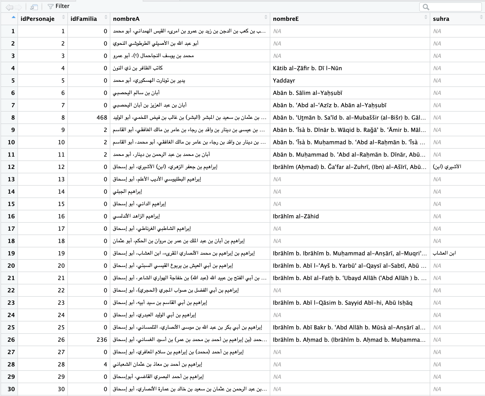
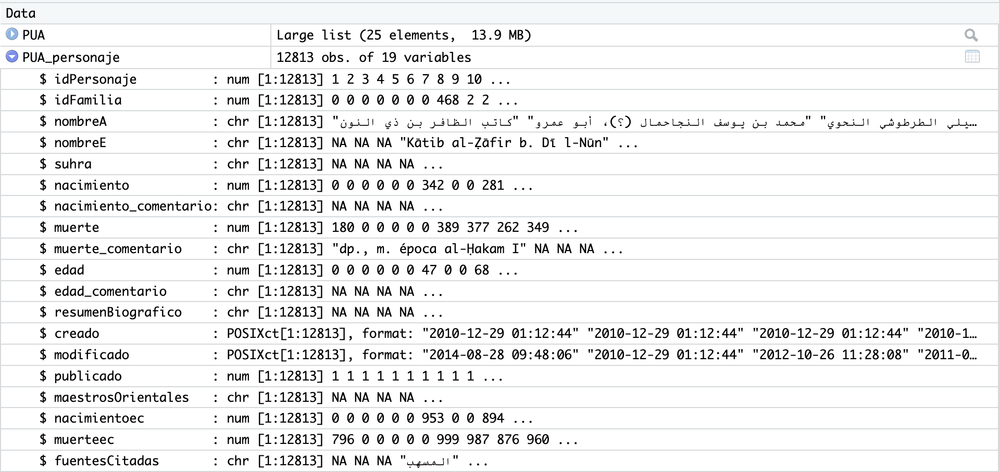
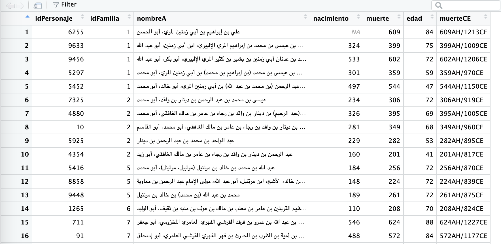
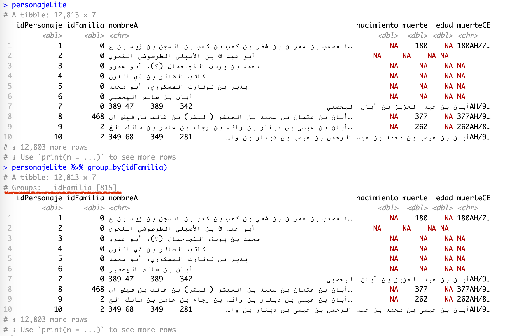
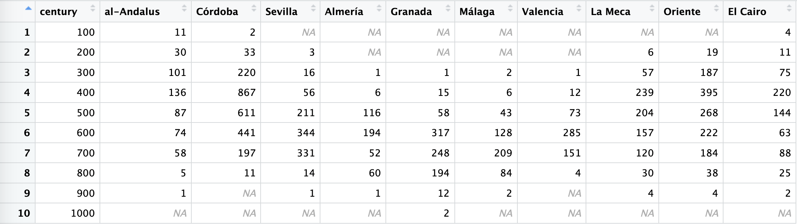

# Data Manipulation I

## This Chapter

- last class focused mainly on formatting, this class will add code chunks into our R markdown documents;
- we will learn and practice working with tabular data (simply put, tables):
	- main relevant data format: TSV / CSV;
	- loading data;
	- manipulating data;
	- generating and extracting observations from data;
- we will start analyzing some data from the PUA database; you will need the following file, which will be shared via Slack. Make sure to put it in the correct folder as shown below (create missing subfolders if they are missing):
	- `Data/PUA_Processed/PUA_allDataTables_asList.rds` :: this file contains all the data from the original relational database (MySQL) of the PUA project. Like any relational database, this one consists of a series of interconnected tables, which are all described in the appendix to this lesson.
	- `Data/Pua_Processed/PUA_personaje.tsv` :: this is the main table from the PUA database; in fact, this one is included in the RDS file given above; we will use this file only for practicing loading data into RStudio from TSV, since this is one of the most common operations for loading data.
	- *questions*:
		- what format is this data stored in and how can we load it in R?
		- what is the internal structure of the data?

<!--ANSWER:  The data is stored in the RDS format (“R Data Single”); the object inside the RDS file is a LIST. As was discussed in one of the preceding lessons, LISTS are great for aggregating lots of data in different formats into a single variable, while RDS files are best for storing such complex objects; -->

<!--

## Main Data Structures — Review

- review of main data structures and how we can subset them;
	- subsetting refers to focusing on a specific part of our variable such as singe element, a range, a column, a raw — and their combinations;
		- vectors, matrices: ranges, single values;
		- matrices, dataframes/tibbles: columns, rows, single values, ranges;
		- lists: single values > then whatever is applicable to the data structure type of the selected item (vector, matrix, dataframe/tibble, another list)

-->


## Why `tidyverse`?

> The `tidyverse` is an opinionated [collection of R packages](https://www.tidyverse.org/packages) designed for data science. All packages share an underlying design philosophy, grammar, and data structures. Here we find a set of functions to perform common data manipulation tasks on data frames, making the process more efficient, readable, and expressive. Although `tidyverse` is not specifically designed for historians, it can be highly relevant and useful for them when working with structured data. (Hadley Wickham is one of the key creators and developers of `tydyverse`.)

1.  **Data organization**: we often work with large datasets containing various types of information, such as dates, names, events, and locations. The `tidyverse` package allows us to organize and clean these datasets efficiently.
2.  **Data filtering**: we may need to focus on specific subsets of data, such as filtering by time periods, regions, or other relevant criteria. The `tidyverse` package provides functions like `filter()` and `slice()` that make it easy to filter and subset data.
3.  **Data transformation**: we often need to create new variables or modify existing ones. The `mutate()` function allows users to create new columns based on existing data, while `transmute()` can be used to create a new data frame with only the newly created variables.
4.  **Data aggregation**: Analyzing data by grouping it based on certain variables, such as time periods, regions, or categories, is a common task for us as historians. The `tidyverse` package provides the `group_by()` function, which makes it easy to group data, and functions like `summarize()` and `tally()` to perform summary operations on the grouped data.
5.  **Data merging**: we often need to combine data from multiple sources or datasets. The `tidyverse` provides functions like `left_join()`, `right_join()`, `inner_join()`, and `full_join()` that make it easy to merge data frames based on common variables.
6.  **Data reshaping**: we may need to reshape our data for different types of analysis, such as converting data from wide format to long format or vice versa. The `tidyverse` facilitates data reshaping.
7.  **Readability**: `tidyverse` uses a syntax that is easy to read and understand, even for those who are not familiar with R. This is particularly helpful for humanists who may not have extensive programming experience but still need to work with data.

To sum up, we can efficiently manipulate, analyze, and visualize our data, which enables us to gain insights and draw conclusions from historical records more effectively.

The `tidyverse` includes several popular packages for data manipulation, visualization, and modeling, such as:

1.  `readr`: For reading and writing data, particularly CSV and TSV files.
2.  `tibble`: For working with modern, enhanced data frames called tibbles.
3.  `dplyr`: For data manipulation, including filtering, selecting, and transforming data.
4.  `tidyr`: For cleaning and reshaping data, making it easier to work with.
5. `stringr`: For working with strings, providing functions to manipulate, extract, and search text.
6. `ggplot2`: For data visualization, creating powerful and flexible graphics.
7.  `purrr`: For functional programming and iteration, making it easier to work with lists and apply functions to data.
8.  `lubridate`: For working with dates and times, making it easier to parse, manipulate, and perform arithmetic with date-time objects.

Together, these packages provide a comprehensive set of tools for data science workflows. Last but not least, as the `tidyverse` approach has gained significant popularity in recent years, numerous additional libraries adhering to the `tidyverse` principles for working with data have emerged. This positions the `tidyverse` as the central hub for everything related to R.

## Main Data File Formats: CSV and TSV

First, let's talk about data formats just a little bit. We are primarily focusing on tabular data, which essentially means tables—like what you might create in MS Excel, Google Spreadsheets, of some other program like that. These programs, however, usually rely on their own proprietary formats. Meanwhile, most analytical programs and programming languages “prefer” plain text formats like CSV or TSV, which are essentially two flavors of the same format.

CSV (Comma-Separated Values) and TSV (Tab-Separated Values) are both simple and widely-used file formats for storing and exchanging tabular data. They are plain-text formats that represent data in a table, with rows and columns. The primary difference between the two formats lies in the delimiter used to separate the values in each row.

CSV Format:

-   In a CSV file, values are separated by commas (`,`).
-   Each row in the file represents a record (an observation or an instance), and each column represents a variable (a feature or an attribute).
-   The first row often contains column headers, indicating the names of the variables.
-   Since CSV files are plain text, they can be opened and edited using any text editor or spreadsheet program, such as Microsoft Excel, Google Sheets, or LibreOffice Calc.

Example of a CSV file:

```csv
Name,Age,Occupation
Alice,30,Engineer
Bob,25,Data Scientist
Charlie,35,Teacher
```

TSV Format:

-   In a TSV file, values are separated by tabs (`\t`).
-   Similar to CSV files, each row represents a record, and each column represents a variable.
-   TSV files also often have a header row with column names.
-   TSV files can be opened and edited using text editors and spreadsheet programs, just like CSV files.

Example of a TSV file (`\t` is actually an invisible character; here is it made visible for demonstration purposes; `\t` is a regular expression for a TAB character):

```tsv
Name\tAge\tOccupation
Alice\t30\tEngineer
Bob\t25\tData Scientist
Charlie\t35\tTeacher
```

Both CSV and TSV formats are popular because they are easy to read and write, both for humans and for computer programs. They can be used to store and share various types of data, such as numerical, categorical, or textual data. However, when working with data that contains commas or tabs within the values themselves, it is essential to use appropriate quoting or escaping methods to avoid confusion between the delimiters and the actual data values.

- TSV has an advantage over CSV in a way that its values can contain commas without complicating the format. `\t` characters are highly unlikely to appear in values of your data (if they do, you need to clean your data!). **Note**: technically, CSV can accommodate commas in values: the value of each cell has to be surrounded by quotation marks—example below—but even with this, some applications are likely to read the format incorrectly.

Example of CSV with commas in values:

```csv
"Name","Age","Occupation"
"Parker, Alice","30","Engineer"
"Marley, Bob","25","Data Scientist"
"Sheen, Charlie","35","Teacher"
```

- Neither TSV nor CSV can support multi-line values (since they encode the entire row as a single line). Luckily, there is an easy workaround that helps to deal with this issue: one can replace `\n` (new line characters) with some arbitrary combination of characters that is unlikely to occur in your data (for example, `%%%%%` or `#####`), which will convert multi-line values into single-line values; one can then easily replace the combination of characters back with `\n` when values need to be displayed as multi-liners.  

## Loading Data into R

### Loading CSV and TSV files

There are several functions and additional libraries that can help us load data into R, but we will focus on `readr` library, since it is a part of `tidyverse`.

If you load some data for the first time, it is best to use **Import Dataset** wizard (Tab “Environment” in the top-right section of RStudio) > from the drop-down menu, select “From Text (readr)...”. Below is the image of the open wizard, where I already selected the file that I want to load:



This wizard is extremely helpful, since you can adjust a number of parameters and see right away if your data is read correctly. You have plenty of options that you can tweak and they will be reflected in “Code Preview” (bottom-right section). “Code Preview” is perhaps the most convenient feature—you can simply copy-paste that code into your script and then reuse later. In our case the code will look like (I have slightly changed the file name):

```R
library(tidyverse) # technically, library(readr)
PUA_personaje <- read_delim("Data/Pua_Processed/PUA_personaje.tsv", delim = "\t", escape_double = FALSE, trim_ws = TRUE)
```

- the function takes a relative path to the file (remember, we are working with our project, so the working directory is the main folder of our project);
- it specifies that the delimiter is `\t`;
- escape characters (`"`) are not used;
- white spaces are automatically trimmed. This is a very useful feature, since there is always a chance that some unnecessary white space character will creep into your data. “White spaces” are, for example, empty lines at the end of the file, and unnecessary spaces at the beginning and/or at the end of each value.
- last but not least, `readr` does a quite decent job guessing the type of values for each column; but you can also manually change the type for each column and that will be reflected in the code preview.

If, by any chance, you got your data into R as a `data.frame`, you can easily convert it to `tibble` with `as_tibble()` function (do not forget to save it into a variable!).

You can save any data frame / tibble into a file using another function from the `readr` library in the following manner: 

```R
write_delim(PUA_personaje, "Data/Pua_Processed/PUA_personaje_saved.tsv", delim = "\t")
```

The saved file will be slightly different from the original (we have not done any modification to the data)—empty cells will have values `NA`. The use of `NA` (*not available*) is one of the highly recommended practices when you work with data: when a cell is empty it is not entirely clear whether the data is missing (i.e., it was not added yet) or not available (someone already tried to add the value, but it was not possible to find it). When `NA` is used explicitly, we can safely treat it as *not available*.

### R-specific Data “Format”: RDS

**Note.** When you need to save data generated in R into a file, you will have to use different functions for saving, depending on the structure of of your generated data. This may complicate things significantly. If cases when you are not planning to use this data outside of R, the easiest way is to save your data into an `*.RDS` file—any data structure can be saved easily into this format and loaded back from it.

It may so happen that your data comes in `*.RDS` files. Standing for “R Data Single” (or “R Data Storage”, or “R Data Structure”), RDS is a binary file format used by R for storing R objects, such as data frames, vectors, matrices, and lists (in fact, one can save a number of R objects into a single RSD file). RDS files are compact, efficient, and platform-independent, which makes them suitable for storing large datasets and sharing data between different R environments.

There are two primary functions in R for working with RSD files:

1.  `saveRDS()`: This function is used to save a single R object to an RSD file.

```r
# Save an R object to an RSD file
saveRDS(object, "your_file.rds")

```

Replace `object` with the name of the R object you want to save, and `"file_name.rds"` with the desired file name.

2.  `readRDS()`: This function is used to read an R object from an RSD file.

```R
# Read an R object from an RSD file
object <- readRDS("your_file.rds")
```

Replace `"your_file.rds"` with the name of the RSD file you want to read, and `object` with the name you want to assign to the loaded R object.

RDS files are also extremely convenient in cases when you need to generate intermediate/temporary results as a part of your data analysis routine.

## Loading PUA data

```R
PUA <- readRDS("Data/PUA_processed/PUA_allDataTables_asList.rds")
```

<!--

## PUA Dataset Technical Description

![[PUA_R - Appendix - PUA Data Tables]]

-->

## Exploring  PUA Data

PUA data is quite complex, consisting of 25 interconnected tables. We have two options: load 25 tables, one after another; or, save all tables into a single object—list—which we save as an RDS file, which can be loaded with a single command.

**`summary()`**.  We can get a general summary of any R object with the command `summary()`. Thus,  if we run `summary(PUA)`, we will get a summary of the `PUA` object, which should look like the following:

```R
> summary(PUA)
                         Length Class       Mode
actividad                 5     spec_tbl_df list
autor                     7     spec_tbl_df list
bibliografia              6     spec_tbl_df list
caracteristica            5     spec_tbl_df list
cargo                     6     spec_tbl_df list
disciplina                5     spec_tbl_df list
familia                  13     spec_tbl_df list
fuente                    7     spec_tbl_df list
keywords                  2     spec_tbl_df list
lugar                     8     spec_tbl_df list
nisba                     6     spec_tbl_df list
personaje                19     spec_tbl_df list
personaje_actividad       4     spec_tbl_df list
personaje_alias           4     spec_tbl_df list
personaje_caracteristica  3     spec_tbl_df list
personaje_cargo           6     spec_tbl_df list
personaje_disciplina      4     spec_tbl_df list
personaje_fuente          4     spec_tbl_df list
personaje_lugar           6     spec_tbl_df list
personaje_nisba           4     spec_tbl_df list
personaje_obra            5     spec_tbl_df list
personaje_referencia      5     spec_tbl_df list
personaje_relacion        4     spec_tbl_df list
tiporelacion              2     spec_tbl_df list
tiporelacionlugar         2     spec_tbl_df list
```

- We can see the names of all the tables (`spec_tbl_df`), and  the `Length` column tells us how many columns each table has. (You can also get a similar summary in the “Environment” tab in the top-right corner—for the variable `PUA`).


**`$`**. We can access each and every table with the `$` operator. For example, we can access `personaje` table with `PUA$personaje`. We can also combine that with `summary()` command to get the summary for that specific table, where the data from each column is summarized:

```R
> summary(PUA$personaje)
  idPersonaje      idFamilia        nombreA         
 Min.   :    1   Min.   :  0.00   Length:12813      
 1st Qu.: 3219   1st Qu.:  0.00   Class :character  
 Median : 6436   Median :  0.00   Mode  :character  
 Mean   : 6440   Mean   : 85.16                     
 3rd Qu.: 9665   3rd Qu.:  0.00                     
 Max.   :12896   Max.   :829.00                     
                 NA's   :115                        
   nombreE             suhra             nacimiento    
 Length:12813       Length:12813       Min.   :  0.00  
 Class :character   Class :character   1st Qu.:  0.00  
 Mode  :character   Mode  :character   Median :  0.00  
                                       Mean   : 71.41  
                                       3rd Qu.:  0.00  
                                       Max.   :806.00  
                                       NA's   :115     
 nacimiento_comentario     muerte      muerte_comentario 
 Length:12813          Min.   :  0.0   Length:12813      
 Class :character      1st Qu.:  0.0   Class :character  
 Mode  :character      Median :312.0   Mode  :character  
                       Mean   :275.9                     
                       3rd Qu.:533.0                     
                       Max.   :921.0                     
                       NA's   :115                       
      edad        edad_comentario    resumenBiografico 
 Min.   :  0.00   Length:12813       Length:12813      
 1st Qu.:  0.00   Class :character   Class :character  
 Median :  0.00   Mode  :character   Mode  :character  
 Mean   : 11.16                                        
 3rd Qu.:  0.00                                        
 Max.   :118.00                                        
 NA's   :115                                           
     creado                      
 Min.   :2010-12-29 01:12:44.00  
 1st Qu.:2010-12-29 01:13:21.00  
 Median :2010-12-29 01:14:23.00  
 Mean   :2011-03-26 14:31:49.92  
 3rd Qu.:2010-12-29 01:15:49.00  
 Max.   :2019-08-02 11:34:43.00  
 NA's   :328                     
   modificado                       publicado     
 Min.   :2010-12-29 01:12:44.00   Min.   :0.0000  
 1st Qu.:2010-12-29 01:16:40.00   1st Qu.:1.0000  
 Median :2013-12-02 11:10:37.50   Median :1.0000  
 Mean   :2014-05-29 14:09:49.69   Mean   :0.9867  
 3rd Qu.:2016-10-06 09:28:28.75   3rd Qu.:1.0000  
 Max.   :2019-09-02 19:40:39.00   Max.   :1.0000  
 NA's   :115                                      
 maestrosOrientales  nacimientoec       muerteec     
 Length:12813       Min.   :   0.0   Min.   :   0.0  
 Class :character   1st Qu.:   0.0   1st Qu.:   0.0  
 Mode  :character   Median :   0.0   Median : 871.0  
                    Mean   : 161.7   Mean   : 571.2  
                    3rd Qu.:   0.0   3rd Qu.:1126.0  
                    Max.   :1403.0   Max.   :1515.0  
                    NA's   :115      NA's   :210     
 fuentesCitadas    
 Length:12813      
 Class :character  
 Mode  :character 
```


As you can see, this function provides, in the case of character data: 1) the number of of values in each column; 2) their type; and 3) their mode. In the context of our work, there is practically no difference between type and mode, as you can see. In the case of numeric data, you can see that a general statistical summary (for example, in `nacimiento`): minimal value (`Min.`), quartiles (`1st Qu.`, `Median`,  `3rd Qu.`), average mean (`Mean`), and maximum value (`Max.`).  In the case of numeric data, `summary()` gives you insight into the general distribution of your data.

<!--
The main thing that we can look at here is the difference between `mean` and `median`.  When a distribution has significant differences between its mean and median, it is typically described as being skewed. Skewness is a measure of asymmetry in a distribution. There are two types of skewness: positive skew (right skew) and negative skew (left skew).

1.  Positive skew (right skew): In this case, the mean is greater than the median. The tail on the right side of the distribution is longer or fatter than the left side. This indicates that there are more extreme values on the right side of the distribution.
2.  Negative skew (left skew): In this case, the mean is less than the median. The tail on the left side of the distribution is longer or fatter than the right side. This indicates that there are more extreme values on the left side of the distribution.
-->

**`View()`** Another way to look at the loaded data is to use `View()`. Thus, `View(PUA)` will give us the following summary view: 



In a similar manner, we can view a specific tibble inside the PUA value. Thus, `View(PUA$personaje)` will give us the following view:



Usually, you can also open this table view by simply clicking on the name of the loaded tibble in “Environment” in top-right section; in our current case, however, we have our tibbles inside a list (but you can always assign a specific tibble from the list to a variable). This view can be searched/filtered and you can rearrange the entire table by any of the columns. This is not necessarily something that you will be using a lot, but sometimes it does come in handy. Additionally, you can click on a blue circle with a white triangle button next to the name of your tibble and you will get another convenient summary, like shown on the image below:



- if you simply type the name of your tibble in the console and hit enter, you will get a shortened version of the tibble. Here you can use commands like `head()` and `tail()`—the first one will show the first 6 rows of data, while the last one —the last 6 rows of data. 

**`tibble$column`**. You can use `$` to look at the contents of a specific column. If you type the name of the tibble and add `$` right after, you will see a pop-up window which will suggest you the names of available columns. This is the easiest way to refer to a specific column. For example, `PUA$personaje$nombreA` will print out the `nombreA` column, in the tibble `personaje` of our main loaded list `PUA`.

**`unique()`** is your standard way to get only unique values for a vector/column. Thus, for example, we can combine `$` and `unique` to get only unique values fro many column. Using `length()` will give us the count.

- `PUA$personaje$nombreA` will print out the `nombreA` column, in the tibble `personaje` of our main loaded list `PUA`;
- `length(PUA$personaje$nombreA)` will tell us how many individuals we have altogether. Try it. (Should be 12,813);
- `length(unique(PUA$personaje$idFamilia))` will give us the number of unique families in the dataset. Try it. (Should be 815; technically);
- any operation that can be applied to a vector, can be applied to a column.

## Main commands for engaging with a tibble

### Chaining with `%>%`

There are two main ways to manipulate tibbles in R:

1. you create a new state of a tibble and you save it into a new/same variable, and then keep repeating this type of step creating new modifications of your data;
2. alternatively, you can “chain” multiple modifications into a single readable expression. In `tidyverse`, for chaining we use a pipe operator that looks like this `%>%`.

As an example, let's get a count of how many people we have for the 6th AH century, whose age was between 70 and 79 (*septuagenarians*). In order to  get this number, we will need to go through a sequence of the following steps:

- we filter all individuals by their death dates, which must fall between 501 and 600 (in other words, their death dates must be within this range); the main column for this is `muerte`;
- we then filter out those whose age is below 70 and those, whose age is above 79 (column `edad`) ;
- we then count the number of resulting rows;

And now, let's take a look how these operations can be done in these two different ways:

- without chaining:
```R
septuagenarians <- PUA$personaje
septuagenarians <- filter(septuagenarians, muerte >= 501, muerte <= 600)
septuagenarians <- filter(septuagenarians, edad >= 70, edad <= 79)
septuagenarians <- nrow(septuagenarians)

septuagenarians
```

- with chaining:
```R
septuagenarians <- PUA$personaje %>%
  filter(muerte >= 501, muerte <= 600) %>%
  filter(edad >= 70, edad <= 79) %>%
  nrow()

septuagenarians
```

The method with chaining gives us shorter expressions, and, in general, it is much easier and more readable. It makes complex operations really simple and easy. That said, occasionally, you would need to save your intermediate results into new variables. It is often best to keep original data in the initial variable and save any modifications that you want to work with (i.e., you want to use them multiple times) into new variables. This way you will be able to easily get the original data without reloading it.

The `%>%` (pipe operator) from the `magrittr` package is an essential tool when working with `dplyr` functions. It allows you to chain multiple `dplyr` functions together, making your code more readable and easier to understand.

## Important Functions from `dplyr` 

`dplyr` is a key package within the Tidyverse ecosystem that provides a set of tools for data manipulation. Here is an overview of some of the most important `dplyr` functions:

1.  `filter()`: Filters rows based on specified conditions. This function helps you to extract a subset of rows from a dataset that meet certain criteria.
2.  `select()`: Selects specific columns from a dataset. This function is useful when you want to work with a subset of columns, either by specifying their names or using helper functions like `starts_with()`, `ends_with()`, and `contains()`.
3.  `mutate()`: Creates new columns or modifies existing ones based on expressions involving existing columns. This function is often used to perform calculations or transformations on the data. (`transmute()` is similar to `mutate()`, but it only keeps the newly created or modified columns in the output, discarding the original columns.)
5.  `arrange()`: Orders the rows in a dataset based on one or more columns. By default, it sorts the data in ascending order, but you can use the `desc()` function to sort in descending order.
6.  `group_by()`: Groups data by one or more columns, typically used in combination with aggregation or window functions to perform grouped calculations.
7.  `summarise()` or `summarize()`: Calculates summary statistics for each group after using `group_by()`. Common summary statistics include mean, median, sum, count, minimum, and maximum.
8.  `rename()`: Renames columns in a dataset, making it easier to work with datasets with non-descriptive or unclear column names.
9.  `join_*` functions: A family of functions for combining datasets based on common columns. Some common join functions are `inner_join()`, `left_join()`, `right_join()`, and `full_join()`.
10.  Window functions: These functions allow you to perform calculations across a set of rows related to the current row, often used with time series data or data that has a natural ordering. Examples include `lag()`, `lead()`, `cumsum()`, `cumprod()`, `cummin()`, `cummax()`, and various ranking functions like `row_number()`, `dense_rank()`, and `min_rank()`. Window functions are particularly useful for time series analysis, when we need to calculate how some variable changes from one period to the next.

By mastering these key `dplyr` functions, you can perform a wide range of data manipulation tasks effectively and efficiently in R using the `tidyverse`.

## Important Functions from `tidyr` 

`tidyr` is a another package within the `tidyverse` ecosystem that focuses on cleaning and reshaping data. Here is an overview of some of the most important `tidyr` functions:

1.  `pivot_longer()`: Converts data from wide to long format, gathering multiple columns into a single column. This function is useful when you have multiple columns representing different categories or time periods, and you want to bring them together into a single column.
2.  `pivot_wider()`: Converts data from long to wide format, spreading a single column into multiple columns. This function is useful when you have data in long format with one row per observation and you want to spread it across multiple columns.
3.  `separate()`: Splits a single column into multiple columns based on a specified delimiter or pattern. This function is helpful when you have a single column containing multiple pieces of information that need to be separated into distinct columns.
4.  `unite()`: Combines multiple columns into a single column, often with a specified delimiter. This function is useful when you need to merge information from multiple columns into a single column.
5.  `drop_na()`: Removes rows with missing values (NA) in one or more specified columns. This function helps you clean your data by removing incomplete records.
6.  `replace_na()`: Replaces missing values (NA) with a specified value or values. This function can be used to fill in missing data with a default value or an estimate.
7.  `fill()`: Fills missing values (NA) in a column with the last non-missing value encountered, either forward or backward. This function is particularly useful when working with time series data or data with a natural ordering.
9.  `nest()`: Creates a nested data frame by collapsing multiple columns into a single column containing a list of data frames.
10.  `unnest()`: Reverses the operation of `nest()`, expanding a list column of data frames into multiple columns.

## Function usage

The list above gives you an idea of what kind of operations you can do with them. In what follows you will learn how to use most of these functions through practical examples (some functions are needed only for rather complicated cases, which we will not be covering here).

### `filter()`

This function filters rows based on specified conditions. This function helps you to extract a subset of rows from a dataset that meet certain criteria.

In this example, we will get individuals from the 6th AH century:

```R
cent_600AH <- PUA$personaje %>%
  filter(muerte >= 501, muerte <= 600)
```

**Note:** it is important to note that names of your variables cannot start with digits; for example, `600AH` will not be possible—that is why I opted for `cent_600AH`.

In this example, we will get septuagenarians from the 6th century AH:

```R
septuagenarians600AH <- PUA$personaje %>%
  filter(muerte >= 501, muerte <= 600) %>%
  filter(edad >= 70, edad <= 79)
```

**Note:** we could have also used the variable `cent_600AH`, in which case we would have needed only the last filter operation.

### `select()`

This function selects specific columns from a dataset. This function is useful when you want to work with a subset of columns, either by specifying their names or using helper functions like `starts_with()`, `ends_with()`, and `contains()`.

Most commonly you will use this function to make a copy of your data with a smaller number of columns, dropping those that you do not need for analysis. In the example below, we will create a light version of our `personaje` tibble, keeping only the most important columns:

```R
personajeLite <- PUA$personaje %>%
  select(idPersonaje, idFamilia, nombreA,
		 nacimiento, muerte, edad)

```

You can drop specific columns by adding a `-` (minus/dash) or `!` (exclamation mark) in front of the name of that columns. Let's drop `edad` from our light data, but, also, let's not save the results:

```R
personajeLite %>% select(-edad)
```

In some cases you may want to try something out without saving the results of your manipulations in a variable. You can do it in the manner shown above. Note, we are not saving our results (there is no `<-` assignment operator, and no new variable). If you run this code, R will simply print out the results in console—the same tibble, but without column `edad`.

Additionally, you can use `starts_with()`, `ends_with()`, and `contains()` if you want to quickly select columns that have the same element in their names—either in the beginning, in the end, or anywhere. For example, we have columns whose names begin with `id`. We can use `starts_with("id")`. You can use `-` or `!` in front of these functions to drop those columns instead. For example, we can drop “comment” columns, whose names end with `_comentario`.

```R
personaje_IDs <- PUA$personaje %>% select(starts_with("id"))
personaje_noComments <- PUA$personaje %>% select(!ends_with("_comentario"))
```

### `mutate()` and `transmute()`

The `mutate()` function creates new columns or modifies existing ones based on expressions involving existing columns. This function is often used to perform calculations or transformations on the data. The `transmute()` function is similar to `mutate()`, but it only keeps the newly created or modified columns in the output, discarding the original columns; `transmute()` would be similar to using `mutate()` to create a new column and then using `select()` to drop all the old columns.

Let's take our `personajeLite` and fix some information there. There are too many zeroes in columns `nacimiento`, `muerto`, and `edad`, which are clearly used as fillers (i.e., they do not actually mean `0`). To ensure that our analyses are done correctly, we need to replace them with `NA`, which would mean that data is not available and it should not be used in calculations. 

**Note on the importance of `NA`:** Let's dwell a little bit on why we need to have `NA`s where appropriate. Say, we want to calculate the average age. In a vector `ages1` we have `0` instead of `NA`, so if we try to calculate average mean, zeroes will be considered as numbers and that will give us the average age of 25.2. Meanwhile, when we have `NA`, as in vector `ages2`, we can exclude them from the calculation of the average mean and get the value of 75.67, which would be much more appropriate for the existing ages of 67, 70, and 90. 

```R
ages1 <- c(0,0,0,0,0,0,67,70,90)
ages2 <- c(NA,NA,NA,NA,NA,NA,67,70,90)

mean(ages1) # 25.22222
mean(ages2, na.rm = TRUE) # 75.66667
```

Let's update our `personajeLite` accordingly. There are two ways we can write it out—in a more explicit manner, or a more packed manner.

```R
# more explicit
personajeLite <- PUA$personaje %>%
  select(idPersonaje, idFamilia, nombreA,
		 nacimiento, muerte, edad) %>%
  mutate(nacimiento = na_if(nacimiento, 0)) %>%
  mutate(muerte = na_if(muerte, 0)) %>%
  mutate(edad = na_if(edad, 0))

# more packed
personajeLite <- PUA$personaje %>%
  select(idPersonaje, idFamilia, nombreA,
		 nacimiento, muerte, edad) %>%
  mutate(nacimiento = na_if(nacimiento, 0),
         muerte = na_if(muerte, 0),
         edad = na_if(edad, 0))
```

We can use `mutate()` to reproduce some of the columns that we dropped in our light version. For example, we have dropped the dates in common era. We can recalculate them, using the function that you used in the previous lesson. 

First, here is our conversion function:

```R
AH2CE <- function(AH){
  CE <- round(AH - AH/33 + 622)
  AH <- ifelse(AH == 0, 1, AH)
  final <- paste0(AH, "AH/", CE, "CE")
  return(final)
}
```

Now, let's update our `personajeLite`. Note that I have added `ifelse()` function in order to keep `NA`:

```R
personajeLite <- personajeLite %>%
  mutate(muerteCE = ifelse(is.na(muerte), NA, AH2CE(muerte)))
```

### `rename()`

This function simply renames columns in a dataset, making it easier to work with datasets with non-descriptive or unclear column names.

For example, we may want to have English names for the columns:

```R
personajeLiteEN <- personajeLite %>%
  rename(idPerson = idPersonaje,
         idFamily = idFamilia,
         nameA = nombreA,
         born = nacimiento,
         died = muerte,
         diedCE = muerteCE,
         age = edad)
```

### `arrange()`

This function orders the rows in a dataset based on one or more columns. By default, it sorts the data in ascending order, but you can use the `desc()` function to sort in descending order. When you use multiple columns as arguments (connected with commas), the data will be sorted by the first mentioned column, and then, inside, by the second column, and so on.

Thus, the following code will arrange the data first by `idFamilia`, and then, within each family (just keep in mind that `0` means `no family`, so we best filter them out), individuals will be arranges from the oldest to the youngest. Run the code and take a look for yourself.

```R
oldestInFamilies <- personajeLite %>%
  filter(idFamilia != 0) %>%
  filter(!is.na(edad)) %>%
  arrange(idFamilia, desc(edad))
```

The results should look something like this:



### `group_by()` /  `ungroup()`

With `group_by()` we are switching to really cool functions that will allow us to do lots of interesting thing with our dataset. The `group_by()` function groups data by one or more columns. Its results are not quite visible. Take a look at the screenshot below of the same tibble: in the first case (top) it is the original tibble, in the second case (bottom) the data is grouped by `idFamilia` (note the underlined `# Groups: idFamilia [815]`):



Usually, when you are done working with groups and you do not need them anymore, you would use function `ungroup()` to remove them.

Typically,  `group_by()` is used in combination with aggregation or window functions to perform grouped calculations or manipulations. We will skip on windows functions for now, but we will look into some most useful aggregation functions. In fact, the results of `group_by()` are not very useful until you apply some aggregation function.

### `summarise()` or `summarize()`

The most common function that is used right after `group_by()` is  `summarize()` or `summarise()`, if you prefer British spelling :). This function calculates summary statistics for each group after using `group_by()`. Common summary statistics include `mean()`, `median()`, `sum()`, `n()`, `min()`, and `max()`. You can also select top items from each group with`top_n()`. 

Let's give it a try.

For example, we can count how many members each family has:

```R
miembrosDeFamilias <- personajeLite %>%
  filter(idFamilia != 0) %>%
  group_by(idFamilia) %>%
  summarize(miembros = n()) %>%
  arrange(desc(miembros))
```

And if we print, we can see the most prominent families, in terms of the numbers of their members who made it into historical records of al-Andalus:

```R
> familias
# A tibble: 813 × 2
   idFamilia miembros
       <dbl>    <int>
 1        89       23
 2       255       23
 3       459       20
 4        20       18
 5        44       18
 6        21       16
 7       700       16
 8         2       15
 9         9       15
10        17       15
# ℹ 803 more rows
# ℹ Use `print(n = ...)` to see more rows
```

In a similar manner we can calculate the average age of members of each family:

```R
familiasEdadPromedio <- personajeLite %>%
  filter(idFamilia != 0) %>%
  group_by(idFamilia) %>%
  summarize(edadPromedio = mean(edad, na.rm = TRUE),
            miembros = n()) %>%
  arrange(desc(edadPromedio))
```

Some results from the top (note, that we now included two operations into the `summarize()` function; it is important to keep in mind that all summarization steps must be put into the same summarization function!):

```R
> familiasEdadPromedio
# A tibble: 813 × 3
   idFamilia edadPromedio miembros
       <dbl>        <dbl>    <int>
 1       724          100        2
 2       290           99        2
 3       224           98        4
 4       207           95        3
 5       453           95        2
 6       551           95        2
 7       561           95        6
 8       158           94        2
 9       484           94        2
10        77           93        2
# ℹ 803 more rows
# ℹ Use `print(n = ...)` to see more rows
```

We an also select the longest living member from each family (`top_n(1, wt = edad)`—1 can be replaced with the desired number). 

```R
familiasMasAntiguo <- personajeLite %>%
  filter(idFamilia != 0) %>%
  group_by(idFamilia) %>%
  top_n(1, wt = edad) %>%
  arrange(desc(edad)) %>%
  select(-nombreA)
```

Results (I have dropped the column with the name, so that the results are more readable here):

```R
> familiasMasAntiguo
# A tibble: 502 × 6
# Groups:   idFamilia [487]
   idPersonaje idFamilia nacimiento muerte  edad muerteCE    
         <dbl>     <dbl>      <dbl>  <dbl> <dbl> <chr>       
 1        2455        44        190    295   118 295AH/908CE 
 2        1307       277         NA    577   100 577AH/1182CE
 3        9407       724        514    614   100 614AH/1217CE
 4        5540       290        603    702    99 702AH/1303CE
 5        4257       449        447    545    98 545AH/1150CE
 6        6705       224        483    581    98 581AH/1185CE
 7        6070       212        201    297    96 297AH/910CE 
 8        9875       605        272    368    96 368AH/979CE 
 9       10700       537        299    394    96 394AH/1004CE
10        2420       453        326    421    95 421AH/1030CE
# ℹ 492 more rows
# ℹ Use `print(n = ...)` to see more rows
```

### `join_*` functions

You might have noticed already that working with numeric IDs can be rather unhelpful: in the examples above we could only see the numeric IDs of families, but we also had no idea what those families actually are. The family of `join_*` functions is very helpful here, since they allow us to join additional information from other tables.

This is a family of functions for combining datasets based on common columns. Some common join functions are `inner_join()`, `left_join()`, `right_join()`, and `full_join()`. These are incredibly useful functions since they allow you to take advantage of the functionality which is available in relational databases or through the linked-open-data (LOD) approach.

The main principle of rDB (and LOD, at least to a certain extent) is as follows: if you duplicate some data in your table, you should move it to a separate one. Such division into separate tables has lots of advantages that contribute to efficient data management and retrieval.

For example, in our `personajeLite` data we have many members of the same families. In order not to repeat all the relevant information on each family in the `personaje` table, this information is moved to a separate table. Such an approach makes it much easier to manage, update, and expand your data. The data on families is stored in `PUA$familia`. Both tables are interconnected by the field `idFamilia`. We can use one of the `join_*` functions to connect both tables.

First, let's get a light version of family data — essentially, just the English name of each family (`idFamilia` is the **key** column and must always be preserved). 

```R
familiaDataLite <- PUA$familia %>%
  select(idFamilia, nombreE)
```

Now, we can take all the results that we generated above and have much more readable results:

1.  Families with the highest numbers of members:

```R
miembrosDeFamilias <- miembrosDeFamilias %>%
  left_join(familiaDataLite, by = c("idFamilia" = "idFamilia"))

> miembrosDeFamilias
# A tibble: 813 × 3
   idFamilia miembros nombreE             
       <dbl>    <int> <chr>               
 1        89       23 Banū l-Bağī 1       
 2       255       23 Banū Saʿīd al-ʿAnsī 
 3       459       20 Banū Ḥağğağ al-Laḫmī
 4        20       18 Banū Abī Ğamra      
 5        44       18 Banū ʿAmīra         
 6        21       16 Banū Ḫalīl al-Sakūnī
 7       700       16 Banū Hāniʾ          
 8         2       15 Banū Dīnār          
 9         9       15 Banū Qāsim b. Hilāl 
10        17       15 Banū Wāğib          
# ℹ 803 more rows
# ℹ Use `print(n = ...)` to see more rows
```

2. Families with the highest average age.

```R
familiasEdadPromedio <- familiasEdadPromedio %>%
  left_join(familiaDataLite, by = c("idFamilia" = "idFamilia"))

> familiasEdadPromedio
# A tibble: 813 × 4
   idFamilia edadPromedio miembros nombreE                    
       <dbl>        <dbl>    <int> <chr>                      
 1       724          100        2 Banū Saʿāda al-Nafzī       
 2       290           99        2 Banū Hārūn 2               
 3       224           98        4 Banū l-Ḥallāʾ / Banū Ṯaʿbān
 4       207           95        3 Banū l-Gaššāʾ              
 5       453           95        2 Banū l-Bağğānī             
 6       551           95        2 Banū Ğarīr                 
 7       561           95        6 Banū Sulaymān al-Gāfiqī    
 8       158           94        2 Banū Kawzān                
 9       484           94        2 Banū l-Šabulārī            
10        77           93        2 Banū Ḥunayn                
# ℹ 803 more rows
# ℹ Use `print(n = ...)` to see more rows
```

3. Families with the longest living members:

```R
familiasMasAntiguo <- familiasMasAntiguo %>%
  left_join(familiaDataLite, by = c("idFamilia" = "idFamilia")) %>%
  select(-nacimiento, -muerte)

> familiasMasAntiguo
# A tibble: 502 × 5
# Groups:   idFamilia [487]
   idPersonaje idFamilia  edad muerteCE     nombreE                    
         <dbl>     <dbl> <dbl> <chr>        <chr>                      
 1        2455        44   118 295AH/908CE  Banū ʿAmīra                
 2        1307       277   100 577AH/1182CE Banū ʿAmīra                
 3        9407       724   100 614AH/1217CE Banū Saʿāda al-Nafzī       
 4        5540       290    99 702AH/1303CE Banū Hārūn 2               
 5        4257       449    98 545AH/1150CE Banū Abī l-Rağāʾ           
 6        6705       224    98 581AH/1185CE Banū l-Ḥallāʾ / Banū Ṯaʿbān
 7        6070       212    96 297AH/910CE  Banū Našr                  
 8        9875       605    96 368AH/979CE  Banū Fahd                  
 9       10700       537    96 394AH/1004CE Banū Barṭāl                
10        2420       453    95 421AH/1030CE Banū l-Bağğānī             
# ℹ 492 more rows
# ℹ Use `print(n = ...)` to see more rows

```

If the **key** columns have the same name in both tables, the `by = c("colNameA" = "colNameB")` can be omitted: the function can figure it on its own. Personally, I prefer to be explicit in my code and strongly recommend that you stick to this practice as well, at least in the beginning. This will help you to avoid possible issues when R runs off doing something irrelevant—and that may happen.

### `pivot_*()` functions

There are two pivot functions, `pivot_long()` and `pivot_wide()`, which are extremely helpful when your data comes in some sub-optimal format, or when sometimes you need to transform your data to be used with some other tool that require a different format.

Let's first calculate how many individuals we have for each place and each century. We will then pick the top 10 places with the highest number of individuals.

```R
# get readable names of places
lugarNombres <- PUA$lugar %>%
  select(idLugar, nombre_castellano)

# count people in places
lugar <- PUA$personaje_lugar %>%
  select(idLugar, idPersonaje, idRelacion) %>%
  left_join(personajeLite, by = c("idPersonaje" = "idPersonaje")) %>%
  select(-nombreA, -nacimiento, -edad, -muerteCE) %>%
  mutate(century = plyr::round_any(muerte, 100, f = ceiling)) %>%
  filter(!is.na(century))

# sleect the top 10 paces
lugarTop10 <- lugar %>%
  group_by(idLugar) %>%
  summarize(total = n()) %>%
  arrange(desc(total)) %>%
  top_n(10, wt = total)

# creating the summary
lugarSummary <- lugar %>%
  group_by(idLugar, century) %>%
  summarize(individuals = n()) %>%
  filter(idLugar %in% lugarTop10$idLugar) %>%
  left_join(lugarNombres)
```

Ok, our summary looks like this:

```R
> lugarSummary
# A tibble: 78 × 4
# Groups:   idLugar [10]
   idLugar century individuals nombre_castellano
     <dbl>   <dbl>       <int> <chr>            
 1      24     300           1 Almería          
 2      24     400           6 Almería          
 3      24     500         116 Almería          
 4      24     600         194 Almería          
 5      24     700          52 Almería          
 6      24     800          60 Almería          
 7      24     900           1 Almería          
 8       4     100           2 Córdoba          
 9       4     200          33 Córdoba          
10       4     300         220 Córdoba          
# ℹ 68 more rows
# ℹ Use `print(n = ...)` to see more rows
```

We can actually *pivot* this summary table to make it more friendly for including into a publication:

```R
lugarSummaryWide <- lugarSummary %>%
  ungroup() %>%
  select(century, individuals, nombre_castellano) %>%
  pivot_wider(names_from = nombre_castellano, values_from = individuals)
```

The results look much better:



We can also return it back into its original long state in the following manner:

```R
lugarSummaryLong <- lugarSummaryWide %>%
  pivot_longer(!century, names_to = "places", values_to = "individuals") %>%
  arrange(places)
```

Results will look like:

```R
> lugarSummaryLong
# A tibble: 100 × 3
   century places  individuals
     <dbl> <chr>         <int>
 1     100 Almería          NA
 2     200 Almería          NA
 3     300 Almería           1
 4     400 Almería           6
 5     500 Almería         116
 6     600 Almería         194
 7     700 Almería          52
 8     800 Almería          60
 9     900 Almería           1
10    1000 Almería          NA
# ℹ 90 more rows
# ℹ Use `print(n = ...)` to see more rows

```

**Note:** most commonly this `pivot` operation is performed to convert long tables into wide and the other way around. However, *pivoting* also has an additional valuable function—as you can see in the example above, we now have `NA` for those centuries that did not have any values in the original data. Having such “blindspots” may lead to faulty visualizations and analyses; *pivoting* can help to ensure that the data is *complete* and all necessary values are accounted for. 

## Homework Tasks

Essentially, this will be your first research assignment: you will actually learn some things — probably, quite a lot — which are not a common knowledge in the field. Simultaneously, you will practice all the data manipulation skills that we have covered in the lesson.

Your homework task is to create a notebook for this lesson. For part I, rerun all the code from this lesson in your notebook to make sure it works and you are gaining some understanding of how it works; for the second part, give solutions to all the problems that are given below. Your code chunks should print the answer that comes from your calculations and manipulations. After your code chunk provide a human-readable answer — one or two sentences is sufficient.

1. Who is the oldest individual we have in the PUA data?
2. Which places did this individual visit?
3. What kind of activities was that individual involved in?
4. Who is the oldest jurist (*faqīh*) in the PUA data?
5. Can you find a person who traveled the most?
6. Can you find a century in which Andalusians traveled the most?
7. What are the 10 most common activities Andalusians were involved into?
8. What are the most common activities in the 5th AH century?
9. What are the main locations of the 5 largest families?
10. What are the most visited locations among the members of those families? <!-- this one is practically the same as the one above -->
11. In which century do we have the largest number of families?
12. What is the peak century in the history of al-Andalus? (This can be measured by the highest number of people.)
13. What is the most prominent location in al-Andalus in general? What about by centuries? (Prominent means  that it has the highest number of people associated with it.)
14. What is the most prominent location outside of al-Andalus? What about by centuries?
15. Do the same task, but for common era centuries. **Hint:** you will also need to use a function from the previous lesson that converts AH dates to CE dates. Think carefully where you need to plug it in, i.e. between what steps.

## Appendix: “Window” function in `tidyverse`

Just in case, I am including some information on window functions. In the context of the `tidyverse` (package `dplyr`), there is a concept of window functions that allow you to perform calculations across a set of rows related to the current row. These functions are particularly useful when working with time series data or data that has a natural ordering. Some common window functions include:

1.  `lag()`: Accesses previous rows in a dataset. By default, it retrieves the value from the row immediately preceding the current row, but you can specify the number of rows to go back.
2.  `lead()`: Accesses following rows in a dataset. By default, it retrieves the value from the row immediately after the current row, but you can specify the number of rows to go forward.
3.  `cumsum()`, `cumprod()`, `cummin()`, and `cummax()`: Calculate the cumulative sum, product, minimum, and maximum, respectively, up to the current row.
4.  `row_number()`: Generates row numbers, often used for ranking.
5.  `dense_rank()`, `min_rank()`, and `percent_rank()`: Generate ranking scores based on different ranking methods.
6.  `ntile()`: Divides the dataset into a specified number of groups (tiles) based on the order of the data.

To use these window functions, you generally need to use `group_by()` first to define the grouping structure, and then you can apply the window functions using `mutate()` or `summarise()`. Additionally, you can use the `arrange()` function to ensure the data is ordered correctly before applying the window functions.

For example, here's a simple code snippet that demonstrates the use of `lag()`:

```R
library(dplyr)

data <- tibble(
  date = seq(as.Date("2021-01-01"), as.Date("2021-01-10"), by = "day"),
  value = runif(10)
)

data %>%
  arrange(date) %>%
  mutate(previous_value = lag(value))
```

In this example, the `previous_value` column is created using the `lag()` function, which contains the value from the row immediately preceding the current row.

<!--

## Appendix: PUA Database Description

> ![[PUA_R - Appendix - PUA Data Tables - Detailed]]

-->


