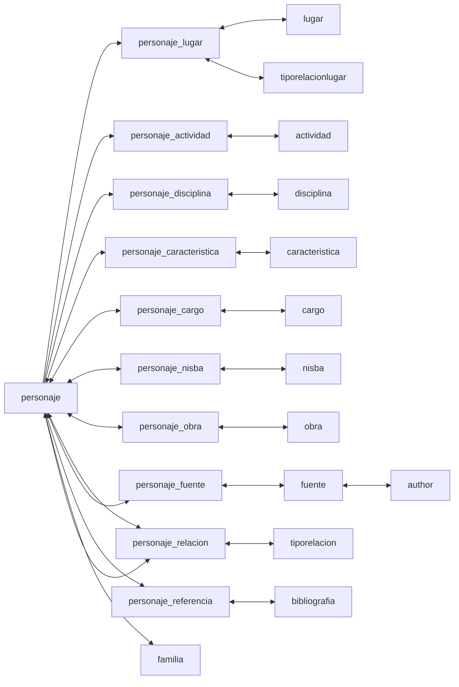
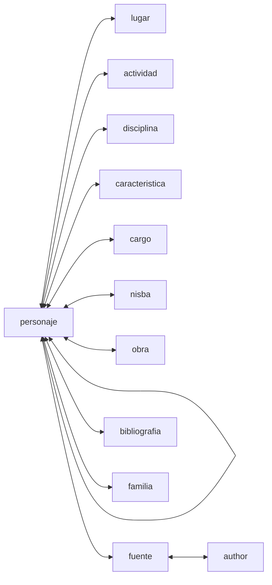

# Getting Your Data Right 

## This Chapter

- we will discuss how to get your data into a proper shape:
	- how to extract data from printed sources;
	- how to “tidy” your data, that is to say to how prepare it for the use with the tidyverse approach; how to normalize your data, which is also a part of tidying your data;
	- how to model your data, which is about getting more from your data during analyses;
	- then, we will look into the PUA dataset and our main task will be to create an improved version of it that is most suitable for different forms of analyses with the tidyverse approach.

## 1. Getting your own data

### Ways of obtaining data

1.  Reusing already produced data
    -   One may require to mold data into a more fitting structure .
2.  Creating one’s own dataset
3.  Digitizing data from printed and/or hand-written sources

### Major formats

-   Relational databases or Tables/Spreadsheets (_tabular data_)?
    - Tabular format: tables; spreadsheets; CSV/TSV files;
-   _Unique identifiers_:
    -   tables with different data can be connected via _unique identifiers_
    -   **Note:** A relational database (rDB) is a collection of interconnected tables. Tables in an rDB are connected with each other via _unique identifiers_ which are usually automatically created by the database itself when new data is added.
	    - In the PUA data, we have `idPersonaje` in the main `personaje` table, and then in all the `personaje_x` tables, which connect individuals and their relevant descriptions. For example, we can connect `personaje` and `lugar` via `personaje_lugar` and analyze the geography of people from the database.
    -   One can maintain interconnected tables without creating a rDB with a _Linked Open Data_ approach (LOD); or, better *Linked Local Data* approach. The main idea is that we create unique identifiers to all entities that we use—then we can use these identifiers to expand our data either manually, semi-automatically, or automatically.

### Ways of obtaining data

1. Reusing already produced data
	* One may require to mold data into a more fitting structure.
2. Creating one's own dataset
3. Digitizing data from printed and/or hand-written sources

### Major formats

* Relational databases or Tables/Spreadsheets (*tabular data*)?
* Tabular format: tables; spreadsheets; CSV/TSV files.
* *Unique identifiers*:
	* tables with different data can be connected via *unique identifiers*
	* **Note:** A relational database (rDB) is a collection of interconnected tables. Tables in an rDB are connected with each other via *unique identifiers* which are usually automatically created by the database itself when new data is added.
	* One can maintain interconnected tables without creating a rDB: *Open Linked Data*; (*Local Linked Data*: you simply connect datasets that you create and have on your computer;)
	* **Example**: Table of the growth of cities. One table includes information on population over time; Another table includes coordinates of the cities from the dataset. It is more efficient and practical (reducing error rate from typos) to work on these tables separately, and connect them via unique identifiers of cities which are used in both tables.

#### Note on the `CSV`/`TSV` format

`CSV` stands for *comma-separated values*; `TSV` --- for *tab-separated values*.

Below is an examples of a CSV format. Here, the first line is the *header*, which provides the names of columns; each line is a row, while columns are separated with `,` commas.

```
DATE,West,East,DATE,West,East
4000 BCE,0,0,1 BCE/CE,0.12,0.08
3000 BCE,0.01,0,100 CE,0.12,0.08
2500 BCE,0.01,0,200 CE,0.11,0.07
2250 BCE,0.01,0,300 CE,0.10,0.07
2000 BCE,0.01,0,400 CE,0.09,0.07
1750 BCE,0.02,0,500 CE,0.07,0.08
1500 BCE,0.02,0.01,600 CE,0.04,0.09
1400 BCE,0.03,0.01,700 CE,0.04,0.11
1300 BCE,0.03,0.01,800 CE,0.04,0.07
1200 BCE,0.04,0.02,900 CE,0.05,0.07
1100 BCE,0.03,0.02,1000 CE,0.06,0.08
1000 BCE,0.03,0.03,1100 CE,0.07,0.09
900 BCE,0.04,0.03,1200 CE,0.08,0.09
800 BCE,0.05,0.02,1300 CE,0.09,0.11
700 BCE,0.07,0.02,1400 CE,0.11,0.12
600 BCE,0.07,0.03,1500 CE,0.13,0.10
500 BCE,0.08,0.04,1600 CE,0.18,0.12
400 BCE,0.09,0.05,1700 CE,0.35,0.15
300 BCE,0.09,0.06,1800 CE,0.50,0.12
200 BCE,0.10,0.07,1900 CE,5.00,1.00
100 BCE,0.11,0.08,2000 CE,250.00,12.50
```

**Example for pasting into Excel**: the very last value will be misinterpreted. (The example is: War-making capacity since 4000 BCE (in social development points), from: Morris, Ian. 2013. *The Measure of Civilization: How Social Development Decides the Fate of Nations*. Princeton: Princeton University Press.)

`TSV` is a better option than a `CSV`, since TAB characters (`\t`) are very unlikely to appear in values.

Neither `TSV` not `CSV` are good for preserving *new line characters* (`\n`)—or, in other words, text split into multiple lines/paragraphs. As a workaround, one can convert `\n` into some unlikely-to-occur character combination (for example, `;;;`), which would be easy to restore into `\n` later, if necessary.

<!--
EXTRA NOTES

https://lsru.github.io/tv_course/lecture05_tidyr.html#1
https://arxiv.org/abs/1809.02264
https://cran.r-project.org/web/packages/tidyr/vignettes/tidy-data.html
http://vita.had.co.nz/papers/tidy-data.html // https://vita.had.co.nz/papers/tidy-data.pdf

Jeff Leek in his book The Elements of Data Analytic Style (Jeff Leek, The Elements of Data Analytic Style, Leanpub, 2015-03-02) summarizes the characteristics of tidy data as the points:[3]

Each variable you measure should be in one column.
Each different observation of that variable should be in a different row.
There should be one table for each "kind" of variable.
If you have multiple tables, they should include a column in the table that allows them to be linked.
-->


## 2. Tidying Data

### Basic principles of organizing data: *Tidy Data*

Tidy data is a concept in data organization and management introduced by statistician Hadley Wickham. It refers to a specific structure of organizing data sets in a way that is easy to analyze and manipulate, typically in the context of data science and statistical analysis. Tidy data adheres to the following principles:

1.  **Each variable is in its own column**: This means that every column represents a single variable or feature, making it easy to understand and analyze the data.
2.  **Each observation is in its own row**: This ensures that each row represents a unique observation or data point, allowing for simple indexing and filtering of the data.
3.  **Each value is in its own cell**: By having individual values in separate cells, the data is clearly organized and easy to manipulate or analyze using various data processing tools and techniques.

The need to use tidy data arises for several reasons:

1.  Simplified analysis: Tidy data makes it easier to perform exploratory data analysis, as the consistent organization allows for the straightforward application of various data manipulation and statistical analysis techniques.
2.  Improved readability: The structure of tidy data is intuitive and easy to understand, even for those with limited experience in data analysis. This makes the data more accessible for interpretation, collaboration, and communication.
3.  Code efficiency: With a consistent data structure, analysts can write more efficient and reusable code, as the same functions can be applied across various tidy data sets. For example, you can create an analytical routine in R that requires your data to be in a specific format—after that you can take any relevant data, convert it into the needed structure and simply reuse your R routine.
4.  Reduced errors: Tidy data reduces the potential for errors in data analysis by minimizing the need for manual data reshaping and transformation, which can introduce errors or inconsistencies.
5.  Better data quality: Tidy data encourages good data management practices by promoting the organization of data in a clear and consistent manner, making it easier to identify and address data quality issues.

In summary, adopting tidy data principles helps streamline data analysis processes, enhance collaboration, and improve the overall quality and accuracy of data-driven insights.

> **The original paper:** Wickham, Hadley. 2014. “Tidy Data.” *Journal of Statistical Software 59 (10)*. <https://doi.org/10.18637/jss.v059.i10>. (The article in open access)

### Clean Data / Tidy Data: *additional explanations*

* Column names and row names are easy to use and informative. In general, it is a good practice to avoid `spaces` and special characters.
	* Good example: `western_cities`
	* Alternative good example: `WesternCities`
	* Bad example: `Western Cities (only the largest)`
* Obvious mistakes in the data have been removed:
* Date format: `YYYY-MM-DD` is the most reliable format. Any thoughts why?
* There should be no empty `cells`:
		* If you have them, it might be that your data is not organized properly.
		* If your data is organized properly, `NA` must be used as an explicit indication that data point is not available.
* Each cell must contain only one piece of data.
* Variable values must be internally consistent
	* Be consistent in coding your values: `M` and `man` are different values computationally, but may have the same meaning in the dataset;
	* Keep track of your categories, i.e., keep a separate document where all codes used in the data set are explained.
* Preserve original values:
	* If you are working with a historical dataset, it will most likely be inconsistent.
		* For example, distances between cities are given in different formats: days of travel, miles, *farsaḫ*s/parasangs, etc.).
		* Instead of replacing original values, it is better to create an additional column, where this information will be homogenized according to some principle.
		* Keeping original data will allow to homogenize data in multiple ways (example: *day of travel*).
	* Clearly differentiate between the *original* and *modified/modeled* values.
		* The use of suffixes can be convenient: `Distance_Orig` *vs* `Distance_Modified`.
* Most of editing operations should be performed in software other than R; any spreadsheet program will work, unless it cannot export into CSV/TSV format.
	* Keep in mind that if you prepare your data in an Excel-like program, rich formatting (like manual highlights, bolds, and italics) is not *data* and it will be lost, when you export your data into CSV/TSV format.
	* Keep in mind also that programs like Excel tend to overdo it. For example, they may try to guess the format of a cell and do something with your data that you do not want. (**Example for pasting into Excel**) 
	* **Note:** It might be useful, however, to use rule-based highlighting in order, for example, to identify bad values that need to be fixed.
* Back up your data! In order to avoid any data loss, you need to have a good strategy to preserve your data periodically.
	* <http://github.com> is a great place for this, plus it allows to work collaboratively.
	* **Google spreadsheets** is a decent alternative as it allows multiple people to work on the same dataset, but it lacks version control and detailed tracking of changes.

**Example for pasting into Excel**: the very last value will be misinterpreted. (The example is: War-making capacity since 4000 BCE (in social development points), from: Morris, Ian. 2013. *The Measure of Civilization: How Social Development Decides the Fate of Nations*. Princeton: Princeton University Press.)


```
DATE,West,East,DATE,West,East
4000 BCE,0,0,1 BCE/CE,0.12,0.08
3000 BCE,0.01,0,100 CE,0.12,0.08
2500 BCE,0.01,0,200 CE,0.11,0.07
2250 BCE,0.01,0,300 CE,0.10,0.07
2000 BCE,0.01,0,400 CE,0.09,0.07
1750 BCE,0.02,0,500 CE,0.07,0.08
1500 BCE,0.02,0.01,600 CE,0.04,0.09
1400 BCE,0.03,0.01,700 CE,0.04,0.11
1300 BCE,0.03,0.01,800 CE,0.04,0.07
1200 BCE,0.04,0.02,900 CE,0.05,0.07
1100 BCE,0.03,0.02,1000 CE,0.06,0.08
1000 BCE,0.03,0.03,1100 CE,0.07,0.09
900 BCE,0.04,0.03,1200 CE,0.08,0.09
800 BCE,0.05,0.02,1300 CE,0.09,0.11
700 BCE,0.07,0.02,1400 CE,0.11,0.12
600 BCE,0.07,0.03,1500 CE,0.13,0.10
500 BCE,0.08,0.04,1600 CE,0.18,0.12
400 BCE,0.09,0.05,1700 CE,0.35,0.15
300 BCE,0.09,0.06,1800 CE,0.50,0.12
200 BCE,0.10,0.07,1900 CE,5.00,1.00
100 BCE,0.11,0.08,2000 CE,250.00,12.50
```


### *Discussion*: “A Bulliet Dataset”

||
|:---------------------------------------------------------------------------------|
|**Dataset:** The dataset shows chrono-geographical distribution of Islamic scholars, according to one of the medieval biographical sources. Source: Bulliet, Richard W. 2009. *Cotton, Climate, and Camels in Early Islamic Iran: A Moment in World History*. New York: Columbia University Press. P. 139|

* This data is formatted for presentation in a book; for data analysis this data needs to be converted into tidy format.
* What should be corrected? Think of how the data should look so that we could analyze it?

## 3. Modeling Data

### Categorization as a Way of modeling data

> “[Modeling is] a continual process of coming to know by manipulating representations.”

>> Willard McCarty, “Modeling: A Study in Words and Meanings,” in Susan Schreibman, Ray Siemens, and John Unsworth, *A New Companion to Digital Humanities*, 2nd ed. (Chichester, UK, 2016), <http://www.digitalhumanities.org/companion/>.

One of the most common way of modeling data in historical research—joining items into broader categories. Categorization is important because it allows to group items with low frequencies into items with higher frequencies, and through those discern patterns and trends. Additionally, alternative categorizations allow one to test different perspectives on historical data.

The overall process is rather simple in terms of technological implementation, but is quite complex in terms of subject knowledge and specialized expertise which is required to make well-informed decisions.

* For example, let's say we have the following categories: *baker*, *blacksmith*, *coppersmith*, *confectioner*, and *goldsmith*.
	* These can be categorized as **occupations**;
	* Additionally, *blacksmith*, *coppersmith*, and *goldsmith* can also be categorized as **'metal industry'**, while *baker* and *confectioner*, can be categorized as **'food industry'**;
	* Yet even more, one might want to introduce additional categories, such as **luxury production** to include items like *goldsmith* and *confectioner*; and **regular production** for items like *baker*, *blacksmith*, *coppersmith*.
* Such categorizations can be created in two different ways, with each having its advantages:
	* first, one can create them as additional columns. This approach will allow to always have the original—or alternative—classifications at hand, which is helpful for re-thinking classifications and creating alternative ones where items will be reclassified differently, based on a  different set of assumptions about your subject.
	* second, these can be created in separate files, which might be easier as one does not have to stare at existing classifications and therefore will be less influenced by them in making classification decisions.
* Additionally, one can use some pre-existing classifications that have already been created in academic literature. These most likely need to be digitized and converted into properly formatted data, as we discussed in the previous lesson.

### Normalization

This is a rather simple, yet important procedure, which is, on the technical side, very similar to what was described above. In essence, the main goal of normalization is to remove insignificant differences that may hinder analysis.

* Most common examples would be:
	* bringing information to the same format (e.g., dates, names, etc.)
	* unifying spelling differences

It is a safe practice to **preserve the initial data**, creating *normalized* data in separate columns (or tables)

### Note: *Proxies*, *Features*, *Abstractions*

These are the terms that refer to the same idea. The notion of *proxies* is used in data visualization, that of *features*—in computer science; that of *abstractions*—in the humanities (see, for example, Franco Moretti’s *Graph, Maps, Trees*).

The main idea behind these terms is that some simple *features* of an object can act as *proxies* to some complex phenomena. For example, we can use individuals who are described as “jurists” as a proxy for the development of Islamic law. This way we use onomastic information as a proxy to the social history of Islamic law.

<!--For example, Ian Morris uses the size of cities as a proxy to the complexity of social organization. The logic is following: the larger the size of a city, the more complex social, economic and technical organization is required to keep that city functional, therefore it alone can be used as an indicator of the social complexity (or a proxy to the social complexity). -->

While *proxies* are selected from what is available—usually not much, especially when it comes to historical data—as a way to approach something more complex. It may also be argued that *abstraction*s are often arrived to from the opposite direction: we start with an object which is available in its complexity—in the case of PUA, the starting point is biographies written in natural language (Arabic). The PUA researchers then reduced the complexity of biographies in natural language to a more manageable form which—we expect—would represent specific aspects of the initial complex object. From this perspective, the PUA database itself is an abstraction of biographies of Andalusians.

Most commonly (and automatically) abstractions are used with texts in natural languages. For example, in *stylometry* texts are reduced to frequency lists of most frequent *features*, which are expected to represent an *authorial fingerprint*. Using these frequency lists we can—with accuracy up to 99%—identify authors of particular texts. The complexity of texts can be reduced in a number of ways: into a list of lemmas (e.g., for topic modeling analysis), frequency lists (e.g., for document distance comparison, such as, for example, stylometry), keyword values (e.g., for identifying texts on a similar topic, using, for example, the TF-IDF method), syntactic structures, ngrams, etc. As you get to practice and experiment more, you will start coming up with your own ways of creating abstractions depending on your current research questions.

## 4. Deep Look into the PUA Dataset

The models of the PUA database essentially looks like the graph below.



In other words, we have::

- the **main table** `personaje` that contains data on individuals, limited to: their names, dates, and familial affiliations (other columns are either variants of these, or not relevant to the overall analysis);
- **connection tables** that connect individuals to different characteristics as places, disciplines, professions, etc. This is done in *one-to-many* format, i.e. one person may have visited multiple cities, may have specialized in multiple disciplines, etc. The main part of these tables is the two columns with ids of individuals from `personaje` and ids of entities from auxiliary tables. These connection tables is what allows us to register multiple instances of the same type of data, which we simply cannot do in the main table. (One connection table, `personaje_relacion`, actually connects `personaje` to itself.)
- **auxiliary tables** describe specific characteristics: places, disciplines, professions. These are the tables that provide additional information on those characteristics. For example, `lugar` tells us where a place is in al-Andalus or not, what are the coordinates of each place, and so on. This is also where most modeling endeavors will be taking place.
- lastly, we have **metadata tables**, which provide metadata on sources used in the creation of the database.

### Updated PUA Dataset

We may consider converting PUA dataset into a somewhat different format, where we merge the main and auxiliary tables into one table that would have a structure like this: 

```
============================================
idPersonaje, type, value
============================================
000006, d_died_in, 163
000006, has_gender, male
000006, t_born, toponymID
000006, t_visited, toponymID
000006, has_name_AR, arabic_name
000006, has_name_CA, castellano_name
000006, has_profession, professionID
000006, has_profession, professionID
============================================
```

Essentially, we can describe each person using this triple structure, which is interpreted as `subject-predicate-object`.  There are standardized approaches to implement this kind of structure, like OWL RDF, but they become truly relevant only after one has finished preparing their data and is willing to share it with the world. Using OWL RDF standard will mean that you are implementing a Linked Open Data (LOD) approach. The problem of the LOD approach in our case is that we do not have anything out there to link into. For this reason, we will focus on a Linked Local Data approach, where we will link only into our own data.

Having data in this kind of format will make it easier to analyze our data, since we will not need to do too many connection (`left_join`) operations, which at times get too complicated. We will still need the *auxiliary* tables, which we will treat more as *interpretative schemes*, since we will be using them more for the purposes of modeling our historical data.

> *On the use of this structure, see*: Romanov, M. (2017). Algorithmic Analysis of Medieval Arabic Biographical Collections. _Speculum_. https://doi.org/10.1086/693970 (The article is available at: <https://www.journals.uchicago.edu/doi/full/10.1086/693970>)

The structure of the new dataset will be:



### Normalized and Improved PUA Dataset

Another thing that we need to do with the PUA dataset is to normalize it. We have already dealt with the issue of birth and death dates, where we find zeroes to be used when no date is available. Another issue that we also encountered was the information on gender which is “buried” in professions and characteristics. Additionally, professions (`actividad`) can be normalized: we have seen at least three different ways, in which jurists are described (*faqīh*, *faqīh šāfiʿī*, *faqīh ẓāhirī*, *faqīh mālikī*).

One other thing that we can do to improve the dataset is to automatically transcribe unstranscribed Arabic names—we, actually, have more than half of all the Arabic names untranscribed. This is a rather tricky procedure, which I will explain later.

### Modeling PUA Dataset

The main modeling approach that we can use with the PUA dataset is categorization. As described above, we can create larger categories for professions (`actividad`), positions (`cargo`), and characteristics (`caracteristica`) in order to identify larger social, professional, and religious groups.

Additionally, we can add different classifications to geographical places (`lugar`). At the moment, places are divided into `andalusian` and `non-andalusian`. Such division allows us to trace travels outside of al-Andalus, but we can do so much more than that.

For example, it would make a lot of sense to split Andalusian places into subregions, which will allow us to aggregate individuals into larger geographical groups and, for example, measure how our individuals were moving within al-Andalus. this task is a bit tricky though (Cova?!).  Classifying  `non-andalusian` places into provinces will also be helpful as we can study into more general directions in which Andalusians were traveling. For example, base on my previous research using *Taʾrīḫ al-islām* of al-Ḏahabī (d. 748/1347), the general direction of travels was changing over time—essentially shifting between Ifrīqiyyaŧ (North Africa, centering on modern Tunisia) and Egypt-and-Syria region; or course, the Arabian peninsula with the Sacred cities of Islām was also very important, as was Baġdād during its heydays.

### Conceptual Models for Your Data


I have mentioned above the traditional `subject-predicate-object` model, with which you can describe pretty much everything that you can describe with a subject-predicate-object sentence. 

### Implementation

Essentially, we can reformat our data into new tables/tibbles, pack them into a list on a similar manner (let's also call it `PUA` for short). We can then save this new list into an RDS file, which can be loaded with `readRDS()` function. Additionally, we can also preserve the entire original dataset, which we can simply add as another element of the list (`PUA$original`).

### Homework assignment

- categorization of places:
	- Andalusian locations: Cova / Ensar (based on the shared publication?);
	- Non-Andalusian locations: Cova / Ensar (al-Thurayya can be used for this: <https://althurayya.github.io/>);
- professions (`actividad`): Antonia; Sean;
- positions (`cargo`): Antonia; Sean;
- characteristics (`caracteristica`): Ali; Rawda;
- “descriptive names” (`nisba`): Rawda; Ali;

**How to do this assignment**:

- you need to save the table that you are planning to work on into a TSV file;
- open it in some table editor. Perhaps, Google Spreadsheets will be the best option, since you can share your work with others, and/or work together. (On Mac, I really like “Easy CSV Editor”—it is a paid application that is worth every penny (6.99€).)
- add a column and create metacategories of your choice; keep in mind, that objectively there is no single correct way to do that. In real research you will go through multiple iterations of your categories. Additionally, as we discussed above, you may want/need to create multiple classifications with each suiting better for a particular research question.
- when you are done, share your tsv file.


## Reference Materials

* Wickham, Hadley. 2014. “Tidy Data.” *Journal of Statistical Software 59 (10)*. <https://doi.org/10.18637/jss.v059.i10>. (The article in open access)
* Check these slides: A. Ginolhac, E. Koncina, R. Krause. *Principles of Tidy Data: tidyr* <https://lsru.github.io/tv_course/lecture05_tidyr.html> (Also check their other lectures/slides: )
* Broman, Karl W., and Kara H. Woo. 2018. “Data Organization in Spreadsheets.” *The American Statistician* 72 (1): 2–10. <https://doi.org/10.1080/00031305.2017.1375989>.

The following book is a great example of modeling data for historical studies:

* Bulliet, Richard. 1979. *Conversion to Islam in the Medieval Period: An Essay in Quantitative History*. Cambridge: Harvard University Press.
* Morris, Ian. 2013. *The Measure of Civilization: How Social Development Decides the Fate of Nations*. Princeton: Princeton University Press.
	* **Note:** This book is a methodological companion to: Morris, Ian. 2010. *Why the West Rules—for Now: The Patterns of History, and What They Reveal about the Future.* New York: Farrar, Straus and Giroux.

## Appendix 1: PUA Data Tables

### Main Table

- `personaje` :: this is essentially the main and the most important table that contains information on individuals;

### Connection Tables

The following tables are *connection* tables that extend the main table by encoding additional information on individuals by connecting each individual to a specific types of information, which are described in auxiliary tables.

For example, different specializations are described in the auxiliary table `disciplina`.  The *connection* table `personaje_disciplina` connects IDs of individuals from the main `personaje` table with IDs of disciplines in the auxiliary table `disciplina`. Thus, each of these connection tables is connected to the table whose name appears after `_`. In some cases, these connection tables are connected to some other tables. 

- `personaje_actividad` :: activities of individuals;
- `personaje_alias` :: aliases of individuals;
- `personaje_caracteristica` :: characteristics of individuals;
- `personaje_cargo` :: positions and offices of individuals;
- `personaje_disciplina` :: specializations of individuals;
- `personaje_fuente` :: sources in which individuals are mentioned; this one is connected to the metadata table `fuente`;
- `personaje_lugar` :: connections of individuals to specific geographical places; also connected to `tiporelacionlugar`, which specify how exactly an individual is connected to a specific settlement;
- `personaje_nisba` :: *associative names* (*nisbaŧ*s) of individuals that describe connection between individuals and some kind of entities. Here *nisbaŧ*s include: geographical, tribal, familial, and misc (unclassified).
- `personaje_obra` :: books written by individuals; this one is not connected to any auxiliary table;
- `personaje_referencia` :: research publications in which individuals are mentioned; this one is actually connected to the metadata table `bibliografia`;
- `personaje_relacion` :: this table describes connections between individuals;

### Auxiliary Tables

Auxiliary tables describe categorical entities through which individuals in the prosopographical section are described. In most cases individuals can be associated with multiple categories from each entity type (for example, individuals live in and visit multiple settlements), which requires one-to-many relationships.

- `actividad` :: types of activities;
- `caracteristica` :: types of personal characteristics;
- `cargo` :: types of positions and offices;
- `disciplina` :: types of specializations;
- `familia` :: families; there is no separate table; family information is encoded in the main `personaje` table, since it is one-to-one relationship;
- `keywords` :: ???
- `lugar` :: settlements like villages, cities, islands;
- `nisba` :: *associative/descriptive names* (*nisbaŧ*s);
- `tiporelacion` :: this table described types of relationships with individuals;
- `tiporelacionlugar` :: this table described types of relationships with settlements;

### Metadata Tables

The following two tables do not have any information on individuals; rather they provide metadata on sources used in the creation of the database.

- `autor` :: this table contains information on authors of primary sources used in the project;
- `fuente` :: this table provides detailed information on each primary source;
- `bibliografiA` :: this is the main bibliographical data of secondary sources of the project; 


## Appendix 2: OCR in R

As was noted above, we can use R to OCR text in PDFs and images. The following libraries will be necessary.

```{r eval=FALSE, include=TRUE}
library(pdftools)
library(tidyverse)
library(tesseract)
library(readr)
```

This code we can use to OCR individual PNG files.

```{r eval=FALSE, include=TRUE}
text <- tesseract::ocr(pathToPNGfile, engine = tesseract("eng"))
readr::write_lines(text, str_replace(pathToPNGfile, ".png", ".txt"))
```

This code can be used to process entire PDFs:

```{r eval=FALSE, include=TRUE}
imagesToProcess <- pdftools::pdf_convert(pathToPDFfile, dpi = 600)
text <- tesseract::ocr(imagesToProcess, engine = tesseract("eng"))
readr::write_lines(text, str_replace(pathToPDFfile, ".pdf", ".txt"))
```

**NB:** I had issues running `pdftools` on Mac. Make sure that you install additional required tools for it. For more details, see: <https://github.com/ropensci/pdftools>.

More details on how to use Tesseract with R you can find here: <https://cran.r-project.org/web/packages/tesseract/vignettes/intro.html>


