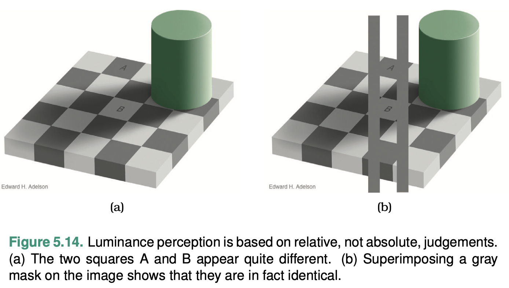
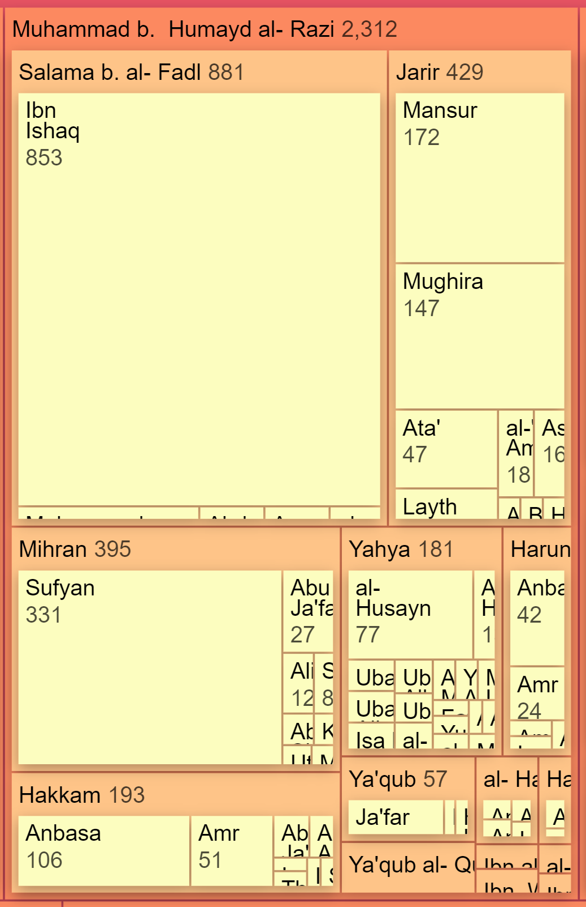
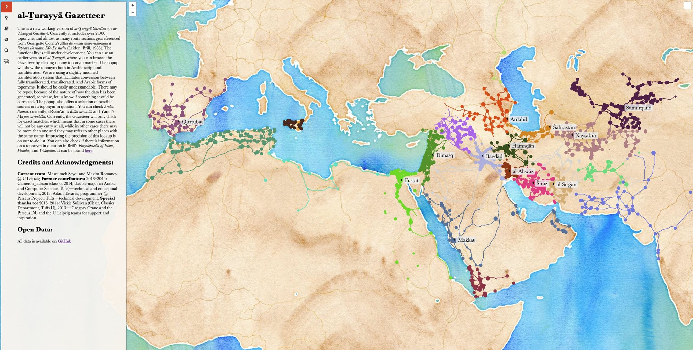
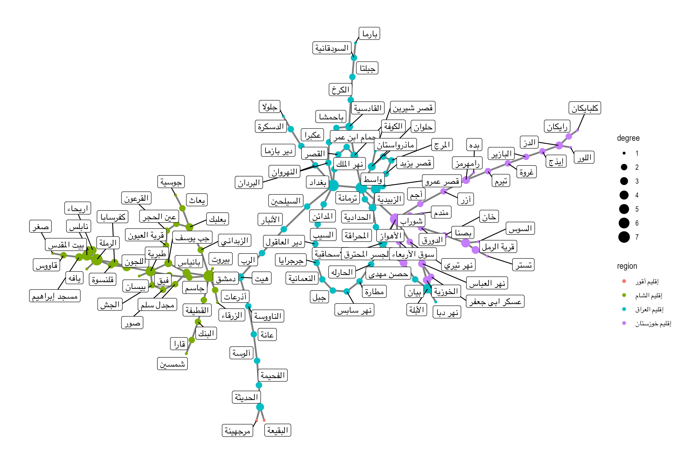
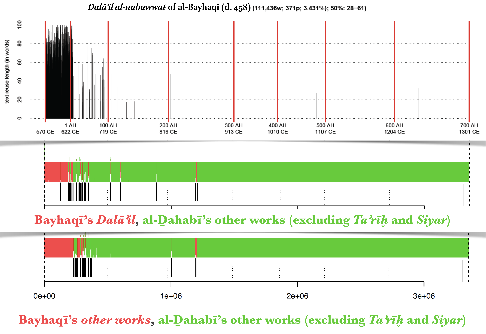
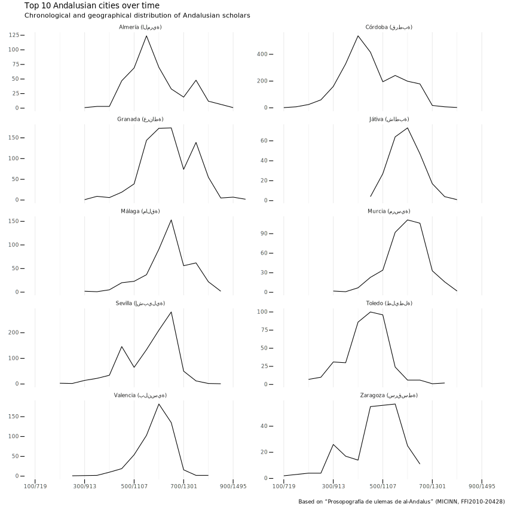
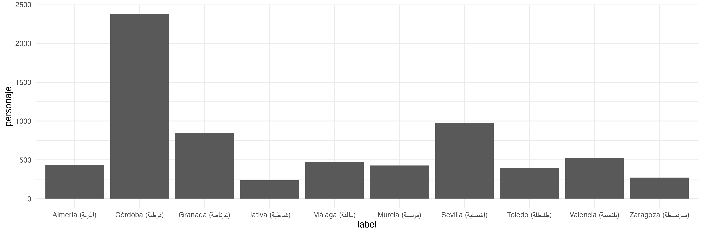
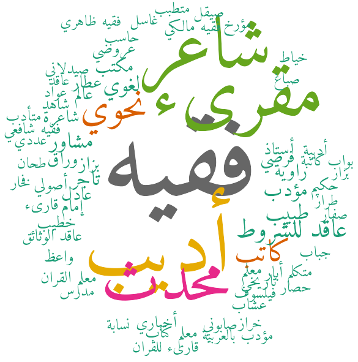

# Visualizations: `plot()` and `ggplot()`

## This Chapter

In this class we will move to the next important part of data analysis: data visualization. We will practice working with the most popular graphic library in R `ggplot2`. In the end, we will also take a quick look at the `gt` library, which was designed to prepare nice table suitable for presentations.

## Conceptual Issues

### Perception

Creating visualizations, we have rather limited means of expressing information effectively. (The following images are from Tamara Munzner’s “Visualization Analysis and Design” (2014), which is considered to be a classical introduction into visualizations.)

First, we are essentially limited to: points, lines, and areas—these are our geometric primitives:


We can use position, color, shape, tilt, and size to encode additional information: 


When we do, we need to consider perceptual issues that are common to our species. In other words, depending on how the information is encoded, we can “see” it better or worse:


These perceptual issues have been experimentally discovered and confirmed. In the image below you can see that, depending how you visualize your data, your readers will have less or more difficulties interpreting your visualizations correctly. In a nutshell, absolute positions are the easiest to interpret, and then everything becomes more and more complicated: relative positions, angles, circular areas, rectangular areas. 


The following illustration shows three different representations of exactly the same information. For our perception it is much easier to see the difference in (c), than in (a) or (b). 


Colors can also create a variety of optical illusions, even when not considering colorblindness. In the example below, our perception tells us that squares A and B in (a) are different in color, yet, if we superimpose a gray mask on the image, we can “see” that they are of the same color. *Takeaway*: “get it right in black and white”.



### The Rules of Thumb for Visualizations

Tamara Munzner in her “Visualization Analysis and Design” (2014) formulated eight rules of thumb (Chapter 6. “Rules of Thumb”), which should be followed in order to create visualizations that effectively convey complex information, avoid common pitfalls, and facilitate meaningful insights. (The PDF of the chapter is provided.)

1.  **No Unjustified 3D**:
	-   *The Power of the Plane*: Use 2D representations when possible, as they are easier to interpret and compare.
	-   *The Disparity of Depth*: Depth perception varies among individuals, making 3D depth cues unreliable for accurate comparisons.
	-   *Occlusion Hides Information*: 3D visualizations can lead to important data points being obscured by other elements.
	-   *Perspective Distortion Dangers*: 3D projections can distort the perception of sizes and distances, leading to incorrect interpretations.
	-   *Tilted Text Isn’t Legible*: 3D visualizations often use tilted text, which can be challenging to read.
1.  **No Unjustified 2D**: Avoid using 2D visualizations when they don’t provide clear benefits over simpler 1D representations.
3.  **Eyes Beat Memory**: Design visualizations that minimize the need for viewers to rely on their memory by placing related data points close together or using common baselines.
4.  **Resolution over Immersion**: Prioritize high-resolution displays over immersive environments, as they provide more detail and are easier to interpret.
5.  **Overview First, Zoom and Filter, Detail on Demand**: Present an overview of the data first, then allow users to zoom in and filter the data to focus on specific areas, and finally provide additional details on demand.
6.  **Responsiveness Is Required**: Ensure that the visualization responds quickly to user input, as slow responsiveness can be frustrating and lead to disengagement.
7.  **Get It Right in Black and White**: Make sure the visualization is effective in grayscale before adding color, as this ensures that the design relies on more perceptually accurate visual channels (e.g., position and length) rather than color alone.
8.  **Function First, Form Next**: Prioritize the functionality and effectiveness of the visualization, and then focus on aesthetics to create a visually pleasing and engaging design.    

### Types of Graphs and When to Use Them

<!--

Here is a list of common graphs and charts with a description of their use cases and when they should and should not be used:

1.  Bar chart:
    -   Use case: Comparing discrete categories or showing changes in data over time.
    -   Should be used: When dealing with categorical data or comparing values across different categories.
    -   Should not be used: For continuous data or to display relationships between variables.
2.  Line chart:
    -   Use case: Displaying trends or patterns in continuous data over time.
    -   Should be used: When visualizing continuous data, especially time series data or data with a clear trend.
    -   Should not be used: For categorical data or when there is no clear trend in the data.
3.  Pie chart:
    -   Use case: Representing relative percentages or proportions of different categories in a dataset.
    -   Should be used: When dealing with part-to-whole relationships or showing proportions.
    -   Should not be used: When comparing more than a few categories, as it becomes difficult to interpret, or for data that doesn't represent proportions.
4.  Scatter plot:
    -   Use case: Exploring correlations or relationships between two numerical variables.
    -   Should be used: When investigating the relationship between two continuous variables.
    -   Should not be used: When dealing with categorical data or when there are no clear relationships between variables.
5.  Histogram:
    -   Use case: Analyzing the distribution and underlying patterns of a continuous variable.
    -   Should be used: When visualizing the distribution of a single continuous variable.
    -   Should not be used: For categorical data or to display relationships between variables.
6.  Heatmap:
    -   Use case: Visualizing complex datasets with multiple dimensions or displaying correlations between variables.
    -   Should be used: When working with large datasets or showing the intensity of data across a matrix.
    -   Should not be used: When dealing with simple datasets, as it may introduce unnecessary complexity.
7.  Box plot:
    -   Use case: Summarizing and comparing the distribution of different groups or categories.
    -   Should be used: When comparing the distribution of data across groups or identifying outliers.
    -   Should not be used: When displaying trends over time or for data with only a few data points.
8.  TreeMap:
    -   Use case: Visualizing hierarchical data structures and part-to-whole relationships.
    -   Should be used: When dealing with hierarchical data or showing nested proportions.
    -   Should not be used: When visualizing non-hierarchical data or when the hierarchy is too complex.
9.  Choropleth map:
    -   Use case: Visualizing geographic distribution of data and spatial patterns.
    -   Should be used: When displaying data across geographic areas, such as countries or states.
    -   Should not be used: When dealing with non-geographic data or when the geographical divisions are not meaningful for the data.
10.  Network graph:
    -   Use case: Visualizing complex relationships or connections between entities.
    -   Should be used: When displaying relationships between entities in a network, such as social networks or organizational structures.
    -   Should not be used: When dealing with simple, non-relational data or when the network structure is too complex to interpret.

Always consider the type of data you have and the insights you want to convey when choosing the appropriate graph or chart. Selecting the right visualization is essential for effectively communicating your findings and enabling your audience to make informed decisions.

-->

Visualizations can be grouped based on the types of data they are designed to represent. Here's a categorization of common visualizations based on data types:

#### Categorical data (nominal or ordinal)

For example, we have people with different activities in a specific place; each activity will be a category, while the umber of people associated with that activity will determine the magnitude of each activity.

- **Bar chart**: Compares values across categories. For example, each city can be represented as a series of activities (an activity per bar), thus each city should have a distinct visual profile.


<!---->

-  **Pie chart**: Represents proportions of different categories in a dataset. In a way, very similar to a bar chart in its function, but much more difficult to interpret, especially when you have multiple pies to compare (see, perception issues above.) A bar chart, or even a list/table may be a better alternative. (Remember, *No Unjustified 2D*.)

> *do not use them, please.*

-  **TreeMap**: Visualizes hierarchical data structures and part-to-whole relationships in nested categories. Since we have difficulties interpreting “rectangular volumes”, you should not rely on them exclusively.


|   |   |
|:-:|:-:|
|Structure of al-Ṭabarī's notes<br> (Credit: Sarah Savant)| Structure of the Islamic world, according to al-Muqaddasī (Credit: Masoumeh Seydi)|


-   **Stacked bar chart:** Displays the composition of different categories over time or across other categorical dimensions. We also saw above that these are quite difficult to read (only the layer at the very bottom is readable because of the same baseline; other layers will be very difficult to compare to each other). It is better to split your data into simpler objects and use a different visualization.


- **Radar chart**, also known as a spider chart or a web chart, is a graphical representation of multivariate data. It is used to display multiple variables as points or lines emanating from a central point, with each variable represented by a different axis that is equally spaced around the center. The variables are plotted on these axes as points or lines that form a polygon, with the shape of the polygon reflecting the values of the variables. A radar chart is a much better alternative to a stacked bar chart and a TreeMap, both of which are difficult to read and do not allow for efficient comparison. Additionally, we can plot multiple objects on a radar chart for comparison.

<!--
| ![[0626YaqutHamawi.MucjamUdaba_RADAR_D20220910T142255.svg]]  | ![[0204Shafici.Umm_RADAR_D20220910T142614.svg]]  |
|:-:|:-:|
| A biographical collection of “men of letters”  | A legal text |
-->


<!--
- **Parallel coordinates plot**: Visualizes multi-dimensional numerical data by representing each dimension as a vertical axis and connecting data points across axes with lines.
-->

#### Continuous data (interval or ratio).

In most cases this means data that changes over time. For example, the number of people in specific places over time; the change over time in activities, in which individuals are involved; the general number of people over time, etc. 

-   **Line chart**: Displays trends or patterns in continuous data over time, like in examples above.


- **“Bar” chart** from above.

- **Scatter plot**: Explores correlations or relationships between two numerical variables. Usually, this chart type is used to check if there is any correlation. For example, with the scatter plot, we can check if there is any correlation between the age at which a person dies and the time when the person was born (if we assume that the living conditions were improving with time, people would live longer); a toy example of a strong correlation in our data will be to plot date of birth vs. date of death.


-  **Histogram**: Analyzes the distribution and underlying patterns of a continuous variable. For example, we can use a histogram to check the distribution of age values.


-   **Box plot**: Summarizes and compares the distribution of different groups or categories in continuous data. Box plot would be an even better alternative for checking the distribution of ages.


-   **Area chart**: Represents the magnitude of continuous data over time, similar to a line chart, but with the area between the line and axis filled. Area charts are usually rather difficult to interpret, but sometimes they work. (This is not quite an area chart, but it is quite similar.)


#### Geographic data

Although most visualization of geographical data are often called*maps*, there is rarely a need to use *true* geographical maps. In most cases we only need a suggestive layout—like shorelines or country borders—to convey sufficient sense of geography in order to make the data that we want to visualize geographically meaningful. It is perhaps best to refer to such “maps” as cartograms.

-   **Choropleth map** visualizes geographic distribution of data and spatial patterns using color to represent data values in predefined geographic areas. Most commonly, predefined geographical units are confines of administrative units, like countries, states, counties, lands, districts, etc. The most common issue with choropleth maps is that categorical values are represented colors, while areas are represented with space: larger administrative units look and appear larger than smaller units—but their area may be misleading, like in the examples below that show voting patterns in the US. The biggest problem of choropleth maps is their unpracticality for pre-modern period, when we simply do not have boundaries to work with.


-   **Heatmap** represents data in a matrix format, often used to display spatial data as a grid with color-coded cells based on data values. This one can be useful to visualize continuous areas, but may also be quite problematic because of its colors.




-   **Bubble map** displays geographic data using circles or bubbles of varying sizes to represent data values at specific locations. This is probably the most common cartogram that you will be using.


-   **Network map** can be viewed as an extension of the bubble map, where we also add connections between bubbles.


#### Relational data.

In most cases this means some form of network data. Or, to put it differently, data that can be represented as a network. For example, in our `personaje` table we have individuals, whom we can connect together in a variety of ways: for example, we can bring individuals into a network based on the overlap between places that they visited and time periods that they shared (in this cases we can assume that they had an opportunity to meet); we can also aggregate places into a network, based on the numbers of individuals who visited the same places.  

**Network graph**: Visualizes complex relationships or connections between entities as nodes and edges in a graph.

- **social networks**: networks of individuals, which can be constructed in a wide variety of ways; here is an example of a social network of scholars in Middle Eastern Studies, based on MESA conference participation [[https://maximromanov.github.io/projects/mesa_network/]]


- **geographical networks**: visualization of connectedness of places based on some data: 1) routes that connect places; 2) people that connect places — different types of connections: a) connections among places based on the movement of people among those places > more people, stronger the connection; b) migrations into/from specific cities (sort of ego-networks); etc.



- **Matrix chart**: Displays relationships between multiple categories or variables in a matrix format, often using color or symbols to represent data values. This can be used to visualize connections among cities (based on people movement) can also be represented by the number of people that moved between the pairs of cities: source, target, weight;


#### Complex Data, Complex Charts 

As you progress with your use of R (or any other programming language), you are likely to design some research experiments that will be unusual and will require some creative ways of visualizing results. For example, the following are a few graphs from the area of text analysis research where some creative thinking was necessary in order to display results in a powerful way.

Examples of text reuse in *Taʾrīḫ al-islām* of al-Ḏahabī (d. 748/1347). [TOP] Identified text reuse from *Dalāʾil al-nubuwwaŧ* of al-Bayhaqī (d. 458/1066); [MIDDLE] Identified authorial signals of al-Ḏahabī (d. 748/1347) and of al-Bayhaqī (d. 458/1066) in *Taʾrīḫ al-islām*. [BOTTOM] Identified authorial signals of al-Ḏahabī (d. 748/1347) and of al-Bayhaqī (d. 458/1066) in *Taʾrīḫ al-islām*—authorial models are based on works of both authors other than *Taʾrīḫ al-islām* and *Dalāʾil al-nubuwwaŧ* (The MIDDLE AND BOTTOM graphs are produced with R package Stylo).

 <!-- [[ex03.png]] :: only text reuse with Dalail -->

Cumulative text reuse in *Taʾrīḫ al-islām* of al-Ḏahabī (d. 748/1347).


Another example of text reuse visualization:


Geographical data over time (based on *Taʾrīḫ al-islām* of al-Ḏahabī (d. 748/1347)):


## R Built-in Graphics Functions: Quick Overview

R provides a variety of built-in graphics functions for creating different types of plots and visualizations. These functions belong to the base R graphics system (package `graphics`, which is always automatically loaded) and provide a simple yet flexible way to create various plots and visualizations. 

1. `plot()` is a versatile, built-in function used to create various types of plots and visualizations based on the input data. It is part of the base R graphics system and provides a simple, yet flexible way to visualize relationships between variables or explore the distribution of a dataset. Additionally, the base R graphics package includes the following main functions:
2.  `hist()`: Creates a histogram of a given vector of values.
3.  `barplot()`: Creates a bar plot for categorical or discrete data.
4.  `boxplot()`: Creates a box plot to visualize the distribution and summary statistics of a dataset.
5.  `pie()`: Creates a pie chart to represent proportions or percentages.
6.  `pairs()`: Creates a scatterplot matrix for multiple continuous variables.
7.  `dotchart()`: Creates a dot chart (also known as a Cleveland dot plot) for comparing values across categories.
8.  `curve()`: Plots a mathematical function or expression as a curve.
9.  `contour()`: Creates contour plots for displaying three-dimensional data in two dimensions.
10.  `image()`: Creates a grid of colored or gray rectangles based on the values of a matrix.
11.  `heatmap()`: Creates a heatmap to visualize a matrix or a two-dimensional dataset with color gradients.
12.  `mosaicplot()`: Creates a mosaic plot to visualize the relationship between two or more categorical variables.

We will not go over these functions. You can check documentation on them, using help function like `?plot`, `?hist`, etc. I strongly recommend you to take a look at the examples: the best way is to click on link “Run examples” — it will give you a nice overview of what is available. (Personally, I frequently use `plot()` and `hist()` to get a quick insight into a dataset; I will give examples below.)

## `Tidyverse` Graphs: `ggplot2`

`ggplot2` is an R package for creating advanced, customizable data visualizationsIt is part of the `tidyverse` ecosystem and excels at creating complex, multi-layered graphics with ease. This package was developed by Hadley Wickham and is based on the “Grammar of Graphics”, a framework proposed by Leland Wilkinson. The idea is to describe visualizations as a combination of components or layers that can be built up step-by-step. This approach provides a consistent and flexible way to create a wide range of graphics. `ggplot2` became *the* library for data visualization and is probably the best out there. because of its popularity, additional libraries have been developed to extend the functionality of `ggplot2` (`ggthemes`,  `ggraph`, `ggridges`, `ggmap`, `ggrepel`, `gganimate`, etc.).

### Grammar of Graphics

The Grammar of Graphics is a framework for describing and constructing statistical graphics systematically and consistently. It was proposed by Leland Wilkinson in his book "The Grammar of Graphics" published in 1999. The main idea behind this framework is to break down a graphic into distinct components or layers, allowing for a more structured and modular approach to creating visualizations.

The Grammar of Graphics is built on the idea that any statistical graphic can be expressed as a combination of the following components:

1.  **Data**: The dataset used for the visualization, typically a data frame or a tibble. In GoG, the data is considered the starting point, and all other elements are built upon it.
2.  **Aesthetics**: Aesthetics are the mappings between variables in the dataset and visual properties such as position, color, size, or shape. Aesthetics define how the data is represented in the plot and are crucial in determining the type and appearance of the graphic.
3.  **Geoms**: Geoms, short for geometric objects, are the visual elements that represent data points in the plot. Common geoms include points, lines, bars, and polygons. Geoms are responsible for the actual data representation on the graphic.
4.  **Scales**: Scales control the transformations applied to the data and aesthetics. They define the mapping between the data values and the visual properties (e.g., continuous to color gradients, discrete to shapes). Scales also handle the creation of legends and axes.
5.  **Coordinate systems**: Coordinate systems define the space in which the plot is drawn. The most common coordinate system is the Cartesian coordinate system (x and y axes), but other systems like polar coordinates can also be used to create different types of plots.
6.  **Facets**: Faceting is a technique used to create multiple small plots for each level of a categorical variable. It is particularly useful for exploring and comparing data across different subgroups or conditions.
7.  **Stat transformations**: Statistical transformations summarize or transform the data before it is plotted. For example, calculating a linear regression line or binning data for histograms.
8.  **Themes**: Themes control the visual appearance of non-data elements in the plot, such as the background, gridlines, text, and legends. They allow for customization and fine-tuning of the overall appearance of the graphic.

By combining these components, the Grammar of Graphics provides a flexible and systematic way to create a wide range of graphics. Let's take a close look at a complex example with many elements included. (In most cases you probably will not need so many elements/layers.)

First, we need to load and prepare some data that we will need for graphing. The following data will include the chronological distribution (by 50 *hijrī* year periods) of individual in top 10 Andalusian cities. Again, for simplification, we group individuals by the years of their death.

```{R eval=FALSE, include=TRUE}

library(tidyverse) # ggplot2 will be loaded with this command

# get readable names of places
lugarNombres <- PUA$lugar %>%
  select(idLugar, nombre, nombre_castellano)

# count people in places
lugar <- PUA$personaje_lugar %>%
  select(idLugar, idPersonaje, idRelacion) %>%
  left_join(personajeLite, by = c("idPersonaje" = "idPersonaje")) %>%
  select(-nombreA, -nacimiento, -edad, -muerteCE) %>%
  mutate(century = plyr::round_any(muerte, 50, f = ceiling)) %>%
  left_join(lugarNombres)

# count people in places
lugar <- PUA$personaje_lugar %>%
  select(idLugar, idPersonaje, idRelacion) %>%
  left_join(personajeLite, by = c("idPersonaje" = "idPersonaje")) %>%
  select(-nombreA, -nacimiento, -edad, -muerteCE) %>%
  mutate(century = plyr::round_any(muerte, 50, f = ceiling)) %>%
  filter(!is.na(century))

# sleect the top 10 paces
lugarTop <- lugar %>%
  group_by(idLugar) %>%
  summarize(total = n()) %>%
  arrange(desc(total)) %>%
  top_n(20, wt = total)

# get only cities
lugarTop10 <- lugarTop %>%
  left_join(lugarNombres) %>%
  filter(!nombre_castellano %in% c("Oriente", "al-Andalus", "La Meca", "El Cairo", "Marraquech", "Ceuta", "Fez")) %>%
  top_n(10, wt = total)
  
# creating the summary
lugarSummary <- lugar %>%
  group_by(idLugar, century) %>%
  summarize(individuals = n()) %>%
  filter(idLugar %in% lugarTop10$idLugar) %>%
  left_join(lugarNombres) %>%
  mutate(label = paste0(nombre_castellano, " (", nombre, ")")) %>%
  ungroup() %>%
  select(label, individuals, century)

lugarSummary
```

Now, let’s prepare some additional data to make our visualization more readable: we will create labels for our x axis.

```{r}

# prepare labels for dates axis
AH2CE <- function(AH) {
  CE <- round(AH - AH/33 + 622)
  return(CE)
}

periodsAH <- seq(100, 1000, 200)
periodsCE <- AH2CE(periodsAH)

xChronLabels <- paste0(periodsAH, "/", periodsCE)
xChronValues <- periodsAH

```

Before we proceed, we need to do one trick that is not really related to the `ggplot()`, but rather to the ability of R to display Arabic properly in graphs. We need to install and load library `ragg` (For more details: <https://www.tidyverse.org/blog/2021/02/modern-text-features/>). The Arabic will still not be displayed correctly in R, but it will in saved filed.

Now, we can generate our graph:

```R
lugarGraph <- ggplot() +
  geom_line(data = lugarSummary,
            aes(x = century, y = individuals),
            color = "black", linewidth = 0.5) +
  labs(
    title = "Top 10 Andalusian cities over time",
    subtitle = "Chronological and geographical distribution of Andalusian scholars",
    caption = "Based on “Prosopografía de ulemas de al-Andalus” (MICINN, FFI2010-20428)",
    x = "", y = "", position = "left"
  ) +
  scale_x_continuous(breaks = xChronValues, labels = xChronLabels) +
  facet_wrap(~ label, ncol = 2, scales = "free_y") + 
  theme_set(theme_minimal())+
  theme(text = element_text(family = "Amiri"),
        #panel.background = element_blank(),
        panel.grid.major.y = element_blank(),
        panel.grid.minor.y = element_blank(),
        #panel.grid.major.x = element_blank(),
        #panel.grid.minor.x = element_blank(),
        axis.ticks = element_line(linewidth = 0.5),
        axis.ticks.length.y = unit(.25, "cm"),
        axis.ticks.length.x = unit(.25, "cm"),
        legend.position = "none", legend.title = element_blank(),
  )

# print object on the screen (Arabic will not be displayed correctly!)
lugarGraph
```

and when we print our chart to screen, we can see something like this (it will look different on you screen, since the chart will be fitted into the available space in RStudio bottom-right section; you can adjust it, or open the chart in a separate window):



This graph is actually loaded from a saved file. You can save your graph in the following manner:

```R
# saving the chart
fileName <- file.path("PUA_top10_AndalusianCities_OverTime.svg")

ggsave(
  filename = fileName,
  plot = lugarGraph,
  device = "svg", # can be changed to "png", "pdf"
  scale = 1, width = 30, height = 30, units = c("cm")
)
```

The format of the file is `svg` (scalable vector graphic). Since it is a vector format, it has the best quality possible—you can keep zooming in and you will never see pixels. This format, however, is a bit tricky—you can open it in a text editor (since it is XML-based), but not in your usual image editor. It is best for conventional printed publications as well as for online publications. You can also save your graphs into other formats like `png` (portable graphics format). `png` is a raster format, so you will need to take care of such parameters like resolution (`dpi`) to ensure its high quality. (Technically, you can also save it as a PDF, but you will most likely have to deal with lots of issues before you succeed. `svg` is a much easier solution; you can save a needed graph into a PDF using some free software like Inkscape: open `svg`, save as `pdf`.)

### Code Breakdown

**Detailed description of the code**. This R code creates a line graph using the `ggplot2` package to visualize top 10 Andalusian cities over time. The graph shows how the number of people (scholars mostly, but not exclusively) changed over centuries, effectively telling us when these cities appeared on the cultural map of al-Andalus, how they faired over time, and when they dropped off the cultural map of al-Andalus. Here's a breakdown of the code:

0. Note that each unit/element of the code is connected to the next one with `+` (not with `%>%`, like in tibble processing).
1.  `lugarGraph <- ggplot() +`: This line initializes a ggplot object and assigns it to the variable `lugarGraph`. It sets the foundation for creating the plot.    
2.  `geom_line(data = lugarSummary, aes(x = century, y = individuals), color = "black", linewidth = 0.5) +`: This line adds a line layer to the plot. It specifies the data frame `lugarSummary` as the data source. The `aes()` function defines the mapping of variables, where `century` is mapped to the x-axis and `individuals` is mapped to the y-axis. The line color is set to black, and the linewidth is set to 0.5.
3.  `labs(...) +`: This section sets the plot's title, subtitle, and caption, as well as removes the x and y axis labels. The `title` argument specifies the main title of the plot, the `subtitle` argument provides additional information below the title, and the `caption` argument adds a caption to the plot.
4.  `scale_x_continuous(breaks = xChronValues, labels = xChronLabels) +`: This line adjusts the x-axis scale. It sets the breaks (ticks) on the x-axis using `xChronValues` and labels them using `xChronLabels`. This is how we can customize labels on any of axes. Essentially, you need to provide two vectors of the same length: one with the numbers, and another one is with labels that will sit on those numbers. 
5.  `facet_wrap(~ label, ncol = 2, scales = "free_y") +`: This line creates a grid of subplots based on the `label` variable. The `~ label` specifies that the plot should be facetted based on the `label` column in the data. `ncol = 2` sets the number of columns in the grid, and `scales = "free_y"` allows each subplot to have its own y-axis scale. You can modify `ncol` to your liking. If you drop `scales = "free_y"`, then all subplots will be using the same scale—this is more convenient when you want to see the largest and the smallest cities, while using individual scales allows one to get a more detailed picture for each subplot. 
6.  `theme_set(theme_minimal())+`: This sets the theme of the plot to a minimal style. The `theme_minimal()` function provides a predefined theme with minimal visual elements.
7.  `theme(...)` section: This section modifies various visual aspects of the plot. It sets the font family to "Amiri" using `element_text(family = "Amiri")`. It also customizes the appearance of the grid lines, axis ticks, legend, and other elements.

**Notes:**
- There is a number of predefined themes that you can use for your graphs. You can find them all here, with examples: <https://ggplot2.tidyverse.org/reference/ggtheme.html>.
- Most likely, you do not have Amiri font on your computer. You can install it from here: <https://github.com/aliftype/amiri/releases>. This is the best freely available Arabic font. 

> **in class**: the best way to learn how any piece of code works is to try breaking it—try to un/comment lines of code, one by one, regenerate the results to see what changes; you can also try to change some parameters. If it breaks, use `CTRL + z` / `Command + z`  to return your code to its initial state and try something else.  

## Simpler graphs

The graphs do not have to be so complicated. We can generate the same graph (with less details, of course) with a much shorter code:

```R
ggplot() +
  geom_line(data = lugarSummary, aes(x = century, y = individuals), color = "black", linewidth = 0.5) +
  facet_wrap(~ label, ncol = 2)

ggsave(
  filename = "PUA_top10_AndalusianCities_OverTime_01.svg",
  plot = last_plot(),
  device = "svg", width = 30, height = 30, units = c("cm")
)
```


```R
ggplot() +
  geom_line(data = lugarSummary,
			aes(x = century, y = individuals, col = label),
			linewidth = 0.5)

ggsave(
  filename = "PUA_top10_AndalusianCities_OverTime_02.svg",
  plot = last_plot(),
  device = "svg", width = 30, height = 15, units = c("cm")
)

```


## Other types of graphs

Let's look as the examples of most useful graphs. (We will leave maps and networks for later, since they are more complicated and require preparing data in a specific manner.)

- introduce major types of graphs;
- give examples; create “simple” graphs: students' task #1 is to make them detailed and fully annotated; 

### 1. Scatter plots

Let's try something very simple. First, the correlation between the date of birth and the date of death—this is a silly example, because we do know that the later one is born, the later one dies; but it will show you how a correlation looks visually. Remember, you can save it into a file with: `ggsave("PUAR_scatterplot01.png", w = 6, h = 5)`

```R
ggplot(personajeLite) +
  geom_point(aes(x = nacimiento, y = muerte))

```


**Note**: this can also be done like this: you supply the data into `ggplot()`, and then simply use `aes()` with the geom. This approach is used more commonly, but the one above is more convenient when you may want to combine different datasets into one graph. this is particularly useful with maps.

```R
ggplot(personajeLite) +
  geom_point(aes(x = nacimiento, y = muerte))
```

Now, let's try something more interesting. Is there a correlation between the age and the date of death. In other words, do people live longer in later periods? 
```R
ggplot() +
  geom_point(data = personajeLite,
			 aes(x = nacimiento, y = muerte))
```

From the graph below, we can say is that there is no correlation between these two variables. At least not in our PUA data.


Now, let's try something else. Do people who travel a lot live longer than those who do not travel much, or at all? In other words, we need to build a scatter plot between the number of places that an individual visited and their ages when they died. We need to prepare data.

```R
lugares_visitados <- PUA$personaje_lugar %>%
  group_by(idPersonaje) %>%
  summarize(lugaresVisitados = n())
  
datos_para_el_grafico <- personajeLite %>%
  left_join(lugares_visitados, by = join_by(idPersonaje)) %>%
  select(idPersonaje, lugaresVisitados, edad) %>%
  filter(!is.na(edad)) %>%
  filter(!is.na(lugaresVisitados))
```

We only have c. 1,920 individuals with the data, which is only about 15% of all data. But graphing is now easy:

```R
lugares_y_edad <- ggplot(datos_para_el_grafico) +
  geom_point(aes(x = edad, y = lugaresVisitados), alpha = 0.2)
```


You can add *jitter* parameter to avoid overplotting:

```R
ggplot(datos_para_el_grafico) +
  geom_point(aes(x = edad, y = lugaresVisitados),
             position = position_jitter(width=0.5, height=0.5),
             alpha = 0.2)
```


**HW**: add detailed annotation to the graph, similar to the main example above.

**Note:** `plot()` can be quite useful for quick scatter plots. The code below shows how the same graphs (although they will look slightly different) can be produced with `plot()`. Try that.

```{r eval=FALSE, include=TRUE}
plot(x = personajeLite$edad, y = personajeLite$muerte)
plot(x = personajeLite$nacimiento, y = personajeLite$muerte)
```

### 2. Line charts

We already have an example of a line chart.

```R
ggplot() +
  geom_line(data = lugarSummary, aes(x = century, y = individuals), color = "black", linewidth = 0.5) +
  facet_wrap(~ label, ncol = 2)
```


**HW:**

- create a fully-annotated chronological chart for top 10 professions (`actividad`);
- create two fully-annotated charts for top 10 professions in two cities of your choice;

### 3. Bar charts

Let's graph bars of individuals in the top 10 Andalusian cities. We will need to do some data processing though.

```R
lugarPersonaje <- lugarSummary %>%
  group_by(label) %>%
  summarize(personaje = sum(individuals))

ggplot(lugarPersonaje) +
  geom_col(aes(label, personaje))
```



**HW:**
- add annotation to the cities graph;
- create a fully-annotated bar chart for 10 most common professions
	- for the entire al-Andalus;
	- and for the top 10 cities;

### 4. Histograms

Histograms are best for understanding the distribution of values. For example, ages (`edad`)

```R
ggplot() +
  geom_histogram(data = personajeLite, aes(x = edad))
```


```R
ggplot() +
  geom_histogram(data = personajeLite, aes(x = edad),
				 binwidth = 10)
```


**Note:** this is where `hist()` may also be very useful: `hist(personajeLite$edad)`

**HW:**

- create a fully annotated histogram of the distribution of ages;
- create a fully annotated histogram for the number of places visited by each individual in the PUA database;

### 5. Wordclouds

Everyone seems to want to use wordclouds, but wordclouds are most commonly misused. Any issues with the following wordcloud? (Think of it this way: well-designed visualizations use position, color, shape, tile, and size in informative ways — ideally, each of them must encode/convey some information.)


Better variants with R (unfortunately, does not work with Arabic text.). First, prepare data: places and frequencies (sizes).

```R
lugarFreqs <- lugar %>%
  group_by(idLugar) %>%
  summarize(total = n()) %>%
  left_join(lugarNombres, by = join_by(idLugar))
```

The graphing is somewhat different, since we need to use a different library—not `ggplot()`—and a different way of saving graphs.

```R
library(wordcloud)
library(RColorBrewer)

set.seed(786) # for replication

png(file = "PUAR_wordcloud_Castellano.png",
    width = 10, height = 10, res = 300, units = "cm")

wordcloud(words = lugarFreqs$nombre_castellano,
		  freq = lugarFreqs$total,
          min.freq = 1, max.words = 200,
		  random.order = FALSE, rot.per = 0, 
          colors=brewer.pal(8, "Dark2"),
		  family = "Brill")

dev.off()
```


As you can see below, it does not work for Arabic. I will get back to you if I find a solution...

**Update!** I found the way to make it work (thanks to Till Grallert). We need to use the same library `ragg` as we did before for ggplot graphs, but here we need to use a slightly different command to save our graph: `agg_png()` instead of `png()`

```R
library(ragg)

set.seed(786) # for replication

agg_png(file = "PUAR_wordcloud_arabe.png",
    width = 10, height = 10, res = 300, units = "cm")

wordcloud(words = lugarFreqs$nombre, freq = lugarFreqs$total,
          min.freq = 1, max.words = 200, random.order = FALSE, rot.per = 0, 
          colors=brewer.pal(8, "Dark2"), family = "Amiri")

invisible(dev.off())
```


**HW**
- ! you cannot annotate these wordclouds in a similar manner.
- create wordclouds of professions
	- for the entire al-Andalus;
	- for top ten cities;

## Homework assignment

Your homework assignment is given in the section above.

<!--

## Final word

In conclusion, this lesson on graphs and graphing with R and ggplot has provided a detailed presentation of the power and versatility of data visualization. We explored the fundamentals of plotting, learned how to create various types of graphs, and discovered how to customize them using the ggplot2 package.

By using R and ggplot2, we gained the ability to transform raw data into meaningful visual representations. We covered essential concepts such as data aesthetics, layers, and mappings, enabling us to effectively convey insights and patterns hidden within our datasets.

Throughout the lesson, we practiced constructing bar plots, line plots, scatter plots, and more, while incorporating labels, titles, and annotations to enhance the clarity and interpretability of our visualizations. We also delved into the concepts of faceting and theming, further expanding our capabilities in creating professional-looking plots.

By mastering the art of graphing, we have acquired a valuable tool for data exploration, analysis, and communication. The ability to create visually appealing and informative graphs equips us to effectively present our findings, engage our audience, and make data-driven decisions.

As we continue to delve into the realm of data science and analysis, the knowledge gained from this lesson will prove invaluable. Armed with the skills to harness R and ggplot2 for graphing, we are well-equipped to tackle complex datasets, unravel trends, and tell compelling stories through our visualizations.

Remember, practice is key to further honing these skills. So, continue exploring the vast possibilities of graphing with R and ggplot2, experimenting with different plot types, customization options, and creative ways to display your data. The world of graphs is at your fingertips, ready to amplify your data analysis journey.

-->


<!--

## Graphing Data

Let's now combine our newly acquired knowledge of tibble manipulations (last class :) with the possibilities that `ggplot2` offers us. It allows you to create various types of charts, including:

1.  Scatter plots;
2.  Line charts;
3.  Bar charts;
4.  Histograms;
5.  Box plots (option: Violin plots);
6.  Density plots;
7.  Area charts;
8.  Heatmaps;
10. Radial charts: great for representing complex objects with multiple characteristics (distribution of genre signals in a book);
11. Wordclouds (not with ggplot2 though); not a very great visualization either; unless done properly
12.  Pie charts should be avoided at all costs! If you use them knowledgeable people will know right away you know nothing about visualization of data. A much better alternative is a table with absolute numbers and percentages (you can knit ones into markdown code with knitr).

The most useful charts depend on the context and the data you are working with. Some common chart types that are helpful in a wide range of scenarios include:

1.  **Scatter plots**: For visualizing the relationship between two continuous variables. *Example:* correlation between the length of a book and the amount of text reuse in it;
2.  **Line charts**: For visualizing trends over time or continuous variables. *Example*: numbers of books over periods; *alternative*: barbell chart --- to highlight gaps; 
3.  **Bar charts**: For comparing discrete categories or showing proportions. *Example*: number of books by genres in the corpus; split into centuries; 
4.  **Histograms**: For understanding the distribution of a single continuous variable. Example?
5.  **Box plots**: For visualizing the distribution of a continuous variable across different categories. *Example*: distribution of lengths of books by genres; by periods;

As for charts to avoid, pie charts are generally not recommended in general because they are less effective at communicating information than other types of charts. This is because it's harder to accurately compare the size of pie slices than bars or points in other types of charts.

Remember that the most important aspect of data visualization is to convey information effectively. Always choose the chart type that best represents your data and makes it easy for your audience to understand the insights you are trying to communicate.

1. need to discuss issues of our perception: shapes, colors, etc. -- Kieran Healey's book;
1. Unique books per period (50 AH years or 100 AH years?);
2. Books by genres per period (50 AH years or 100 AH years?);
3. Need to show different types of graphs:
	1. line chart --- unique books per period; books by genres per period;
	2. bar chart --- books by genres; books by periods;
	3. barbell charts? --- to highlight gaps;
	4. pie charts: use a table with absolute numbers and percentages > show how to make one with typeset it with knitr;
	5. radial charts: compound genre signal in books an in authors;
	6. histograms: distribution of what?
	7. scatterplots: text reuse (simplified data) > the larger the book, the higher the possibility of text reuse;
4. Map of the Islamic world:
	1. base map > for reuse;
	2. data to be added on top;
	3. focusing on specific provinces;
5. Network example:
	2. social network;
	1. geographical network;

-->

## Appendices

### Appendix 1: When a “Simple” Table May Suffice

> The **gt** package is all about making it simple to produce nice-looking display tables. Display tables? Well yes, we are trying to distinguish between data tables (e.g., tibbles,`data.frame`s, etc.) and those tables you’d find in a web page, a journal article, or in a magazine. Such tables can likewise be called presentation tables, summary tables, or just tables really. For more: <https://gt.rstudio.com/articles/intro-creating-gt-tables.html>


More links of on `gt()` and `gtExtra()`:
- <https://gt.rstudio.com/articles/intro-creating-gt-tables.html>
	- Latest update: <https://posit.co/blog/new-formatting-functions-in-gt-0-9-0/>
	- Extension package `gtExtras`: https://jthomasmock.github.io/gtExtras/
	- A digital “book” on creating `gt` tables: <https://gt.albert-rapp.de/>
- This is primarily for your records; just flip through its digital pages so that you have an idea what kind of things you can create with this library. When you have a specific project or idea, you can always come back to that book and work your way through relevant chapters to present your data in a similar manner.

As a quick example, let's summarize our `personajeLite` table:

```R
personajeLite <- PUA$personaje %>%
  select(idPersonaje, idFamilia, nombreA,
		 nacimiento, muerte, edad) %>%
  mutate(nacimiento = na_if(nacimiento, 0)) %>%
  mutate(muerte = na_if(muerte, 0)) %>%
  mutate(edad = na_if(edad, 0)) %>%
  mutate(idFamilia = na_if(idFamilia, 0)) %>%
  mutate(muerteCE = ifelse(is.na(muerte), NA, round(muerte - muerte/33 + 622)))
```

Now, we can get a quick and nice-looking summary in the following manner:

```R
library(gt)
library(gtExtras)

gt_plt_summary(personajeLite) 
```


## Appendix: Interactive Graphs

If you want to create an interactive graph, you can use `plotly` library —it can add some interactivity to a `ggplot` graph (<https://plotly.com/ggplot2/>); or 2) you can use a slightly different syntax to create `plotly` graphs directly (<https://plotly.com/r/>).

> Example: a Genre Classification Experiment on OpenITI texts, <https://maximromanov.shinyapps.io/adhfais_app2/> 


### Appendix: Checklist for Creating Visualizations

Creating effective visualizations involves taking into account several factors related to human perception and design principles. Here are some key issues to consider when designing charts, graphs, or other visualizations:

1.  Choose the **right chart type**: Select the most appropriate chart type that effectively represents the data and relationships you want to convey. Different chart types are better suited for different kinds of data and purposes.
2.  Maintain **simplicity**: Avoid clutter and unnecessary elements in your visualizations. A clean and simple design helps the viewer to focus on the main message of the chart.
3.  Use **color** wisely: Use color to highlight important aspects or to distinguish between different data points or categories. However, avoid using too many colors, which can make the chart confusing. Be mindful of color-blind users and choose color schemes that are easily distinguishable for them.
4.  Label **axes** and provide **legends**: Clearly label the axes of your chart and provide a legend to explain symbols, colors, or patterns used in the visualization. This helps viewers understand the context and meaning of the data.
5.  Use consistent **scales**: Ensure that the scales of your axes are consistent and appropriate for the data being presented. This makes it easier for viewers to compare values and understand trends.
6.  **Be cautious with 3D effects**: Although 3D charts can look visually appealing, they can also introduce distortions and make it difficult for viewers to accurately perceive the data. Stick to 2D charts whenever possible.
7.  Maintain **aspect ratio**: Choose an appropriate aspect ratio for your chart to prevent distortion and misinterpretation of the data. For example, using a square aspect ratio for a scatter plot can help viewers accurately perceive the relationship between variables.
8.  **Tell a story**: Focus on the main message you want to convey with your visualization. Emphasize the key insights, trends, or relationships within the data to make the chart informative and engaging.
9.  **Test with your audience**: To ensure that your visualization is effective, share it with a sample of your intended audience and gather feedback. This can help you identify any issues or confusion that may arise and refine the visualization accordingly.


## Appendix: Scientific Notation

Sooner or later you will run into numbers that are expressed with *scientific notation*. Here's an example of a number in scientific notation and its equivalent representation without scientific notation:

- Scientific notation: `3.25e+03`
- Without scientific notation: `3250`

In scientific notation, the number is expressed as a product of a coefficient (3.25) and a power of 10 (10<sup>3</sup>). This notation is especially useful for representing very large or very small numbers in a more compact form. In this example, `3.25e+03` means `3.25` times `10` raised to the power of `3`, which is equal to `3250`.

Since such notation will be problematic for most of us, it may be best to switch it off.  In R, you can turn off scientific notation by setting the `scipen` option to a large positive value. This will force R to display numbers in fixed-point notation instead of scientific notation. You can set the `scipen` option using the `options()` function:

```R
options(scipen = 999)
```

By setting `scipen` to 999, you're essentially telling R to avoid using scientific notation unless the number is extremely large or extremely small. To reset the option to its default value, you can set `scipen` back to 0:

```R
options(scipen = 0)
```

Keep in mind that these settings only affect how the numbers are displayed in R, not how they are stored or used in calculations.

## Homework solutions (partial)

Solutions are given only to the data problems; you should be able to figure out prettification assignments on your own.

### Line charts

- create a fully-annotated chronological chart for top 10 professions (`actividad`);

The code is actually pretty much the same as we used above to graph top 10 Andalusian cities. We just need to swap the tables on places with tables on activities. Keep in mind that we are filtering out people for whom we do not have chronological information, even if those individuals are representing the top 10 professions. This means that you will need to make a note about that in an annotation to the graph and make sure to discuss this in your academic prose (for example: there are X representatives of profession Y, but only Z are shown on the graph (Z%) since others do not have chronological information.).

```R
# get readable names of activities
actividadNombres <- PUA$actividad %>%
  select(idActividad, nombre, nombre_castellano)

# count people by activities
actividad <- PUA$personaje_actividad %>%
  select(idActividad, idPersonaje) %>%
  left_join(personajeLite, by = c("idPersonaje" = "idPersonaje")) %>%
  select(-nombreA, -nacimiento, -edad) %>%
  mutate(century = plyr::round_any(muerte, 50, f = ceiling)) %>%
  filter(!is.na(century))

# select the top 10 activities
actividadTop <- actividad %>%
  group_by(idActividad) %>%
  summarize(total = n()) %>%
  arrange(desc(total)) %>%
  top_n(10, wt = total) %>%
  left_join(actividadNombres)

  
# creating the summary
actividadSummary <- actividad %>%
  group_by(idActividad, century) %>%
  summarize(individuals = n()) %>%
  filter(idActividad %in% actividadTop$idActividad) %>%
  left_join(actividadNombres) %>%
  mutate(label = paste0(nombre_castellano, " (", nombre, ")")) %>%
  ungroup() %>%
  select(label, individuals, century)


actividadSummaryNew <- actividadSummary %>%
  pivot_wider(names_from = century, values_from = individuals) %>%
  pivot_longer(!label, names_to = "century", values_to = "individuals") %>%
  mutate(century = as.numeric(century))
```

Now, graphing. Again, quite the same if compared to the code on top 10 Andalusian cities.

```R

actividadGraph <- ggplot() +
  geom_line(data = actividadSummaryNew,
            aes(x = century, y = individuals),
            color = "black", linewidth = 0.5) +
  labs(
    title = "Top 10 Andalusian professions over time",
    subtitle = "Chronological and geographical distribution of Andalusian scholars by professions",
    caption = "Based on “Prosopografía de ulemas de al-Andalus” (MICINN, FFI2010-20428)",
    x = "", y = "", position = "left"
  ) +
  scale_x_continuous(breaks = xChronValues, labels = xChronLabels) +
  facet_wrap(~ label, ncol = 2) +  # , scales = "free_y"
  theme_set(theme_minimal())+
  theme(text = element_text(family = "Amiri"),
        panel.grid.major.y = element_blank(),
        panel.grid.minor.y = element_blank(),
        axis.ticks = element_line(linewidth = 0.5),
        axis.ticks.length.y = unit(.25, "cm"),
        axis.ticks.length.x = unit(.25, "cm"),
        legend.position = "none", legend.title = element_blank(),
  )

actividadGraph


ggsave(
  filename = file.path("PUA_top10_AndalusianProfessions_OverTime_01.svg"),
  plot = actividadGraph,
  device = "svg", scale = 1, width = 30, height = 30, units = c("cm")
)

```


- create two fully-annotated charts for top 10 professions in two cities of your choice;

I will limit this to a single city—Cordoba; you should be able to get another city on your own. We already have the code for professions.

We can reuse the code from above, but we ned pre-filter our `personajeLite`, keeping only those with connections to Cordoba.

```{r eval=FALSE, include=TRUE}

cordobans <- PUA$personaje_lugar %>%
  filter(idLugar == 4) # you can find that the id of Cordoba is 4

personajeLiteCordoba <- personajeLite %>%
  filter(idPersonaje %in% cordobans$idPersonaje)
```

Now, the light version of what we did for cities and professions above:

```{r eval=FALSE, include=TRUE}

# count people by professions
actividadCordoba <- PUA$personaje_actividad %>%
  select(idActividad, idPersonaje) %>%
  left_join(personajeLiteCordoba, by = c("idPersonaje" = "idPersonaje")) %>%
  select(-nombreA, -nacimiento, -edad) %>%
  mutate(century = plyr::round_any(muerte, 50, f = ceiling)) %>%
  filter(!is.na(century))

# creating the summary
actividadSummaryCordoba <- actividadCordoba %>%
  group_by(idActividad, century) %>%
  summarize(individuals = n()) %>%
  filter(idActividad %in% actividadTop$idActividad) %>%
  left_join(actividadNombres) %>%
  mutate(label = paste0(nombre_castellano, " (", nombre, ")")) %>%
  ungroup() %>%
  select(label, individuals, century)

actividadSummaryCordobaNew <- actividadSummaryCordoba %>%
  pivot_wider(names_from = century, values_from = individuals) %>%
  pivot_longer(!label, names_to = "century", values_to = "individuals") %>%
  mutate(century = as.numeric(century))
```

And, now, the graph:

```R


actividadGraphCordoba <- ggplot() +
  geom_line(data = actividadSummaryCordobaNew,
            aes(x = century, y = individuals),
            color = "black", linewidth = 0.5) +
  labs(
    title = "Top 10 Cordoban professions over time",
    subtitle = "Chronological distribution of Cordoban scholars by professions",
    caption = "Based on “Prosopografía de ulemas de al-Andalus” (MICINN, FFI2010-20428)",
    x = "", y = "", position = "left"
  ) +
  scale_x_continuous(breaks = xChronValues, labels = xChronLabels) +
  facet_wrap(~ label, ncol = 2) +  # , scales = "free_y"
  theme_set(theme_minimal())+
  theme(text = element_text(family = "Amiri"),
        panel.grid.major.y = element_blank(),
        panel.grid.minor.y = element_blank(),
        axis.ticks = element_line(linewidth = 0.5),
        axis.ticks.length.y = unit(.25, "cm"),
        axis.ticks.length.x = unit(.25, "cm"),
        legend.position = "none", legend.title = element_blank(),
  )

actividadGraphCordoba


ggsave(
  filename = file.path("PUA_top10_CordobanProfessions_OverTime_01.svg"),
  plot = actividadGraphCordoba,
  device = "svg", scale = 1, width = 30, height = 30, units = c("cm")
)
```


### 3. Bar charts

- add annotation to the cities graph;
- create a fully-annotated bar chart for 10 most common professions
	- for the entire al-Andalus;
	- and for the top 10 cities;

I will add only a graph for all professions. The previous solutions should help you to produce bar charts for the top ten cities. (Essentially, you need to pre-filter `personajeLite` to include only people from the top ten cities; and then to apply the code that we used for the entire al-Andalus.)

```r
actividad <- PUA$personaje_actividad %>%
  select(idActividad, idPersonaje) %>%
  left_join(personajeLite, by = c("idPersonaje" = "idPersonaje")) %>%
  select(-nombreA, -nacimiento, -edad) %>%
  group_by(idActividad) %>%
  summarize(total = n()) %>%
  arrange(desc(total)) %>%
  top_n(10, wt = total) %>%
  left_join(actividadNombres) %>%
  mutate(label = paste0(nombre_castellano, " (", nombre, ")")) %>%
  ungroup() %>%
  select(label, total)
```

And now the graph:

```R
ggplot(actividad) +
  geom_col(aes(label, total)) + 
#  geom_col(aes(label, personaje))
  coord_flip() +
  labs(
    title = "Top 10 Andalusian Professions",
    subtitle = "Overall counts for top Andalusian professions",
    caption = "Based on “Prosopografía de ulemas de al-Andalus” (MICINN, FFI2010-20428)",
    x = "", y = "", position = "left"
  ) +
  theme_set(theme_minimal())+
  theme(text = element_text(family = "Amiri"),
        panel.grid.major.y = element_blank(),
        panel.grid.minor.y = element_blank(),
        axis.ticks = element_line(linewidth = 0.5),
        axis.ticks.length.y = unit(.25, "cm"),
        axis.ticks.length.x = unit(.25, "cm"),
        legend.position = "none", legend.title = element_blank())
        
        
ggsave(
  filename = file.path("PUA_top10_AndalusianProfessions_Total01.svg"),
  plot = last_plot(),
  device = "svg", scale = 1, width = 30, height = 10, units = c("cm")
)
```


We can also build a slightly different looking graph. **Note:** for some reason, on my computer R crashes if I use Amiri font—for this specific graph only. So, I switched to a different font here. *Modifications*: I have added counts to the labels; bars look a bit more subtle (line + point); data is arranged by frequencies, not alphabetically as in the first example. 

```R
actividadNew <- actividad %>%
  mutate(label = paste0("[", total, "] ", label))


ggplot(actividadNew) +
  geom_point(aes(y=reorder(label, desc(total)), x = total)) +
  geom_segment(aes(y=reorder(label, desc(total)), yend=reorder(label, desc(total)), x=0, xend=total), linewidth=0.5) +
  labs(
    title = "Top 10 Andalusian Professions",
    subtitle = "Overall counts for top Andalusian professions",
    caption = "Based on “Prosopografía de ulemas de al-Andalus” (MICINN, FFI2010-20428)",
    x = "", y = "", position = "left"
  ) +
  theme_set(theme_minimal()) +
  theme(text = element_text(family = "Brill"),
        panel.grid.major.y = element_blank(),
        panel.grid.minor.y = element_blank(),
        axis.ticks = element_line(linewidth = 0.5),
        axis.ticks.length.y = unit(.25, "cm"),
        axis.ticks.length.x = unit(.25, "cm"),
        legend.position = "none", legend.title = element_blank())
        
        
ggsave(
  filename = file.path("PUA_top10_AndalusianProfessions_Total02.svg"),
  plot = last_plot(),
  device = "svg", scale = 1, width = 30, height = 10, units = c("cm")
)
```


### 4. Histograms

- create a fully annotated histogram of the distribution of ages;
- create a fully annotated histogram for the number of places visited by each individual in the PUA database;

Only the second one here. This, in fact, is super easy. **Note**: using `summary()` on the vector of values would provide additional details.

```r

visits <- PUA$personaje_lugar %>%
  group_by(idPersonaje) %>%
  summarize(places = n())

visitors <- personajeLite %>%
  left_join(visits) %>%
  select(idPersonaje, places) %>%
  mutate(places = replace_na(places, 0))

ggplot(visitors) +
  geom_histogram(aes(places), binwidth = 1) +
  # the rest is just the layers of prettification
    labs(
    title = "Histogram of Visited Places per Person",
    subtitle = "The histogram shows the density of travels, as based on data",
    caption = "Based on “Prosopografía de ulemas de al-Andalus” (MICINN, FFI2010-20428)",
    x = "", y = "", position = "left"
  ) +
  theme_set(theme_minimal()) +
  theme(text = element_text(family = "Brill"),
        panel.grid.major.y = element_blank(),
        panel.grid.minor.y = element_blank(),
        axis.ticks = element_line(linewidth = 0.5),
        axis.ticks.length.y = unit(.25, "cm"),
        axis.ticks.length.x = unit(.25, "cm"),
        legend.position = "none", legend.title = element_blank())

ggsave(
  filename = file.path("PUA_density_of_travels.svg"),
  plot = last_plot(),
  device = "svg", scale = 1, width = 30, height = 10, units = c("cm")
)
```


### 5. Wordclouds - Homework

- ! you cannot annotate these wordclouds in a similar manner.
- create wordclouds of professions:
	- for the entire al-Andalus;
	- for top ten cities;

The solution is for the entire al-Andalus. Wordclouds for the top 10 cities should be easy to get using the main solution. This is actually a great case where you can give a visual comparison to the professional profiles of the cities. (Keep in mind that there is an issue with these graphs here — you might remember that there are several different ways with which ‘jurists’ are described; the data needs to be normalized.)

```r

# count people by professions
actividadWordcloud <- PUA$personaje_actividad %>%
  select(idActividad, idPersonaje) %>%
  left_join(personajeLite, by = c("idPersonaje" = "idPersonaje")) %>%
  select(-nombreA, -nacimiento, -edad) %>%
  group_by(idActividad) %>%
  summarize(total = n()) %>%
  arrange(desc(total)) %>%
  left_join(actividadNombres)
```

Now, the graphs:

```R
# ARABIC WORDCLOUD
library(ragg)

set.seed(786) # for replication

agg_png(file = "PUAR_wordcloud_professions_arabe.png",
    width = 10, height = 10, res = 300, units = "cm")

wordcloud(words = actividadWordcloud$nombre, freq = actividadWordcloud$total,
          min.freq = 2, max.words = 200, random.order = FALSE, rot.per = 0, 
          colors=brewer.pal(8, "Dark2"), family = "Amiri")

invisible(dev.off())
```



```R
# SPANISH WORDCLOUD
library(ragg)

set.seed(786) # for replication

agg_png(file = "PUAR_wordcloud_professions_castellano.png",
    width = 10, height = 10, res = 300, units = "cm")

wordcloud(words = actividadWordcloud$nombre_castellano, freq = actividadWordcloud$total,
          min.freq = 2, max.words = 200, random.order = FALSE, rot.per = 0, 
          colors=brewer.pal(8, "Dark2"), family = "Amiri")

invisible(dev.off())
```


**Note**: There is one important thing to keep in mind about wordclouds. When you save them into a file, make sure to make the graph big enough (width, height), otherwise some words on the sides may be dropped without you knowing. It is safer to save a very large graph and then manually trim it. Below is an example of a wordcloud whose size was too small to fit all words (`width = 5, height = 5`).


