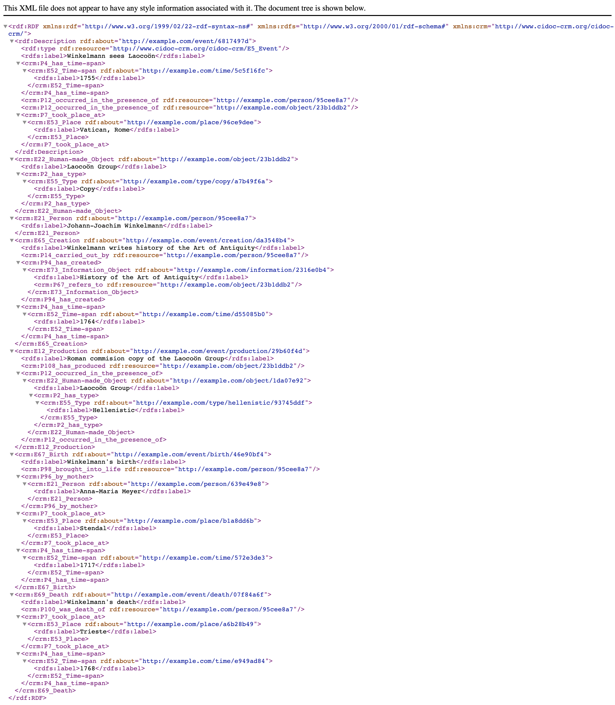
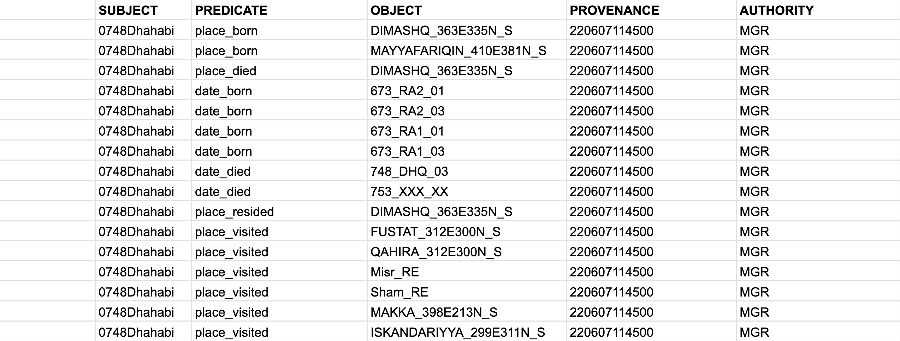

# Overview of the PUA dataset

The original data has been collected into a MySQL database. The researchers who have been creating this data in the course of some thirty to forty years shared their MySQL file. This file is 7,7 Mb and, in fact, can be open in a text editor:


The best way to extract data from this file is to connect to it as a database and extract all the tables into separate files.


## The initial SQL Database: extraction of tables

**Note:** you do not really need to worry much about the following steps, as you will have access to the extracted data. However, it is helpful at least to have some idea about steps that might be necessary when your initial data is not provided in the format that you need. And in my experience, you never get data in the format that you need.  

The best way to proceed it to extract the tables from the MySQL database file and save them as separate files. Unfortunately, we cannot extract the model of the database from the MySQL file, since connections between tables have not been encoded explicitly. This means that we will have to look closely at all the tables and recreate those connections (database model/structure).

But first, we need to extract the tables. The following recipe is for Mac; the installation and starting of MySQL will be different for Windows, but `mysql` commands should be exactly the same.

- make sure that MySQL is installed: `brew info mysql`
- if not: `brew install mysql`
- next, start mysql server: `mysql.server start`
- next, start mysql (in the folder with the database file): `mysql -u root`
- (the server can be stopped: `mysql.server stop`)

The following commands should be the same on all systems, since these are `mysql` commands. So, run these commands to create a database. You only need to run these commands once. Later, the `SHOW DATABASES` command will show all created databases, including the PUA database.

```
mysql> CREATE DATABASE 'pua';
mysql> CREATE USER 'user_pua'@'localhost' IDENTIFIED BY 'pua_pass';
mysql> GRANT SELECT ON pua.* TO 'user_pua'@'localhost';
mysql> USE pua;
mysql> SOURCE file.sql;
mysql> SHOW TABLES;
mysql> EXIT;
```

a few more commands:

- `SHOW DATABASES;` :: will show all databases;
- `DROP nameOfDB;` :: will remove a database;

After this it should be possible to connect to the database from R;

## Extracting tables with R

You will need to set working directory to the folder where mysql file is. Also, create a subfolder `/tables_new/`—this is where all the tables will be exported.

This script connects to a local mysql database, retrieves all tables, and exports them as TSV files in the `tables_new` directory.

```r
library(RMariaDB)
library(dbplyr)
library(dplyr)

# provide working directory --- where the pua.sql file is
workingDirectory <- "path_to_where_you_want_to_save_tables"
setwd(workingDirectory)

con <- DBI::dbConnect(RMariaDB::MariaDB(),
                      dbname = 'pua',
                      host = 'localhost',
                      port = 3306,
                      user = 'user_pua',
                      password = 'pua_pass')

tables <- DBI::dbListTables(con)
str(tables)

library(tidyverse)
library(readr)

folderForTables <- "tables_extracted"
dir.create(folderForTables)

for(t in tables) {
  pathForTable <- file.path(folderForTables, paste0(t, ".tsv"))
  tbl(con, t) %>% 
    collect() %>%
    write_delim(pathForTable, delim = "\t")
}

DBI::dbDisconnect(con)

```

The steps can be explained in the following manner:

This script is written in R and is used to connect to a MariaDB database, extract data from the tables within that database, and then write each table to a separate .tsv file in a specified directory. Here's a detailed breakdown of the code:

1. Libraries are loaded using `library()`. RMariaDB, dbplyr, and dplyr are packages that provide a connection to a MariaDB database and operations on the database. tidyverse is a package that includes several tools for data manipulation, and readr is a package used for reading rectangular data.

```R
library(RMariaDB)
library(dbplyr)
library(dplyr)
library(tidyverse)
library(readr)
```

2. A working directory is set. This should be the path where you want to save your .tsv files.

```R
workingDirectory <- "path_to_where_you_want_to_save_tables"
setwd(workingDirectory)

```

3. A connection to a MariaDB database is established using `DBI::dbConnect()`. The dbname, host, port, user, and password are all parameters to establish the connection.

```R
con <- DBI::dbConnect(RMariaDB::MariaDB(),
                      dbname = 'pua',
                      host = 'localhost',
                      port = 3306,
                      user = 'user_pua',
                      password = 'pua_pass')
```

4. The list of tables in the connected database is retrieved using `DBI::dbListTables(con)`, and then the structure of this object is printed to the console using `str(tables)`.

```R
tables <- DBI::dbListTables(con)
str(tables)
```

5. A directory is created in the working directory for saving the .tsv files. If the directory already exists, `dir.create()` will return a warning.

```R
folderForTables <- "tables_extracted"
dir.create(folderForTables)
```

6. A loop is created to iterate over each table in the `tables` list. Inside the loop, each table is read from the database connection using `tbl(con, t)`. The table is collected into memory using `collect()`, and then written to a .tsv file in the `folderForTables` directory using `write_delim()`. The filename for each .tsv file is the name of the table with `.tsv` appended to it.

```R
for(t in tables) {
  pathForTable <- file.path(folderForTables, paste0(t, ".tsv"))
  tbl(con, t) %>% 
    collect() %>%
    write_delim(pathForTable, delim = "\t")
}
```

7. Finally, the connection to the database is closed using `DBI::dbDisconnect(con)`.

```R
DBI::dbDisconnect(con)
```

Upon completion of this script, we will have all the tables extracted into a subfolder. The files are names after the names of the tables in the original database file (i.e., they are in Spanish). This code can be useful for backing up a database into a more portable and human-readable format, or for processing the data from the database using R's powerful data analysis and manipulation tools.  

### Looking at the data

As was noted above, we do not have the model of the database in the database file, which makes it a bit more complicated. Essentially, we need to look at the tables and figure out how are they connected. This is crucial, since we need to know what is connected to what. Luckily, we can find out that rather easily by identifying the same columns in different tables. As a result, we have the structure that we looked at in the previous lesson with:

1. the main table (`personaje`);
2. connection tables (`personaje_x`);
3. entities tables (`x`);
4. metadata tables;

### Reorganization: Conceptual Model For Your Data

The model that you should choose depends significantly on what exactly you are doing. When the data is already collected and you are just reorganizing it for more efficiency, a much wider variety of approaches can be used. This is the case when the use of a relational database will be fully justified and very easy to implement, since the data is already collected—the most difficult and time-consuming part is already done.

It is a completely different case when you are only beginning to collect your data. In cases when your objects have a very clear set of attributes and information on all or most of those attributes is available or relatively easily acquirable, the reliance on relational databases could be quite efficient. The cases of such objects include actual physical objects and the set of their attributes include descriptions of their physical properties. For example, editions, manuscripts, etc.

In cases, when the set of attributed is not clear, relational databases will be significantly less efficient. Biographical/prosopographical data is one of such cases, mainly for the following reason. It is practically impossible to know beforehand what attributes will be of actual relevance; even though one may think that there is a clear set of attributes, the actual data from the sources may be skewed in a variety of ways not providing one with relevant data on most attributes. On the other hand, working with a particular source one inevitably discovers attributes that were not included in the initial thinking about a given problem, but happened to be important for thinking about specific groups of people. Relational databases are rather inflexible for modifications and would require significant re-design to be realigned with new realities of research.


In the previous lesson, I have mentioned the `subject-predicate-object` model, with which you can describe pretty much everything that you can describe with a subject-predicate-object sentence. The traditional `SPO` model, however, is not exactly perfect for our purposes, especially if we want to record conflicting information from different sources. For this purpose a somewhat different model has been proposed by Tara Andrews, the Professor of Digital Humanities at the University of Vienna. since she is also a historian, working on the medieval Armenian history, she is interested in recording both the provenance, i.e. where the information is taken from, and the authority, i.e. who is making this assertion—since even the same information in the same source may be read differently by two different scholars. To solve this issue, she proposed the structured assertion model (`STAR`), that you see on the right. Thus, with this model, we would have a five column table, instead of a three-column one.

Let's take a look at how STAR method is used in the OpenITI project. We can use the following piece of information as an example of how biographical data can be encoded using STAR method in plain text format:

>  al-Ḏahabī was a teacher (*tafaqqaha ʿalay-hi*) of al-Subkī in Damascus from 699 till 715 AH. (Source: a made-up example with the reference code `220607114503`)

Now, in order to do the actual encoding we use an ordered structure, URIs, and patterned statements. The ordered structure means that the category of data is defines by its location in our encoding statement (for example, the first element is always the subject, the second—always the predicate, etc.). The patterned statement means that we encode certain types of data with a sequence of characters that can be described with generalized patterns (`regular expressions`), which can later be used to both extract and interpret encoded data. The end result may look like the following statement, where five elements are connected with `@`, and details on all the coded information being available/collected in additional files (*linked local data*):

> `[0748Dhahabi@]teacherOf_tafaqqahaCalayhi@0771Subki;DIMASHQ_363E335N_S;699_XXX_XX-715_XXX_XX@MGR@MacrufDahabi1976s_1_345`


- The first element is the *subject*, which is recorded using the Author URI—`0748Dhahabi`; in order to simplify things, we most commonly omit the subject, since it is implied by the name of the file in which metadata is collected (more on this in the discussion of YML files with metadata);
- The second element is our *predicate*—`teacherOf_tafaqqahaCalayhi`. We use unrestricted vocabulary, since we are still at the research stage and this appears to be more productive to explore possibilities; the normalization of predicates will take place periodically during the revisions of metadata. As you may have noticed, there is a pattern in the predicate—there are two parts connected with the “underscore”, which allows us to record the predicate with the reference to its original form in Arabic (although, one can also use simply `teacherOf`, if no Arabic equivalent is available). This kind of encoding is particularly important for developing classification schemes, where one has to keep track of the original vocabulary (for example, relationships among books—different types of abridgments, continuations, commentaries, etc.). <!--Add a visualization?--> 
- The third element is our objects, of which we have three: 1) the “direct object”, which is a person also encoded with the Author URI (`771Subki`)—all individuals are to be encoded using such URIs;[^2206100431] 2) the “object of place”, which is encoded with the URI from an affiliated project al-Ṯurayyā (<https://althurayya.github.io/>)—all geographical entities are to be encoded with such URIs; 3) the “object of time”, which is encoded following a specific pattern `YYYY_MMM_DD` where sub-elements are also divided with an underscore. From this pattern we know that the first sub-element is the year, the second—the month, and the third—the day. In case, any of sub-elements are unknown, they are encoded with `X`s. For the encoding of a period of time, two date statements are connected with “-” (hyphen).
- The fourth element is authority, encoded with the pattern `AUTH_ContributorURI`, with `ContributorURIs` recorded in a separate file that contains additional information on all contributors to the project.
- The last, fifth element contains references, which can be encoded in a variety of ways. Here, we use `MacrufDahabi1976s_1_345`, which consists of three elements separated with `_`.   The first element is the `bibTeX` code of a publication (with the detailed information on the edition stored in a bibTex file with all the used bibliography), while the other two are the volume and page number. (**Note**: this reference is not real.)

**Note**: even if some elements seem complicated for you at the moment because you do not have enough skills to process them and convert them into something more useful, you should always strive for consistency in how you encode your data—if you want to be able to analyze that data computationally. For example, the reference `MacrufDahabi1976s_1_345` may seem weird, but it is structurally solid: there are three elements, separated with `_` and it is very easy to break this coded piece of information into distinct elements. You already know how to do that with R, where, using `tidyverse` approach (more specifically, functions from the family of `stringr`) you can break such references into three separate columns: reference, volume, page(s). Even if you do not know now how to do that, it is always important to plan ahead and focus on encoding your data in a consistent manner.

[^2206100431]: We are primarily interested in the relationships within the OpenITI projects, i.e., among works and among authors, but the coverage can be easily expanded to include non-authors.

Now, let’s talk a bit about how to practically implement these models. The STAR model is meant to fit into existing standards, like CIDOC-CRM or/and FRBR-OO (see, <https://cidoc-crm.org/collaborations>), and implement Linked Open Data (LOD) approach, i.e. linking into existing online datasets. Since we are focusing more on Linked Local Data (LLD) approach, we also want a more pragmatic—i.e., simple—implementation of the STAR model (CIDOC-CRM is a rather complicated standard, see below for an example).

||
|:-:|
|CIDOC-CRM Encoding Example in RDF XML (`*.xml`).<br> Source: <https://www.cidoc-crm.org/sites/default/files/Winkelmann_time_label_1.xml>|

In fact, depending on your sources and your final goals, you can opt for one of the following three variations.

1. As we discussed the simplest variation will be the `S-P-O` model, with `SUBJECT`, `PREDICATE`, and `OBJECT`. (As you can see, the `SUBJECT` is repeated many times, so, technically, one can simplify the data encoding even further, by keeping separate files for each person, and then having only `PREDICATE` and `OBJECT` columns—the `SUBJECT` will be encoded in the name of the file.):


2. If your assertions are simple (i.e., they have single objects), you can use a “simple” STAR model, where we add `PROVENANCE` and `AUTHORITY`:



3. If your assertions have multiple objects, then we would need a “robust”  STAR model with an additional column for `AssertionID`. The complex event has id `17`, where we describe that “al-Ḏahabī was a teacher (*tafaqqaha ʿalay-hi*) of al-Subkī in Damascus from 699 till 715 AH. (Source: a made-up example with the reference code `220607114503`)”:


**Note:** Please, watch Tara Andrews’ presentation “How Might We Make Data Collections More Useful for Historians?”  (<https://www.youtube.com/watch?v=JcBdthObApY>) on the STAR model.

**The advantages of such models:**

- they are *symmetrical*, i.e. you always know which column contains which data. This means you can easily manipulate this data in R.
	- when you load this kind of data into R, you can recursively query your dataset. For example, if you want to find people who died in, say, Qurṭubaŧ, you can filter `OBJECT` to find all instances of `QURTUBA_047W379N_S`; then limit your results to `PREDICATE` == `place_died`. Then you would get all the unique IDs from `SUBJECT`. Then you will filter  `date_died` (in `PREDICATE`) by the unique IDs that you got in the previous step. And now you have all the death dates of people who died in Qurṭubaŧ (don't forget to pick a single date from `date_died` data!).
- they are *expandable*, since you can easily encode new types of information by simply introducing new predicates, and without changing the main structure of your data.
	- Please, note how predicates are named: a broader category is followed by a subcategory, separated with `_`; This will allow you to easily pull out dates, places, etc.
	- Keep in mind that there is no single correct way of modeling your predicates. this is something that you should periodically revise and improve. It helps to keep a visual scheme of your predicates and playing around with it, until you arrive to some stable scheme that allows you to encode everything you need.
- they allow to *implement the Linked Data approach locally* (i.e., Linked Local Data):
	- for example, for places, I used settlement IDs from the al-Ṯurayyā Gazetteer (<https://althurayya.github.io/>); you can download and keep al-Ṯurayyā data in a TSV file and you can get coordinates and settlement classifications from this file easily. If some places are missing, you can expand the original al-Ṯurayyā dataset by adding new places into it (and assigning new IDs following the same pattern, but perhaps adding some suffix that would indicate that this place was not originally in al-Ṯurayyā).
	- for authorities, if you have many of those, you can also keep a file with all the additional descriptions that would be connected to the IDs used in the main table.
	- similarly for predicates (`PREDICATE`) and references (`PROVENANCE`), as well as other columns, as need arises.
	- you will want to keep a master document where you would describe all other conventions that you adopt for your research project (for example, date encoding.)


### Improving PUA Data

After close examination one is likely to discover that PUA data will benefit from some modifications that will allow to get much more out of it during different analyses. These improvements can be broken down into three categories: 

- cosmetic modifications do not change any data, but rather transform the existing information into different representations;
- normalizing modifications are meant to do bring a bit more order and consistency to the used categories;
- modeling modifications are meant to introduce meta categories that would allow to group existing categories into larger analytical categories, thus allowing us to get larger sub-groups of data and through that more meaningful results. While cosmetic and normalizing modifications are meant to improve the quality of structured and normalized data, modeling modifications are intended as an additional research tool that may have multiple alternative and/or complementary categorizations, each meant to address specific research questions.  

Detailed descriptions:

- *cosmetic* modifications:
	- automatic Arabic name transcription, extrapolating from transcribed examples;
	- translation of data from Spanish to English;
- *normalizing* modifications:
	- cleaning of data tables:
		- merging duplicate items: toponyms, *nisbaŧ*s, offices, activities, etc.;
			- conflating records on the same toponyms;
			- conflating gendered descriptions: these must be split into two --- explicit information on gender, that should be attached to persons, and conflating gendered descriptors (like, for example, *adīb* and *adībaŧ* must be conflated into *adīb*, and gendered information moved to personal descriptions)
		- grouping closely related items:
			- particularly, for toponyms, where too many different levels are used; most commonly, toponyms like city quarters, markets, etc. must be conflated into the cities they belong to;
		- refactoring *nisbaŧ*s and dates of offices:
			- geographical *nisbaŧ*s should be converted into places, with a new type of relationship (for example, we can classify it as *onomastic*); this will allow to include more people into geospatial analyses;
				- some *nisbaŧ*s will cause problems (like al-Ṭarābulusī, which may refers to two different cities);
			- offices: there are occasional dates on when one got an office; there is possibility that those dates could be moved into personal information, which will be useful especially when we do not have birth/death dates for that person. These dates must be classified as *date_of_office*, of something like that.
		- main strategy:
			- categories must be analyzed quantitatively and the priority must be given to most frequent ones, while those with very low frequencies might be excluded altogether (for example, those with frequency 1). 
- *modeling* modifications:
	- introducing meta categories for analytical purposes:
		- toponyms: grouped into larger geographical entities as provinces, districts, etc. (at the moment we only have classification into Andalusian and non-Andalusian locations);
	- `actividad` can be divided into different “industries”, “social spheres”, etc.
	- `cargo` can be grouped into “social spheres”, etc.
	- essentially, every categorical table must be reviewed from this perspective. 


<!--

### From the previous lesson

#### PUA [Tidy] Data:

> perhaps this should be move to the first lesson that deals with PUA --- something like "Tiding PUA Data"

Multiple extensive tables can and should be converted into a simpler structure (following: @RomanovAlgorithmic2017, <https://www.journals.uchicago.edu/doi/full/10.1086/693970>)

- **ID of a biographee**: these must be unique across the dataset;
- **category**: any number of categories can be easily accommodated;
- **value**: a specific value for the selected category; any number of values for the same category can be accommodated;

This tripartite model is particularly convenient and efficient for encoding objects whose data may vary significantly in richness. For example, some biographies may have only two or three values for encoding, while others may have dozens of values. If we use a more conventional “symmetrical” format—a table where we have a column for each category of data to be encoded, we will end up with lots of empty cells, and, at the same time, we will have difficulties in cases when we have multiple values for the same category (in the case of biographies, a person may often have multiple geographical *nisbaŧ*s). Here we can take a look at the main original data table of the PUA --- and count how many cells are empty and how many cells include multiple values (i.e., not tidy).

**Note:** not all tables must be merged together; quite the opposite, it makes sense to keep some data in separate tables and merge with the main data table only when necessary. For example, it makes sense to keep the following data separately (it will make it also easier to update and extend, especially when it has to be done manually):

- additional information on toponyms;
- additional information on professions;
- additional information on sources;

Essentially, most of the tables that were kept separately in the original dataset should remain isolated; only the main prosopographical table should be converted into this tripartite model.

-->