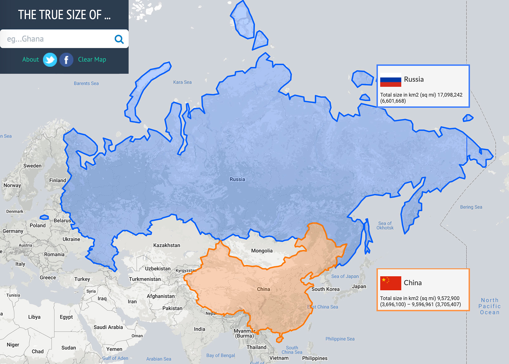
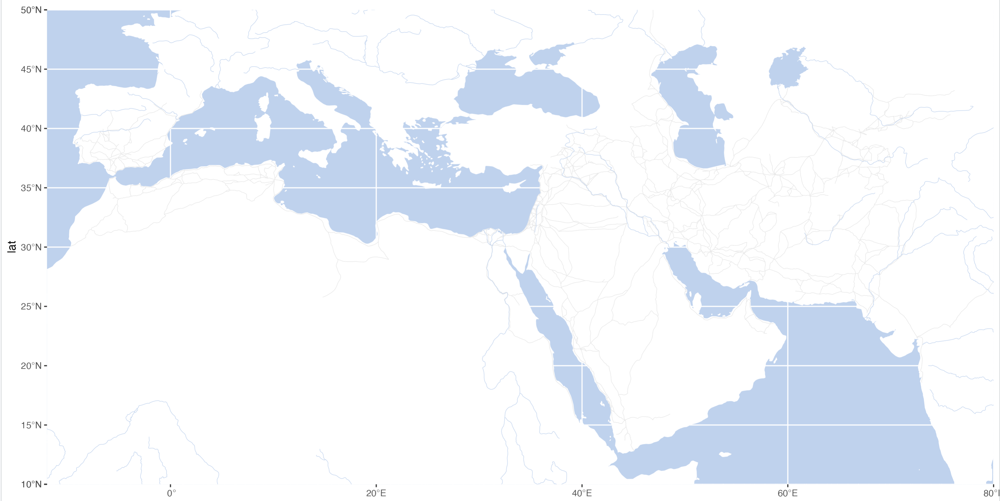
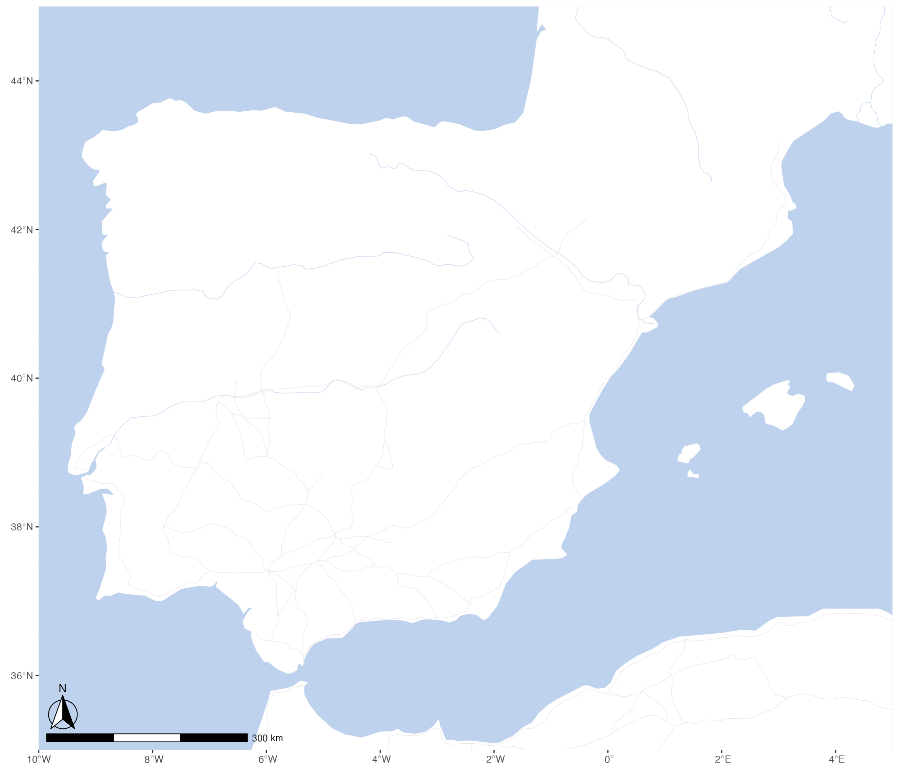
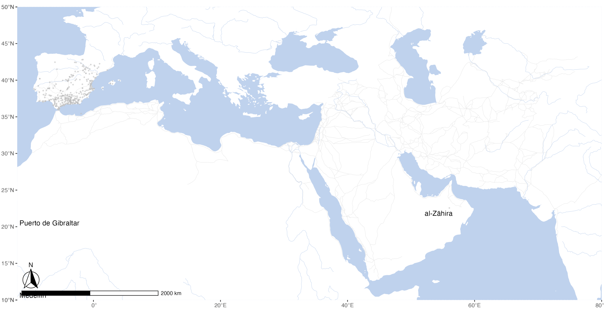
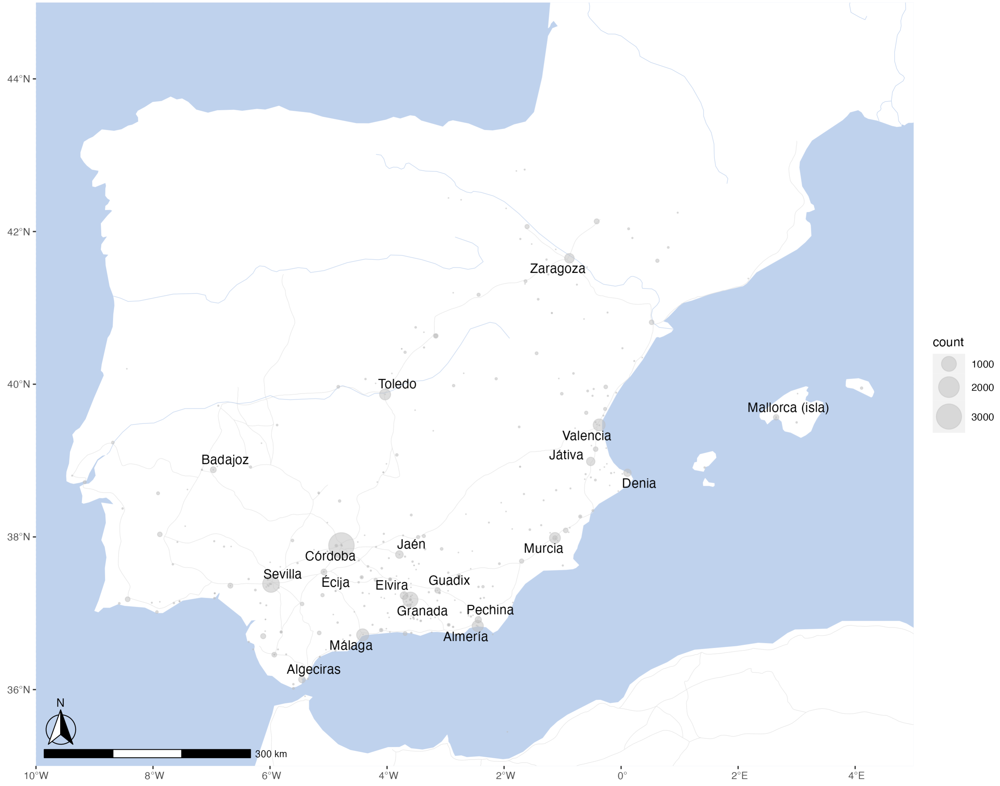

# Geographical Maps & Cartograms


## Creating Base Maps

A base map is the foundational layer of your map with necessary contextual information. It provides context for additional layers---those with analytical information---that are added on top of the base map. Most commonly, base maps provide location references for features that do not change often like shorelines, boundaries, rivers, lakes, roads.

<!--

-A base map is a layer with geographic information that serves as a background. A base map provides context for additional layers that are overlaid on top of the base map. Base maps usually provide location references for features that do not change often like boundaries, rivers, lakes, roads, and highways. Even on base maps, these different categories of information are in layers. Usually a base map contains this basic data, and then extra layers with a particular theme, or from a particular discipline, are overlaid on the base map layers for the sake of analysis. (<https://rdkb.sgrc.selkirk.ca/Help/Content/Client_APIs/SV_User/SVU_AboutBaseMaps.htm>)

- A basemap provides a user with context for a map. You can add information to a basemap by overlaying other information on top of it. (<https://nhd.usgs.gov/userGuide/Robohelpfiles/NHD_User_Guide/Interactive_Tutorials/Module_1/Basemaps_Overlays/Popups/What_is_a_Basemap_.htm>)

-->

<!--
- ~~Projections; examples; <https://thetruesize.com/>~~
- ~~Understanding main map components: layers of points, lines, polygons and rasters~~
- Construct a base map, step by step.
  - adding main layers
  - customizing map with additional goodies
  - saving maps
- Examples of maps:
  - Europe
  - Islamic world provinces
- PS: Maps as Art:
  - Vienna
-->


## Core concepts and their practical implementations

### Projection Issues


<!--

-->

See, <https://en.wikipedia.org/wiki/List_of_map_projections>.

Website <https://thetruesize.com/> is a nice tool for demonstrating how projection affects our perceprion of reality. On te following two screenshots you can see how the "sizes" of Russia (~17,1 mln km^2^) and China (c. 9,6 mln. km^2^) change when they change places.




### A Digital Map: Layers of Goodness


* Layers:
	* Analytical Layer
	* Our Data
	* Annotation/Legend
* Social Geography
	* Political Boundaries
	* Settlements, etc.
* Physical Geography
	* Types of surface (*raster*)
	* Continents / Coastal Line
	* Elevation profile (*raster*)
	* Rivers, Lakes, etc.
* Base Layer: Graticule

## Main Types of Data: Points, Lines, Polygons


**SOURCE**: There are 3 types of vector objects: points, lines or polygons. Each object type has a different structure. Image Source: Colin Williams (NEON), via: [www.earthdatascience.org](https://www.earthdatascience.org/courses/earth-analytics/spatial-data-r/intro-vector-data-r/)

* Analytical Layers:

	* Our Data
		* Points:
			* item1, x**[1]**, point(lat, lon)**[2]**; item2, x**[1]**, point(lat, lon)**[2]**; item3, x**[1]**, point(lat, lon)**[2]**; ... itemX, x**[1]**, point(lat, lon)**[2]**;
		* Lines:
			* line1, x**[1]**, {from(lat, lon)**[2]**, to(lat, lon); from(lat, lon)**[2]**, to(lat, lon); from(lat, lon)**[2]**, to(lat, lon); ... from(lat, lon)**[2]**, to(lat, lon);}**[2]** ... lineX ...
		* Polygons:
			* polygon1, x, area(lat1, lon1; lat2, lon2; ... latX, lonX; ... lat1, lon1)**[2]** ... polygonX ...

	* Annotation/Legend

**[1]** where x is a categorical parameter; **[2]** lat/lon: decimal coordinates (not DMS)

## Base maps

Base map is essentially the foundation map on which you will be adding data that you want to analyze. It is good to have the base map put together and ready for reuse.

For a detailed walkthrough for creating a base map, see <https://maximromanov.github.io/rgis_univie2021/l08-gis-ii.html>. Here we will use a shortened version.

### New libraries

```R
library(tidyverse)

library(sf)
library(rnaturalearth)
library(rnaturalearthdata)

library(ggspatial)
library(ggrepel)
```

#### Geospatial layers

First, download necessary geospatial data. `world` is loaded from `rnaturalearth` libraries, while the other three files are preprocessed and prepared by me. Download them and place them into your course folder according to the paths given below!

```R
world <- ne_countries(scale = "medium", returnclass = "sf")
rivers_df <- readRDS("./Data/map_objects/rivers_df.rds")
aral_sea_df <- readRDS("./Data/map_objects/aral_sea_df.rds")
routes_df <- readRDS("./Data/map_objects/routes_df.rds")
```

and, let's load the PUA data (still working with the old data):

```R
PUA <- readRDS("./Data/PUA_processed/PUA_allDataTables_asList.rds")
```

### Compiling the base map

With the following code we can generate our first base map. you can adjust a number of parameters to change the look of your map. The main ones are: colors and map limits.

```R
waterColor <- "lightsteelblue2" #
roadColor  <- "grey90"
xlim <- c(-12,80); ylim <- c(10,50)

ggplot(data = world) +
  geom_sf(fill="white", color="white") +
  # routes from Althurayya
  geom_path(data = routes_df,aes(x = long, y = lat, group = group), color = roadColor, linewidth = .2) +
  # rivers and the aral sea
  geom_path(data = rivers_df,aes(x = long, y = lat, group = group), color = waterColor, linewidth = .2) +
  geom_polygon(data = aral_sea_df,aes(x = long, y = lat, group = group), color = waterColor, fill = waterColor, linewidth = .2) +
  # map limits and theme
  coord_sf(xlim = xlim, ylim = ylim, expand = FALSE) +
  theme(panel.background = element_rect(fill = waterColor))
```



We can add a scale bar. This we can do with the library `ggspatial` (location parameters are as follows: `tl`, `tr`, `bl` and `br`—for top left, top right, bottom left, and bottom right).

```R
ggplot(data = world) +
  geom_sf(fill="white", color="white") +
  # routes from Althurayya
  geom_path(data = routes_df,aes(x = long, y = lat, group = group), color = roadColor, linewidth = .2) +
  # rivers and the aral sea
  geom_path(data = rivers_df,aes(x = long, y = lat, group = group), color = waterColor, linewidth = .2) +
  geom_polygon(data = aral_sea_df,aes(x = long, y = lat, group = group), color = waterColor, fill = waterColor, linewidth = .2) +
  # annotation scale
  annotation_scale(location = "bl", width_hint = 0.25) +
  annotation_north_arrow(location = "bl", which_north = "true", pad_x = unit(0.0, "in"), pad_y = unit(0.2, "in"), style = north_arrow_fancy_orienteering) +  
  # map limits and theme
  coord_sf(xlim = xlim, ylim = ylim, expand = FALSE) +
  theme(panel.background = element_rect(fill = waterColor), axis.title.y=element_blank(), axis.title.x=element_blank())
```


For convenience, we can store the main layers into variables:

```R
baseplot <- ggplot(data = world) +
  geom_sf(fill="white", color="white") +
  # routes from Althurayya
  geom_path(data = routes_df,aes(x = long, y = lat, group = group), color = roadColor, linewidth = .2) +
  # rivers and the aral sea
  geom_path(data = rivers_df,aes(x = long, y = lat, group = group), color = waterColor, size = .2) +
  geom_polygon(data = aral_sea_df,aes(x = long, y = lat, group = group), color = waterColor, fill = waterColor, size = .2) +
  # annotation scale
  annotation_scale(location = "bl", width_hint = 0.25) +
  annotation_north_arrow(location = "bl", which_north = "true", pad_x = unit(0.0, "in"), pad_y = unit(0.2, "in"), style = north_arrow_fancy_orienteering) +  
  # map limits and theme
  coord_sf(xlim = xlim, ylim = ylim, expand = FALSE)

themeParameters <- theme(panel.background = element_rect(fill = waterColor), axis.title.y=element_blank(), axis.title.x=element_blank(), panel.grid.major = element_line(color = waterColor, linetype = "dotted", linewidth = 0.5))
```

And then, call `baseplot + themeParameters` to print out the map. We can add a layer of additional data between these two layers to visualize some our our research data.

### Adding data

We can add some of the PUA data on our base map to get the final view. But first we may want to also refocus our on al-Andalus, which can be done by changing xlim and ylim parameters. 

```R
xlimAnd=c(-10,5); ylimAnd=c(35,45)

baseplotAnd <- ggplot(data = world) +
  geom_sf(fill="white", color="white") +
  # routes from Althurayya
  geom_path(data = routes_df,aes(x = long, y = lat, group = group), color = roadColor, linewidth = .2) +
  # rivers and the aral sea
  geom_path(data = rivers_df,aes(x = long, y = lat, group = group), color = waterColor, size = .2) +
  geom_polygon(data = aral_sea_df,aes(x = long, y = lat, group = group), color = waterColor, fill = waterColor, size = .2) +
  # annotation scale
  annotation_scale(location = "bl", width_hint = 0.25) +
  annotation_north_arrow(location = "bl", which_north = "true", pad_x = unit(0.0, "in"), pad_y = unit(0.2, "in"), style = north_arrow_fancy_orienteering) +  
  # map limits and theme
  coord_sf(xlim = xlimAnd, ylim = ylimAnd, expand = FALSE)
```



Let's try to map all the Andalusian locations:

```R
cities <- PUA$lugar %>%
  filter(FLAG_alandalus == 1)

graph01 <- baseplot + 
  geom_point(data = cities, aes(x=lng, y=lat), alpha = 0.5, col="grey", size = 0.5) +
  scale_size(range=c(0.01, 2)) +
  geom_text_repel(data = cities, aes(x=lng, y=lat, label = nombre_castellano), force = 2, segment.alpha = 0) + 
  themeParameters

graph01
```



We can see here that PUA data has some more flaws, as some Andalusian locations are not in al-Andalus. Something that needs to be fixed (Cova & Ensar).

For now we can implement some quick fix:

- filter our cities by coordinates;
- focus on high frequency locations; (not using fixed data yet!)

```R
citiesTop <- PUA$personaje_lugar %>%
  group_by(idLugar) %>%
  summarize(count = n()) %>%
  left_join(cities) %>%
  filter(lat >= ylimAnd[1] & lat <= ylimAnd[2]) %>%
  filter(lng >= xlimAnd[1] & lng <= xlimAnd[2]) %>%
  mutate(label = ifelse(count > 100, nombre_castellano, NA))

graph02 <- baseplotAnd + 
  geom_point(data = citiesTop, aes(x=lng, y=lat, size = count), alpha = 0.5, col="grey") +
  scale_size(range=c(0.01, 10)) +
  geom_text_repel(data = citiesTop, aes(x=lng, y=lat, label = label), size = 4, force = 2, segment.alpha = 0) + 
  themeParameters

graph02
```



You can save maps in the following manner. Like with graphs before, you may need to play around with sizing to get the best possible view for your map.

```R
ggsave("./Classes/Class_09/PUAR_Cl09_Map01.png", plot=graph02, width = 420, height = 297, units = "mm", dpi = "retina")
ggsave("./Classes/Class_09/PUAR_Cl09_Map01.svg", plot=graph02, width = 10, height = 10, units = "in")
```


## Raster base maps

There are other options for base maps that rely on raster data. Since practically all raster data is moderns, we do not have much use for it.
Yet, if you work on maps of cities, modern data (both raster and vector) may be quite handy in order to map old entities into the modern realities of cities.
You can check how to use that here: <https://maximromanov.github.io/rgis_univie2021/l08-gis-ii.html>.

## Homework

Try to map different subsets of data (go back to the examples of previous lessons):

- for example, jurists vs some other group;
- use Arabic names for settlements;
- for those who are up for a challenge, check <https://maximromanov.github.io/rgis_univie2021/l09-gis-iii.html>
	- try to create maps by periods as explained in the lesson;
	- try to create an animated map; 

**NB**: I am not throwing you under the bus here, but rather wanting you to try a real life scenario, when, in order to do something that you want you need to find something similar and adapt it to your data.

