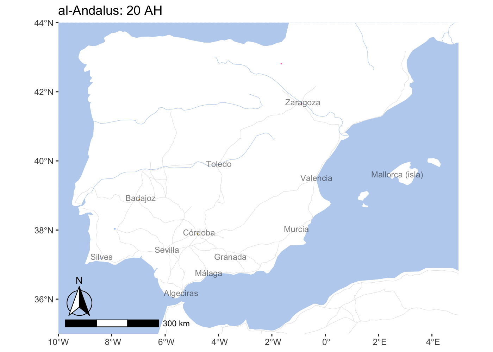
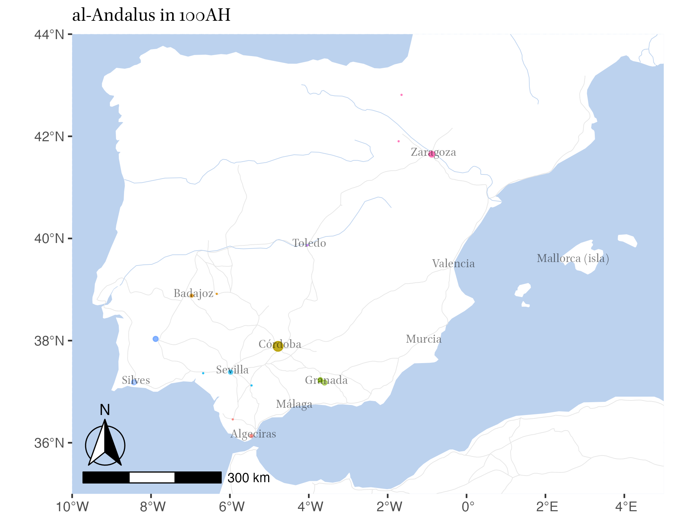
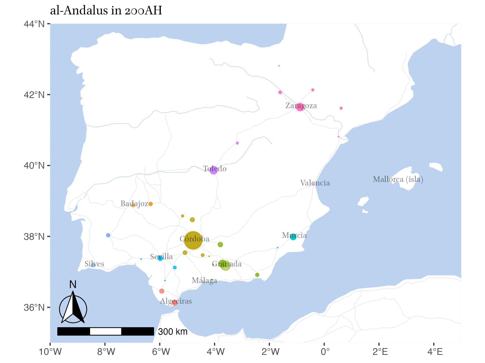
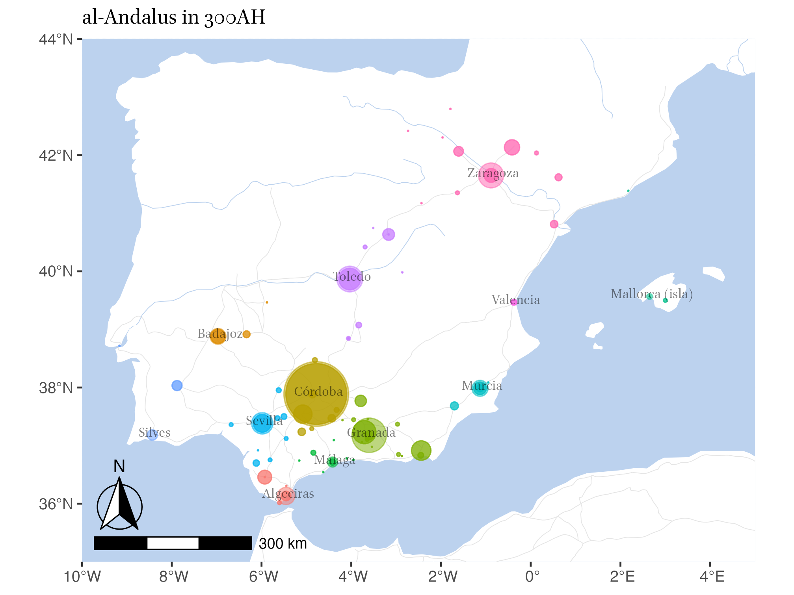
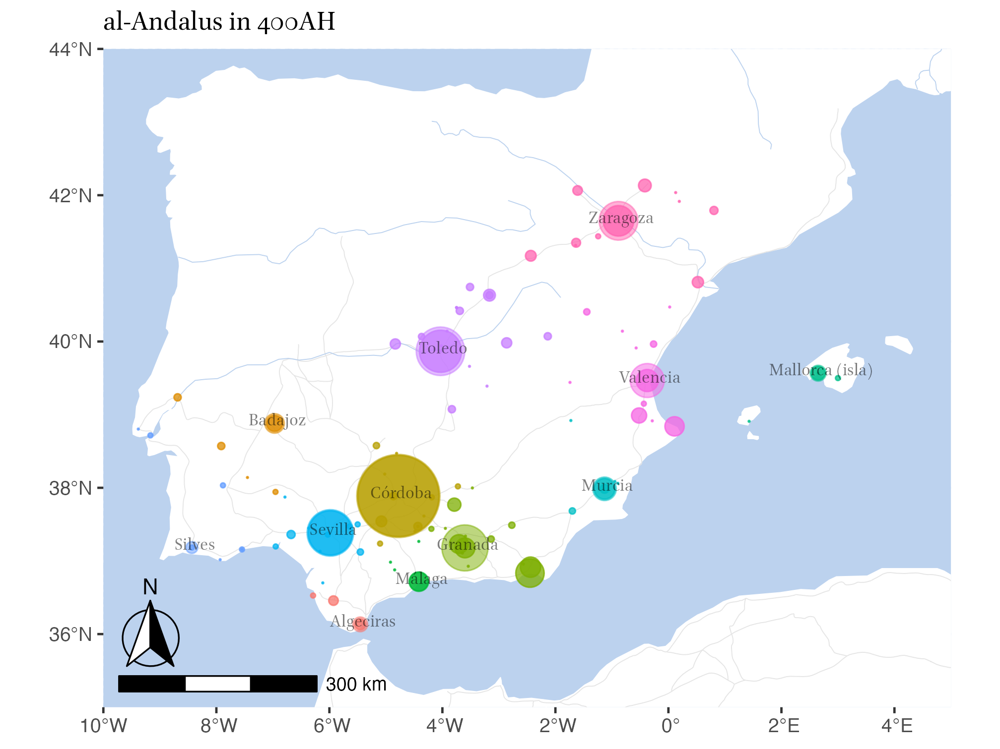
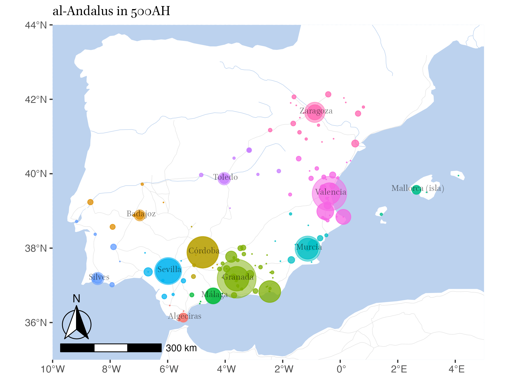
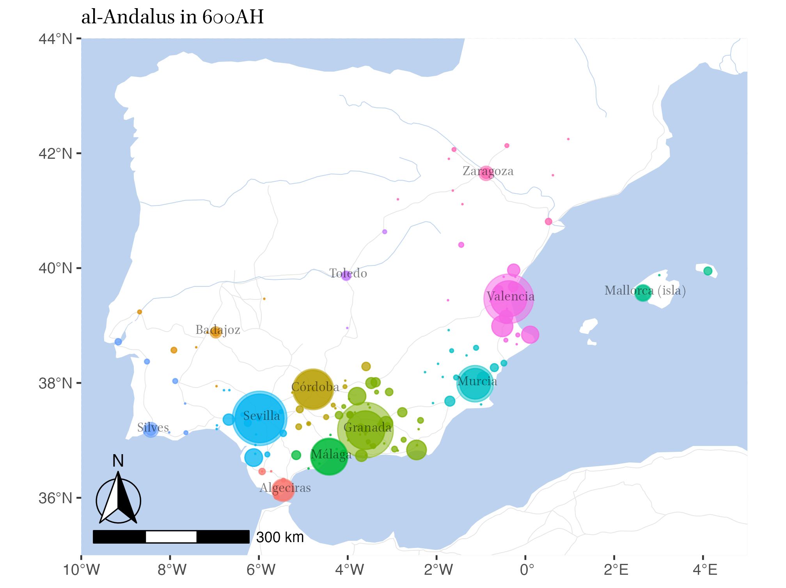
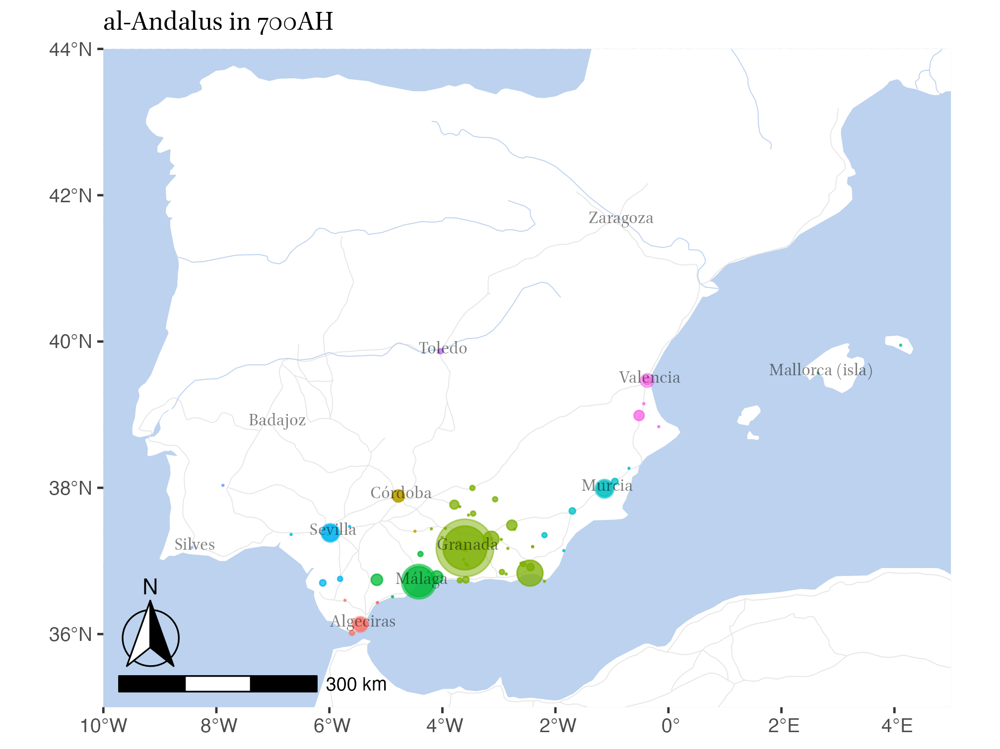
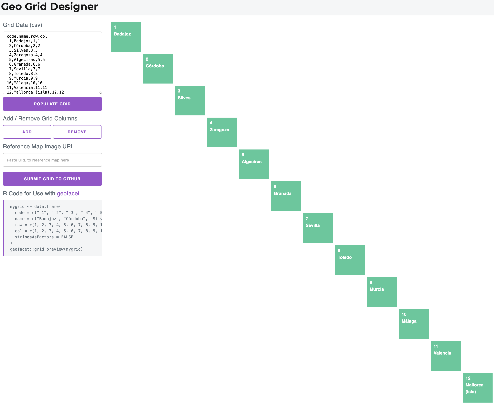
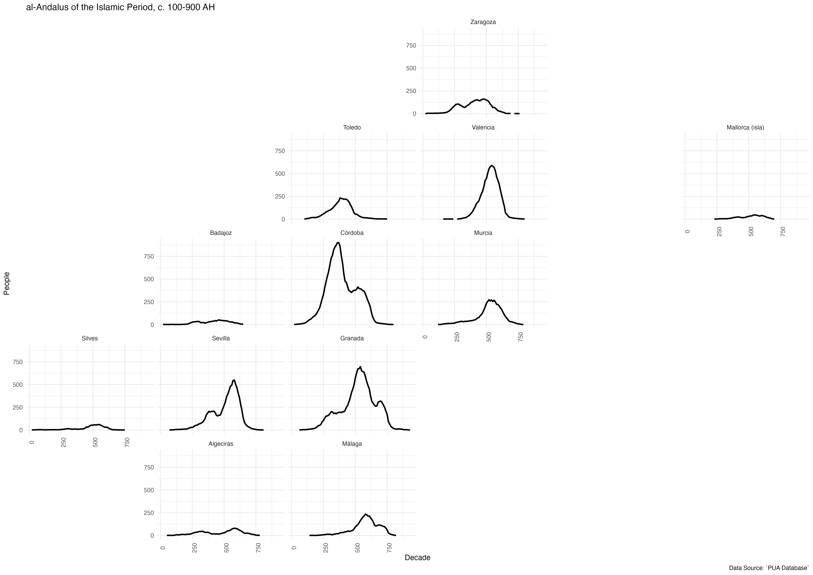

# Chronological Cartograpms

Let's now create a series of maps on all the people that we have in PUA within al-Andalus across the covered period. (Following the US cities example from the previous lesson).

```{r}

PUA <- readRDS("./data/PUA_processed/PUA_allDataTables_asList_UPDATED.rds")

personaje_with_dates <- PUA$personaje_decadas_modeladas

personaje_with_places <- PUA$personaje_lugar %>%
  filter(idPersonaje %in% personaje_with_dates$idPersonaje) %>%
  select(idPersonaje, idLugar) %>%
  left_join(PUA$lugar) %>%
  select(idPersonaje, idLugar, lat, lng) %>%
  left_join(PUA$lugar_con_imanes) %>%
  filter(!is.na(region)) %>%
  select(idPersonaje, idLugar, lat, lng, region, latR, lngR)

personaje_with_places
```
Now, let's `left_join` with modeled decades. Essentially, this will create lots of “duplicates” for each person---a single person-place row will be duplicated as many times as there are decades for that individual.  

```{r eval=TRUE, message=FALSE, warning=FALSE, include=TRUE}
personaje_with_places_and_dates <- personaje_with_places %>%
  left_join(personaje_with_dates)

personaje_with_places_and_dates
```

Now we can split this table into two: one will have the minor places count, while the other will have counts for our magnets.

```{r}

minor_places_over_time <- personaje_with_places_and_dates %>%
  group_by(idLugar, lat, lng, decadas, region) %>%
  summarize(people = n()) %>%
  arrange(decadas) %>%
  pivot_wider(names_from = decadas, values_from = people) %>%
  pivot_longer(cols = "20":"930", names_to = "decadas", values_to = "people") %>%
  ungroup()

imanes_decadas <- personaje_with_places_and_dates %>%
  group_by(region, latR, lngR, decadas) %>%
  summarize(people = n()) %>%
  arrange(decadas) %>%
  pivot_wider(names_from = decadas, values_from = people) %>%
  pivot_longer(cols = "20":"930", names_to = "decadas", values_to = "people") %>%
  mutate(decadas = as.numeric(decadas)) %>%
  ungroup()

```

We can now use both layers to map data at two scales:

```{r message=FALSE, warning=FALSE}

andalus <- base_plot_andalus_themed + 
  geom_point(data = imanes_decadas,
             aes(x = lngR, y = latR, size = people, col = region),
             alpha = 0.5, show.legend = FALSE) +  
  geom_point(data = minor_places_over_time,
             aes(x = lng, y = lat, size = people, col = region),
             alpha = 0.75, show.legend = FALSE) +
  geom_text(data = imanes_decadas,
            aes(x = lngR + 0.05, y = latR + 0.05, label = region),
            size = 3, alpha = 0.5) +
  scale_size_continuous(range = c(0.05, 20))

andalus
```

### Animated Map Approach

Animating the map can be quite annoying. however, below is the code. Keep in mind that it takes a while to generate animation. While you are developing it, it is worth reducing the quality of the animation: 1) reduce the duration to 10-20 seconds; 2) reduce the width and height; 3) reduce the resolution to 100 or less. If your animation looks like what you want, you can then select all the high quality parameters and generate the final result. 

```{r eval=FALSE, include=TRUE}

library(gganimate)
library(gifski)

andalusAnimated <- andalus +
  transition_states(decadas) +
  labs(title = "al-Andalus: {closest_state} AH")

anim_save("./images/generated/Andalus_Animated_01.gif", animation = andalusAnimated,
          duration = 60, fps = 2, end_pause = 10,
          rewind = FALSE, height = 5, width = 7, units = "in", res = 200)

```



### “Frame-by-Frame” Approach

Alternatively, one can generate individual maps of each and every decade and aggregate them into an animation using other means. However, in most cases, static maps of specific periods would be of much greater use, both for presentations and for publications. We can generate such maps using a loop. We can either loop over all the decades (which we have in the vector `imanes_decadas$decadas`), or, we can reduce the number of decades for which we generate maps (using for example this vector: `seq(100, 900, 100)`).

**Note:** we need to add some modification to the scaling parameters, expressed in the `global_range` variable. Essentially, we need to adjust our scaling to the values *for all the periods*.

```{r eval=FALSE, include=TRUE}

global_range <- range(imanes_decadas$people, minor_places_over_time$people, na.rm = TRUE)

for (d in seq(100, 900, 100)) {
  
  # TEMP DATA
  imanes_decadas_temp <- imanes_decadas %>%
    filter(decadas == d)
  minor_places_over_time_temp <- minor_places_over_time %>%
    filter(decadas == d)
  
  # TEMP MAP
  map_temp <- base_plot_andalus_themed + 
    geom_point(data = imanes_decadas_temp,
             aes(x = lngR, y = latR, size = people, col = region),
             alpha = 0.5, show.legend = FALSE) +  
    geom_point(data = minor_places_over_time_temp,
             aes(x = lng, y = lat, size = people, col = region),
             alpha = 0.75, show.legend = FALSE) +
    geom_text(data = imanes_decadas_temp,
            aes(x = lngR + 0.05, y = latR + 0.05, label = region),
            size = 3, alpha = 0.5, family = "Brill") +
    scale_size_continuous(range = c(0.05, 20), limits = global_range) +
    ggtitle(paste0("al-Andalus in ", d, "AH")) +
    theme(plot.title = element_text(family = "Brill"))

  # SAVE TEMP MAP
  fileName <- paste0("PUA_Andalus_BubbleMap_",
                     stringr::str_pad(d, width = 4, side = "left", pad = "0"),
                     ".png")
  fullPath <- paste0("./images/generated/", fileName)
  ggsave(fullPath, plot = map_temp, width = 160, height = 120,
         units = "mm", dpi = "retina")
  
}

```

Our results are for the following time frames: 100, 200, 300, 400, 500, ... 900 AH.













## Chrono-Geographical Information without Maps

We can visualize our data by regions in a manner we have already used:

```{r message=FALSE, warning=FALSE}

andalus_01 <-  ggplot() + 
  geom_line(data = imanes_decadas, aes(x = as.integer(decadas), y = people, color = region), linewidth = 1) +
  facet_wrap(~ region) +
  theme_minimal() +
  labs(title = "Andalusian regions over time")
  
andalus_01
```

Alternatively, we can also arrange this tabular format in such a way that would visually resemble the geography of al-Andalus. For this we can use the library `geofacet` that also has a nice interface for arranging the grid:

```{r eval=FALSE, include=TRUE}
library(geofacet)

andalusGridInitial <- tibble(
  code = seq(1,12),
  name = unique(imanes_decadas$region),
  row = seq(1,12),
  col = seq(1,12),
) 

grid_design(data = andalusGridInitial)
```


Using this convenient interface, one can easily rearrange squares into a more geographically suggestive table. In our case it may look like the following:


```{r message=FALSE, warning=FALSE}

andalusGrid <- data.frame(
  code = c(" 1", "11", " 8", " 9", " 4", " 2", "12", " 3", " 7", " 5", " 6", "10"),
  name = c("Zaragoza", "Valencia", "Toledo", "Murcia", "Córdoba", "Badajoz", "Mallorca (isla)", "Silves", "Sevilla", "Granada", "Algeciras", "Málaga"),
  row = c(1, 2, 2, 3, 3, 3, 2, 4, 4, 4, 5, 5),
  col = c(4, 4, 3, 4, 3, 2, 6, 1, 2, 3, 2, 3),
  stringsAsFactors = FALSE
)

# run this line separately , if you want to open grid editor;
# no need to have it uncommented, if you want to generate a notebook
geofacet::grid_preview(andalusGrid)

```

Now, we can use this grid to visualize our geographical curves:

```{r message=FALSE, warning=FALSE}

imanes_decadas_test <- imanes_decadas %>%
  rename(name = region)

andalusGridGraph <- ggplot(data = imanes_decadas_test,
                           aes(x = as.integer(decadas), y = people)) +
  geom_line(linewidth = 1) +
  facet_geo(~ name, grid = andalusGrid, label = "name") +
  labs(title = "al-Andalus of the Islamic Period, c. 100-900 AH",
    caption = "Data Source: `PUA Database`",
    x = "Decade", y = "People", family = "Brill") +
  theme_minimal() +
  theme(axis.text.x = element_text(angle = 90))

andalusGridGraph

ggsave("./images/generated/andalusGridGraph.png",
       plot = andalusGridGraph, width = 420, height = 297,
       units = "mm", dpi = "retina")

```


