--- 
title: "HDIS: Analysis of Prosopographical Data--with R"
author: ["Maxim G. Romanov"]
date: "`r Sys.Date()`"
description: "This is a Handbook for Digital Islamicate Studies. Work in progress, based on tought courses."
url: 'https\://eis1600.github.io/hdis-pua/'
github-repo: "EIS1600/hdis-pua"
apple-touch-icon: "touch-icon.png"
apple-touch-icon-size: 120
favicon: "favicon.ico"
documentclass: book
link-citations: yes
bibliography:
- book.bib
- references.bib
- packages.bib
biblio-style: apalike
---

# Preface{-}

This is a Handbook for Digital Islamicate Studies. Work in progress, based on courses tought. The current instantiation is a hands-on course that provides a practical introduction to the R programming language for historians with a specific focus on analyzing prosopographical data. The primary dataset that we will explore comes from the “Prosopografía de ulemas de al-Andalus” (PUA) project (https://www.eea.csic.es/pua/), which contains information on Muslim scholars from al-Andalus. The course is designed for those with no prior programming experience but assumes some familiarity with Arabic and Spanish, as the PUA data is primarily in these languages. The language of instruction will be English.

<!--chapter:end:index.Rmd-->

# About the Course{-}

This hands-on course provides a practical introduction to the R programming language for historians, with a specific focus on analyzing prosopographical data. The primary dataset we will explore comes from the “Prosopografía de ulemas de al-Andalus” (PUA) project (https://www.eea.csic.es/pua/), which contains information on about 12,000 Muslim scholars from al-Andalus. The course is designed for those with no prior programming experience but assumes some familiarity with Arabic and Spanish, as the PUA data is primarily in these languages. The language of instruction will be English.

## Syllabus{-}

* **Full nomenclature**: [UHH AAI SoSe 23] 57-528 Digital Humanities in African-Asian Studies: Analysis of prosopographical data with programming language “R”
* **Language of instruction**: English
* **Hours per week**: 2
* **Credits**: 6.0
* **Meeting time**: ...
* **Additional meeting time**: *we will need to find a time slot when you can all join and work on your HW assignments together*
* **Meeting place**: for convenience, all meetings will be held online via Zoom: <...>;
* **Course resources:** <https://eis1600.github.io/hdis-pua/>;
* **Meeting link**: *shared via Slack*; other details are available via STiNE
* **Office hours**: *tbd* (on Zoom); if you have any questions, please, post them on Slack
* **Instructor**: Dr. Maxim Romanov, [maxim.romanov@uni-hamburg.de](maxim.romanov@uni-hamburg.de)

### General Description{-}

The course aims to introduce students to the main methods of data analysis that would be suitable for historical data. Students will learn the basics of the programming language R, which is one of the top choices in the field of Digital Humanities and Digital History. By the end of the course, students will understand how to work with data and how to extract the most valuable insights from it (exploratory data analysis). Students will practice on a prosopographical dataset created from data from medieval Arabic biographical collections.

Personal computers are required both for in-class work and for your homework. Your computer must run a full version of either Windows, MacOS, or Linux; unfortunately, neither tablets nor Chrome-based laptops are suitable for this course. No prior programming experience is required, but familiarity with the command line and basic principles of programming will be beneficial.

### Learning objectives{-}

1. Get basic familiarity with the programming language R;
2. Learn basic analytical techniques;
3. Gain an understanding of working with data and modeling data;
4. Practice these skills on a collection of historical data;

### Didactic concept{-}

This is a hands-on practical course, which requires regular attendance and completion of homework assignments. The participants of the course are encouraged to attend weekly “office hours”, where they can work on their homework assignments and get immediate feedback from the instructor. The main didactic approach of the course is to maximize the engagement of the participants with the programming language: this will provide a level of confidence and comfort in dealing with admittedly an alien subject within the scope of African and Asian studies; attaining this level of comfort is the key to absorbing the necessary theoretical, conceptual, and practical knowledge. Upon the completion of assigned tasks, the students are encouraged to bring their own datasets, since the engagement with their own data will provide a better grounding in this new subject.  

### Course structure and learning objectives:

1.  Introduction to R programming language: Learn the basics of R, including syntax, data types, and core functions.
2.  Data manipulation and analysis: Understand how to clean, transform, and analyze data using R.
3.  Visualization techniques: Create chronological graphs, cartograms, and network diagrams to visually represent the data.
4.  Working with prosopographical data: Apply learned techniques to the PUA dataset, focusing on the analysis of Muslim scholars from al-Andalus.
5.  Independent research: Encourage students to bring their own datasets for analysis and receive guidance from the instructor.

By the end of the course, students will have a foundational understanding of R programming, basic data analysis techniques, and experience working with prosopographical data. They will be better equipped to tackle research questions in African and Asian studies using computational methods.

### Main Object of the Course: PUA Dataset

In the course we will focus on the data from “Prosopografía de ulemas de al-Andalus” (PUA) ([https://www.eea.csic.es/pua/](https://www.eea.csic.es/pua/)). Below is a slightly reworked description of the project from the official website (should be further reworked):

> The aim of prosopography is the historical study of a group of people---as defined by a particular feature or common characteristic---through an analysis of their biographical data. Prosopography is not a simple collection of biographies, because, although it is closely related to that literary genre, it is distinct from it because its interest is not focused on the individual, but rather on the group. It analyzes common characteristics and the structure of relationships between the people belonging to that sector of society. In the case of PUA, that group is the *ʿulamāʾ* (scholars) who lived in al-Andalus during the 2nd–9th centuries AH / 8th–14th centuries CE. *ʿUlamāʾ* are defined as specialists in Islamic religious knowledge, whose biographies can be found in biographical dictionaries, a characteristic genre of Arabic literature which underwent substantial development during the Middle Ages in al-Andalus. It should be added, however, that the project includes all those persons who have their own entry in biographical dictionaries, even if they cannot be truly be labelled as *ʿulamāʾ*. These include poets, men of letters and people devoted to “the sciences of the ancient” are also included.

The dataset includes:

A total of 31,117 biographies belonging to 205 sources have been consulted, which allowed to compile:

- 11,832 - persons (12,817 records; 985 reference records)
- 509 *nisbaŧ*s
	-   281 geographic
	-   184 tribal
	-   13 family
	-   31 other type
- 817 families
- 848 places
	-   554 al-Andalus
	-   294 non-andalusi

The following is a list of just some of the points for which the prosopographic method may be of use.

-  **Reconstructing families**: Reconstructing families and research into family relationships between the ulemas, as well as producing genealogical trees, is a task that will be facilitated by having all of the information available in digital format. Bringing together all of these genealogical trees and studying the geographical and tribal origins of all of the families is a fundamental task that still remains to be done. It must also be pointed out that achievements of other partial works (Molina, “Taʾrīj de Ibn al-Faraḍīi”) lead us to think that this is the best method for carrying out a true critical review of the data provided by biographical dictionaries. 
-   **Research into the world of knowledge**: Master-disciple relationships, establishing transmission networks for the main works and disciplines. This topic is in turn very closely connected to kinship, as the marriage strategies that were established within the group of the ulemas were linked to the transmission of knowledge and to the control of knowledge as a means of power.
-   **Local elites**: The distribution of these ulemas across different areas allows us to look at which were the main centres of knowledge and to study local elites. Many of these studies have already been carried out using this database, such as the study of the scholarss of Algeciras by Marín y and Fierro.
-   **Demographic studies**: It is these that can benefit the most from the information being available in a database. Some examples of this are the calculation of the median age at death of the ulemas (studies by Ávila and Zanón), the results of which have shown a very high rate for this group, and other more complex calculations such as working out the age of procreation, for which it is necessary to turn to the study of families and which up to the present has been calculated as 35 years old (Molina).
-   **Legal-religious posts**: Studying the offices held by the ulemas and their links to political power. It is possible to establish the relationships of people who held a particular office by order of succession, as well as studying the characteristics of a certain office or activity through the minor details that are given for each of the individuals who held it or by looking at the different expressions that are used to refer to it, whether or not they were paid for carrying out their duties, whether they were involved in any other professional activity at the same time, etc.
-   **Research into onomastics**: Important studies on the onomastic traditions of the Andalusi ulemas have already been carried out (Marín). We hope, however, to be able to research this area in greater depth once the project has progressed further. The main objective of studies on onomastics will be to investigate homonymy, in particular family homonymy, and to reflect on the name Muḥammad in al-Andalus, which has already been the subject of research (Granja).

The PUA Project Team:

-  scientific team:
	- **María Luisa Ávila (Coordinator)**, Scientific Researcher CSIC
	-  **Luis Molina**, Scientific Researcher CSIC
	-  **Mayte Penelas**, Tenured Scientist CSIC  
	-  **María López Fernández**, Research assistant CSIC
	- the detailed list of other contributors can be found at: [https://www.eea.csic.es/pua/info/otroscolaboradores.php](https://www.eea.csic.es/pua/info/otroscolaboradores.php).

- web design and programming:
	- **Carlos Bueno**, telecom engineer, graphic designer (design, programming and data structures);
	- **Ángel Isidro Vega Zafra** , Technical Engineer in Computer Systems – Web developer;

Detailed description of the project: <https://www.eea.csic.es/pua/info/proyecto.php> (available in English and Spanish).

A note on prosopography as a method:

> Prosopography is a research method used in history and social sciences to study the collective biography of a specific group of people, such as a social class, a profession, or a community, through the analysis of their social, political, economic, and cultural interactions. The term "prosopography" comes from the Greek words "prosopon" (meaning "person") and "graphein" (meaning "to write"), and was first used in the 19th century to describe a method of identifying and describing individuals mentioned in historical documents. In practice, prosopography involves collecting and analyzing data from a variety of sources, such as official records, archives, and correspondence, in order to construct a database of biographical information about the individuals in the group being studied. This can include information such as their occupation, social status, family connections, religious affiliations, and political activities. By analyzing this biographical data, scholars can gain insights into the social, political, and cultural dynamics of the group being studied, as well as broader historical and cultural trends. Prosopography is a useful method for understanding the lives and experiences of people who may have been overlooked by traditional historical narratives, and for identifying patterns and trends that may not be apparent through other methods of analysis.

### Course Evaluation: requirements for the full credit{-}

- mandatory attendance and participation;
- timely homework assignments;
- final project (computational analysis + analytical commentary);
- no examination;

Final projects can be prepared either individually or in groups.

### Class Participation{-}

Each class session will consist in large part of practical hands-on exercises led by the instructor. Personal computers are required. We can accommodate whatever operating system you use (Windows, Mac, Linux), but it should be a full computer/laptop, not a tablet that uses an "incomplete" version of any major operating system. Don’t forget that asking for help counts as participation!

### Homework{-}

Just as in research and real life, collaboration is a very good way to learn and is therefore encouraged. If you need help with any assignment, you are welcome to ask a fellow student. If you do work together on homework assignments, then when you submit it please include a brief note (just a sentence or two) to indicate who did what.

**NB:** On submitting homework, see below.

### Final Project{-}

Final project will be discussed later. You will have an option to build on what we will be doing in class, but you are most encouraged to pick a topic of your own. The best option will be to work on something relevant to your field of study, your term paper or your thesis.

### Additional Study Materials{-}

You can also find recommended literature in the Bibliography below and in the section References.

[**#todo**: add references to the `references.bib` file]

* [@ArnoldHumanities2015] Arnold, Taylor, and Lauren Tilton. *Humanities Data in R*. New York, NY: Springer Science+Business Media, 2015 (shared via Slack)
* [@HealyData2018] Healy, Kieran. *Data Visualization: A Practical Guide.* Princeton University Press, 2018. ISBN: 978-0691181622. <http://socviz.co/>
* [@HadleyGgplot22016] Hadley, Wickham. *Ggplot2: Elegant Graphics for Data Analysis.* New York, NY: Springer, 2016.
* [@HadleyRfoDataScience2017] Hadley Wickham & Garrett Grolemund, *R for Data Science: Import, Tidy, Transform, Visualize, and Model Data.* O’Reilly, 2017. ISBN: 978-1491910399. <https://r4ds.had.co.nz/>
* [@HadleyAdvanced2014] Wickham, Hadley. *Advanced R*, Second Edition. 2 edition. Boca Raton: Chapman and Hall/CRC, 2019. <http://adv-r.had.co.nz/>
* Also check <https://bookdown.org/> for more books on R
* *Coding Club R Tutorials* (focus on Ecology and Environmental Sciences), <https://ourcodingclub.github.io/tutorials.html>

*NB:* By the way, this website is also built with R. Check: Yihui Xie. *bookdown: Authoring Books and Technical Documents with R Markdown*, 2022 <https://bookdown.org/yihui/bookdown/>

### Software, Tools, & Technologies:{-}

The following is the list of software, applications and packages that we will be using in the course. Make sure to have them installed by the class when we are supposed to use them.

The main tools for the course will be the programming language `R` and `RStudio`, the premier integrated development environment for `R`.

- `R`: <https://cloud.r-project.org/> (choose the version for your operating system!)
- `RStudio`: <https://rstudio.com/products/rstudio/download/> (RStudio Desktop, Open Source License — the free version)

We will also use a variety of packages for `R`, which we will be installing when necessary.

### Submitting Homework:{-}

* Homework assignments are to be submitted by the beginning of the next class;
* For the first few classes you must email them to the instructor (as attachments)
	*  In the subject of your email, please, use the following format: `CourseAPPREVIATION-LessonID-HW-Lastname-matriculationNumber`, for example, if I were to submit homework for the first lesson, my subject header would look like: `PUA-L01-HW-Romanov-12435687`.
* DH is a collaborative field, so you are most welcome to work on your homework assignments in groups, however, you must still submit it. That is, if a groups of three works on one assignment, there must be three separate submissions: either emailed from each member’s email and published at each member’s github page. 

### Lesson Topics (*subject to modifications*){-}

- **[ `#01` ]** Introduction; Syllabus; Setting Everything Up;
- **[ `#02` ]** Part I—Basics: RStudio, Basic R Commands, Swirl Tutorials
- **[ `#03` ]** Part I—Basics: R Markdown and R Notebooks
- **[ `#04` ]** Part I—Basics: Control Flow; Regular Expressions;
- **[ `#05` ]** Part I—Basics: Data Manipulations;
- **[ `#06` ]** Part I—Basics: Visualizations with `plot()` and `ggplot()`;
- **[ `#07` ]** Part I—Basics: Tidying Data;
- **[ `#08` ]** Part II—Analyses: PUA Data;
- **[ `#09` ]** Part II—Analyses: PUA Data;
- **[ `#10` ]** Part II—Analyses: PUA Data;
- **[ `#11` ]** Part II—Analyses: PUA Data;
- **[ `#12` ]** Part II—Analyses: PUA Data;
- **[ `#13` ]** Part II—Analyses: PUA Data;
- **[ `#14` ]** Part II—Analyses: PUA Data;

<!--chapter:end:000-Syllabus.Rmd-->

# Setting Everything Up

[*subject to updates and corrections*]

## Links for things to install

- https://cloud.r-project.org/ :: R is the programming language that we will be using;
- https://posit.co/downloads/ :: RStudio is an integrated development environment (IDE) for R (In other words, a convenient interface that makes it easier to code in R.)
- https://learnr-examples.shinyapps.io/ex-setup-r/ :: an interactive tutorial on how to install everything, with useful additional explanations.

## Setting Things Up

**Important, like *really-super-duper-important*!!!**:

We will need to set everything up so that it is much easier during the course. Creating folders and subfolders it is crucially important that you create them the exact way it is described below: 1) use only small letters; 2) instead of spaces between words, use “_” (underscore). It is important that you set things up exactly like that. If you make mistakes in naming folders correctly, code that we will be using will most likely not work, because it will not be able to find files that it needs to load and/or save.


**Setting up our main folder:**

- `PUA-R`
	- Create that folder in “Documents” (one of the default folders both on Mac and Windows); or anywhere else—ideally where you keep all your other folders related to other courses that you are taking; just remember where you create it;
	- In your folder then create the following structure:

```
PUA-R/
    ├── downloads/
    ├── data/
    │   ├── raw_data/
    │   └── processed_pata/
    ├── literature/
    │   ├── articles/
    │   └── books/
    ├── classes/
    │   ├── class_01/
    │   ├── class_02/
    │   └── class_03/
    ├── presentations/
    └── meeting_notes/
```

- `/downloads/`
	- here we will store all the course-related files that you will be downloading;
- `/data/`
	- here we will keep files with our data;
	- we will not really need `/raw_data/` and `/processed_data/`, but, usually, in your own future projects you may want to have such a division, to keep the original data in one folder and data that you have processed (cleaned, updated, etc.) in a different folder;
- `/literature/`
	- This is a way to organize readings, relevant to your project; we will keep here relevant files;
	- Using bibliography managers, like Zotero, is a better option though;
- `/classes/`
	- here we will be placing files relevant to specific classes; mainly, these folders will keep the scripts that you will be working on;
- `/presentations/`
	- A folder for your final presentation/project;
- `/meeting_notes/`
	- You may want to store your notes separately;

## Creating a Project

- now that you have created everything, you need to create what is called a “Project” in RStudio. This will create a single file, which you can open in order to load all the necessary settings relevant to our course.
- using “Projects” will help you to keep different research tasks separately and, most importantly, keep all the files relevant to specific tasks well-organized.

So, how to create a project?


1. open RStudio, then, in the main menu, choose: File > New Project (you should then see “New Project Wizard”, as shown below);
1. Select “Existing Directory” > then click on “Browse”, and then select the folder “CADAS-R”, which you created in the first step; click “Create Project” to complete the process.
1. Now, what will happen is that in the tab “Files” in the lower right part of RStudio you will see the contents of the folder “CADAS-R”. There will also be a new file, called `CADAS-R.Rproj`. Later on, you will be able to quickly open your project by double-clicking on that file. When you open the project, R automatically sets the working directory (`setwd()`) to the folder of the project and many things just become much easier.
1. Now, you can add and create new files relevant to your project in the folder “CADAS-R” and they will be easy to find directly from RStudio, using its “Files” Tab, which is usually available in the lower right corner. **Suggestion:** you will benefit greatly from keeping some order in your project folder. For example, keep all the files that you download in a subfolder “downloads”; your your data files in a subfolder “data”, and so on.

## Homework assignments

- Homework (Links will take you to tutorials):
	- http://programminghistorian.org/ is a great resource for learning the basics of practical digital humanities. I encourage you to browse the lessons carefully, just to get a sense of what you can learn to do: http://programminghistorian.org/en/lessons/. Please, read the following assigned lessons carefully. In some cases, it is well worth trying to repeat all the steps on your own computer. I will mark those.
	- **Data organization**: understanding and applying basic principles of data organization will save you a lot of time in the future and will help you to keep your data well organized and easily accessible.
		- James Baker, "Preserving Your Research Data," *Programming Historian 3* (2014), https://doi.org/10.46430/phen0039.
	- **Command Line** is the most foundational tool for anyone interested in doing anything remotely interesting with computers. Unlike graphical-user-interfaces (GIU), here you give commands to the computer by typing them in directly. You will need one of the following two tutorials, depending on whether you use Mac or Windows. You should try to repeat at least some of the commands given in tutorials. These tutorials are a little bit more detailed than what you will need for now; the most important thing for you to understand is how to navigate your computer (i.s., move from one folder to another), copy and move files, create folders, etc.
		- **Mac**. Ian Milligan and James Baker, "Introduction to the Bash Command Line," *Programming Historian 3* (2014), https://doi.org/10.46430/phen0037
		- **Windows**. Ted Dawson, "Introduction to the Windows Command Line with PowerShell," *Programming Historian 5* (2016), https://doi.org/10.46430/phen0054

<!--chapter:end:010-Class01.Rmd-->

# RStudio, Basic R Commands, Swirl Tutorials

## This Chapter

- Overview of R
- RStudio and its interface;
	-  Describe the RStudio interface and its main components (Console, Script Editor, Environment, and Plots/Packages/Help);
	-  Explain the benefits of using RStudio for R programming;
- File types and projects;
- Basic operators and commands;
- Built-in functions and libraries;
- Basic data structures and when they are used;
- `swirl()` tutorials as homework assignments;

## Overview of R

-   R, its features, and its relevance to historians;
-   R as an open-source programming language and its community;
-   Comprehensive R Archive Network (CRAN);

## RStudio Interface

-  RStudio interface and its main components (Console, Script Editor, Environment, and Plots/Packages/Help)
- The benefits of using RStudio for R programming

||
|:-:|
|Rstudio Interface|

-   top-left:
	- **Open Scripts and Files**: this is where you will be working with your R scripts;
-   bottom-left: 
	- **R console**: this is where you can run R code (without committing it to a script; very handy for quickly testing something);
	- **Terminal**: skipping for now
-   top-right:
	- **Environment**: all active variables are listed here; you can also load data through the “Import Dataset” dialog from here; this tab is useful to keep track of what is loaded into your current state of R; 
	- **History**: here you will find the complete list of commands that you have run already;
	- plus, some other tabs which are not too relevant for now;
-   bottom-right:
	- **Files**: this is your file browser, which is useful when you work with *projects*;
	- **Plots**: all your temporary plots will be appearing here;
	- **Packages**: this is the list of all installed and loaded packages (not the most important tab);
	- **Help**: whenever you invoke help, details will be shown here;
	- **Viewer**: this tab will be showing the results of HTML output; most useful for working with notebooks (next class);
	- plus, some other tabs which are not too relevant for now;

> for a video explanation: <https://www.youtube.com/watch?v=XdgfhqNtje4>

## Main File Types

- main file types: R script, R notebook, and R markdown;
	- R script: contains only R code and comments; most useful for “silent” processing of data and time-consuming analyses that are best run from command line;
	- R notebook (R markdown): allows one to combine executable R code and academic prose; with this format one can create documents that can be regenerated when data is updated
		- *scenario*: you describe some statistical data—on population, for example; in a year or two you get an updated file; your old descriptions may still be true—overall population, distribution of population over years, etc., but the data changed; you can simply regenerate your notebook with new data and all the numbers and graphs will be updated.  
- you can create them from: `File > New File` or the icon with green plus (top left corner);
	- for now, we will try an R script;
	- next class we will start with R notebooks;

## Projects

- RStudio projects make it straightforward to divide your work into multiple contexts, each with their own working directory, workspace, history, and source documents.
- Creating our project:
	- `File` > `New Project`
	- `Existing Directory`
	- choose the directory for the course that we created last time: `CADAS-R` (we agreed that you create it in your “Documents” folder—both Mac ands Windows have such a folder)
	- click `Create Project`
- Using your Project:
	- you now can open RStudio by clicking on the `CADAS-R.Rproj` file in your course folder; this will automatically adjust RStudio settings to that folder
	- in **Files** (bottom-right corner) you will automatically see the folder of your project;
	- you can now use paths relative to your project's folder:
		- review: what are relative and absolute paths?
- Closing your Project:
	- If you did any work with your project and then want to close it, RStudio will ask you if you want to `Save workspace image to ...`, click `Do not save`; while saving may be useful occasionally, in most cases that creates a large temporary file which makes your Rstudio slower.

## Basic Commands

- let's create an R script file in `classes/class_02/` and call it `class_02.R`
	- here is some little filler for our script. Simply copy-paste it into the new script.

```r
# arithmetic operations

3 + 5
3 - 5
3 / 5
3 * 5

# assignment: `<-` or `=`; 
x <- 3 + 5
x

x * 5
x - 5

y <- 3 * 5
y + x

z <- y + x

# = Vs ==

x == y
x = y
x == y

```

- now we can try basic R operations:
	- we can write them in our R script (top-left part of RStudio interface);
	- we can also run them directly in **Console** (bottom-left part of RStudio interface);
	- the main differences are:
		- we can save all our commands in R script, but we cannot do that in console;
		- console, however, is very useful for running commands that we do not want to save (for example, using help commands)
		- R script is most useful when we want to do something complex and we need a series of commands that must run in a specific order; this will be the main use of R scripts (as well as R notebooks);
		- In R script you can execute all commands one after another (as they appear in the script); in console you can execute only one command at a time;
- **basic arithmetic operations**: `+`, `-`, `*`, `/`;
	- let's try some examples from what we pasted into our script;
- **values and variables**:
	- **values**:
		- when we simply typed our commands as we just did we use values, but they are gone as soon as we type the next one; variables allow us to preserve results for later reuse;
	- **variables**:
		- assignment operator (`<-` or `=`) and variable assignment;
		- difference between `=` and `==`;

- **comments**: we can use `#` in front of any line to turn it into a comment; comment means that R will not try to execute it.

## Built-in Functions

Let's add the following few lines to the end of our R script:

```r
# built-in functions

numbers <- c(1, 2, 3, 4, 5, 6, 7, 8, 9)

max(numbers)
min(numbers)
mean(numbers)
sum(numbers)
```

- R comes with some built-in functions, which have this format: `function(arguments)`
	- functions usually pack a few steps that transform and manipulate supplied data (`argument`) and return the result of those manipulations;
- in the code we created a vector (I will explain in a moment what vector is) names `numbers`
- we can try some of the built-in functions and use this variable as an argument. What do you think the following functions will do?
	- `max()` :: ?
	- `min()` :: ?
	- `mean()` :: ?
	- `sum()` :: ?
- functions may take/require a different number of arguments; arguments may be data that you supply and/or some parameters that trigger a specific behavior of a function;
- in order to find out how a specific function works—and what arguments it takes, you can use help function or operator. For example, if we want to get help for the function `mean()`, we can do the following (type and execute):
	- `?mean` (or `??mean` --- this will give broader results);
	- `help(mean)`;
- Thus, help tells us that `mean()` can take the following arguments:
	- `mean(x, trim = 0, na.rm = FALSE, ...)`
- Alternatively, you can always google how to do a certain thing in R...

## Libraries/Packages

-   The concept of R packages and their role in extending R's functionality;
	- you can think of packages as additional programs for R (like MS Word on your computers that gives you a useful tool for writing your papers);
	- packages give you access to more functions;
-   Packages can be installed:
	- using the `install.packages()` function (the name of the library should be in quotation marks);
		- let's install `ggplot2` with this command;
		- let's also install `stringi` with this command;
	- using interface: **Tools > Install Packages**
		- let's install `tidyverse` via the interface;
	- let's also install library `swirl` :: you will need it for your homework;
-   Packages can be loaded using function `library()` (or `require()`);
	- `library(ggplot2)`
	- `library(tidyverse)`
	- `library(stringi)`
- Alternatively, you can call specific functions directly from specific libraries:
	- `stringi::stri_rand_lipsum(2)` :: try this example;
	- this way is sometimes necessary when there are functions with the same name in different loaded packages;
	- you can try to run the following line of code to generate a graph:
		- `ggplot2::ggplot(mtcars) + ggplot2::geom_point(ggplot2::aes(x = mpg, y = hp))`
	- this code becomes simple, if you have loaded the library `ggplot2` in advance:
		- `ggplot(mtcars) + geom_point(aes(x = mpg, y = hp))`


## Values and their types

There are several main types of values in R (these are the most important ones):

- *numeric*: `3` or `3,14`
- *character*: `character` or `"3.14"`
- *logical*: `TRUE` or `FALSE`

You can check the type of value by using `class()` function, suppling the value or the variable as an argument.

You can convert between types:

- `as.numeric()` to convert to numeric; you will not be able to convert to numeric a vector that contains letter characters;
-  `as.character()` to convert to character; any vector can be converted to character;

There are some other types, which we will cover when they become relevant.


## Basic Data Structures and Their Practical Usage

One can say that everything in R revolves around vectors and vector algebra. This is not as scary as it may sound, but it has an extremely profound effect on how everything is done in R. 

A vector is a fundamental data structure that represents a one-dimensional array containing elements of the same data type. Vectors are used to store and manipulate collections of values, such as numbers, characters, or logical values. They are the basic building blocks for more complex data structures like matrices, data frames, and lists.

Unless there is evidence to the opposite, you can assume that a variable/value is a vector. All operations in R work like vector operations, which makes R effective, efficient, and quite elegant.

Vectors in R are versatile and can be used to perform various operations, such as element-wise arithmetic, comparisons, and aggregations. R has a rich set of built-in functions for working with vectors, which makes it a powerful language for data manipulation and analysis.

Keep in mind that the elements of a vector must be of the same type. If you try to combine different types of elements in a vector, R will attempt to coerce the elements to a common type, following a hierarchy of types (logical < integer < double < character). For example, if you combine numeric and character values in a vector, R will convert the numeric values to character values. If you need to store elements of different types, you can use a list, which is a more flexible data structure in R.

### Basic data structures

- vectors;
- matrices;
- dataframes/tibbles;
- lists;

### Main properties of basic data structures

- *single dimension* (x axis):
	- vectors: each vector is a vector
	- a vector can hold data of only one type!
- *two-dimensions* (x-axis: rows, y-axis: columns):
	- matrices:
		- a vector folded into two dimensions; (each element can be accessed as if it were a vector - 1dim coordinates, or as if it were a matrix -- 2dim coordinates;)
		- like a vector, a matrix can only hold data of one type!
	- dataframes / tibbles;
		- columns and rows, where each column is a vector (i.e., must be the same type);
- *heterogeneous*:
	- lists:
		- anything can be an item in a list;

### Most Common Usage of Basic Data Structures:

- **storing data**: most commonly, data frames / tibbles are used for storing data;
	- you will load data into R in a form of a data frame and then you will start your analyses;
- **calculations (modifications, alterations, updates, etc.)**: these are most commonly performed on vectors, or, most commonly, columns of data frames or, in case of matrices, on complete matrices or their columns or rows. Matrices are used almost exclusively for complex calculations (for example, we can use them for identifying groups of individuals with similar characteristics).
- **export of data from complex functions**: list are very convenient to return results of complex functions, since they can hold any types of data structures in a single object; we are not going to use them much (if at all); they become useful after you reach a certain level of complexity in your work with R;

###  Basic Data Structures Examples

#### Vectors

In R, a vector is a one-dimensional array that can store a collection of values of the same type. You can create a vector using the `c()` function, which combines multiple values into a single vector. Here's an example of vectors. (Check what happens with `mixed_vector`).

```r
numeric_vector <- c(10, 20, 30, 40, 50)
character_vector <- c("apple", "banana", "cherry", "date", "fig")
mixed_vector <- c(10, 20, 30, 40, 50, "banana")
```

Print out:

```R
[1] 10 20 30 40 50
[1] "apple"  "banana" "cherry" "date"   "fig" 
[1] "10"     "20"     "30"     "40"     "50"     "banana"
```

#### Matrices

In R, a matrix is a two-dimensional array that can store a collection of values of the same type, organized in rows and columns. You can create a matrix using the `matrix()` function. Here's an example of a numeric matrix:

```R
numeric_matrix <- matrix(c(1, 2, 3, 4, 5, 6), nrow = 2, ncol = 3)
```

Print out:

```R
     [,1] [,2] [,3]
[1,]    1    3    5
[2,]    2    4    6
```

#### Data.frames/tibbles

A data frame is a table-like data structure in R, where each column can contain different types of data, and rows represent observations. A `tibble` (short for "tidy data frame") is a modern version of a data frame, introduced by the `tidyverse` package collection, which offers some improvements over the traditional data frame, such as better printing and subsetting.

```R
# Load required libraries
library(dplyr)
library(tibble)

# Define the data
names <- c("Alice", "Bob", "Charlie")
ages <- c(25, 30, 22)
gender <- c("F", "M", "M")

# Create the data frame
my_dataframe <- data.frame(Name = names, Age = ages, Gender = gender)

# Create the tibble
my_tibble <- tibble(Name = names, Age = ages, Gender = gender)

```

Print out for data.frame:

```R
     Name Age Gender
1   Alice  25      F
2     Bob  30      M
3 Charlie  22      M

```

Print out for tibble:

```R
# A tibble: 3 × 3
  Name     Age Gender
  <chr>  <dbl> <chr> 
1 Alice     25 F     
2 Bob       30 M     
3 Charlie   22 M     

```

#### Lists

In R, a list is a versatile data structure that can store a collection of values, where each element can be of a different type or even another data structure like a vector, matrix, or another list. You can create a list using the `list()` function. Here's an example of a list:

```R
# Define the data
names <- c("Alice", "Bob", "Charlie")
matrix_data <- matrix(c(1, 2, 3, 4, 5, 6), nrow = 2, ncol = 3)
sublist <- list(temperature = 72, weather = "sunny")

# Create the list
my_list <- list(Names = names, Data = matrix_data, Sublist = sublist)
```

Print out:

```R
$Names
[1] "Alice"   "Bob"     "Charlie"

$Data
     [,1] [,2] [,3]
[1,]    1    3    5
[2,]    2    4    6

$Sublist
$Sublist$temperature
[1] 72

$Sublist$weather
[1] "sunny"

```

#### RDS Files

They provide a convenient and efficient way to save and load R objects such as vectors, matrices, data frames, lists, and models. RDS files use a compact representation, which makes them smaller in size and faster to read and write compared to text-based file formats like CSV or TSV.

You can save an R object to an RDS file using the `saveRDS()` function and load an R object from an RDS file using the `readRDS()` function.

RDS files are particularly useful when working with large datasets or complex objects, as they allow for fast and efficient storage and retrieval. However, keep in mind that RDS files are specific to R and may not be compatible with other programming languages or software without additional conversion.

Summary:

- quick and small, because they are binary;
- very handy, because one can use the same command to save/load any data structure;

## Homework with `swirl()`

- Homework assignment: **Swirl Course Tutorials**;
- Swirl Course: `R Programing`(you will be asked to install it in the beginning);
	- other course can be installed with `install_course("name of the course")` (perhaps, the only relevant to us course will be "Exploratory Data Analysis");
- Swirl: start the `R Programming` course; 
- Swirl tutorials to complete:
	- for Lesson 02:
		- Basic Building Blocks;
		- Workspace and Files;
		- Sequences of Numbers;
		- Vectors;
	- for Lesson 03:
		- Missing Values;
		- Subsetting Vectors;
		- Matrices and Dataframes;
		- Logic;
- Swirl commands:
	- `library(swirl)` to load the library;
	- then type `swirl()` to start it;
	- your main course is `R Programming`
	- start it and complete the assigned modules;
	- in the middle of the lesson, you can use `play()` to go into a free mode, if you need to check something in R;
	- type `nxt()` to return to the lesson;
- Swirl Additional Courses:
	- <http://swirlstats.com/scn/title.html>
	- there are some more courses, with quite a few in German and Spanish;
	- recommend you to try for practice;
- **Swirl assignment submission**:
	- when you reach the end of the course, choose yes if you want to receive credit;
	- type in your email;
	- type in XXXXX for your Corsera.org token;
	- then, you will get an error; do not worry, I want you to take a screenshot of this screen and email it to me as your confirmation; (take a screenshot of either your entire screen, or of the entire RStudio screen).
	- in the topic of our email, use the format described in the syllabus;
		- please, send one email per module, that is to say, you will need to send me 4 emails by the next class;
		- I recommend you to do these whenever you have time; it is best to do them not in one go, but rather take breaks between them;


<!--chapter:end:020-Class02.Rmd-->

# R Markdown and R Notebooks

## Previous lesson

- ...

## This lesson

- we will start with R notebooks which will become our main format for the class;
- you will be creating them for each class, completing assignments, and generating final document which you will be sending to me as your homework;
- we will need some new packages:
	- `rmarkdown`;
	- `knitr`;
- and some files to get us started:
	- place these three files into the main folder of your project:
		- `bibliography.bib` 
		-  `chicago-author-date.csl`
		-  `chicago-fullnote-bibliography.csl`

## R Notebook/Markdown

Technically, there are two types of R documents: R notebooks and R markdown. R notebooks are supposed to be more interactive, but they also seems to cause too many issues when one tries to generate them. We will focus on R markdown documents. 

R Notebooks/Markdown are complex documents that combine executable R code, formatted text, images, and other elements in a single file. They are a powerful tool for data exploration, analysis, and visualization, as well as for creating reproducible research documents and reports. R Notebooks are a part of the R Markdown ecosystem, which provides a suite of tools for creating dynamic, self-contained documents using the R programming language.

R Notebooks are created and edited using RStudio, a popular integrated development environment (IDE) for R. RStudio provides a user-friendly interface for creating and working with R Notebooks, which are saved as files with the extension `.Rmd`. These files are plain text files that use the Markdown language for formatting text, and R code is embedded using code chunks.

Some key features of R Notebooks include:

1. **YML Header:** this block is always at the very beginning of R notebook. YAML (short for "YAML Ain't Markup Language", or "Yet Another Markup Language") is a human-readable data serialization format used to store metadata and configuration settings for the notebook. YAML is used in the R Notebook's header, which is also known as the YAML front matter or YAML header. This header is placed at the very beginning of the `.Rmd` file and is enclosed between two sets of triple dashes (`---`). The YAML header contains key-value pairs that define various settings and options for the R Notebook, such as the title, author, date, and output format. These settings are used by the `rmarkdown` package to control how the notebook is rendered and displayed.
1.  **Code Chunks**: R code is embedded in the notebook using code chunks, which are enclosed in triple backticks (\`\`\`). These chunks can be executed independently or as part of the entire document, with the results (output, tables, or plots) displayed directly below the corresponding code chunk.
3.  **Inline Code**: R code can also be embedded directly within the text using inline code expressions, which are enclosed in single backticks and start with the letter "r". The result of the inline code expression is inserted directly into the text when the notebook is rendered.
4.  **Rich Text Formatting**: R Notebooks support Markdown syntax for formatting text, which allows you to create well-structured documents with headers, lists, tables, images, and other useful elements.
5.  **Output Formats**: R Notebooks can be rendered into various output formats, such as HTML, PDF, or Microsoft Word, using the `knitr` and `rmarkdown` packages. This makes it easy to share your work with others, even if they don't use R or RStudio.
6.  **Reproducibility**: R Notebooks enable reproducible research by storing the code, data, and results together in a single document. This makes it easy for others to replicate your analyses and build upon your work.

To create a new R Notebook in RStudio, go to the "File" menu, select "New File", and then choose "R Notebook". This will open a new `.Rmd` file with some basic content, which you can edit and customize as needed.

### R Notebook/ YML Header

When you create an R notebook via RStudio interface, it automatically creates a template, which looks like what is shown on the image below. You can save it and generate it (or *knit* it)—an HTML file will appear next to it. You can preview it in “Viewer” (bottom right part of the RStudio interface).

**Important:** the files must be named `Class_03.Rmd` and saved into this folder: `./57528_DH_in_AAS_PUA_R/Classes/Class_03`.

||
|:-:|
|Default R Notebook Template|

Let's modify the YML header in the following manner (but use you name :):

```YML
---
title: "Class 02: R Markdown and R Notebook"
author: "Maxim Romanov"
date: "2023-04-12"
output:
  html_document:
    toc: true
    toc_depth: 3
    theme: "united"
bibliography: ../../bibliography.bib
csl: ../../chicago-author-date.csl
---
```

- Tick [ ] **Preview on Save** (this option is nice for small documents, but you would want to switch it off if your document is too large and takes some time to generate. For now, keep it on.)
- **Preview** menu will change to **Knit** when we change `html_notebook` to `html_document`; in that menu you can choose the format of the document that you want to *knit*;
- The **Gears** menu (next to **Preview**): make sure to choose “Preview in viewer Pane” — your document then will be automatically shown in the bottom-right section of RStudio.

**Note:** You can customize the YAML header to change the appearance and behavior of your R Notebook, as well as to include additional metadata. The `rmarkdown` package documentation provides more information on the available options and settings: [https://rmarkdown.rstudio.com/lesson-1.html](https://rmarkdown.rstudio.com/lesson-1.html)

You can also automatically generate a MS Word file, by changing the YML header to (note that we added `word_document` output  parameters):

```YML
---
title: "Class 02: R Markdown and R Notebook"
author: "Maxim Romanov"
date: "2023-04-12"
output:
  word_document:
    toc: true
    toc_depth: 3
  html_document:
    toc: true
    toc_depth: 3
    theme: "united"
bibliography: ../../bibliography.bib
csl: ../../chicago-author-date.csl
---
```

#### Bibliography and References

**Important!** Make sure to create file `bibliography.bib` and save it to the main folder of your class project.

Note the path in our YML header: `../../bibliography.bib`. What does it mean?

Use the following contents for the `bibliography.bib` file:

```latex
@book{ArnoldHumanities2015,
  title = {Humanities Data in {{R}}},
  author = {Arnold, Taylor and Tilton, Lauren},
  date = {2015},
  publisher = {{Springer Science+Business Media}},
  location = {{New York, NY}},
  isbn = {978-3-319-20701-8}
}

@book{HadleyAdvanced2014,
  title = {Advanced {{R}}},
  author = {Hadley, Wickham},
  date = {2014},
  publisher = {{CRC Press}},
  location = {{London}},
  annotation = {OCLC: 904449443},
  isbn = {978-1-4665-8697-0},
  langid = {english}
}

@book{HadleyGgplot22016,
  title = {Ggplot2: {{Elegant Graphics}} for {{Data Analysis}}},
  author = {Hadley, Wickham},
  date = {2016},
  publisher = {{Springer Science+Business Media, LLC}},
  location = {{New York, NY}},
  isbn = {978-3-319-24275-0}
}
```

As you might have guessed already, `bibliography.bib` is a file with bibliographical information. You can also probably guess that it now contains three references—to the books that we use as references in our course. `*.bib` is a `BibTeX` format for recording machine-actionable bibliographical data: you can probably quite easily understand these records. (You can find a detailed description of this format here: <https://en.wikipedia.org/wiki/BibTeX>).  You can quite easily create such records manually, but in most cases you can actually download them from practically any online library. 

For example, the two screenshots below show you how you can get `bibTeX` data from the online catalog of our UHH Library:

||
|:-:|
|A record in Katalog**_plus_** of the UHH Library|
|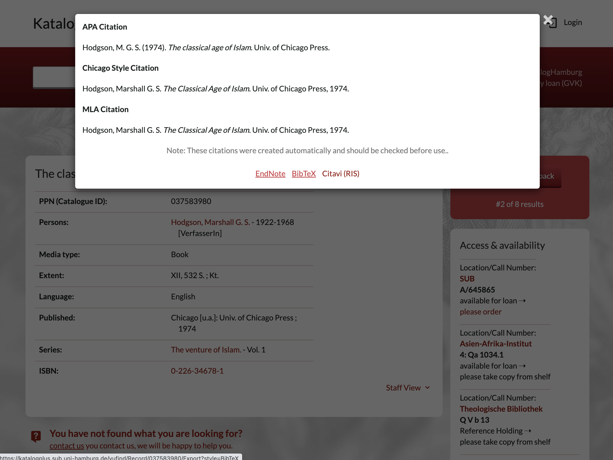|
|An export interface: click on BibTeX to download the record|

Unfortunately, records do not always look perfect:

```
@book{
Solr-037583980,
title = {The classical age of Islam},
series = {Hodgson, Marshall G. S. 1922-1968 The venture of Islam.},
author = {Hodgson, Marshall G. S. 1922-1968},
publisher = {Univ. of Chicago Press},
year = {1974},
}
```

You want to change it into something like the following:

```
@book{HodgsonVentureI1974,
  title = {The venture of Islam, Vol 1: The classical age of Islam},
  author = {Hodgson, Marshall G. S.},
  date = {1974},
  publisher = {{University of Chicago Press}},
  location = {{Chicago}}
}
```

The most important part is the KEY (`HodgsonVentureI1974`) — it must be unique and, ideally, easy to remember so that you can use it in the document.

Using `bibTeX` references is very easy: simply add `[@key]` to wherever you want the reference to appear. The complete bibliographical record will be also automatically added at the end of the document. For this reason, make sure that your document ends with the following line (empty line, followed by `# Bibliography` and then followed by another empty line):

```md

# Bibliography

```

##### Collecting Bibliographical References: Zotero + BetterBibTeX

- the best and easiest way to do that is to collect them via Zotero (<https://www.zotero.org/>), although other bibliography managers should be suitable for this purpose;
- with Zotero you can “harvest” bibliographical records from book stores (like Amazon), most digital catalogs (like our UHH Library), as well as journal databases/websites (like JSTOR);
- collected bibliographical data can be then easily exported into BibTeX format using Zotero plugin `better BibTeX` (<https://retorque.re/zotero-better-bibtex/>); in this plugin you can also define how your keys should be formatted, and it will take care of ensuring that every key is unique. 

##### Zotero

Zotero is an open-source reference management software that helps researchers, students, and professionals collect, organize, cite, and share research sources, such as journal articles, books, web pages, and multimedia content. Zotero is particularly useful for managing bibliographies and citations, making it easier to maintain an accurate and up-to-date record of sources used in a research project or academic paper.

Some key features of Zotero include:

1.  **Source Collection**: Zotero can automatically extract bibliographic information from web pages, online databases, and library catalogs, allowing you to quickly add sources to your Zotero library. It also supports importing reference data from other reference management tools, such as EndNote, Mendeley, or BibTeX.
2.  **Organizing and Tagging**: Zotero provides tools for organizing your research sources into collections and sub-collections, which can be shared with collaborators. You can also use tags and notes to further categorize and annotate your sources.
3.  **Citation and Bibliography Generation**: Zotero integrates with popular word processing software like Microsoft Word, LibreOffice, and Google Docs, enabling you to easily insert citations and generate bibliographies in a wide range of citation styles, such as APA, MLA, Chicago, and many others. Zotero's citation engine is built on the open-source Citation Style Language (CSL), which supports thousands of citation styles.
4.  **Collaboration**: Zotero allows you to create group libraries, which can be shared among multiple users for collaborative research projects. Group libraries can be set up with different access and editing permissions, making it easy to manage collaboration among team members.
5.  **File Storage and Synchronization**: Zotero provides cloud-based storage for your library data and attached files, such as PDFs or images, allowing you to access your Zotero library from multiple devices and keep everything in sync. Zotero offers 300 MB of free storage and additional storage plans for purchase.

Zotero is available as a standalone desktop application for Windows, macOS, and Linux, as well as a browser extension for Firefox, Chrome, and Safari. You can learn more about Zotero and download the software from the official website: [https://www.zotero.org/](https://www.zotero.org/)

##### Citation Styles

As you may know, Zotero allows one to dynamically change style of your citations and bibliography. This can be done with R markdown as well. We just need to provide a file with the style that you want to use.

<https://www.zotero.org/styles> is the website where you can find the style that you need. That style needs to be downloaded and placed into the folder of your project, and linked to in the same manner as we did with the `bibliography.bib` file.

I have downloaded the following two styles. Please, download them as well. We will experiment with them.

- [Chicago Manual of Style 17th edition (author-date)](https://www.zotero.org/styles/chicago-author-date) (2022-12-12 04:02:09)
- [Chicago Manual of Style 17th edition (full note)](https://www.zotero.org/styles/chicago-fullnote-bibliography) (2023-03-31 12:44:56)

### Basics of Markdown

Markdown is a lightweight markup language designed for formatting plain text documents in a human-readable and easily-editable way. Created by John Gruber and Aaron Swartz in 2004, Markdown has become a popular choice for authoring web content, documentation, and even academic papers due to its simplicity and ease of use. The main motto of markdown:

> “A Markdown-formatted document should be publishable as-is, as plain text, without looking like it’s been marked up with tags or formatting instructions.” (John Gruber)

The primary goal of Markdown is to make writing for the web as natural and intuitive as possible, while still allowing for basic text formatting, such as headings, lists, bold, italics, links, images, and more. Markdown uses simple punctuation and symbols to represent formatting elements, which makes it easy to learn and write without the need for complex tags or HTML code.

In markdown each structural element is coded explicitly, but in a very simple manner (if compared to HTML, XML, LaTeX, or any other language that is used for similar purposes). Additionally, explicit structural encoding helps to maintain clean structure of a document.

Markdown offers all the features you might possibly need for any kind of writing, including academic writing:

-   Headers of different levels
-   Lists: ordered, unordered, mixed
-   Links
-   Images
-   Block quotes
-   Latex equations
-   Horizontal rules (i.e., horizontal lines to visually break up your content)
-   Tables
-   Footnotes
-   Citations/References (multiple styles)
-   Bibliography
-   Slide breaks
-   Text formatting
	-   Italicized text
	-   Bold text
	-   Superscripts
	-   Subscripts
	-   Strikethrough text

You can download and use this cheatsheet, until you get comfortable with markdown: <https://github.com/rstudio/cheatsheets/raw/main/rmarkdown-2.0.pdf>

RStudio also offers a very nice and detailed presentation of markdown: https://rmarkdown.rstudio.com/lesson-1.html. You can also use this free guide: <https://bookdown.org/yihui/rmarkdown/> (can be also downloaded as a PDF).

Let's try the most important elements of markdown—in the file that we created in the beginning of the class.

- Basics of markdown:
	- simple explicit formatting
	- basic principles: 
	- main elements:
		- YML header;
		- headers;
		- paragraphs;
		- text: bold, italics, strikethrough, superscript, subscript, code;
		- lists;
		- tables;
		- images;
		- executable code blocks;
		- executable inline code;
		- footnotes;
		- bibliography;
			- file; include some references; remaining must be added by the students;
			- collecting;
- generating notebook: HTML and DOCX only; PDF --- try on your own;
- HW:
	- create a notebook for the description of PUA: <https://www.eea.csic.es/pua/info/proyecto.php> (use English version);
		- references: you can find some references here: https://www.eea.csic.es/pua/info/otroscolaboradores.php

## Homework

- complete 4 more modules in `swirl()`:  Missing Values; Subsetting Vectors; Matrices and Dataframes; Logic; 
- create a R notebook and recreate the content of this web page in markdown: <https://www.eea.csic.es/pua/info/proyecto.php>. This will give you some practice with the main elements of markdown syntax and formatting.
	- **NB:** the document does not include some important elements, so, please, at your own discretion, use the following:
		- add a few footnotes;
		- add a few references (you can use the ones from the `bibliography.bib`, but also at least two-three new references.)
	- this task took me about 20 mins to finish; it will take longer for you, but it should not be too much longer. In any case, the goal is to make you practice markdown—it is a very efficient system which is now everywhere and you will benefit greatly, if you know how to use it. With just a little bit of practice you can become proficient in markdown.


<!--chapter:end:030-Class03.Rmd-->

# Data Manipulation I

## This Chapter

- last class focused mainly on formatting, this class will add code chunks into our R markdown documents;
- we will learn and practice working with tabular data (simply put, tables):
	- main relevant data format: TSV / CSV;
	- loading data;
	- manipulating data;
	- generating and extracting observations from data;
- we will start analyzing some data from the PUA database; you will need the following file, which will be shared via Slack. Make sure to put it in the correct folder as shown below (create missing subfolders if they are missing):
	- `Data/PUA_Processed/PUA_allDataTables_asList.rds` :: this file contains all the data from the original relational database (MySQL) of the PUA project. Like any relational database, this one consists of a series of interconnected tables, which are all described in the appendix to this lesson.
	- `Data/Pua_Processed/PUA_personaje.tsv` :: this is the main table from the PUA database; in fact, this one is included in the RDS file given above; we will use this file only for practicing loading data into RStudio from TSV, since this is one of the most common operations for loading data.
	- *questions*:
		- what format is this data stored in and how can we load it in R?
		- what is the internal structure of the data?

<!--ANSWER:  The data is stored in the RDS format (“R Data Single”); the object inside the RDS file is a LIST. As was discussed in one of the preceding lessons, LISTS are great for aggregating lots of data in different formats into a single variable, while RDS files are best for storing such complex objects; -->

<!--

## Main Data Structures — Review

- review of main data structures and how we can subset them;
	- subsetting refers to focusing on a specific part of our variable such as singe element, a range, a column, a raw — and their combinations;
		- vectors, matrices: ranges, single values;
		- matrices, dataframes/tibbles: columns, rows, single values, ranges;
		- lists: single values > then whatever is applicable to the data structure type of the selected item (vector, matrix, dataframe/tibble, another list)

-->


## Why `tidyverse`?

> The `tidyverse` is an opinionated [collection of R packages](https://www.tidyverse.org/packages) designed for data science. All packages share an underlying design philosophy, grammar, and data structures. Here we find a set of functions to perform common data manipulation tasks on data frames, making the process more efficient, readable, and expressive. Although `tidyverse` is not specifically designed for historians, it can be highly relevant and useful for them when working with structured data. (Hadley Wickham is one of the key creators and developers of `tydyverse`.)

1.  **Data organization**: we often work with large datasets containing various types of information, such as dates, names, events, and locations. The `tidyverse` package allows us to organize and clean these datasets efficiently.
2.  **Data filtering**: we may need to focus on specific subsets of data, such as filtering by time periods, regions, or other relevant criteria. The `tidyverse` package provides functions like `filter()` and `slice()` that make it easy to filter and subset data.
3.  **Data transformation**: we often need to create new variables or modify existing ones. The `mutate()` function allows users to create new columns based on existing data, while `transmute()` can be used to create a new data frame with only the newly created variables.
4.  **Data aggregation**: Analyzing data by grouping it based on certain variables, such as time periods, regions, or categories, is a common task for us as historians. The `tidyverse` package provides the `group_by()` function, which makes it easy to group data, and functions like `summarize()` and `tally()` to perform summary operations on the grouped data.
5.  **Data merging**: we often need to combine data from multiple sources or datasets. The `tidyverse` provides functions like `left_join()`, `right_join()`, `inner_join()`, and `full_join()` that make it easy to merge data frames based on common variables.
6.  **Data reshaping**: we may need to reshape our data for different types of analysis, such as converting data from wide format to long format or vice versa. The `tidyverse` facilitates data reshaping.
7.  **Readability**: `tidyverse` uses a syntax that is easy to read and understand, even for those who are not familiar with R. This is particularly helpful for humanists who may not have extensive programming experience but still need to work with data.

To sum up, we can efficiently manipulate, analyze, and visualize our data, which enables us to gain insights and draw conclusions from historical records more effectively.

The `tidyverse` includes several popular packages for data manipulation, visualization, and modeling, such as:

1.  `readr`: For reading and writing data, particularly CSV and TSV files.
2.  `tibble`: For working with modern, enhanced data frames called tibbles.
3.  `dplyr`: For data manipulation, including filtering, selecting, and transforming data.
4.  `tidyr`: For cleaning and reshaping data, making it easier to work with.
5. `stringr`: For working with strings, providing functions to manipulate, extract, and search text.
6. `ggplot2`: For data visualization, creating powerful and flexible graphics.
7.  `purrr`: For functional programming and iteration, making it easier to work with lists and apply functions to data.
8.  `lubridate`: For working with dates and times, making it easier to parse, manipulate, and perform arithmetic with date-time objects.

Together, these packages provide a comprehensive set of tools for data science workflows. Last but not least, as the `tidyverse` approach has gained significant popularity in recent years, numerous additional libraries adhering to the `tidyverse` principles for working with data have emerged. This positions the `tidyverse` as the central hub for everything related to R.

## Main Data File Formats: CSV and TSV

First, let's talk about data formats just a little bit. We are primarily focusing on tabular data, which essentially means tables—like what you might create in MS Excel, Google Spreadsheets, of some other program like that. These programs, however, usually rely on their own proprietary formats. Meanwhile, most analytical programs and programming languages “prefer” plain text formats like CSV or TSV, which are essentially two flavors of the same format.

CSV (Comma-Separated Values) and TSV (Tab-Separated Values) are both simple and widely-used file formats for storing and exchanging tabular data. They are plain-text formats that represent data in a table, with rows and columns. The primary difference between the two formats lies in the delimiter used to separate the values in each row.

CSV Format:

-   In a CSV file, values are separated by commas (`,`).
-   Each row in the file represents a record (an observation or an instance), and each column represents a variable (a feature or an attribute).
-   The first row often contains column headers, indicating the names of the variables.
-   Since CSV files are plain text, they can be opened and edited using any text editor or spreadsheet program, such as Microsoft Excel, Google Sheets, or LibreOffice Calc.

Example of a CSV file:

```csv
Name,Age,Occupation
Alice,30,Engineer
Bob,25,Data Scientist
Charlie,35,Teacher
```

TSV Format:

-   In a TSV file, values are separated by tabs (`\t`).
-   Similar to CSV files, each row represents a record, and each column represents a variable.
-   TSV files also often have a header row with column names.
-   TSV files can be opened and edited using text editors and spreadsheet programs, just like CSV files.

Example of a TSV file (`\t` is actually an invisible character; here is it made visible for demonstration purposes; `\t` is a regular expression for a TAB character):

```tsv
Name\tAge\tOccupation
Alice\t30\tEngineer
Bob\t25\tData Scientist
Charlie\t35\tTeacher
```

Both CSV and TSV formats are popular because they are easy to read and write, both for humans and for computer programs. They can be used to store and share various types of data, such as numerical, categorical, or textual data. However, when working with data that contains commas or tabs within the values themselves, it is essential to use appropriate quoting or escaping methods to avoid confusion between the delimiters and the actual data values.

- TSV has an advantage over CSV in a way that its values can contain commas without complicating the format. `\t` characters are highly unlikely to appear in values of your data (if they do, you need to clean your data!). **Note**: technically, CSV can accommodate commas in values: the value of each cell has to be surrounded by quotation marks—example below—but even with this, some applications are likely to read the format incorrectly.

Example of CSV with commas in values:

```csv
"Name","Age","Occupation"
"Parker, Alice","30","Engineer"
"Marley, Bob","25","Data Scientist"
"Sheen, Charlie","35","Teacher"
```

- Neither TSV nor CSV can support multi-line values (since they encode the entire row as a single line). Luckily, there is an easy workaround that helps to deal with this issue: one can replace `\n` (new line characters) with some arbitrary combination of characters that is unlikely to occur in your data (for example, `%%%%%` or `#####`), which will convert multi-line values into single-line values; one can then easily replace the combination of characters back with `\n` when values need to be displayed as multi-liners.  

## Loading Data into R

### Loading CSV and TSV files

There are several functions and additional libraries that can help us load data into R, but we will focus on `readr` library, since it is a part of `tidyverse`.

If you load some data for the first time, it is best to use **Import Dataset** wizard (Tab “Environment” in the top-right section of RStudio) > from the drop-down menu, select “From Text (readr)...”. Below is the image of the open wizard, where I already selected the file that I want to load:

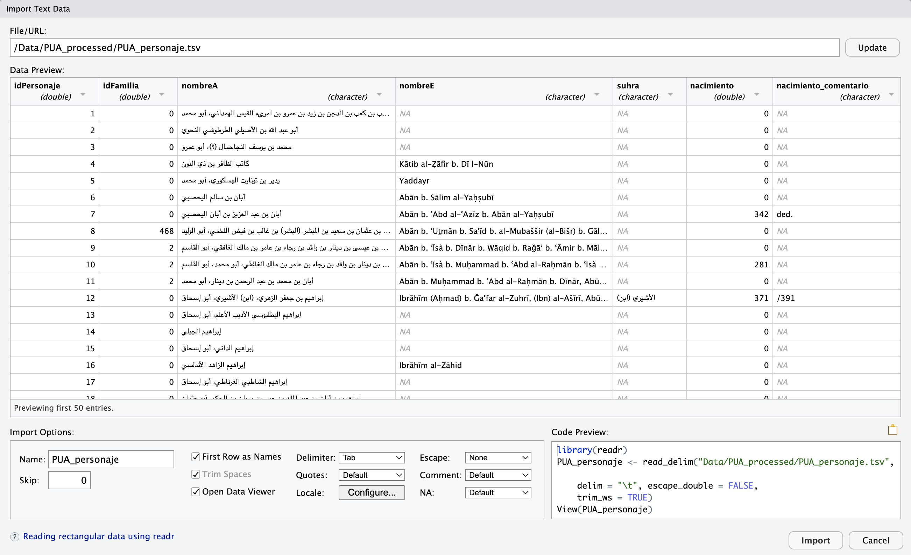

This wizard is extremely helpful, since you can adjust a number of parameters and see right away if your data is read correctly. You have plenty of options that you can tweak and they will be reflected in “Code Preview” (bottom-right section). “Code Preview” is perhaps the most convenient feature—you can simply copy-paste that code into your script and then reuse later. In our case the code will look like (I have slightly changed the file name):

```R
library(tidyverse) # technically, library(readr)
PUA_personaje <- read_delim("Data/Pua_Processed/PUA_personaje.tsv", delim = "\t", escape_double = FALSE, trim_ws = TRUE)
```

- the function takes a relative path to the file (remember, we are working with our project, so the working directory is the main folder of our project);
- it specifies that the delimiter is `\t`;
- escape characters (`"`) are not used;
- white spaces are automatically trimmed. This is a very useful feature, since there is always a chance that some unnecessary white space character will creep into your data. “White spaces” are, for example, empty lines at the end of the file, and unnecessary spaces at the beginning and/or at the end of each value.
- last but not least, `readr` does a quite decent job guessing the type of values for each column; but you can also manually change the type for each column and that will be reflected in the code preview.

If, by any chance, you got your data into R as a `data.frame`, you can easily convert it to `tibble` with `as_tibble()` function (do not forget to save it into a variable!).

You can save any data frame / tibble into a file using another function from the `readr` library in the following manner: 

```R
write_delim(PUA_personaje, "Data/Pua_Processed/PUA_personaje_saved.tsv", delim = "\t")
```

The saved file will be slightly different from the original (we have not done any modification to the data)—empty cells will have values `NA`. The use of `NA` (*not available*) is one of the highly recommended practices when you work with data: when a cell is empty it is not entirely clear whether the data is missing (i.e., it was not added yet) or not available (someone already tried to add the value, but it was not possible to find it). When `NA` is used explicitly, we can safely treat it as *not available*.

### R-specific Data “Format”: RDS

**Note.** When you need to save data generated in R into a file, you will have to use different functions for saving, depending on the structure of of your generated data. This may complicate things significantly. If cases when you are not planning to use this data outside of R, the easiest way is to save your data into an `*.RDS` file—any data structure can be saved easily into this format and loaded back from it.

It may so happen that your data comes in `*.RDS` files. Standing for “R Data Single” (or “R Data Storage”, or “R Data Structure”), RDS is a binary file format used by R for storing R objects, such as data frames, vectors, matrices, and lists (in fact, one can save a number of R objects into a single RSD file). RDS files are compact, efficient, and platform-independent, which makes them suitable for storing large datasets and sharing data between different R environments.

There are two primary functions in R for working with RSD files:

1.  `saveRDS()`: This function is used to save a single R object to an RSD file.

```r
# Save an R object to an RSD file
saveRDS(object, "your_file.rds")

```

Replace `object` with the name of the R object you want to save, and `"file_name.rds"` with the desired file name.

2.  `readRDS()`: This function is used to read an R object from an RSD file.

```R
# Read an R object from an RSD file
object <- readRDS("your_file.rds")
```

Replace `"your_file.rds"` with the name of the RSD file you want to read, and `object` with the name you want to assign to the loaded R object.

RDS files are also extremely convenient in cases when you need to generate intermediate/temporary results as a part of your data analysis routine.

## Loading PUA data

```R
PUA <- readRDS("Data/PUA_processed/PUA_allDataTables_asList.rds")
```

<!--

## PUA Dataset Technical Description

![[PUA_R - Appendix - PUA Data Tables]]

-->

## Exploring  PUA Data

PUA data is quite complex, consisting of 25 interconnected tables. We have two options: load 25 tables, one after another; or, save all tables into a single object—list—which we save as an RDS file, which can be loaded with a single command.

**`summary()`**.  We can get a general summary of any R object with the command `summary()`. Thus,  if we run `summary(PUA)`, we will get a summary of the `PUA` object, which should look like the following:

```R
> summary(PUA)
                         Length Class       Mode
actividad                 5     spec_tbl_df list
autor                     7     spec_tbl_df list
bibliografia              6     spec_tbl_df list
caracteristica            5     spec_tbl_df list
cargo                     6     spec_tbl_df list
disciplina                5     spec_tbl_df list
familia                  13     spec_tbl_df list
fuente                    7     spec_tbl_df list
keywords                  2     spec_tbl_df list
lugar                     8     spec_tbl_df list
nisba                     6     spec_tbl_df list
personaje                19     spec_tbl_df list
personaje_actividad       4     spec_tbl_df list
personaje_alias           4     spec_tbl_df list
personaje_caracteristica  3     spec_tbl_df list
personaje_cargo           6     spec_tbl_df list
personaje_disciplina      4     spec_tbl_df list
personaje_fuente          4     spec_tbl_df list
personaje_lugar           6     spec_tbl_df list
personaje_nisba           4     spec_tbl_df list
personaje_obra            5     spec_tbl_df list
personaje_referencia      5     spec_tbl_df list
personaje_relacion        4     spec_tbl_df list
tiporelacion              2     spec_tbl_df list
tiporelacionlugar         2     spec_tbl_df list
```

- We can see the names of all the tables (`spec_tbl_df`), and  the `Length` column tells us how many columns each table has. (You can also get a similar summary in the “Environment” tab in the top-right corner—for the variable `PUA`).


**`$`**. We can access each and every table with the `$` operator. For example, we can access `personaje` table with `PUA$personaje`. We can also combine that with `summary()` command to get the summary for that specific table, where the data from each column is summarized:

```R
> summary(PUA$personaje)
  idPersonaje      idFamilia        nombreA         
 Min.   :    1   Min.   :  0.00   Length:12813      
 1st Qu.: 3219   1st Qu.:  0.00   Class :character  
 Median : 6436   Median :  0.00   Mode  :character  
 Mean   : 6440   Mean   : 85.16                     
 3rd Qu.: 9665   3rd Qu.:  0.00                     
 Max.   :12896   Max.   :829.00                     
                 NA's   :115                        
   nombreE             suhra             nacimiento    
 Length:12813       Length:12813       Min.   :  0.00  
 Class :character   Class :character   1st Qu.:  0.00  
 Mode  :character   Mode  :character   Median :  0.00  
                                       Mean   : 71.41  
                                       3rd Qu.:  0.00  
                                       Max.   :806.00  
                                       NA's   :115     
 nacimiento_comentario     muerte      muerte_comentario 
 Length:12813          Min.   :  0.0   Length:12813      
 Class :character      1st Qu.:  0.0   Class :character  
 Mode  :character      Median :312.0   Mode  :character  
                       Mean   :275.9                     
                       3rd Qu.:533.0                     
                       Max.   :921.0                     
                       NA's   :115                       
      edad        edad_comentario    resumenBiografico 
 Min.   :  0.00   Length:12813       Length:12813      
 1st Qu.:  0.00   Class :character   Class :character  
 Median :  0.00   Mode  :character   Mode  :character  
 Mean   : 11.16                                        
 3rd Qu.:  0.00                                        
 Max.   :118.00                                        
 NA's   :115                                           
     creado                      
 Min.   :2010-12-29 01:12:44.00  
 1st Qu.:2010-12-29 01:13:21.00  
 Median :2010-12-29 01:14:23.00  
 Mean   :2011-03-26 14:31:49.92  
 3rd Qu.:2010-12-29 01:15:49.00  
 Max.   :2019-08-02 11:34:43.00  
 NA's   :328                     
   modificado                       publicado     
 Min.   :2010-12-29 01:12:44.00   Min.   :0.0000  
 1st Qu.:2010-12-29 01:16:40.00   1st Qu.:1.0000  
 Median :2013-12-02 11:10:37.50   Median :1.0000  
 Mean   :2014-05-29 14:09:49.69   Mean   :0.9867  
 3rd Qu.:2016-10-06 09:28:28.75   3rd Qu.:1.0000  
 Max.   :2019-09-02 19:40:39.00   Max.   :1.0000  
 NA's   :115                                      
 maestrosOrientales  nacimientoec       muerteec     
 Length:12813       Min.   :   0.0   Min.   :   0.0  
 Class :character   1st Qu.:   0.0   1st Qu.:   0.0  
 Mode  :character   Median :   0.0   Median : 871.0  
                    Mean   : 161.7   Mean   : 571.2  
                    3rd Qu.:   0.0   3rd Qu.:1126.0  
                    Max.   :1403.0   Max.   :1515.0  
                    NA's   :115      NA's   :210     
 fuentesCitadas    
 Length:12813      
 Class :character  
 Mode  :character 
```


As you can see, this function provides, in the case of character data: 1) the number of of values in each column; 2) their type; and 3) their mode. In the context of our work, there is practically no difference between type and mode, as you can see. In the case of numeric data, you can see that a general statistical summary (for example, in `nacimiento`): minimal value (`Min.`), quartiles (`1st Qu.`, `Median`,  `3rd Qu.`), average mean (`Mean`), and maximum value (`Max.`).  In the case of numeric data, `summary()` gives you insight into the general distribution of your data.

<!--
The main thing that we can look at here is the difference between `mean` and `median`.  When a distribution has significant differences between its mean and median, it is typically described as being skewed. Skewness is a measure of asymmetry in a distribution. There are two types of skewness: positive skew (right skew) and negative skew (left skew).

1.  Positive skew (right skew): In this case, the mean is greater than the median. The tail on the right side of the distribution is longer or fatter than the left side. This indicates that there are more extreme values on the right side of the distribution.
2.  Negative skew (left skew): In this case, the mean is less than the median. The tail on the left side of the distribution is longer or fatter than the right side. This indicates that there are more extreme values on the left side of the distribution.
-->

**`View()`** Another way to look at the loaded data is to use `View()`. Thus, `View(PUA)` will give us the following summary view: 


In a similar manner, we can view a specific tibble inside the PUA value. Thus, `View(PUA$personaje)` will give us the following view:


Usually, you can also open this table view by simply clicking on the name of the loaded tibble in “Environment” in top-right section; in our current case, however, we have our tibbles inside a list (but you can always assign a specific tibble from the list to a variable). This view can be searched/filtered and you can rearrange the entire table by any of the columns. This is not necessarily something that you will be using a lot, but sometimes it does come in handy. Additionally, you can click on a blue circle with a white triangle button next to the name of your tibble and you will get another convenient summary, like shown on the image below:


- if you simply type the name of your tibble in the console and hit enter, you will get a shortened version of the tibble. Here you can use commands like `head()` and `tail()`—the first one will show the first 6 rows of data, while the last one —the last 6 rows of data. 

**`tibble$column`**. You can use `$` to look at the contents of a specific column. If you type the name of the tibble and add `$` right after, you will see a pop-up window which will suggest you the names of available columns. This is the easiest way to refer to a specific column. For example, `PUA$personaje$nombreA` will print out the `nombreA` column, in the tibble `personaje` of our main loaded list `PUA`.

**`unique()`** is your standard way to get only unique values for a vector/column. Thus, for example, we can combine `$` and `unique` to get only unique values fro many column. Using `length()` will give us the count.

- `PUA$personaje$nombreA` will print out the `nombreA` column, in the tibble `personaje` of our main loaded list `PUA`;
- `length(PUA$personaje$nombreA)` will tell us how many individuals we have altogether. Try it. (Should be 12,813);
- `length(unique(PUA$personaje$idFamilia))` will give us the number of unique families in the dataset. Try it. (Should be 815; technically);
- any operation that can be applied to a vector, can be applied to a column.

## Main commands for engaging with a tibble

### Chaining with `%>%`

There are two main ways to manipulate tibbles in R:

1. you create a new state of a tibble and you save it into a new/same variable, and then keep repeating this type of step creating new modifications of your data;
2. alternatively, you can “chain” multiple modifications into a single readable expression. In `tidyverse`, for chaining we use a pipe operator that looks like this `%>%`.

As an example, let's get a count of how many people we have for the 6th AH century, whose age was between 70 and 79 (*septuagenarians*). In order to  get this number, we will need to go through a sequence of the following steps:

- we filter all individuals by their death dates, which must fall between 501 and 600 (in other words, their death dates must be within this range); the main column for this is `muerte`;
- we then filter out those whose age is below 70 and those, whose age is above 79 (column `edad`) ;
- we then count the number of resulting rows;

And now, let's take a look how these operations can be done in these two different ways:

- without chaining:
```R
septuagenarians <- PUA$personaje
septuagenarians <- filter(septuagenarians, muerte >= 501, muerte <= 600)
septuagenarians <- filter(septuagenarians, edad >= 70, edad <= 79)
septuagenarians <- nrow(septuagenarians)

septuagenarians
```

- with chaining:
```R
septuagenarians <- PUA$personaje %>%
  filter(muerte >= 501, muerte <= 600) %>%
  filter(edad >= 70, edad <= 79) %>%
  nrow()

septuagenarians
```

The method with chaining gives us shorter expressions, and, in general, it is much easier and more readable. It makes complex operations really simple and easy. That said, occasionally, you would need to save your intermediate results into new variables. It is often best to keep original data in the initial variable and save any modifications that you want to work with (i.e., you want to use them multiple times) into new variables. This way you will be able to easily get the original data without reloading it.

The `%>%` (pipe operator) from the `magrittr` package is an essential tool when working with `dplyr` functions. It allows you to chain multiple `dplyr` functions together, making your code more readable and easier to understand.

## Important Functions from `dplyr` 

`dplyr` is a key package within the Tidyverse ecosystem that provides a set of tools for data manipulation. Here is an overview of some of the most important `dplyr` functions:

1.  `filter()`: Filters rows based on specified conditions. This function helps you to extract a subset of rows from a dataset that meet certain criteria.
2.  `select()`: Selects specific columns from a dataset. This function is useful when you want to work with a subset of columns, either by specifying their names or using helper functions like `starts_with()`, `ends_with()`, and `contains()`.
3.  `mutate()`: Creates new columns or modifies existing ones based on expressions involving existing columns. This function is often used to perform calculations or transformations on the data. (`transmute()` is similar to `mutate()`, but it only keeps the newly created or modified columns in the output, discarding the original columns.)
5.  `arrange()`: Orders the rows in a dataset based on one or more columns. By default, it sorts the data in ascending order, but you can use the `desc()` function to sort in descending order.
6.  `group_by()`: Groups data by one or more columns, typically used in combination with aggregation or window functions to perform grouped calculations.
7.  `summarise()` or `summarize()`: Calculates summary statistics for each group after using `group_by()`. Common summary statistics include mean, median, sum, count, minimum, and maximum.
8.  `rename()`: Renames columns in a dataset, making it easier to work with datasets with non-descriptive or unclear column names.
9.  `join_*` functions: A family of functions for combining datasets based on common columns. Some common join functions are `inner_join()`, `left_join()`, `right_join()`, and `full_join()`.
10.  Window functions: These functions allow you to perform calculations across a set of rows related to the current row, often used with time series data or data that has a natural ordering. Examples include `lag()`, `lead()`, `cumsum()`, `cumprod()`, `cummin()`, `cummax()`, and various ranking functions like `row_number()`, `dense_rank()`, and `min_rank()`. Window functions are particularly useful for time series analysis, when we need to calculate how some variable changes from one period to the next.

By mastering these key `dplyr` functions, you can perform a wide range of data manipulation tasks effectively and efficiently in R using the `tidyverse`.

## Important Functions from `tidyr` 

`tidyr` is a another package within the `tidyverse` ecosystem that focuses on cleaning and reshaping data. Here is an overview of some of the most important `tidyr` functions:

1.  `pivot_longer()`: Converts data from wide to long format, gathering multiple columns into a single column. This function is useful when you have multiple columns representing different categories or time periods, and you want to bring them together into a single column.
2.  `pivot_wider()`: Converts data from long to wide format, spreading a single column into multiple columns. This function is useful when you have data in long format with one row per observation and you want to spread it across multiple columns.
3.  `separate()`: Splits a single column into multiple columns based on a specified delimiter or pattern. This function is helpful when you have a single column containing multiple pieces of information that need to be separated into distinct columns.
4.  `unite()`: Combines multiple columns into a single column, often with a specified delimiter. This function is useful when you need to merge information from multiple columns into a single column.
5.  `drop_na()`: Removes rows with missing values (NA) in one or more specified columns. This function helps you clean your data by removing incomplete records.
6.  `replace_na()`: Replaces missing values (NA) with a specified value or values. This function can be used to fill in missing data with a default value or an estimate.
7.  `fill()`: Fills missing values (NA) in a column with the last non-missing value encountered, either forward or backward. This function is particularly useful when working with time series data or data with a natural ordering.
9.  `nest()`: Creates a nested data frame by collapsing multiple columns into a single column containing a list of data frames.
10.  `unnest()`: Reverses the operation of `nest()`, expanding a list column of data frames into multiple columns.

## Function usage

The list above gives you an idea of what kind of operations you can do with them. In what follows you will learn how to use most of these functions through practical examples (some functions are needed only for rather complicated cases, which we will not be covering here).

### `filter()`

This function filters rows based on specified conditions. This function helps you to extract a subset of rows from a dataset that meet certain criteria.

In this example, we will get individuals from the 6th AH century:

```R
cent_600AH <- PUA$personaje %>%
  filter(muerte >= 501, muerte <= 600)
```

**Note:** it is important to note that names of your variables cannot start with digits; for example, `600AH` will not be possible—that is why I opted for `cent_600AH`.

In this example, we will get septuagenarians from the 6th century AH:

```R
septuagenarians600AH <- PUA$personaje %>%
  filter(muerte >= 501, muerte <= 600) %>%
  filter(edad >= 70, edad <= 79)
```

**Note:** we could have also used the variable `cent_600AH`, in which case we would have needed only the last filter operation.

### `select()`

This function selects specific columns from a dataset. This function is useful when you want to work with a subset of columns, either by specifying their names or using helper functions like `starts_with()`, `ends_with()`, and `contains()`.

Most commonly you will use this function to make a copy of your data with a smaller number of columns, dropping those that you do not need for analysis. In the example below, we will create a light version of our `personaje` tibble, keeping only the most important columns:

```R
personajeLite <- PUA$personaje %>%
  select(idPersonaje, idFamilia, nombreA,
		 nacimiento, muerte, edad)

```

You can drop specific columns by adding a `-` (minus/dash) or `!` (exclamation mark) in front of the name of that columns. Let's drop `edad` from our light data, but, also, let's not save the results:

```R
personajeLite %>% select(-edad)
```

In some cases you may want to try something out without saving the results of your manipulations in a variable. You can do it in the manner shown above. Note, we are not saving our results (there is no `<-` assignment operator, and no new variable). If you run this code, R will simply print out the results in console—the same tibble, but without column `edad`.

Additionally, you can use `starts_with()`, `ends_with()`, and `contains()` if you want to quickly select columns that have the same element in their names—either in the beginning, in the end, or anywhere. For example, we have columns whose names begin with `id`. We can use `starts_with("id")`. You can use `-` or `!` in front of these functions to drop those columns instead. For example, we can drop “comment” columns, whose names end with `_comentario`.

```R
personaje_IDs <- PUA$personaje %>% select(starts_with("id"))
personaje_noComments <- PUA$personaje %>% select(!ends_with("_comentario"))
```

### `mutate()` and `transmute()`

The `mutate()` function creates new columns or modifies existing ones based on expressions involving existing columns. This function is often used to perform calculations or transformations on the data. The `transmute()` function is similar to `mutate()`, but it only keeps the newly created or modified columns in the output, discarding the original columns; `transmute()` would be similar to using `mutate()` to create a new column and then using `select()` to drop all the old columns.

Let's take our `personajeLite` and fix some information there. There are too many zeroes in columns `nacimiento`, `muerto`, and `edad`, which are clearly used as fillers (i.e., they do not actually mean `0`). To ensure that our analyses are done correctly, we need to replace them with `NA`, which would mean that data is not available and it should not be used in calculations. 

**Note on the importance of `NA`:** Let's dwell a little bit on why we need to have `NA`s where appropriate. Say, we want to calculate the average age. In a vector `ages1` we have `0` instead of `NA`, so if we try to calculate average mean, zeroes will be considered as numbers and that will give us the average age of 25.2. Meanwhile, when we have `NA`, as in vector `ages2`, we can exclude them from the calculation of the average mean and get the value of 75.67, which would be much more appropriate for the existing ages of 67, 70, and 90. 

```R
ages1 <- c(0,0,0,0,0,0,67,70,90)
ages2 <- c(NA,NA,NA,NA,NA,NA,67,70,90)

mean(ages1) # 25.22222
mean(ages2, na.rm = TRUE) # 75.66667
```

Let's update our `personajeLite` accordingly. There are two ways we can write it out—in a more explicit manner, or a more packed manner.

```R
# more explicit
personajeLite <- PUA$personaje %>%
  select(idPersonaje, idFamilia, nombreA,
		 nacimiento, muerte, edad) %>%
  mutate(nacimiento = na_if(nacimiento, 0)) %>%
  mutate(muerte = na_if(muerte, 0)) %>%
  mutate(edad = na_if(edad, 0))

# more packed
personajeLite <- PUA$personaje %>%
  select(idPersonaje, idFamilia, nombreA,
		 nacimiento, muerte, edad) %>%
  mutate(nacimiento = na_if(nacimiento, 0),
         muerte = na_if(muerte, 0),
         edad = na_if(edad, 0))
```

We can use `mutate()` to reproduce some of the columns that we dropped in our light version. For example, we have dropped the dates in common era. We can recalculate them, using the function that you used in the previous lesson. 

First, here is our conversion function:

```R
AH2CE <- function(AH){
  CE <- round(AH - AH/33 + 622)
  AH <- ifelse(AH == 0, 1, AH)
  final <- paste0(AH, "AH/", CE, "CE")
  return(final)
}
```

Now, let's update our `personajeLite`. Note that I have added `ifelse()` function in order to keep `NA`:

```R
personajeLite <- personajeLite %>%
  mutate(muerteCE = ifelse(is.na(muerte), NA, AH2CE(muerte)))
```

### `rename()`

This function simply renames columns in a dataset, making it easier to work with datasets with non-descriptive or unclear column names.

For example, we may want to have English names for the columns:

```R
personajeLiteEN <- personajeLite %>%
  rename(idPerson = idPersonaje,
         idFamily = idFamilia,
         nameA = nombreA,
         born = nacimiento,
         died = muerte,
         diedCE = muerteCE,
         age = edad)
```

### `arrange()`

This function orders the rows in a dataset based on one or more columns. By default, it sorts the data in ascending order, but you can use the `desc()` function to sort in descending order. When you use multiple columns as arguments (connected with commas), the data will be sorted by the first mentioned column, and then, inside, by the second column, and so on.

Thus, the following code will arrange the data first by `idFamilia`, and then, within each family (just keep in mind that `0` means `no family`, so we best filter them out), individuals will be arranges from the oldest to the youngest. Run the code and take a look for yourself.

```R
oldestInFamilies <- personajeLite %>%
  filter(idFamilia != 0) %>%
  filter(!is.na(edad)) %>%
  arrange(idFamilia, desc(edad))
```

The results should look something like this:


### `group_by()` /  `ungroup()`

With `group_by()` we are switching to really cool functions that will allow us to do lots of interesting thing with our dataset. The `group_by()` function groups data by one or more columns. Its results are not quite visible. Take a look at the screenshot below of the same tibble: in the first case (top) it is the original tibble, in the second case (bottom) the data is grouped by `idFamilia` (note the underlined `# Groups: idFamilia [815]`):


Usually, when you are done working with groups and you do not need them anymore, you would use function `ungroup()` to remove them.

Typically,  `group_by()` is used in combination with aggregation or window functions to perform grouped calculations or manipulations. We will skip on windows functions for now, but we will look into some most useful aggregation functions. In fact, the results of `group_by()` are not very useful until you apply some aggregation function.

### `summarise()` or `summarize()`

The most common function that is used right after `group_by()` is  `summarize()` or `summarise()`, if you prefer British spelling :). This function calculates summary statistics for each group after using `group_by()`. Common summary statistics include `mean()`, `median()`, `sum()`, `n()`, `min()`, and `max()`. You can also select top items from each group with`top_n()`. 

Let's give it a try.

For example, we can count how many members each family has:

```R
miembrosDeFamilias <- personajeLite %>%
  filter(idFamilia != 0) %>%
  group_by(idFamilia) %>%
  summarize(miembros = n()) %>%
  arrange(desc(miembros))
```

And if we print, we can see the most prominent families, in terms of the numbers of their members who made it into historical records of al-Andalus:

```R
> familias
# A tibble: 813 × 2
   idFamilia miembros
       <dbl>    <int>
 1        89       23
 2       255       23
 3       459       20
 4        20       18
 5        44       18
 6        21       16
 7       700       16
 8         2       15
 9         9       15
10        17       15
# ℹ 803 more rows
# ℹ Use `print(n = ...)` to see more rows
```

In a similar manner we can calculate the average age of members of each family:

```R
familiasEdadPromedio <- personajeLite %>%
  filter(idFamilia != 0) %>%
  group_by(idFamilia) %>%
  summarize(edadPromedio = mean(edad, na.rm = TRUE),
            miembros = n()) %>%
  arrange(desc(edadPromedio))
```

Some results from the top (note, that we now included two operations into the `summarize()` function; it is important to keep in mind that all summarization steps must be put into the same summarization function!):

```R
> familiasEdadPromedio
# A tibble: 813 × 3
   idFamilia edadPromedio miembros
       <dbl>        <dbl>    <int>
 1       724          100        2
 2       290           99        2
 3       224           98        4
 4       207           95        3
 5       453           95        2
 6       551           95        2
 7       561           95        6
 8       158           94        2
 9       484           94        2
10        77           93        2
# ℹ 803 more rows
# ℹ Use `print(n = ...)` to see more rows
```

We an also select the longest living member from each family (`top_n(1, wt = edad)`—1 can be replaced with the desired number). 

```R
familiasMasAntiguo <- personajeLite %>%
  filter(idFamilia != 0) %>%
  group_by(idFamilia) %>%
  top_n(1, wt = edad) %>%
  arrange(desc(edad)) %>%
  select(-nombreA)
```

Results (I have dropped the column with the name, so that the results are more readable here):

```R
> familiasMasAntiguo
# A tibble: 502 × 6
# Groups:   idFamilia [487]
   idPersonaje idFamilia nacimiento muerte  edad muerteCE    
         <dbl>     <dbl>      <dbl>  <dbl> <dbl> <chr>       
 1        2455        44        190    295   118 295AH/908CE 
 2        1307       277         NA    577   100 577AH/1182CE
 3        9407       724        514    614   100 614AH/1217CE
 4        5540       290        603    702    99 702AH/1303CE
 5        4257       449        447    545    98 545AH/1150CE
 6        6705       224        483    581    98 581AH/1185CE
 7        6070       212        201    297    96 297AH/910CE 
 8        9875       605        272    368    96 368AH/979CE 
 9       10700       537        299    394    96 394AH/1004CE
10        2420       453        326    421    95 421AH/1030CE
# ℹ 492 more rows
# ℹ Use `print(n = ...)` to see more rows
```

### `join_*` functions

You might have noticed already that working with numeric IDs can be rather unhelpful: in the examples above we could only see the numeric IDs of families, but we also had no idea what those families actually are. The family of `join_*` functions is very helpful here, since they allow us to join additional information from other tables.

This is a family of functions for combining datasets based on common columns. Some common join functions are `inner_join()`, `left_join()`, `right_join()`, and `full_join()`. These are incredibly useful functions since they allow you to take advantage of the functionality which is available in relational databases or through the linked-open-data (LOD) approach.

The main principle of rDB (and LOD, at least to a certain extent) is as follows: if you duplicate some data in your table, you should move it to a separate one. Such division into separate tables has lots of advantages that contribute to efficient data management and retrieval.

For example, in our `personajeLite` data we have many members of the same families. In order not to repeat all the relevant information on each family in the `personaje` table, this information is moved to a separate table. Such an approach makes it much easier to manage, update, and expand your data. The data on families is stored in `PUA$familia`. Both tables are interconnected by the field `idFamilia`. We can use one of the `join_*` functions to connect both tables.

First, let's get a light version of family data — essentially, just the English name of each family (`idFamilia` is the **key** column and must always be preserved). 

```R
familiaDataLite <- PUA$familia %>%
  select(idFamilia, nombreE)
```

Now, we can take all the results that we generated above and have much more readable results:

1.  Families with the highest numbers of members:

```R
miembrosDeFamilias <- miembrosDeFamilias %>%
  left_join(familiaDataLite, by = c("idFamilia" = "idFamilia"))

> miembrosDeFamilias
# A tibble: 813 × 3
   idFamilia miembros nombreE             
       <dbl>    <int> <chr>               
 1        89       23 Banū l-Bağī 1       
 2       255       23 Banū Saʿīd al-ʿAnsī 
 3       459       20 Banū Ḥağğağ al-Laḫmī
 4        20       18 Banū Abī Ğamra      
 5        44       18 Banū ʿAmīra         
 6        21       16 Banū Ḫalīl al-Sakūnī
 7       700       16 Banū Hāniʾ          
 8         2       15 Banū Dīnār          
 9         9       15 Banū Qāsim b. Hilāl 
10        17       15 Banū Wāğib          
# ℹ 803 more rows
# ℹ Use `print(n = ...)` to see more rows
```

2. Families with the highest average age.

```R
familiasEdadPromedio <- familiasEdadPromedio %>%
  left_join(familiaDataLite, by = c("idFamilia" = "idFamilia"))

> familiasEdadPromedio
# A tibble: 813 × 4
   idFamilia edadPromedio miembros nombreE                    
       <dbl>        <dbl>    <int> <chr>                      
 1       724          100        2 Banū Saʿāda al-Nafzī       
 2       290           99        2 Banū Hārūn 2               
 3       224           98        4 Banū l-Ḥallāʾ / Banū Ṯaʿbān
 4       207           95        3 Banū l-Gaššāʾ              
 5       453           95        2 Banū l-Bağğānī             
 6       551           95        2 Banū Ğarīr                 
 7       561           95        6 Banū Sulaymān al-Gāfiqī    
 8       158           94        2 Banū Kawzān                
 9       484           94        2 Banū l-Šabulārī            
10        77           93        2 Banū Ḥunayn                
# ℹ 803 more rows
# ℹ Use `print(n = ...)` to see more rows
```

3. Families with the longest living members:

```R
familiasMasAntiguo <- familiasMasAntiguo %>%
  left_join(familiaDataLite, by = c("idFamilia" = "idFamilia")) %>%
  select(-nacimiento, -muerte)

> familiasMasAntiguo
# A tibble: 502 × 5
# Groups:   idFamilia [487]
   idPersonaje idFamilia  edad muerteCE     nombreE                    
         <dbl>     <dbl> <dbl> <chr>        <chr>                      
 1        2455        44   118 295AH/908CE  Banū ʿAmīra                
 2        1307       277   100 577AH/1182CE Banū ʿAmīra                
 3        9407       724   100 614AH/1217CE Banū Saʿāda al-Nafzī       
 4        5540       290    99 702AH/1303CE Banū Hārūn 2               
 5        4257       449    98 545AH/1150CE Banū Abī l-Rağāʾ           
 6        6705       224    98 581AH/1185CE Banū l-Ḥallāʾ / Banū Ṯaʿbān
 7        6070       212    96 297AH/910CE  Banū Našr                  
 8        9875       605    96 368AH/979CE  Banū Fahd                  
 9       10700       537    96 394AH/1004CE Banū Barṭāl                
10        2420       453    95 421AH/1030CE Banū l-Bağğānī             
# ℹ 492 more rows
# ℹ Use `print(n = ...)` to see more rows

```

If the **key** columns have the same name in both tables, the `by = c("colNameA" = "colNameB")` can be omitted: the function can figure it on its own. Personally, I prefer to be explicit in my code and strongly recommend that you stick to this practice as well, at least in the beginning. This will help you to avoid possible issues when R runs off doing something irrelevant—and that may happen.

### `pivot_*()` functions

There are two pivot functions, `pivot_long()` and `pivot_wide()`, which are extremely helpful when your data comes in some sub-optimal format, or when sometimes you need to transform your data to be used with some other tool that require a different format.

Let's first calculate how many individuals we have for each place and each century. We will then pick the top 10 places with the highest number of individuals.

```R
# get readable names of places
lugarNombres <- PUA$lugar %>%
  select(idLugar, nombre_castellano)

# count people in places
lugar <- PUA$personaje_lugar %>%
  select(idLugar, idPersonaje, idRelacion) %>%
  left_join(personajeLite, by = c("idPersonaje" = "idPersonaje")) %>%
  select(-nombreA, -nacimiento, -edad, -muerteCE) %>%
  mutate(century = plyr::round_any(muerte, 100, f = ceiling)) %>%
  filter(!is.na(century))

# sleect the top 10 paces
lugarTop10 <- lugar %>%
  group_by(idLugar) %>%
  summarize(total = n()) %>%
  arrange(desc(total)) %>%
  top_n(10, wt = total)

# creating the summary
lugarSummary <- lugar %>%
  group_by(idLugar, century) %>%
  summarize(individuals = n()) %>%
  filter(idLugar %in% lugarTop10$idLugar) %>%
  left_join(lugarNombres)
```

Ok, our summary looks like this:

```R
> lugarSummary
# A tibble: 78 × 4
# Groups:   idLugar [10]
   idLugar century individuals nombre_castellano
     <dbl>   <dbl>       <int> <chr>            
 1      24     300           1 Almería          
 2      24     400           6 Almería          
 3      24     500         116 Almería          
 4      24     600         194 Almería          
 5      24     700          52 Almería          
 6      24     800          60 Almería          
 7      24     900           1 Almería          
 8       4     100           2 Córdoba          
 9       4     200          33 Córdoba          
10       4     300         220 Córdoba          
# ℹ 68 more rows
# ℹ Use `print(n = ...)` to see more rows
```

We can actually *pivot* this summary table to make it more friendly for including into a publication:

```R
lugarSummaryWide <- lugarSummary %>%
  ungroup() %>%
  select(century, individuals, nombre_castellano) %>%
  pivot_wider(names_from = nombre_castellano, values_from = individuals)
```

The results look much better:


We can also return it back into its original long state in the following manner:

```R
lugarSummaryLong <- lugarSummaryWide %>%
  pivot_longer(!century, names_to = "places", values_to = "individuals") %>%
  arrange(places)
```

Results will look like:

```R
> lugarSummaryLong
# A tibble: 100 × 3
   century places  individuals
     <dbl> <chr>         <int>
 1     100 Almería          NA
 2     200 Almería          NA
 3     300 Almería           1
 4     400 Almería           6
 5     500 Almería         116
 6     600 Almería         194
 7     700 Almería          52
 8     800 Almería          60
 9     900 Almería           1
10    1000 Almería          NA
# ℹ 90 more rows
# ℹ Use `print(n = ...)` to see more rows

```

**Note:** most commonly this `pivot` operation is performed to convert long tables into wide and the other way around. However, *pivoting* also has an additional valuable function—as you can see in the example above, we now have `NA` for those centuries that did not have any values in the original data. Having such “blindspots” may lead to faulty visualizations and analyses; *pivoting* can help to ensure that the data is *complete* and all necessary values are accounted for. 

## Homework Tasks

Essentially, this will be your first research assignment: you will actually learn some things — probably, quite a lot — which are not a common knowledge in the field. Simultaneously, you will practice all the data manipulation skills that we have covered in the lesson.

Your homework task is to create a notebook for this lesson. For part I, rerun all the code from this lesson in your notebook to make sure it works and you are gaining some understanding of how it works; for the second part, give solutions to all the problems that are given below. Your code chunks should print the answer that comes from your calculations and manipulations. After your code chunk provide a human-readable answer — one or two sentences is sufficient.

1. Who is the oldest individual we have in the PUA data?
2. Which places did this individual visit?
3. What kind of activities was that individual involved in?
4. Who is the oldest jurist (*faqīh*) in the PUA data?
5. Can you find a person who traveled the most?
6. Can you find a century in which Andalusians traveled the most?
7. What are the 10 most common activities Andalusians were involved into?
8. What are the most common activities in the 5th AH century?
9. What are the main locations of the 5 largest families?
10. What are the most visited locations among the members of those families? <!-- this one is practically the same as the one above -->
11. In which century do we have the largest number of families?
12. What is the peak century in the history of al-Andalus? (This can be measured by the highest number of people.)
13. What is the most prominent location in al-Andalus in general? What about by centuries? (Prominent means  that it has the highest number of people associated with it.)
14. What is the most prominent location outside of al-Andalus? What about by centuries?
15. Do the same task, but for common era centuries. **Hint:** you will also need to use a function from the previous lesson that converts AH dates to CE dates. Think carefully where you need to plug it in, i.e. between what steps.

## Appendix: “Window” function in `tidyverse`

Just in case, I am including some information on window functions. In the context of the `tidyverse` (package `dplyr`), there is a concept of window functions that allow you to perform calculations across a set of rows related to the current row. These functions are particularly useful when working with time series data or data that has a natural ordering. Some common window functions include:

1.  `lag()`: Accesses previous rows in a dataset. By default, it retrieves the value from the row immediately preceding the current row, but you can specify the number of rows to go back.
2.  `lead()`: Accesses following rows in a dataset. By default, it retrieves the value from the row immediately after the current row, but you can specify the number of rows to go forward.
3.  `cumsum()`, `cumprod()`, `cummin()`, and `cummax()`: Calculate the cumulative sum, product, minimum, and maximum, respectively, up to the current row.
4.  `row_number()`: Generates row numbers, often used for ranking.
5.  `dense_rank()`, `min_rank()`, and `percent_rank()`: Generate ranking scores based on different ranking methods.
6.  `ntile()`: Divides the dataset into a specified number of groups (tiles) based on the order of the data.

To use these window functions, you generally need to use `group_by()` first to define the grouping structure, and then you can apply the window functions using `mutate()` or `summarise()`. Additionally, you can use the `arrange()` function to ensure the data is ordered correctly before applying the window functions.

For example, here's a simple code snippet that demonstrates the use of `lag()`:

```R
library(dplyr)

data <- tibble(
  date = seq(as.Date("2021-01-01"), as.Date("2021-01-10"), by = "day"),
  value = runif(10)
)

data %>%
  arrange(date) %>%
  mutate(previous_value = lag(value))
```

In this example, the `previous_value` column is created using the `lag()` function, which contains the value from the row immediately preceding the current row.

<!--

## Appendix: PUA Database Description

> ![[PUA_R - Appendix - PUA Data Tables - Detailed]]

-->


<!--chapter:end:040-Class04.Rmd-->

# Data Manipulation II

```{r eval=TRUE, include=FALSE}

library(tidyverse)
PUA <- readRDS("./data/PUA_processed/PUA_allDataTables_asList_UPDATED.rds")

```

## This Chapter

- we will go over the solutions to the problems from the previous Chapter

## Problems

Your homework task is to create a notebook for this lesson. For part I, rerun all the code from this lesson in your notebook to make sure it works and you are gaining some understanding of how it works; for the second part, give solutions to all the problems that are given below. Your code chunks should print the answer that comes from your calculations and manipulations. After your code chunk provide a human-readable answer — one or two sentences is sufficient.

Below you will find solutions to the first few problems. 

### [1] Who is the oldest individual we have in the PUA data?

- *algorithmic solution*: we need to find a person with the highest value in the column where ages are recorded; 
- *complete solution*: we need to find a person with the highest value in column `edad` in the table `personaje`; the easiest way will be to use `top_n` function (`top_n(1, wt = edad)`);

```{r}
oldest <- PUA$personaje %>%
  top_n(1, wt = edad)

oldest
```

- *human readable solution, based on results*:

```{r eval=FALSE, include=TRUE}
The oldest person in the PUA database is: `r oldest$nombreE`.
His Arabic name is: ``r oldest$nombreA``. He died at the age
of `r oldest$edad` in `r oldest$muerte` AH / `r oldest$muerteec` CE.
```

This solution will be rendered in the notebook as:

> The oldest person in the PUA database is: Ṣabbāḥ / al-Ṣabbāḥ b. ʿAbd al-Raḥmān b. al-Faḍl (b. ʿAmāra) b. ʿAmīra b. Rāšid b. ʿAbd Allāh b. Saʿīd b. Šarīk b. ʿAbd Allāh b. Muslim b. Nawfal b. Rabīʿa b. Mālik b. ʿAtīq b. Malkān b. Kināna al-Kinānī, al ʿUtaqī, Abū l-Guṣn (Abū l-Faḍl). His Arabic name is: `صباح (الصباح) بن عبد الرحمن بن الفضل (بن عمارة) بن عميرة بن راشد بن عبد الله بن سعيد بن شريك بن عبد الله بن مسلم بن نوفل بن ربيعة بن مالك بن عتيق بن ملكان بن كنانة الكناني العتقي، أبو الغصن (أبو الفضل).` He died at the age of 118 in 295 AH / 907 CE.

### [2] Which places did this individual visit?

- *algorithmic solution*: we already found the oldest person, so now we only need his ID. We can use that id to filter the table which records relationships between individuals and places. After that we need to join those results with the table on places (to get their human-readable names) and with the table on relationships to places (to get more details on how exactly our oldest person is connected to those places). We can simply print out the resultant table in order to sum up the results.
- *complete solution*:

```{r}
oldestPersonID <- oldest$idPersonaje

places <- PUA$personaje_lugar %>%
  filter(idPersonaje == oldestPersonID) %>%
  left_join(PUA$lugar, by = c("idLugar" = "idLugar")) %>%
  left_join(PUA$tiporelacionlugar, by = c("idTipoRelacionLugar" = "idTipoRelacionLugar"))

placesLite <- places %>%
  select(nombre.x, nombre_castellano, nombre.y)

placesLite
```

- *human-readable solution:* just add the description based on the table; you can incorporate in-text code chunks like in the problem before, but it is not really necessary, since the data is more complex here.

```{r eval=FALSE, include=TRUE}
From the results we know that the oldest individual (let's call him al-Ṣabbāḥ,
by his first name) has connections to the following places:
`r paste0(placesLite$nombre_castellano)` (In Arabic their names would be,
respectively: `r paste0(placesLite$nombre.x)`). From the types of relationships
to places we can say that he was most closely connected to the cities of Tudmīr
and Murcia (*min ahl ...*, “from the people of ...”). We know that he made a trip
(*riḥlaŧ*) to the East of the Islamic world (*raḥala ilá al-Mašriq*). He “was”
(*kāna*) in Qayrawan and Cairo (El Cairo); and that he performed “the greater
pilgrimage” (*ḥajja*), meaning that he also visited Mecca (La Meca).
```

> **The result will look like**: From the results we know that the oldest individual (let’s call him al-Ṣabbāḥ, by his first name) has connections to the following places: Tudmīr, Murcia, Oriente, La Meca, Qayrawan, El Cairo (In Arabic their names would be, respectively: تدمير, مرسية, المشرق, مكة, القيروان, مصر). From the types of relationships to places we can say that he was most closely connected to the cities of Tudmīr and Murcia (_min ahl …_, “from the people of …”). We know that he made a trip (_riḥlaŧ_) to the East of the Islamic world (_raḥala ilá al-Mašriq_). He “was” (_kāna_) in Qayrawan and Cairo (El Cairo); and that he performed “the greater pilgrimage” (_ḥajja_), meaning that he also visited Mecca (La Meca).

### [3] What kind of activities was that individual involved in?

- *algorithmic solution*: we do have the ID of al-Ṣabbāḥ. Now, we essentially need to repeat the steps that we did in the previous problem, but we need to focus on the tables that record relationships between individuals and activities.
- *complete solution*:

**Note:** it makes sense to always check your intermediary results—this will allow you to check whether your steps are correct, and, perhaps, discover that your do not need to go all the way, like in the example below.

```
oldestPersonID <- oldest$idPersonaje

activities <- PUA$personaje_actividad %>%
  filter(idPersonaje == oldestPersonID)

activities
```

Our intermediary results will look like the following:

```
# A tibble: 0 × 4
# ℹ 4 variables: idPersonaje <dbl>, idActividad <dbl>, fechaActividad <dbl>,
#   notas <chr>
```

Essentially, we got an empty tibble. What does this mean? This means that we have no records on the activities of al-Ṣabbāḥ. And that is your solution/answer to the problem. Data in Arabic biographical dictionaries is often quite robust, but also quite often we have only very scarce details on specific individuals. 

- *human-readable solution:*

> We do not have any information on any activities of al-Ṣabbāḥ, the oldest individual in the PUA database.

### [4] Who is the oldest jurist (*faqīh*) in the PUA data?

- *algorithmic solution*: first of all, we need to find all the activities that can be classified as *jurist* in the table on activities. The only way to do that is actually to eyeball the table with activities: you need to open the table and find all the fitting activities. (To simplify things a little bit, we can focus only on activities that have “alfaquí” in the column `nombre_castellano`—there are 4 of those; if you do a serious research, however, you should carefully study the list of activities and check what else might fit the definition of a jurist.). Second, we need to filter the table that records relationships between activities and individuals, so that we only have individuals with activities in the area of jurisprudence. Third, we need to join our results with the main table on individuals—and then find the oldest of these individuals (like we did in the very first problem). 
- *complete solution*:

```{r eval=TRUE, include=TRUE}
#View(PUA$actividad) # use this to view the table, but do not include it into
#the active chunk as it may interfere with the knitting of your notebook.

juristActivities <- PUA$actividad %>%
  filter(str_detect(nombre_castellano, "alfaquí"))

juristActivitiesIDs <- juristActivities$idActividad
# This step will give us the vector of IDs of relevant activities: 174, 59, 60, 67

oldestJurist <- PUA$personaje_actividad %>%
  filter(idActividad %in% juristActivitiesIDs) %>%
  left_join(PUA$personaje, by = c("idPersonaje" = "idPersonaje")) %>%
  top_n(1, edad)
```

**Note:** the operator `%in%` is used in R to test whether the elements of one vector are present in another vector. This is the best way to filter one vector by another.

The table below shows different types of jurists that we have in the activities table:

```{r eval=TRUE, include=TRUE}
juristActivities
```

- *human-readable solution:* since our results are structurally very similar to those of the first problem, we can format our reply in a similar manner.

```{r eval=FALSE, include=TRUE}
The oldest jurist in the PUA database is: `r oldestJurist$nombreE`.
His Arabic name is ``r oldestJurist$nombreA``. He died at the age
of `r oldestJurist$edad` in `r oldestJurist$muerte` AH /
`r oldestJurist$muerteec` CE.`
```

> **The result will look like**:  The oldest jurist in the PUA database is: ʿAbd Allāh b. Ayyūb al-Anṣārī, Ibn Ḫayruǧ (/Ḫaḏūg / Ḫarūg), Abū Muḥammad,. His Arabic name is `عبد الله بن أيوب الأنصاري، ابن خيروج (/ ابن خذوج / ابن خروج)، أبو محمد`. He died at the age of 100 in 562 AH / 1166 CE.

###[5] Can you find a person who traveled the most?

- *algorithmic solution*: This problem is a bit tricky. We need to begin with a quick discussion of how exactly we represent “traveled the most”. The easiest way would be to think of an individual who has the highest number of places associated with his/her name. Thus, we need to count the number of places associated with each individual in the table that records relationships between individuals and places. Then, we need to find an individual who has the highest number of places. We, then, may want to join our results with the main table on individuals to get more details on our traveller.  
- *complete solution*:

```{r}
traveller <- PUA$personaje_lugar %>%
  group_by(idPersonaje) %>%
  summarize(placesTotal = n()) %>%
  top_n(1, wt = placesTotal) %>%
  left_join(PUA$personaje)
```

- *human-readable solution:*

```{r eval=FALSE, include=TRUE}
The person who travelled the most has visited `r traveller$placesTotal`
places. His name is: `r traveller$nombreE`. His Arabic name is 
`r traveller$nombreA``. He died at the age of `r traveller$edad` in
`r traveller$muerte` AH / `r traveller$muerteec` CE. There is a short
biographical note on him in Spanish: *`r traveller$resumenBiografico`*.
```

> **The result will look like**:  The person who travelled the most has visited 32 places. His name is: ʿAlī b. Mūsà b. Muḥammad b. ʿAbd al-Malik b. Saʿīd b. Ḫalaf b. Saʿīd b. Muḥammad b. ʿAbd Allāh b. Saʿīd b. al-Ḥasan b. ʿUṯmān b. ʿAbd Allāh b. Saʿd b. ʿAmmār b. Yāsir b. Kināna b. Qays b. al-Ḥaṣīn b. Lawḏan b. Ṯaʿlaba b. ʿAwf b. Ḥāriṯa b. ʿĀmir al-Akbar b. Nām b. ʿAbs al-ʿAnsī al-Maḏḥiğī, Ibn Saʿīd, Abū l-Ḥasan. His Arabic name is `علي بن موسى بن محمد بن عبد الملك بن سعيد بن خلف بن سعيد بن محمد بن عبد الله بن سعيد بن الحسن بن عثمان بن عبد الله بن سعد بن عمار بن ياسر بن كنانة بن قيس بن الحصين بن لوذم بن ثعلب بن عوف بن حارثة بن عامر الأكبر بن نام بن عبس العنسي المذحجي، ابن سعيد، أبو الحسن`. He died at the age of 75 in 685 AH / 1286 CE. There is a short biographical note on him in Spanish: *Célebre historiador, geógrafo y poeta nacido en 610/1213 en Alcalá la Real. Tras haber viajado por diversas ciudades de Oriente, haciendo varias veces la peregrinación a la Meca, falleció en Túnez en 685/1286. Fue autor, entre otras obras no conservadas, de Al-Mugrib fī ḥulà l-Magrib, Rāyāt al-mubarrizīn wa-gāyāt al-mumayyizīn, Iḫtiṣār al-Qidḥ al-muʿallà fī l-taʾrīḫ al-muḥallà, utilizadas aquí como fuente*.

>> (**English**: Celebrated historian, geographer, and poet born in 610/1213 in Alcalá la Real. After having traveled through various cities in the East, making several pilgrimages to Mecca, he died in Tunisia in 685/1286. He was the author, among other works that have not been preserved, of Al-Mugrib fī ḥulà l-Magrib, Rāyāt al-mubarrizīn wa-gāyāt al-mumayyizīn, Iḫtiṣār al-Qidḥ al-muʿallà fī l-taʾrīḫ al-muḥallà, used here as a source.)

**Note:** a better solution (following Covadonga)

```{r}
travellerPlaces <- traveller %>%
  left_join(PUA$personaje_lugar) %>%
  left_join(PUA$lugar)
```

> **Additional details:**

```{r eval=FALSE, include=TRUE}
Our traveller `r length(unique(travellerPlaces$nombre_castellano))` places,
which are: `r unique(travellerPlaces$nombre_castellano)`.
```

> **Rendered as:** Our traveller visited 30 places, which are: Ifrīqiya, Alcalá la Real, al-ʿIdwa, Alejandría, El Cairo, Alepo, Mosul, Bagdad, Túnez, Granada, Sevilla, Damasco, Oriente, Egipto, Jerusalén, Émesa, Basora, La Meca, Arrağān, Kelibia, Carmona, Sanğār, Tal Afar, Arcos, Algeciras, Jerez, Medina Sidonia, Málaga, Ceuta, Hama.


### [6] Can you find a century in which Andalusians traveled the most?

- *algorithmic solution*: we need to aggregate data on individuals into centuries---for now, let's simply round up death dates to the next 100; in actual research you would prefer doing something more elaborate, but this simplified approach will suffice for now. In any case, however, you always need to explain how you “implement” your data: in our case, we simply round up death dates to the next 100. Second, we will count the number of places associated with each individual. After connecting two tables (which should in the end have columns: person, century, number of visited places), we should calculate some number that would indicate the number of travels. The easiest would be to calculate average mean (`mean()`), but the problem with the mean is that it is too sensitive to outliers.

- In the example below, for `vector` the mean is 8.467, while the majority of numbers are 2s. We can get a better picture by looking at interquartile range, which is the range between the 1st quarter and the 3rd quarter—values that we can get with `summary()`. In both cases we get 2s, which means that the middle 50% of all values are 2s. Since we have the range, we will need to look at the results (but we can still try to arrange by the value of the 1st quartile).

```{r eval=FALSE, include=TRUE}
vector <- c(1,2,2,2,2,2,2,2,2,2,2,2,2,2,100)

mean(vector)
# [1] 8.466667

summary(vector)
#[1] 8.466667
#   Min. 1st Qu.  Median    Mean 3rd Qu.    Max. 
#  1.000   2.000   2.000   8.467   2.000 100.000

q1 <- summary(vector)[[2]]
q3 <- summary(vector)[[5]]
```

- *complete solution*:

```{r}
visitedPlaces <- PUA$personaje_lugar %>%
  select(idPersonaje, idLugar) %>%
  unique()

travellersByCenturies <- PUA$personaje %>%
  left_join(visitedPlaces) %>%
  group_by(idPersonaje, muerte) %>%
  summarize(totalPlaces = n()) %>%
  mutate(century = ceiling(muerte / 100) * 100) %>%
  group_by(century) %>%
  summarize(q1 = summary(totalPlaces)[[2]],
            q3 = summary(totalPlaces)[[5]],
            mean = mean(totalPlaces),
            total = n()) %>%
  arrange(century)
```

The results will look like:

```{r}
travellersByCenturies
```


- *human-readable solution:* On average, 50% of individuals in each century travelled to 1-3 places, with 3rd and 7th centuries having a slightly higher volume of travel between 1 and 4 places for the interquartile range. One may argue that the average level of traveling remained quite similar through the centuries (the average mean does not change significantly either). Alternatively, perhaps, we need a different way to calculate that.

### [7] What are the 10 most common activities Andalusians were involved into?

- *algorithmic solution*: We need to count instances of all activities (table that connects individuals and activities). Then we simply find the top ten.
- *complete solution*:

```{r}
activities <- PUA$personaje_actividad %>%
  group_by(idActividad) %>%
  summarize(total = n()) %>%
  left_join(PUA$actividad) %>%
  top_n(10, wt = total) %>%
  arrange(desc(total)) %>%
  mutate(readable = paste0(nombre_castellano, " (", nombre, ") --- ", total, " individuals")) %>%
  select(readable)
  
activities
```

- *human-readable solution:*

```{r eval=FALSE, include=TRUE}
The most common activities among Andalusians are:
`r paste0(activities$readable, collapse = "; ")`.
```

> **Rendered as:** The most common activities among Andalusians are: alfaquí (فقيه) --- 725 individuals; letrado (أديب) --- 464 individuals; almocrí (مقرىء) --- 417 individuals; poeta (شاعر) --- 406 individuals; tradicionista (محدث) --- 331 individuals; gramático (نحوي) --- 156 individuals; secretario, escribano (كاتب) --- 103 individuals; redactor de contratos (عاقد للشروط) --- 78 individuals; médico (طبيب) --- 52 individuals; lexicógrafo (لغوي) --- 52 individuals.

### [8] What are the most common activities in the 5th AH century?

- *algorithmic solution*: This is very similar to the previous one. What we need to change is, first, to identify all individual from the 5th century AH and then use this data to filter the table that connects individuals and activities. After that we process the results in the exact same way as in the previous problem.

- *complete solution*:

```{r}
people500AH <- PUA$personaje %>%
  mutate(century = ceiling(muerte / 100) * 100) %>%
  filter(century == 500) %>%
  left_join(PUA$personaje_actividad) %>%
  select(idActividad) %>%
  left_join(PUA$actividad) %>%
  group_by(nombre_castellano, nombre) %>%
  summarize(total = n()) %>%
  arrange(desc(total)) %>%
  mutate(readable = paste0(nombre_castellano, " (", nombre, ") --- ", total, " individuals")) %>%
  ungroup() %>%
  top_n(10, wt = total) %>%
  select(readable)

people500AH
```

- *human-readable solution:*

```{r eval=FALSE, include=TRUE}
The most common activities among Andalusians in the 5th century
AH are: `r paste0(people500AH$readable, collapse = "; ")`. The first result essentially
means that for most Andalusians in the 5th century we actually
do not have any information on their activities.
```

> **Rendered as:** The most common activities among Andalusians in the 5th century AH are: NA (NA) --- 1216 individuals; alfaquí (فقيه) --- 78 individuals; almocrí (مقرىء) --- 63 individuals; poeta (شاعر) --- 60 individuals; letrado (أديب) --- 54 individuals; tradicionista (محدث) --- 27 individuals; comerciante (تاجر) --- 26 individuals; consejero (مشاور) --- 9 individuals; lexicógrafo (لغوي) --- 8 individuals; gramático (نحوي) --- 7 individuals. The first result essentially means that for most Andalusians in the 5th century we actually do not have any information on their activities.

### [9] What are the main locations of the 5 largest families? (places from `familia`)

- *algorithmic solution*: main locations are those that are mentioned in the table `familia`. We need to find those locations in the table `personaje_lugar` (filter by relationship type). We then need to find the top 5 families. Then we filter the table with persons by these top 5 families. We then connect resulting persons with filtered places and count people by places per family. The final results would be to create a “summary” column with readable information. Let's see if this works :)

- *complete solution*:

```{r}
top5families <- PUA$personaje %>%
  filter(idFamilia != 0) %>%
  filter(!is.na(idFamilia)) %>%
  group_by(idFamilia) %>%
  summarize(totalMembers = n()) %>%
  top_n(20, totalMembers) %>%
  arrange(desc(totalMembers)) %>%
  left_join(PUA$familia) %>% 
  select(totalMembers, nombreE, lugar, lugarOrigen, lugarTraslado) %>%
  left_join(PUA$lugar, by = c("lugar" = "idLugar")) %>%
  select(totalMembers, nombreE, nombre_castellano, lugarOrigen, lugarTraslado) %>%
  rename(lugar = nombre_castellano) %>%
  left_join(PUA$lugar, by = c("lugarOrigen" = "idLugar")) %>%
  select(totalMembers, nombreE, lugar, nombre_castellano, lugarTraslado) %>%
  rename(lugarOrigen = nombre_castellano) %>%
  select(totalMembers, nombreE, lugar, lugarOrigen, lugarTraslado) %>%
  left_join(PUA$lugar, by = c("lugarTraslado" = "idLugar")) %>%
  select(totalMembers, nombreE, lugar, lugarOrigen, nombre_castellano) %>%
  rename(lugarTraslado = nombre_castellano) %>%
  select(totalMembers, nombreE, lugar, lugarOrigen, lugarTraslado)

top5families

```

- *human-readable solution:* ...

### [10] What are the most visited locations among the members of those families? (places from `personaje_lugar`)

- *algorithmic solution*: we can think of “main locations” as locations that are described with verb of residence and origin (AHL / ASL / SAKAN). We need to find those locations in the table personaje_lugar (filter by relationship type). We then need to find the top 5 families. Then we filter the table with persons by these top 5 families. We then connect resulting persons with filtered places and count people by places per family. The final results would be to create a “summary” column with readable information. Let's see if this works :)
- *complete solution*: ...
- *human-readable solution:* ...

### [11] In which century do we have the largest number of families?

- *algorithmic solution*: ...
- *complete solution*: ...
- *human-readable solution:* ...

### [12] What is the peak century in the history of al-Andalus? (This can be measured by the highest number of people.)

- *algorithmic solution*: ...
- *complete solution*: ...
- *human-readable solution:* ...

### [13] What is the most prominent location in al-Andalus in general? What about by centuries? (Prominent means  that it has the highest number of people associated with it.)

- *algorithmic solution*: ...
- *complete solution*: ...
- *human-readable solution:* ...

### [14] What is the most prominent location outside of al-Andalus? What about by centuries?

- *algorithmic solution*: ...
- *complete solution*: ...
- *human-readable solution:* ...

### [15] Do the same task, but for common era centuries.

**Hint:** you will also need to use a function from the previous lesson that converts AH dates to CE dates. Think carefully where you need to plug it in, i.e. between what steps.

- *algorithmic solution*: ...
- *complete solution*: ...
- *human-readable solution:* ...

<!--chapter:end:050-Class05.Rmd-->

# Control Flow; Regular Expressions

## This Chapter

we will discuss and learn about control flow in R, which includes:

- conditional statements;
- loops;
- functions;

and also:

- regular expressions;

## Control Flow

Control flow refers to the order in which code is executed in a programming language. It is used to create logical structures and conditionally execute code based on specific conditions, enabling you to build more advanced and powerful programs. In R, there are several constructs that allow you to control the flow of your code, such as conditional statements, loops, and functions.

### Conditional statements

####  `if`, `else` and `else if` statements

In R, `if`, `else`, and `else if` are used to create conditional statements that control the flow of your code based on specific conditions. These constructs allow you to execute different blocks of code depending on whether certain conditions are met. Here's a brief explanation of each:

1.  `if`: The `if` statement is used to test a condition. If the condition is true, the code within the curly braces `{}` following the `if` statement is executed. If the condition is false, the code is skipped.

```R
x <- 5

if (x > 0) {
  print("x is positive")
}
```

In this example, since `x > 0` is true, the message "x is positive" will be printed.

2.  `else`: The `else` statement is used in conjunction with an `if` statement. If the condition in the `if` statement is false, the code within the curly braces `{}` following the `else` statement is executed.

```R
x <- -5

if (x > 0) {
  print("x is positive")
} else {
  print("x is non-positive")
}
```

In this example, since `x > 0` is false, the message "x is non-positive" will be printed.

3.  `else if`: The `else if` statement is used to test additional conditions when the previous `if` or `else if` conditions are false. If the condition in the `else if` statement is true, the code within the curly braces `{}` following the `else if` statement is executed. If the condition is false, the code is skipped, and the next `else if` or `else` statement (if any) is evaluated.

```R
x <- 0

if (x > 0) {
  print("x is positive")
} else if (x < 0) {
  print("x is negative")
} else {
  print("x is zero")
}
```

Keep in mind that only the first condition which is evaluated to `True` will be executed - the other cases are ignored afterwards. Therefore consider the order in which conditions are tested.

```R
x <- 15
if (x > 0) {
  print("x is greater than zero")
} else if (x > 10) {
  print("x is greater than ten")
}
```

```R
[1] "x is greater than zero"
```

The output is greater than zero because the first condition is already `True`, so the second case is ignored even though that condition would be `True` as well.

#### `ifelse()` function

`ifelse()` is a vectorized function in R that takes three arguments: a test condition, a value to return if the condition is `True`, and a value to return if the condition is `False`. It can be used to create a new vector by applying a condition to an existing vector. 

Here’s an example of how to use `ifelse()`:

```R
# Create a vector of numbers
numbers <- c(1, -2, 3, -4, 5)

# Create a new vector using ifelse()
number_signs <- ifelse(numbers >= 0, "positive", "negative")

# Print the resulting vector
print(number_signs)
```

In this example, we create a numeric vector called `numbers` containing both positive and negative values. We then use `ifelse()` to create a new character vector called `number_signs`. For each element in `numbers`, `ifelse()` checks if the number is greater than or equal to 0 (i.e., positive). If the condition is TRUE, the corresponding element in `number_signs` will be "positive". If the condition is FALSE, the corresponding element in `number_signs` will be "negative". The resulting `number_signs` vector will look like this:

```R
[1] "positive" "negative" "positive" "negative" "positive"
```

#### Tasks

- modify this code that would check whether the date (year in Common Era) is pre-Islamic or not; try both approaches.

```R
dates <- c(748, 600, 1500, 902, 571, 314, 3)
```

### Loops

Loops are a fundamental programming concept used to execute a block of code repeatedly until a certain condition is met. In R, there are two primary types of loops: `for` loops and `while` loops.

-   `for`: This loop is used to iterate over a sequence (e.g., a vector, list, or range) and execute a block of code for each element in the sequence.
-   `while`: This loop is used to execute a block of code as long as a specified condition is true.

```R
# for loop
for (i in 1:5) {
  print(i)
}

# while loop
counter <- 1
while (counter <= 5) {
  print(counter)
  counter <- counter + 1
}
```

####  `for` loops:

A `for` loop iterates over a sequence (e.g., a vector, list, or range) and executes the code block for each element in the sequence. The syntax for a `for` loop in R is:

```R
for (variable in sequence) {
  # Code to execute for each element in the sequence
  # The current element is stored in variable and is accessible inside the loop
}
```

For example, to iterate over a vector of numbers and print each number:

```R
numbers <- c(1, 2, 3, 4, 5)

for (number in numbers) {
  print(number)
}
```

#### `while` loops:

A `while` loop executes a block of code as long as a specified condition is true. The syntax for a `while` loop in R is:

```R
while (condition) {
  # Code to execute while the condition is true
}
```

For example, to print the numbers from 1 to 5 using a `while` loop:

```R
counter <- 1

while (counter <= 5) {
  print(counter)
  counter <- counter + 1
}
```

While loops can be powerful, but they can also lead to infinite loops if the specified condition never becomes false. Make sure to include logic inside the loop that eventually makes the condition false to avoid infinite loops.

In addition to `while` loops, R provides the `repeat` loop. 

```R
repeat  {
  # Do something
  if (condition) {
    # If true exit the loop
    break
  }
  # Do something else only if the condition was evaluated as False
}
```

The repeat loop is executed until the command to exit it is called: `break`. Compared to the `while` loop, the `repeat` loop test the condition at the point you instruct to test the condition (i.e. somewhere in the middle or at the end of the statements **inside** the loop). The `while` loop always tests **before** executing the next cycle of the loop statements.

```R
counter <- 5

while (counter <= 5) {
  print('while-loop')
  print(counter)
  counter <- counter + 1
}
```

The output looks as follows:

```R
[1] "while-loop"
[1] 5
```

```R
counter <- 5

repeat  {
  print('repeat-loop')
  print(counter)
  if (counter > 5) {
    break
  }
  print('Increment counter')
  counter <- counter + 1
}
```

The output looks as follows:

```R
[1] "repeat-loop"
[1] 5
[1] "Increment counter"
[1] "repeat-loop"
[1] 6
```

Since everything in R revolves around vectors, there are other efficient ways for doing loop-like operation and we will not need to use loops in most cases. However, there are cases when loops are still the only way to go. We will come back to them in the next lessons.

#### `break` and `next`

-   `break`: This statement is used to exit a loop prematurely. Hardly necessary in `while` loops as the condition should take care of exiting the loop.
-   `next`: This statement is used to skip the current iteration of a loop and continue with the next iteration.

```R
fruits <- list("apple", "banana", "cherry")

for (x in fruits) {
  print('The current fruit is:')
  if (x == "banana") {
    next
  }
  print(x)
}
```

The output looks as follows:

```R
[1] "The current fruit is:"
[1] "apple"
[1] "The current fruit is:"
[1] "The current fruit is:"
[1] "cherry"
```

#### Tasks

- sort the dates (year in Common Era) into two vectors: one should hold pre-Islamic dates and the other dates after the Hijra. Use a `for` loop. Add elements to a vector with `append(vector, new_element)`

```R
dates <- c(748, 600, 1500, 902, 571, 314, 3)
preislamic <- c()
postislamic <- c()

```

- sort the dates (year in Common Era) into two vectors: one should hold pre-Islamic dates and the other dates after the Hijra. Use a `while` loop.

### Functions

Functions are reusable blocks of code that can be defined and called by name. They can take input arguments, perform a specific task, and return a result. We have already seen some build-in functions as well as functions that we load from different packages. What is important to stress now is that we can also build our own functions.

```R
# Define a function that adds two numbers
add_numbers <- function(a, b) {
  x <- a + b
  return(x)
}

# Call the function
result <- add_numbers(3, 4)
print(result)
```

```R
# Define a function that prints 'hello world!'
print_hello_world <- function() {
  print('~^^~')
  print('hello world!')
  print('~^^~')
}

for (i in 1:10) {
  print('=====')
  if (i == 2) {
    # Print those statements from the function
    print_hello_world()
  }
}
print_hello_world()
```

The output will look as follows:

```R
[1] "====="
[1] "====="
[1] "~^^~"
[1] "hello world!"
[1] "~^^~"
[1] "====="
[1] "====="
[1] "====="
[1] "====="
[1] "====="
[1] "====="
[1] "====="
[1] "====="
[1] "~^^~"
[1] "hello world!"
[1] "~^^~"
```

We want to group certain statements into a separate function whenever we execute the same block of statements multiple times in our code. Grouping those statements into a function ensures the statements are called in the exact same way in each of the occurrences without having to type the same code again (which is usually prone to errors).

#### Tasks

- write a function that converts AH dates (just years) to CE dates;
	- think of additional convenient features, like converting a year to a nice date statement. For example, we take `750` and it gets converted into 750AH/1349CE, or something like that.
- write a function that converts CE dates to AH dates;
- write a function that converts period statements like `132-656` and converts it to 132-656AH/750-1258CE, and the other way around.

Useful functions for these tasks:
- `paste()` and `paste0()` — they allow to “paste” things together. For example, `paste0(750, "CE")` will give `750CE`.
	- `paste()` --- automatically inserts a single space between pasted elements; 
	- `paste0()` --- pastes elements together, creating a single string of characters;
	
```R
print(paste(750, "CE"))
[1] "750 CE"
print(paste0(750, "CE"))
[1] "750CE"
print(paste(750, "CE", sep=";"))
[1] "750;CE"
print(paste(fruits, collapse=", "))
[1] "apple, banana, cherry"
```
	
Try to apply the final function to a vector of dates: all values in the vector should be converted.

**Solution (partial):**

```R
AH2CEa <- function(AH) {
  CE <- round(AH - AH/33 + 622)
  return(CE)
}

AH2CEb <- function(AH) {
  CE <- round(AH - AH/33 + 622)
  AH <- ifelse(AH == 0, 1, AH)
  final <- paste0(AH, " AH / ", CE, " CE")
  return(final)
}

periodsAH <- seq(0, 1400, 50)
periodsCEa <- AH2CEa(periodsAH)
periodsCEb <- AH2CEb(periodsAH)
```

```R
> periodsCEa
 [1]  622  670  719  767  816  864  913  961 1010 1058 1107 1155 1204 1252 1301 1349 1398 1446 1495 1543 1592 1640 1689
[24] 1737 1786 1834 1883 1931 1980
```

```R
> periodsCEb
 [1] "1 AH / 622 CE"     "50 AH / 670 CE"    "100 AH / 719 CE"   "150 AH / 767 CE"   "200 AH / 816 CE"  
 [6] "250 AH / 864 CE"   "300 AH / 913 CE"   "350 AH / 961 CE"   "400 AH / 1010 CE"  "450 AH / 1058 CE" 
[11] "500 AH / 1107 CE"  "550 AH / 1155 CE"  "600 AH / 1204 CE"  "650 AH / 1252 CE"  "700 AH / 1301 CE" 
[16] "750 AH / 1349 CE"  "800 AH / 1398 CE"  "850 AH / 1446 CE"  "900 AH / 1495 CE"  "950 AH / 1543 CE" 
[21] "1000 AH / 1592 CE" "1050 AH / 1640 CE" "1100 AH / 1689 CE" "1150 AH / 1737 CE" "1200 AH / 1786 CE"
[26] "1250 AH / 1834 CE" "1300 AH / 1883 CE" "1350 AH / 1931 CE" "1400 AH / 1980 CE"
```

## Regular Expressions in R

Regular expressions (often abbreviated as regex or regexp) are a powerful pattern-matching tool used in text processing and searching. They are essentially a sequence of characters that define a search pattern, which can then be used to find, replace, or manipulate text based on that pattern. Regular expressions are widely used in programming languages, text editors, search engines, and other tools that deal with text data.

Like most other programming languages, R has support for regular expressions and in this tutorial will guide you through their usage in R.

### Basics of Regular Expressions

Here are some examples for the first part of the tutorial, focusing on the basics of regular expressions:

1.  Literals:
    -   Literal characters match themselves exactly.
    - Example:
	    -   Pattern: `cat`
	    -   Matches: `'cat'` in the string `'The cat is on the mat.'`
1.  Metacharacters:
    -   Metacharacters have special meanings in regex and are used to build more complex patterns.
    -   Example metacharacters: `.` (matches any single character), `*` (matches zero or more repetitions of the preceding character), `+` (matches one or more repetitions of the preceding character)
    - Example:
	    -   Pattern: `c.t`
	    -   Matches: `'cat'`, `'cot'`, `'c1t'`, etc.
1.  Character classes:
    -   Character classes are used to match specific types of characters.
    -   Examples: `\d` (matches digits), `\w` (matches word characters), `\s` (matches whitespace characters)
    - Example:
	    -   Pattern: `\d{4}-\d{2}-\d{2}`
	    -   Matches: `'2021-09-30'` in the string `'The event will take place on 2021-09-30.'`
1.  Custom character classes:
    -   You can create custom character classes using square brackets `[...]`.
    -   Example: `[aeiou]` (matches any vowel), `[A-Za-z0-9]` (matches any alphanumeric character)
    - Example:
	    -   Pattern: `b[aeiou]t`
	    -   Matches: `'bat'`, `'bet'`, `'bit'`, `'bot'`, `'but'`
1.  Quantifiers:
    -   Quantifiers specify how many times a character or a group of characters should be repeated.
    -   Examples: `*` (zero or more), `+` (one or more), `?` (zero or one), `{n}` (exactly n times), `{n,}` (at least n times), `{n,m}` (at least n, but not more than m times)
    - Example:
	    -   Pattern: `ca{2,4}t`
	    -   Matches: `'caat'`, `'caaat'`, `'caaaat'`
1.  Grouping with parentheses:
    -   Parentheses are used to group characters and apply quantifiers to the entire group.
    - Example:
	    -   Pattern: `(ab)+`
	    -   Matches: `'ab'`, `'abab'`, `'ababab'`, etc.
1.  Alternation with the pipe symbol:
    -   The pipe symbol `|` is used to represent alternation (i.e., a choice between multiple patterns).
    - Example:
	    -   Pattern: `apple|banana`
	    -   Matches: `'apple'` or `'banana'`
1. Anchors: Anchors are used to specify the position of the match in the input string, which can be extremely helpful in a great number of research scenarios:
	- `^` and `$` match the beginning and the end of a string respectively.
	- Example:
		- `^this` will only match the first instance of “this” in `'this is ridiculous and this is ridiculous'`, while `ridiculous$` will only match the last instance of “ridiculous”.
	- `\b` matches word boundary.
	- Example:
		- `cat` will get two matches in `'This cat is a catastrophe waiting to happen!'`: the first match will be `cat` in “cat” , while the second match will be `cat` in “catastrophe”.
		- `\bcat\b` will only match `cat` in “cat”.
 
These examples should help you demonstrate the basics of regular expressions and how they can be used to create patterns for matching text. Remember to provide explanations and context for each example, so readers can understand the concepts being introduced.

### Regular Expressions in R

There is a number of regular expression functions in R, but we will stick to what we have in `tidyverse`. (You can learn about others on your own.) In the `tidyverse`, regular expressions are often used in conjunction with string manipulation functions from the `stringr` package. The `stringr` package provides a consistent, simple, and efficient set of functions for working with strings, and it is part of the `tidyverse`. Here are some examples of using regular expressions with `stringr` functions (Run these lines in R to check the results!):

1.  `str_detect()`: Test if a pattern is present in a string.

```R
library(tidyverse)

words <- c("apple", "banana", "cherry", "date")
pattern <- "a."

words_with_a <- str_detect(words, pattern)
print(words_with_a)
```
2.  `str_replace()`: Replace the **first** occurrence of a pattern with a specified string.

```R
text <- "The quick brown fox jumps over the lazy dog."
pattern <- "o\\w+"
replacement <- "XXXX"

new_text <- str_replace(text, pattern, replacement)
print(new_text)
```
3.  `str_replace_all()`: Replace **all** occurrences of a pattern with a specified string.

```R
text <- "The quick brown fox jumps over the lazy dog."
pattern <- "o\\w+"
replacement <- "XXXX"

new_text <- str_replace_all(text, pattern, replacement)
print(new_text)
```
4.  `str_extract()`: Extract the **first** occurrence of a pattern from a string.

```R
text <- "The price is $25.99, and the discount is $5."
pattern <- "\\$\\d+\\.\\d{2}"

price <- str_extract(text, pattern)
print(price)
```
5.  `str_extract_all()`: Extract **all** occurrences of a pattern from a string.

```R
text <- "The price is $25.99, and the discount is $5."
pattern <- "\\$\\d+(\\.\\d{2})?"

prices <- str_extract_all(text, pattern)
print(prices)
```

6.  `str_split()`: Split a string based on a pattern.

```R
text <- "apple,banana;cherry|date"
pattern <- ","

split_text <- str_split(text, pattern)
print(split_text)
```

```R
text <- "apple,banana;cherry|date"
pattern <- "[,;|]"

split_text <- str_split(text, pattern)
print(split_text)
```

In each example, the `pattern` argument is a regular expression, and the functions from the `stringr` package are used to manipulate the strings based on the pattern. The `tidyverse` ecosystem makes it easy to integrate regular expressions with data manipulation tasks, such as filtering, transforming, or summarizing data in data frames or tibbles.

Regular expressions can be used in `if` statements, loops, functions, as well as, generally, in the processing of all main data structures.

### Tips for Regular Expressions in R

1.  Start simple and build complexity gradually. Regular expressions is not an exact science, so to speak, but rather an art. It takes some time to get used to them.
2. Regular expressions are greedy, i.e. they tend to catch more than you really need. Usually, it is relatively easy to write a regular expression that catches what you need, but it is much more difficult to write a regular expression in such a way that it does not what you do not need. This takes practice. 
3.  Test your regex patterns using online tools like <https://regex101.com/> (although it does not seem to support R). It also helps to use text editors (*Sublime Text*, *Kate*, etc.) that support regular expressions: paste a sample of a text you are working with and test your regular expression—in such text editors matches are usually automatically highlighted.  
4. Use comments and whitespace to make complex regex patterns more readable. In R, you can use comments and whitespace to make complex regular expressions more readable by employing the `(?#...)` syntax for inline comments and the `(?x)` modifier to enable free-spacing mode. In free-spacing mode, whitespace between regex tokens is ignored, allowing you to format the pattern for readability. Here's an example:
```R
library(stringr)

# Sample text
text <- "Phone numbers: (123) 456-7890, 321-654-0987, +1 (987) 654-3210"

# Complex regex pattern to match phone numbers
pattern <- regex("
  (?x)                 (?# Enable free-spacing mode)
  (\\+\\d\\s)?         (?# Optional international prefix with a space)
  (\\(?\\d{3}\\)?\\s?) (?# Optional area code with optional parentheses and space)
  \\d{3}               (?# First three digits of the phone number)
  [-]                  (?# Separator: hyphen)
  \\d{4}               (?# Last four digits of the phone number)
", comments = TRUE)

# Extract phone numbers from the text using the pattern
phone_numbers <- unlist(str_extract_all(text, pattern))
print(phone_numbers)
```
In this example, we create a complex regex pattern to match different phone number formats. We use inline comments with `(?#...)` and free-spacing mode with `(?x)` to make the pattern more readable. The `str_extract_all()` function from the `stringr` package is then used to extract the phone numbers from the sample text.

5. Be aware of R's string escaping rules when using regex patterns (e.g., using double backslashes `\\` instead of single ones `\`).
6. You can find the most detailed description of all the possible options in for regular expressions `stringr` at <https://stringr.tidyverse.org/articles/regular-expressions.html>.

### In-Class Practice

- get some long-ish text variable;
- assign a series of tasks to find something very specific in that text;
- perhaps, the “old” practice file can be used in `Sublime Text` (it is best to use the same editor for this exercise).

### The Practice Regex File

```
======================================================
===Regular Expression Practical Session===============
======================================================
	[Regex Interactive Tutorial: http://regexone.com/]
	Best works in text editors:
		EditPad Lite/Pro on Windows (decent support of Arabic)
		Sublime Text or TextMate on Mac (limited support of Arabic)
	Alternatively, either of web RE testers:
		http://regexpal.com/, http://regexr.com/, http://regex101.com/:
		copy-paste the text into the lower window;
		test your regular expressions in the upper one.
		
	Regex Cheat Sheets:
		http://www.rexegg.com/regex-quickstart.html
		
INTRO
1. Try the following regex: [ch]at
	that	at
	chat	cat
	fat	phat
	
3. Try the following regex: [10][23]
	02	03	12	13

4. Try the following regex: \d\d\d[- ]\d\d\d\d
	501-1234	234 1252
	652.2648	713-342-7452
	PE6-5000	653-6464x256

5. Try the following regex: runs?
	runs	run
	
6. Try the following regex: 1\d*
	12345	122345	111111
	113456	098097	109493
	510349	673452	005645
	
7. Try the following regexes:
	ar?t, a[fr]?t, ar*t, ar+t, a.*t
	
	1: “at”		2: “art”
	3: “arrrrt”	4: “aft”

PART I
1. What regular expression matches each of the following?
	“eat”, “eats”, “ate”, “eaten”, “eating”, “eater”,
	“eatery”

2. Find all Qadhdhafis...
	... the name of the country's head of state [is]
	Colonel Gaddafi. Wait, no, that's Kaddafi. Or maybe it's
	Qadhafi. Tell you what, we'll just call him by his first
	name, which is, er ... hoo boy.
		(SRC: http://tinyurl.com/4839sks)
	The LOC lists 72 alternate spellings
		(SRC: http://tinyurl.com/3nnftpt)
	Maummar Gaddafi, Moamar AI Kadafi, Moamar al-Gaddafi,
	Moamar el Gaddafi, Moamar El Kadhafi, Moamar Gaddafi,
	Moamar Gadhafi, Moamer El Kazzafi, Moamer Gaddafi,
	Moamer Kadhafi, Moamma Gaddafi, Moammar el Gadhafi,
	Moammar El Kadhafi, Mo'ammar el-Gadhafi, Moammar Gaddafi,
	Moammar Gadhafi, Mo'ammar Gadhafi, Moammar Ghadafi,
	Moammar Kadhafi, Moammar Khadaffy, Moammar Khadafy,
	Moammar Khaddafi, Moammar Qudhafi, Moammer Gaddafi,
	Mouammer al Gaddafi, Mouammer Al Gaddafi, Mu`amar al-Kad'afi,
	Mu`ammar al-Qadhdhāfī, Mu'amar al-Kadafi, Muamar Al-Kaddafi,
	Muamar Gaddafi, Muamar Kaddafi, Muamer Gadafi, Muammar al Gaddafi,
	Muammar Al Ghaddafi, Muammar Al Qaddafi, Muammar Al Qathafi

3. Find all variations of Iṣbahān
	(construct the shortest possible regular expression):
	
	EASY:
	Iṣbahān, Iṣfahān, Isbahan,
	Isfahan, Esfāhān‎, Esfahān,
	Espahan, Ispahan, Sepahan,
	Esfahan, Hispahan, Nesf-e Jahān,
	iṣbahān, iṣfahān, isbahan,
	isfahan, esfāhān‎, esfahān,
	espahan, ispahan, sepahan,
	esfahan, hispahan, nesf-e jahān
	
	TRICKY:
	اصفهان، أصفهان، اسپهان، أصفهــان،
	أصبهان، آصفهان، إصفهان، آسپهان،
	ٱصفهــان، اصبهان، إصبهان، آصبهان


PART II (more practice)

1. Conversion: Convert “Qaddafi, Muammar” > “Muammar Qaddafi”
	Qaddafi, Muammar
	Al-Gathafi, Muammar
	al-Qadhafi, Muammar
	Al Qathafi, Muammar
	Al Qathafi, Muammar
	El Gaddafi, Moamar
	El Kadhafi, Moammar
	El Kazzafi, Moamer
	El Qathafi, MuAmmar
	Vader, Darth

2. Find all nisbas:

	EASY:
	Al-Iṣbahānī, al-Isfahani, Iskandarii,
	al-Baghdadiya, al-Baġdādīya, al-Kūfī,
	al-Dhahabi, Jawziyya, aṭ-Ṭabarī
	
	TRICKY:
	الاصبهاني، الاصفهانى، إسكندري،
	البغدادية، بغدادي، الكوفي،
	الذهبي، جوزية، الطبري
	
3. Find all words of the mafʿūl pattern:

	EASY:
	al-maqtūl, al-mafʿūl, al-maktūb,
	al-masʾūlaŧ, al-manṣūraŧ, al-maksūraŧ,
	maqtūl, mafʿūl, maktūb,
	masʾūlaŧ, manṣūraŧ, maksūraŧ
	
	TRICKY:
	المقتول، ٱلمفعول، المكتوب،
	المسؤولة، المنصورة، المكسورة،
	مقتول، مفعول، مكتوب،
	مسؤولة، منصورة، مكسورة
	
4. Find all given variations of the strong root:
	EASY:
	ḫabaza al-ḫabbāzu aḫbazan wa-maḫbūzātin fī maḫbazīhi
	
	TRICKY:
	خبز الخباز أخبازا ومخبوزات في مخبزه

5. Construct regular expressions that find references to the regions of
	al-Kūfa, al-Baṣra, Wāsiṭ, Baġdād and Ḥulwān. For convenience, toponyms
	are separated with commas.
	(Excerpt from al-Muqaddasī):
	# فاما الكوفة فمن مدنها حمام ابن عمر ، الجامعين ،
	  سورا ، النيل ، القادسية ، عين التمر .
	# واما البصرة فمن مدنها الأبلة ، شق عثمان ،
	  زبان ، بدران ، بيان ، نهر الملك ، دبا ، نهر الأمير ،
	  ابو الخصيب ، سليمانان ، عبادان ، المطوعة ، والقندل ،
	  المفتح ، الجعفرية .
	# واما واسط فمن مدنها فم الصلح ، درمكان ، قراقبة ،
	  سيادة ، باذبين ، السكر ، الطيب ، قرقوب ، قرية الرمل ،
	   نهر تيري ، لهبان ، بسامية ، اودسة .
	# واما بغداد فمن مدنها النهروان ، بردان ، كارة ،
	  الدسكرة ، طراستان ، هارونية ، جلولا ، باجسرى ، باقبة ،
	  إسكاف ، بوهرز ، كلواذى ، درزيجان ، المدائن ، كيل ، سيب ،
	  دير العاقول ، النعمانية ، جرجرايا ، جبل ، نهر سابس ،
	  عبرتا ، بابل ، عبدس ، قصر ابن هبيرة .
	# واما حلوان فمن مدنها خانقين ، زبوجان ، شلاشان ، الجامد ،
	  الحر ، السيروان ، بندنيجان .

6. [In pseudocode] Construct a regular expression that
	finds dates in Arabic (limit to years)
  	مات في سنة اثنتين واستقر بعده محمد بن غرلو.
  	ولد البهاء في سنة ثمان وسبعين وخمسمائة، وسمع من فلان.
  	ولد بالقاهرة في سنة أربع عشرة تقريبا وأمه أم ولد.
  	مات بالطاعون في سنة ثلاث وثلاثين.
  	ولد سنة تسع وتسعين بدمشق.
  	وقد حج صاحب الترجمة في سنة تسع وثمانين.
  	توفي في ذي الحجة سنة تسع عشرة.
  	توفي سنة تسع وثلاثين.
  	ولد سنة ثلاث عشرة وست مائة وتوفي سنة عشر وسبع مائة.
  	حدث بشيراز سنة نيف وأربعين عن يعقوب بن سفيان.


```


<!--chapter:end:060-Class06.Rmd-->

# Getting Your Data Right

## This Chapter

- we will discuss how to get your data into a proper shape:
	- how to extract data from printed sources;
	- how to “tidy” your data, that is to say to how prepare it for the use with the tidyverse approach; how to normalize your data, which is also a part of tidying your data;
	- how to model your data, which is about getting more from your data during analyses;
	- then, we will look into the PUA dataset and our main task will be to create an improved version of it that is most suitable for different forms of analyses with the tidyverse approach.

## 1. Getting your own data

### Ways of obtaining data

1.  Reusing already produced data
    -   One may require to mold data into a more fitting structure .
2.  Creating one’s own dataset
3.  Digitizing data from printed and/or hand-written sources

### Major formats

-   Relational databases or Tables/Spreadsheets (_tabular data_)?
    - Tabular format: tables; spreadsheets; CSV/TSV files;
-   _Unique identifiers_:
    -   tables with different data can be connected via _unique identifiers_
    -   **Note:** A relational database (rDB) is a collection of interconnected tables. Tables in an rDB are connected with each other via _unique identifiers_ which are usually automatically created by the database itself when new data is added.
	    - In the PUA data, we have `idPersonaje` in the main `personaje` table, and then in all the `personaje_x` tables, which connect individuals and their relevant descriptions. For example, we can connect `personaje` and `lugar` via `personaje_lugar` and analyze the geography of people from the database.
    -   One can maintain interconnected tables without creating a rDB with a _Linked Open Data_ approach (LOD); or, better *Linked Local Data* approach. The main idea is that we create unique identifiers to all entities that we use—then we can use these identifiers to expand our data either manually, semi-automatically, or automatically.

### Ways of obtaining data

1. Reusing already produced data
	* One may require to mold data into a more fitting structure.
2. Creating one's own dataset
3. Digitizing data from printed and/or hand-written sources

### Major formats

* Relational databases or Tables/Spreadsheets (*tabular data*)?
* Tabular format: tables; spreadsheets; CSV/TSV files.
* *Unique identifiers*:
	* tables with different data can be connected via *unique identifiers*
	* **Note:** A relational database (rDB) is a collection of interconnected tables. Tables in an rDB are connected with each other via *unique identifiers* which are usually automatically created by the database itself when new data is added.
	* One can maintain interconnected tables without creating a rDB: *Open Linked Data*; (*Local Linked Data*: you simply connect datasets that you create and have on your computer;)
	* **Example**: Table of the growth of cities. One table includes information on population over time; Another table includes coordinates of the cities from the dataset. It is more efficient and practical (reducing error rate from typos) to work on these tables separately, and connect them via unique identifiers of cities which are used in both tables.

#### Note on the `CSV`/`TSV` format

`CSV` stands for *comma-separated values*; `TSV` --- for *tab-separated values*.

Below is an examples of a CSV format. Here, the first line is the *header*, which provides the names of columns; each line is a row, while columns are separated with `,` commas.

```
DATE,West,East,DATE,West,East
4000 BCE,0,0,1 BCE/CE,0.12,0.08
3000 BCE,0.01,0,100 CE,0.12,0.08
2500 BCE,0.01,0,200 CE,0.11,0.07
2250 BCE,0.01,0,300 CE,0.10,0.07
2000 BCE,0.01,0,400 CE,0.09,0.07
1750 BCE,0.02,0,500 CE,0.07,0.08
1500 BCE,0.02,0.01,600 CE,0.04,0.09
1400 BCE,0.03,0.01,700 CE,0.04,0.11
1300 BCE,0.03,0.01,800 CE,0.04,0.07
1200 BCE,0.04,0.02,900 CE,0.05,0.07
1100 BCE,0.03,0.02,1000 CE,0.06,0.08
1000 BCE,0.03,0.03,1100 CE,0.07,0.09
900 BCE,0.04,0.03,1200 CE,0.08,0.09
800 BCE,0.05,0.02,1300 CE,0.09,0.11
700 BCE,0.07,0.02,1400 CE,0.11,0.12
600 BCE,0.07,0.03,1500 CE,0.13,0.10
500 BCE,0.08,0.04,1600 CE,0.18,0.12
400 BCE,0.09,0.05,1700 CE,0.35,0.15
300 BCE,0.09,0.06,1800 CE,0.50,0.12
200 BCE,0.10,0.07,1900 CE,5.00,1.00
100 BCE,0.11,0.08,2000 CE,250.00,12.50
```

**Example for pasting into Excel**: the very last value will be misinterpreted. (The example is: War-making capacity since 4000 BCE (in social development points), from: Morris, Ian. 2013. *The Measure of Civilization: How Social Development Decides the Fate of Nations*. Princeton: Princeton University Press.)

`TSV` is a better option than a `CSV`, since TAB characters (`\t`) are very unlikely to appear in values.

Neither `TSV` not `CSV` are good for preserving *new line characters* (`\n`)—or, in other words, text split into multiple lines/paragraphs. As a workaround, one can convert `\n` into some unlikely-to-occur character combination (for example, `;;;`), which would be easy to restore into `\n` later, if necessary.

<!--
EXTRA NOTES

https://lsru.github.io/tv_course/lecture05_tidyr.html#1
https://arxiv.org/abs/1809.02264
https://cran.r-project.org/web/packages/tidyr/vignettes/tidy-data.html
http://vita.had.co.nz/papers/tidy-data.html // https://vita.had.co.nz/papers/tidy-data.pdf

Jeff Leek in his book The Elements of Data Analytic Style (Jeff Leek, The Elements of Data Analytic Style, Leanpub, 2015-03-02) summarizes the characteristics of tidy data as the points:[3]

Each variable you measure should be in one column.
Each different observation of that variable should be in a different row.
There should be one table for each "kind" of variable.
If you have multiple tables, they should include a column in the table that allows them to be linked.
-->


## 2. Tidying Data

### Basic principles of organizing data: *Tidy Data*

Tidy data is a concept in data organization and management introduced by statistician Hadley Wickham. It refers to a specific structure of organizing data sets in a way that is easy to analyze and manipulate, typically in the context of data science and statistical analysis. Tidy data adheres to the following principles:

1.  **Each variable is in its own column**: This means that every column represents a single variable or feature, making it easy to understand and analyze the data.
2.  **Each observation is in its own row**: This ensures that each row represents a unique observation or data point, allowing for simple indexing and filtering of the data.
3.  **Each value is in its own cell**: By having individual values in separate cells, the data is clearly organized and easy to manipulate or analyze using various data processing tools and techniques.

The need to use tidy data arises for several reasons:

1.  Simplified analysis: Tidy data makes it easier to perform exploratory data analysis, as the consistent organization allows for the straightforward application of various data manipulation and statistical analysis techniques.
2.  Improved readability: The structure of tidy data is intuitive and easy to understand, even for those with limited experience in data analysis. This makes the data more accessible for interpretation, collaboration, and communication.
3.  Code efficiency: With a consistent data structure, analysts can write more efficient and reusable code, as the same functions can be applied across various tidy data sets. For example, you can create an analytical routine in R that requires your data to be in a specific format—after that you can take any relevant data, convert it into the needed structure and simply reuse your R routine.
4.  Reduced errors: Tidy data reduces the potential for errors in data analysis by minimizing the need for manual data reshaping and transformation, which can introduce errors or inconsistencies.
5.  Better data quality: Tidy data encourages good data management practices by promoting the organization of data in a clear and consistent manner, making it easier to identify and address data quality issues.

In summary, adopting tidy data principles helps streamline data analysis processes, enhance collaboration, and improve the overall quality and accuracy of data-driven insights.

> **The original paper:** Wickham, Hadley. 2014. “Tidy Data.” *Journal of Statistical Software 59 (10)*. <https://doi.org/10.18637/jss.v059.i10>. (The article in open access)

### Clean Data / Tidy Data: *additional explanations*

* Column names and row names are easy to use and informative. In general, it is a good practice to avoid `spaces` and special characters.
	* Good example: `western_cities`
	* Alternative good example: `WesternCities`
	* Bad example: `Western Cities (only the largest)`
* Obvious mistakes in the data have been removed:
* Date format: `YYYY-MM-DD` is the most reliable format. Any thoughts why?
* There should be no empty `cells`:
		* If you have them, it might be that your data is not organized properly.
		* If your data is organized properly, `NA` must be used as an explicit indication that data point is not available.
* Each cell must contain only one piece of data.
* Variable values must be internally consistent
	* Be consistent in coding your values: `M` and `man` are different values computationally, but may have the same meaning in the dataset;
	* Keep track of your categories, i.e., keep a separate document where all codes used in the data set are explained.
* Preserve original values:
	* If you are working with a historical dataset, it will most likely be inconsistent.
		* For example, distances between cities are given in different formats: days of travel, miles, *farsaḫ*s/parasangs, etc.).
		* Instead of replacing original values, it is better to create an additional column, where this information will be homogenized according to some principle.
		* Keeping original data will allow to homogenize data in multiple ways (example: *day of travel*).
	* Clearly differentiate between the *original* and *modified/modeled* values.
		* The use of suffixes can be convenient: `Distance_Orig` *vs* `Distance_Modified`.
* Most of editing operations should be performed in software other than R; any spreadsheet program will work, unless it cannot export into CSV/TSV format.
	* Keep in mind that if you prepare your data in an Excel-like program, rich formatting (like manual highlights, bolds, and italics) is not *data* and it will be lost, when you export your data into CSV/TSV format.
	* Keep in mind also that programs like Excel tend to overdo it. For example, they may try to guess the format of a cell and do something with your data that you do not want. (**Example for pasting into Excel**) 
	* **Note:** It might be useful, however, to use rule-based highlighting in order, for example, to identify bad values that need to be fixed.
* Back up your data! In order to avoid any data loss, you need to have a good strategy to preserve your data periodically.
	* <http://github.com> is a great place for this, plus it allows to work collaboratively.
	* **Google spreadsheets** is a decent alternative as it allows multiple people to work on the same dataset, but it lacks version control and detailed tracking of changes.

**Example for pasting into Excel**: the very last value will be misinterpreted. (The example is: War-making capacity since 4000 BCE (in social development points), from: Morris, Ian. 2013. *The Measure of Civilization: How Social Development Decides the Fate of Nations*. Princeton: Princeton University Press.)


```
DATE,West,East,DATE,West,East
4000 BCE,0,0,1 BCE/CE,0.12,0.08
3000 BCE,0.01,0,100 CE,0.12,0.08
2500 BCE,0.01,0,200 CE,0.11,0.07
2250 BCE,0.01,0,300 CE,0.10,0.07
2000 BCE,0.01,0,400 CE,0.09,0.07
1750 BCE,0.02,0,500 CE,0.07,0.08
1500 BCE,0.02,0.01,600 CE,0.04,0.09
1400 BCE,0.03,0.01,700 CE,0.04,0.11
1300 BCE,0.03,0.01,800 CE,0.04,0.07
1200 BCE,0.04,0.02,900 CE,0.05,0.07
1100 BCE,0.03,0.02,1000 CE,0.06,0.08
1000 BCE,0.03,0.03,1100 CE,0.07,0.09
900 BCE,0.04,0.03,1200 CE,0.08,0.09
800 BCE,0.05,0.02,1300 CE,0.09,0.11
700 BCE,0.07,0.02,1400 CE,0.11,0.12
600 BCE,0.07,0.03,1500 CE,0.13,0.10
500 BCE,0.08,0.04,1600 CE,0.18,0.12
400 BCE,0.09,0.05,1700 CE,0.35,0.15
300 BCE,0.09,0.06,1800 CE,0.50,0.12
200 BCE,0.10,0.07,1900 CE,5.00,1.00
100 BCE,0.11,0.08,2000 CE,250.00,12.50
```


### *Discussion*: “A Bulliet Dataset”

||
|:---------------------------------------------------------------------------------|
|**Dataset:** The dataset shows chrono-geographical distribution of Islamic scholars, according to one of the medieval biographical sources. Source: Bulliet, Richard W. 2009. *Cotton, Climate, and Camels in Early Islamic Iran: A Moment in World History*. New York: Columbia University Press. P. 139|

* This data is formatted for presentation in a book; for data analysis this data needs to be converted into tidy format.
* What should be corrected? Think of how the data should look so that we could analyze it?

## 3. Modeling Data

### Categorization as a Way of modeling data

> “[Modeling is] a continual process of coming to know by manipulating representations.”

>> Willard McCarty, “Modeling: A Study in Words and Meanings,” in Susan Schreibman, Ray Siemens, and John Unsworth, *A New Companion to Digital Humanities*, 2nd ed. (Chichester, UK, 2016), <http://www.digitalhumanities.org/companion/>.

One of the most common way of modeling data in historical research—joining items into broader categories. Categorization is important because it allows to group items with low frequencies into items with higher frequencies, and through those discern patterns and trends. Additionally, alternative categorizations allow one to test different perspectives on historical data.

The overall process is rather simple in terms of technological implementation, but is quite complex in terms of subject knowledge and specialized expertise which is required to make well-informed decisions.

* For example, let's say we have the following categories: *baker*, *blacksmith*, *coppersmith*, *confectioner*, and *goldsmith*.
	* These can be categorized as **occupations**;
	* Additionally, *blacksmith*, *coppersmith*, and *goldsmith* can also be categorized as **'metal industry'**, while *baker* and *confectioner*, can be categorized as **'food industry'**;
	* Yet even more, one might want to introduce additional categories, such as **luxury production** to include items like *goldsmith* and *confectioner*; and **regular production** for items like *baker*, *blacksmith*, *coppersmith*.
* Such categorizations can be created in two different ways, with each having its advantages:
	* first, one can create them as additional columns. This approach will allow to always have the original—or alternative—classifications at hand, which is helpful for re-thinking classifications and creating alternative ones where items will be reclassified differently, based on a  different set of assumptions about your subject.
	* second, these can be created in separate files, which might be easier as one does not have to stare at existing classifications and therefore will be less influenced by them in making classification decisions.
* Additionally, one can use some pre-existing classifications that have already been created in academic literature. These most likely need to be digitized and converted into properly formatted data, as we discussed in the previous lesson.

### Normalization

This is a rather simple, yet important procedure, which is, on the technical side, very similar to what was described above. In essence, the main goal of normalization is to remove insignificant differences that may hinder analysis.

* Most common examples would be:
	* bringing information to the same format (e.g., dates, names, etc.)
	* unifying spelling differences

It is a safe practice to **preserve the initial data**, creating *normalized* data in separate columns (or tables)

### Note: *Proxies*, *Features*, *Abstractions*

These are the terms that refer to the same idea. The notion of *proxies* is used in data visualization, that of *features*—in computer science; that of *abstractions*—in the humanities (see, for example, Franco Moretti’s *Graph, Maps, Trees*).

The main idea behind these terms is that some simple *features* of an object can act as *proxies* to some complex phenomena. For example, we can use individuals who are described as “jurists” as a proxy for the development of Islamic law. This way we use onomastic information as a proxy to the social history of Islamic law.

<!--For example, Ian Morris uses the size of cities as a proxy to the complexity of social organization. The logic is following: the larger the size of a city, the more complex social, economic and technical organization is required to keep that city functional, therefore it alone can be used as an indicator of the social complexity (or a proxy to the social complexity). -->

While *proxies* are selected from what is available—usually not much, especially when it comes to historical data—as a way to approach something more complex. It may also be argued that *abstraction*s are often arrived to from the opposite direction: we start with an object which is available in its complexity—in the case of PUA, the starting point is biographies written in natural language (Arabic). The PUA researchers then reduced the complexity of biographies in natural language to a more manageable form which—we expect—would represent specific aspects of the initial complex object. From this perspective, the PUA database itself is an abstraction of biographies of Andalusians.

Most commonly (and automatically) abstractions are used with texts in natural languages. For example, in *stylometry* texts are reduced to frequency lists of most frequent *features*, which are expected to represent an *authorial fingerprint*. Using these frequency lists we can—with accuracy up to 99%—identify authors of particular texts. The complexity of texts can be reduced in a number of ways: into a list of lemmas (e.g., for topic modeling analysis), frequency lists (e.g., for document distance comparison, such as, for example, stylometry), keyword values (e.g., for identifying texts on a similar topic, using, for example, the TF-IDF method), syntactic structures, ngrams, etc. As you get to practice and experiment more, you will start coming up with your own ways of creating abstractions depending on your current research questions.


## Appendix: OCR with R

As we discussed above, sometimes one may really need to OCR text from PDFs and images. One can do that with R in the following manner.

The following libraries will be necessary.

```{r eval=FALSE, include=TRUE}
library(pdftools)
library(tidyverse)
library(tesseract)
library(readr)
```

This code we can use to OCR individual PNG files.

```{r eval=FALSE, include=TRUE}
text <- tesseract::ocr(pathToPNGfile, engine = tesseract("eng"))
readr::write_lines(text, str_replace(pathToPNGfile, ".png", ".txt"))
```

This code can be used to process entire PDFs:

```{r eval=FALSE, include=TRUE}
imagesToProcess <- pdftools::pdf_convert(pathToPDFfile, dpi = 600)
text <- tesseract::ocr(imagesToProcess, engine = tesseract("eng"))
readr::write_lines(text, str_replace(pathToPDFfile, ".pdf", ".txt"))
```

**NB:** I had issues running `pdftools` on Mac. Make sure that you install additional required tools for it. For more details, see: <https://github.com/ropensci/pdftools>.

More details on how to use Tesseract with R you can find here: <https://cran.r-project.org/web/packages/tesseract/vignettes/intro.html>

<!--chapter:end:070-Class07.Rmd-->

# Deep Look into the PUA Dataset

The models of the PUA database essentially looks like the graph below.

```{r echo=FALSE}
library(DiagrammeR)

DiagrammeR("
graph LR;
personaje-->personaje_lugar
personaje_lugar-->lugar
personaje-->personaje_actividad
personaje_actividad-->actividad
personaje-->personaje_disciplina
personaje_disciplina-->disciplina
personaje-->personaje_caracteristica
personaje_caracteristica
personaje-->personaje_cargo
personaje-->personaje_nisba
personaje-->personaje_obra
personaje-->personaje_relacion
personaje-->personaje_fuente
personaje-->personaje_referencia

fuente-->author
personaje_cargo-->cargo
personaje_nisba-->nisba
personaje_obra-->obra
personaje_relacion-->personaje
personaje_fuente-->fuente
personaje_referencia-->bibliografia

personaje-->familia
personaje_relacion-->tiporelacion
personaje_lugar-->tiporelacionlugar
")
```

In other words, we have::

- the **main table** `personaje` that contains data on individuals, limited to: their names, dates, and familial affiliations (other columns are either variants of these, or not relevant to the overall analysis);
- **connection tables** that connect individuals to different characteristics as places, disciplines, professions, etc. This is done in *one-to-many* format, i.e. one person may have visited multiple cities, may have specialized in multiple disciplines, etc. The main part of these tables is the two columns with ids of individuals from `personaje` and ids of entities from auxiliary tables. These connection tables is what allows us to register multiple instances of the same type of data, which we simply cannot do in the main table. (One connection table, `personaje_relacion`, actually connects `personaje` to itself.)
- **auxiliary tables** describe specific characteristics: places, disciplines, professions. These are the tables that provide additional information on those characteristics. For example, `lugar` tells us where a place is in al-Andalus or not, what are the coordinates of each place, and so on. This is also where most modeling endeavors will be taking place.
- lastly, we have **metadata tables**, which provide metadata on sources used in the creation of the database.

## Updated PUA Dataset

We may consider converting PUA dataset into a somewhat different format, where we merge the main and auxiliary tables into one table that would have a structure like this: 

```
============================================
idPersonaje, type, value
============================================
000006, d_died_in, 163
000006, has_gender, male
000006, t_born, toponymID
000006, t_visited, toponymID
000006, has_name_AR, arabic_name
000006, has_name_CA, castellano_name
000006, has_profession, professionID
000006, has_profession, professionID
============================================
```

Essentially, we can describe each person using this triple structure, which is interpreted as `subject-predicate-object`.  There are standardized approaches to implement this kind of structure, like OWL RDF, but they become truly relevant only after one has finished preparing their data and is willing to share it with the world. Using OWL RDF standard will mean that you are implementing a Linked Open Data (LOD) approach. The problem of the LOD approach in our case is that we do not have anything out there to link into. For this reason, we will focus on a Linked Local Data approach, where we will link only into our own data.

Having data in this kind of format will make it easier to analyze our data, since we will not need to do too many connection (`left_join`) operations, which at times get too complicated. We will still need the *auxiliary* tables, which we will treat more as *interpretative schemes*, since we will be using them more for the purposes of modeling our historical data.

> *On the use of this structure, see*: Romanov, M. (2017). Algorithmic Analysis of Medieval Arabic Biographical Collections. _Speculum_. https://doi.org/10.1086/693970 (The article is available at: <https://www.journals.uchicago.edu/doi/full/10.1086/693970>)

The structure of the new dataset will be:

```{r echo=FALSE}
library(DiagrammeR)


DiagrammeR("
    graph LR
    personaje-->lugar
    personaje-->actividad
    personaje-->disciplina
    personaje-->caracteristica
    personaje-->cargo
    personaje-->nisba
    personaje-->obra
    personaje-->fuente
    personaje-->bibliografia
    personaje-->familia
    fuente-->author
")
```


## Normalized and Improved PUA Dataset

Another thing that we need to do with the PUA dataset is to normalize it. We have already dealt with the issue of birth and death dates, where we find zeroes to be used when no date is available. Another issue that we also encountered was the information on gender which is “buried” in professions and characteristics. Additionally, professions (`actividad`) can be normalized: we have seen at least three different ways, in which jurists are described (*faqīh*, *faqīh šāfiʿī*, *faqīh ẓāhirī*, *faqīh mālikī*).

One other thing that we can do to improve the dataset is to automatically transcribe unstranscribed Arabic names—we, actually, have more than half of all the Arabic names untranscribed. This is a rather tricky procedure, which I will explain later.

## Modeling PUA Dataset

The main modeling approach that we can use with the PUA dataset is categorization. As described above, we can create larger categories for professions (`actividad`), positions (`cargo`), and characteristics (`caracteristica`) in order to identify larger social, professional, and religious groups.

Additionally, we can add different classifications to geographical places (`lugar`). At the moment, places are divided into `andalusian` and `non-andalusian`. Such division allows us to trace travels outside of al-Andalus, but we can do so much more than that.

For example, it would make a lot of sense to split Andalusian places into subregions, which will allow us to aggregate individuals into larger geographical groups and, for example, measure how our individuals were moving within al-Andalus. this task is a bit tricky though (Cova?!).  Classifying  `non-andalusian` places into provinces will also be helpful as we can study into more general directions in which Andalusians were traveling. For example, base on my previous research using *Taʾrīḫ al-islām* of al-Ḏahabī (d. 748/1347), the general direction of travels was changing over time—essentially shifting between Ifrīqiyyaŧ (North Africa, centering on modern Tunisia) and Egypt-and-Syria region; or course, the Arabian peninsula with the Sacred cities of Islām was also very important, as was Baġdād during its heydays.

## Conceptual Models for Your Data


I have mentioned above the traditional `subject-predicate-object` model, with which you can describe pretty much everything that you can describe with a subject-predicate-object sentence. 

## Implementation

Essentially, we can reformat our data into new tables/tibbles, pack them into a list on a similar manner (let's also call it `PUA` for short). We can then save this new list into an RDS file, which can be loaded with `readRDS()` function. Additionally, we can also preserve the entire original dataset, which we can simply add as another element of the list (`PUA$original`).

## Homework assignment

- categorization of places:
	- Andalusian locations<!-- : Cova / Ensar (based on the shared publication?) -->;
	- Non-Andalusian locations<!-- : Cova / Ensar (al-Thurayya can be used for this: <https://althurayya.github.io/>) -->;
- professions (`actividad`)<!-- : Antonia; Sean -->;
- positions (`cargo`)<!-- : Antonia; Sean -->;
- characteristics (`caracteristica`)<!-- : Ali; Rawda -->;
- “descriptive names” (`nisba`)<!-- : Rawda; Ali -->;

**How to do this assignment**:

- you need to save the table that you are planning to work on into a TSV file;
- open it in some table editor. Perhaps, Google Spreadsheets will be the best option, since you can share your work with others, and/or work together. (On Mac, I really like `Easy CSV Editor`. It is not free (€6.99), but it is worth every penny.)
- add a column and create metacategories of your choice; keep in mind, that objectively there is no single correct way to do that. In real research you will go through multiple iterations of your categories. Additionally, as we discussed above, you may want/need to create multiple classifications with each suiting better for a particular research question.
- when you are done, share your tsv file.


## Reference Materials

* Wickham, Hadley. 2014. “Tidy Data.” *Journal of Statistical Software 59 (10)*. <https://doi.org/10.18637/jss.v059.i10>. (The article in open access)
* Check these slides: A. Ginolhac, E. Koncina, R. Krause. *Principles of Tidy Data: tidyr* <https://lsru.github.io/tv_course/lecture05_tidyr.html> (Also check their other lectures/slides: )
* Broman, Karl W., and Kara H. Woo. 2018. “Data Organization in Spreadsheets.” *The American Statistician* 72 (1): 2–10. <https://doi.org/10.1080/00031305.2017.1375989>.

The following book is a great example of modeling data for historical studies:

* Bulliet, Richard. 1979. *Conversion to Islam in the Medieval Period: An Essay in Quantitative History*. Cambridge: Harvard University Press.
* Morris, Ian. 2013. *The Measure of Civilization: How Social Development Decides the Fate of Nations*. Princeton: Princeton University Press.
	* **Note:** This book is a methodological companion to: Morris, Ian. 2010. *Why the West Rules—for Now: The Patterns of History, and What They Reveal about the Future.* New York: Farrar, Straus and Giroux.

## Appendix 1: PUA Data Tables

### Main Table

- `personaje` :: this is essentially the main and the most important table that contains information on individuals;

### Connection Tables

The following tables are *connection* tables that extend the main table by encoding additional information on individuals by connecting each individual to a specific types of information, which are described in auxiliary tables.

For example, different specializations are described in the auxiliary table `disciplina`.  The *connection* table `personaje_disciplina` connects IDs of individuals from the main `personaje` table with IDs of disciplines in the auxiliary table `disciplina`. Thus, each of these connection tables is connected to the table whose name appears after `_`. In some cases, these connection tables are connected to some other tables. 

- `personaje_actividad` :: activities of individuals;
- `personaje_alias` :: aliases of individuals;
- `personaje_caracteristica` :: characteristics of individuals;
- `personaje_cargo` :: positions and offices of individuals;
- `personaje_disciplina` :: specializations of individuals;
- `personaje_fuente` :: sources in which individuals are mentioned; this one is connected to the metadata table `fuente`;
- `personaje_lugar` :: connections of individuals to specific geographical places; also connected to `tiporelacionlugar`, which specify how exactly an individual is connected to a specific settlement;
- `personaje_nisba` :: *associative names* (*nisbaŧ*s) of individuals that describe connection between individuals and some kind of entities. Here *nisbaŧ*s include: geographical, tribal, familial, and misc (unclassified).
- `personaje_obra` :: books written by individuals; this one is not connected to any auxiliary table;
- `personaje_referencia` :: research publications in which individuals are mentioned; this one is actually connected to the metadata table `bibliografia`;
- `personaje_relacion` :: this table describes connections between individuals;

### Auxiliary Tables

Auxiliary tables describe categorical entities through which individuals in the prosopographical section are described. In most cases individuals can be associated with multiple categories from each entity type (for example, individuals live in and visit multiple settlements), which requires one-to-many relationships.

- `actividad` :: types of activities;
- `caracteristica` :: types of personal characteristics;
- `cargo` :: types of positions and offices;
- `disciplina` :: types of specializations;
- `familia` :: families; there is no separate table; family information is encoded in the main `personaje` table, since it is one-to-one relationship;
- `keywords` :: ???
- `lugar` :: settlements like villages, cities, islands;
- `nisba` :: *associative/descriptive names* (*nisbaŧ*s);
- `tiporelacion` :: this table described types of relationships with individuals;
- `tiporelacionlugar` :: this table described types of relationships with settlements;

### Metadata Tables

The following two tables do not have any information on individuals; rather they provide metadata on sources used in the creation of the database.

- `autor` :: this table contains information on authors of primary sources used in the project;
- `fuente` :: this table provides detailed information on each primary source;
- `bibliografiA` :: this is the main bibliographical data of secondary sources of the project; 

<!--chapter:end:071-Class07.Rmd-->

# Visualizations: `plot()` and `ggplot()`

## This Chapter

In this class we will move to the next important part of data analysis: data visualization. We will practice working with the most popular graphic library in R `ggplot2`. In the end, we will also take a quick look at the `gt` library, which was designed to prepare nice table suitable for presentations.

## Conceptual Issues

### Perception

Creating visualizations, we have rather limited means of expressing information effectively. (The following images are from Tamara Munzner’s “Visualization Analysis and Design” (2014), which is considered to be a classical introduction into visualizations.)

First, we are essentially limited to: points, lines, and areas—these are our geometric primitives:

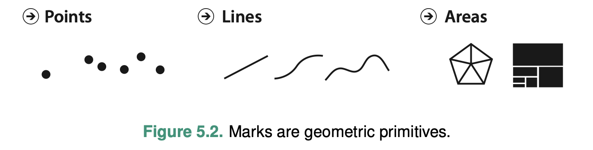

We can use position, color, shape, tilt, and size to encode additional information: 


When we do, we need to consider perceptual issues that are common to our species. In other words, depending on how the information is encoded, we can “see” it better or worse:


These perceptual issues have been experimentally discovered and confirmed. In the image below you can see that, depending how you visualize your data, your readers will have less or more difficulties interpreting your visualizations correctly. In a nutshell, absolute positions are the easiest to interpret, and then everything becomes more and more complicated: relative positions, angles, circular areas, rectangular areas. 


The following illustration shows three different representations of exactly the same information. For our perception it is much easier to see the difference in (c), than in (a) or (b). 


Colors can also create a variety of optical illusions, even when not considering colorblindness. In the example below, our perception tells us that squares A and B in (a) are different in color, yet, if we superimpose a gray mask on the image, we can “see” that they are of the same color. *Takeaway*: “get it right in black and white”.


### The Rules of Thumb for Visualizations

Tamara Munzner in her “Visualization Analysis and Design” (2014) formulated eight rules of thumb (Chapter 6. “Rules of Thumb”), which should be followed in order to create visualizations that effectively convey complex information, avoid common pitfalls, and facilitate meaningful insights. (The PDF of the chapter is provided.)

1.  **No Unjustified 3D**:
	-   *The Power of the Plane*: Use 2D representations when possible, as they are easier to interpret and compare.
	-   *The Disparity of Depth*: Depth perception varies among individuals, making 3D depth cues unreliable for accurate comparisons.
	-   *Occlusion Hides Information*: 3D visualizations can lead to important data points being obscured by other elements.
	-   *Perspective Distortion Dangers*: 3D projections can distort the perception of sizes and distances, leading to incorrect interpretations.
	-   *Tilted Text Isn’t Legible*: 3D visualizations often use tilted text, which can be challenging to read.
1.  **No Unjustified 2D**: Avoid using 2D visualizations when they don’t provide clear benefits over simpler 1D representations.
3.  **Eyes Beat Memory**: Design visualizations that minimize the need for viewers to rely on their memory by placing related data points close together or using common baselines.
4.  **Resolution over Immersion**: Prioritize high-resolution displays over immersive environments, as they provide more detail and are easier to interpret.
5.  **Overview First, Zoom and Filter, Detail on Demand**: Present an overview of the data first, then allow users to zoom in and filter the data to focus on specific areas, and finally provide additional details on demand.
6.  **Responsiveness Is Required**: Ensure that the visualization responds quickly to user input, as slow responsiveness can be frustrating and lead to disengagement.
7.  **Get It Right in Black and White**: Make sure the visualization is effective in grayscale before adding color, as this ensures that the design relies on more perceptually accurate visual channels (e.g., position and length) rather than color alone.
8.  **Function First, Form Next**: Prioritize the functionality and effectiveness of the visualization, and then focus on aesthetics to create a visually pleasing and engaging design.    

### Types of Graphs and When to Use Them

<!--

Here is a list of common graphs and charts with a description of their use cases and when they should and should not be used:

1.  Bar chart:
    -   Use case: Comparing discrete categories or showing changes in data over time.
    -   Should be used: When dealing with categorical data or comparing values across different categories.
    -   Should not be used: For continuous data or to display relationships between variables.
2.  Line chart:
    -   Use case: Displaying trends or patterns in continuous data over time.
    -   Should be used: When visualizing continuous data, especially time series data or data with a clear trend.
    -   Should not be used: For categorical data or when there is no clear trend in the data.
3.  Pie chart:
    -   Use case: Representing relative percentages or proportions of different categories in a dataset.
    -   Should be used: When dealing with part-to-whole relationships or showing proportions.
    -   Should not be used: When comparing more than a few categories, as it becomes difficult to interpret, or for data that doesn't represent proportions.
4.  Scatter plot:
    -   Use case: Exploring correlations or relationships between two numerical variables.
    -   Should be used: When investigating the relationship between two continuous variables.
    -   Should not be used: When dealing with categorical data or when there are no clear relationships between variables.
5.  Histogram:
    -   Use case: Analyzing the distribution and underlying patterns of a continuous variable.
    -   Should be used: When visualizing the distribution of a single continuous variable.
    -   Should not be used: For categorical data or to display relationships between variables.
6.  Heatmap:
    -   Use case: Visualizing complex datasets with multiple dimensions or displaying correlations between variables.
    -   Should be used: When working with large datasets or showing the intensity of data across a matrix.
    -   Should not be used: When dealing with simple datasets, as it may introduce unnecessary complexity.
7.  Box plot:
    -   Use case: Summarizing and comparing the distribution of different groups or categories.
    -   Should be used: When comparing the distribution of data across groups or identifying outliers.
    -   Should not be used: When displaying trends over time or for data with only a few data points.
8.  TreeMap:
    -   Use case: Visualizing hierarchical data structures and part-to-whole relationships.
    -   Should be used: When dealing with hierarchical data or showing nested proportions.
    -   Should not be used: When visualizing non-hierarchical data or when the hierarchy is too complex.
9.  Choropleth map:
    -   Use case: Visualizing geographic distribution of data and spatial patterns.
    -   Should be used: When displaying data across geographic areas, such as countries or states.
    -   Should not be used: When dealing with non-geographic data or when the geographical divisions are not meaningful for the data.
10.  Network graph:
    -   Use case: Visualizing complex relationships or connections between entities.
    -   Should be used: When displaying relationships between entities in a network, such as social networks or organizational structures.
    -   Should not be used: When dealing with simple, non-relational data or when the network structure is too complex to interpret.

Always consider the type of data you have and the insights you want to convey when choosing the appropriate graph or chart. Selecting the right visualization is essential for effectively communicating your findings and enabling your audience to make informed decisions.

-->

Visualizations can be grouped based on the types of data they are designed to represent. Here's a categorization of common visualizations based on data types:

#### Categorical data (nominal or ordinal)

For example, we have people with different activities in a specific place; each activity will be a category, while the umber of people associated with that activity will determine the magnitude of each activity.

- **Bar chart**: Compares values across categories. For example, each city can be represented as a series of activities (an activity per bar), thus each city should have a distinct visual profile.

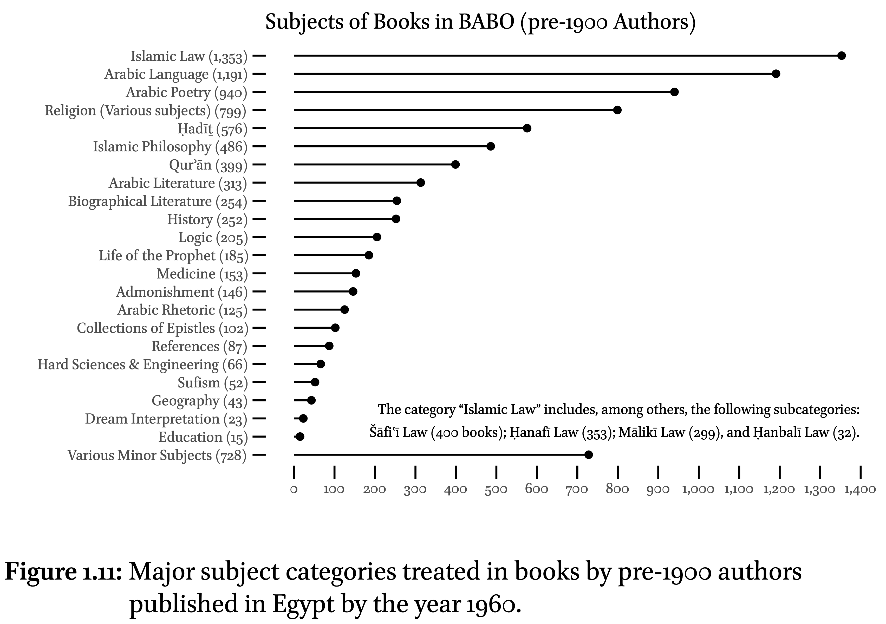


<!---->

-  **Pie chart**: Represents proportions of different categories in a dataset. In a way, very similar to a bar chart in its function, but much more difficult to interpret, especially when you have multiple pies to compare (see, perception issues above.) A bar chart, or even a list/table may be a better alternative. (Remember, *No Unjustified 2D*.)

> *do not use them, please.*

-  **TreeMap**: Visualizes hierarchical data structures and part-to-whole relationships in nested categories. Since we have difficulties interpreting “rectangular volumes”, you should not rely on them exclusively.


| 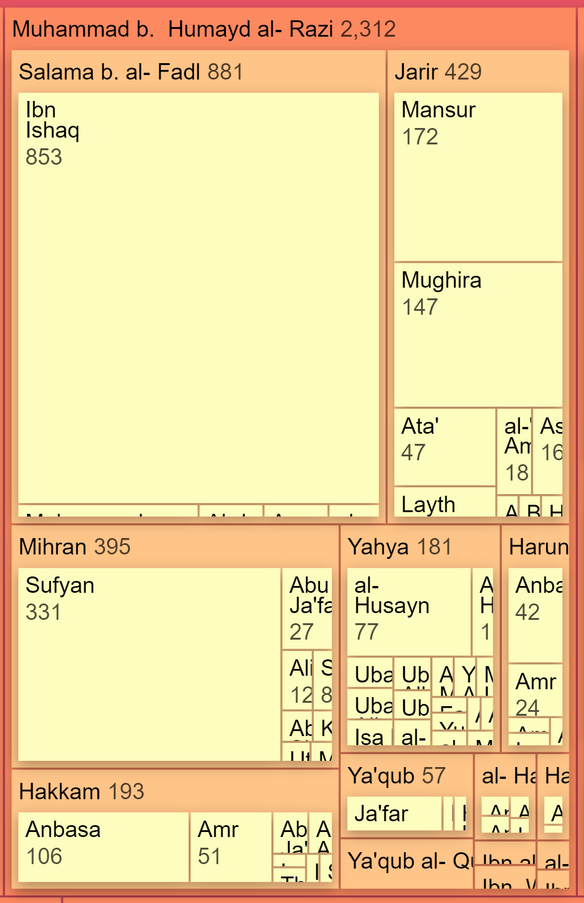  |   |
|:-:|:-:|
|Structure of al-Ṭabarī's notes<br> (Credit: Sarah Savant)| Structure of the Islamic world, according to al-Muqaddasī (Credit: Masoumeh Seydi)|


-   **Stacked bar chart:** Displays the composition of different categories over time or across other categorical dimensions. We also saw above that these are quite difficult to read (only the layer at the very bottom is readable because of the same baseline; other layers will be very difficult to compare to each other). It is better to split your data into simpler objects and use a different visualization.

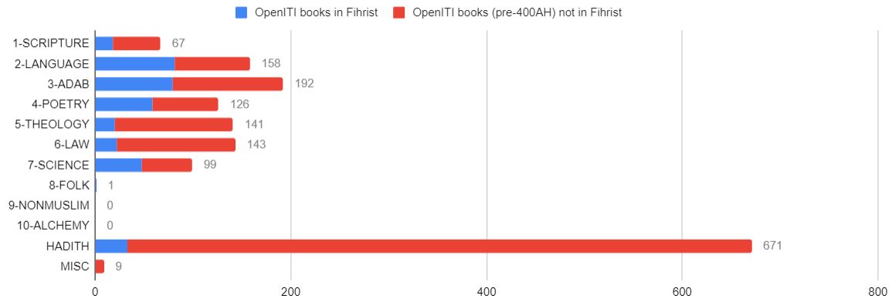


- **Radar chart**, also known as a spider chart or a web chart, is a graphical representation of multivariate data. It is used to display multiple variables as points or lines emanating from a central point, with each variable represented by a different axis that is equally spaced around the center. The variables are plotted on these axes as points or lines that form a polygon, with the shape of the polygon reflecting the values of the variables. A radar chart is a much better alternative to a stacked bar chart and a TreeMap, both of which are difficult to read and do not allow for efficient comparison. Additionally, we can plot multiple objects on a radar chart for comparison.

<!--
| ![[0626YaqutHamawi.MucjamUdaba_RADAR_D20220910T142255.svg]]  | ![[0204Shafici.Umm_RADAR_D20220910T142614.svg]]  |
|:-:|:-:|
| A biographical collection of “men of letters”  | A legal text |
-->


<!--
- **Parallel coordinates plot**: Visualizes multi-dimensional numerical data by representing each dimension as a vertical axis and connecting data points across axes with lines.
-->

#### Continuous data (interval or ratio).

In most cases this means data that changes over time. For example, the number of people in specific places over time; the change over time in activities, in which individuals are involved; the general number of people over time, etc. 

-   **Line chart**: Displays trends or patterns in continuous data over time, like in examples above.


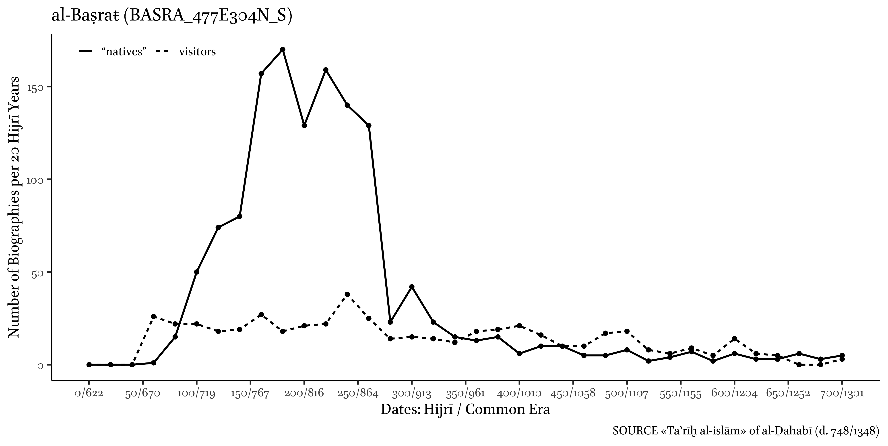

- **“Bar” chart** from above.

- **Scatter plot**: Explores correlations or relationships between two numerical variables. Usually, this chart type is used to check if there is any correlation. For example, with the scatter plot, we can check if there is any correlation between the age at which a person dies and the time when the person was born (if we assume that the living conditions were improving with time, people would live longer); a toy example of a strong correlation in our data will be to plot date of birth vs. date of death.


-  **Histogram**: Analyzes the distribution and underlying patterns of a continuous variable. For example, we can use a histogram to check the distribution of age values.


-   **Box plot**: Summarizes and compares the distribution of different groups or categories in continuous data. Box plot would be an even better alternative for checking the distribution of ages.

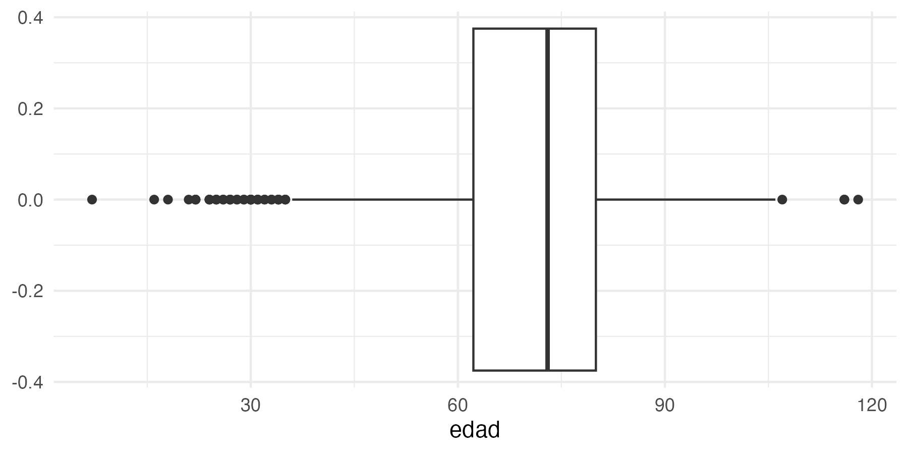

-   **Area chart**: Represents the magnitude of continuous data over time, similar to a line chart, but with the area between the line and axis filled. Area charts are usually rather difficult to interpret, but sometimes they work. (This is not quite an area chart, but it is quite similar.)


#### Geographic data

Although most visualization of geographical data are often called*maps*, there is rarely a need to use *true* geographical maps. In most cases we only need a suggestive layout—like shorelines or country borders—to convey sufficient sense of geography in order to make the data that we want to visualize geographically meaningful. It is perhaps best to refer to such “maps” as cartograms.

-   **Choropleth map** visualizes geographic distribution of data and spatial patterns using color to represent data values in predefined geographic areas. Most commonly, predefined geographical units are confines of administrative units, like countries, states, counties, lands, districts, etc. The most common issue with choropleth maps is that categorical values are represented colors, while areas are represented with space: larger administrative units look and appear larger than smaller units—but their area may be misleading, like in the examples below that show voting patterns in the US. The biggest problem of choropleth maps is their unpracticality for pre-modern period, when we simply do not have boundaries to work with.


-   **Heatmap** represents data in a matrix format, often used to display spatial data as a grid with color-coded cells based on data values. This one can be useful to visualize continuous areas, but may also be quite problematic because of its colors.


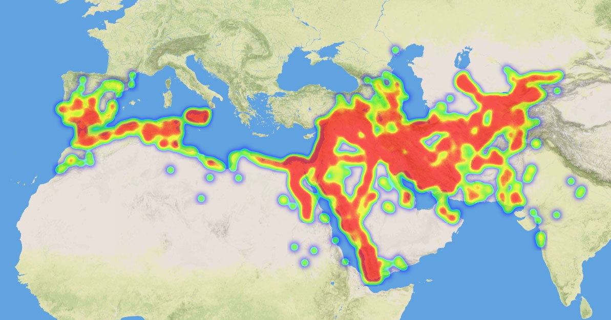


-   **Bubble map** displays geographic data using circles or bubbles of varying sizes to represent data values at specific locations. This is probably the most common cartogram that you will be using.


-   **Network map** can be viewed as an extension of the bubble map, where we also add connections between bubbles.

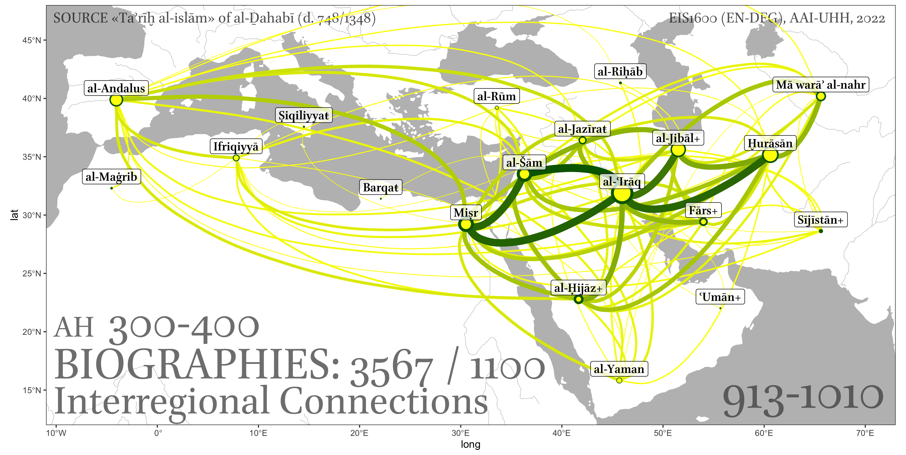
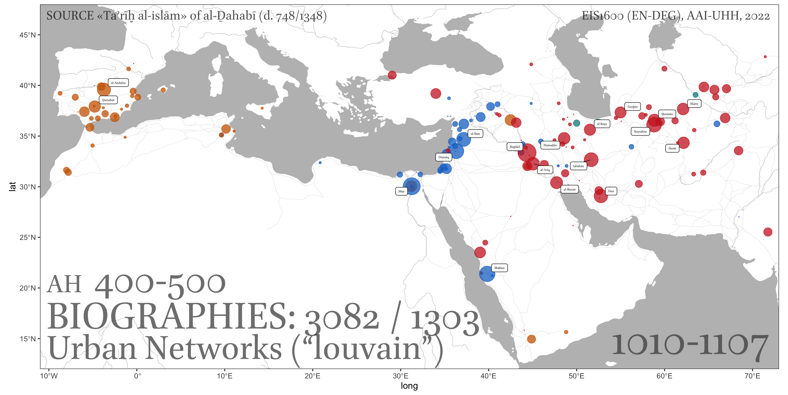

#### Relational data.

In most cases this means some form of network data. Or, to put it differently, data that can be represented as a network. For example, in our `personaje` table we have individuals, whom we can connect together in a variety of ways: for example, we can bring individuals into a network based on the overlap between places that they visited and time periods that they shared (in this cases we can assume that they had an opportunity to meet); we can also aggregate places into a network, based on the numbers of individuals who visited the same places.  

**Network graph**: Visualizes complex relationships or connections between entities as nodes and edges in a graph.

- **social networks**: networks of individuals, which can be constructed in a wide variety of ways; here is an example of a social network of scholars in Middle Eastern Studies, based on MESA conference participation [[https://maximromanov.github.io/projects/mesa_network/]]


- **geographical networks**: visualization of connectedness of places based on some data: 1) routes that connect places; 2) people that connect places — different types of connections: a) connections among places based on the movement of people among those places > more people, stronger the connection; b) migrations into/from specific cities (sort of ego-networks); etc.


- **Matrix chart**: Displays relationships between multiple categories or variables in a matrix format, often using color or symbols to represent data values. This can be used to visualize connections among cities (based on people movement) can also be represented by the number of people that moved between the pairs of cities: source, target, weight;


#### Complex Data, Complex Charts 

As you progress with your use of R (or any other programming language), you are likely to design some research experiments that will be unusual and will require some creative ways of visualizing results. For example, the following are a few graphs from the area of text analysis research where some creative thinking was necessary in order to display results in a powerful way.

Examples of text reuse in *Taʾrīḫ al-islām* of al-Ḏahabī (d. 748/1347). [TOP] Identified text reuse from *Dalāʾil al-nubuwwaŧ* of al-Bayhaqī (d. 458/1066); [MIDDLE] Identified authorial signals of al-Ḏahabī (d. 748/1347) and of al-Bayhaqī (d. 458/1066) in *Taʾrīḫ al-islām*. [BOTTOM] Identified authorial signals of al-Ḏahabī (d. 748/1347) and of al-Bayhaqī (d. 458/1066) in *Taʾrīḫ al-islām*—authorial models are based on works of both authors other than *Taʾrīḫ al-islām* and *Dalāʾil al-nubuwwaŧ* (The MIDDLE AND BOTTOM graphs are produced with R package Stylo).

 <!-- [[ex03.png]] :: only text reuse with Dalail -->

Cumulative text reuse in *Taʾrīḫ al-islām* of al-Ḏahabī (d. 748/1347).


Another example of text reuse visualization:


Geographical data over time (based on *Taʾrīḫ al-islām* of al-Ḏahabī (d. 748/1347)):


## R Built-in Graphics Functions: Quick Overview

R provides a variety of built-in graphics functions for creating different types of plots and visualizations. These functions belong to the base R graphics system (package `graphics`, which is always automatically loaded) and provide a simple yet flexible way to create various plots and visualizations. 

1. `plot()` is a versatile, built-in function used to create various types of plots and visualizations based on the input data. It is part of the base R graphics system and provides a simple, yet flexible way to visualize relationships between variables or explore the distribution of a dataset. Additionally, the base R graphics package includes the following main functions:
2.  `hist()`: Creates a histogram of a given vector of values.
3.  `barplot()`: Creates a bar plot for categorical or discrete data.
4.  `boxplot()`: Creates a box plot to visualize the distribution and summary statistics of a dataset.
5.  `pie()`: Creates a pie chart to represent proportions or percentages.
6.  `pairs()`: Creates a scatterplot matrix for multiple continuous variables.
7.  `dotchart()`: Creates a dot chart (also known as a Cleveland dot plot) for comparing values across categories.
8.  `curve()`: Plots a mathematical function or expression as a curve.
9.  `contour()`: Creates contour plots for displaying three-dimensional data in two dimensions.
10.  `image()`: Creates a grid of colored or gray rectangles based on the values of a matrix.
11.  `heatmap()`: Creates a heatmap to visualize a matrix or a two-dimensional dataset with color gradients.
12.  `mosaicplot()`: Creates a mosaic plot to visualize the relationship between two or more categorical variables.

We will not go over these functions. You can check documentation on them, using help function like `?plot`, `?hist`, etc. I strongly recommend you to take a look at the examples: the best way is to click on link “Run examples” — it will give you a nice overview of what is available. (Personally, I frequently use `plot()` and `hist()` to get a quick insight into a dataset; I will give examples below.)

## `Tidyverse` Graphs: `ggplot2`

`ggplot2` is an R package for creating advanced, customizable data visualizationsIt is part of the `tidyverse` ecosystem and excels at creating complex, multi-layered graphics with ease. This package was developed by Hadley Wickham and is based on the “Grammar of Graphics”, a framework proposed by Leland Wilkinson. The idea is to describe visualizations as a combination of components or layers that can be built up step-by-step. This approach provides a consistent and flexible way to create a wide range of graphics. `ggplot2` became *the* library for data visualization and is probably the best out there. because of its popularity, additional libraries have been developed to extend the functionality of `ggplot2` (`ggthemes`,  `ggraph`, `ggridges`, `ggmap`, `ggrepel`, `gganimate`, etc.).

### Grammar of Graphics

The Grammar of Graphics is a framework for describing and constructing statistical graphics systematically and consistently. It was proposed by Leland Wilkinson in his book "The Grammar of Graphics" published in 1999. The main idea behind this framework is to break down a graphic into distinct components or layers, allowing for a more structured and modular approach to creating visualizations.

The Grammar of Graphics is built on the idea that any statistical graphic can be expressed as a combination of the following components:

1.  **Data**: The dataset used for the visualization, typically a data frame or a tibble. In GoG, the data is considered the starting point, and all other elements are built upon it.
2.  **Aesthetics**: Aesthetics are the mappings between variables in the dataset and visual properties such as position, color, size, or shape. Aesthetics define how the data is represented in the plot and are crucial in determining the type and appearance of the graphic.
3.  **Geoms**: Geoms, short for geometric objects, are the visual elements that represent data points in the plot. Common geoms include points, lines, bars, and polygons. Geoms are responsible for the actual data representation on the graphic.
4.  **Scales**: Scales control the transformations applied to the data and aesthetics. They define the mapping between the data values and the visual properties (e.g., continuous to color gradients, discrete to shapes). Scales also handle the creation of legends and axes.
5.  **Coordinate systems**: Coordinate systems define the space in which the plot is drawn. The most common coordinate system is the Cartesian coordinate system (x and y axes), but other systems like polar coordinates can also be used to create different types of plots.
6.  **Facets**: Faceting is a technique used to create multiple small plots for each level of a categorical variable. It is particularly useful for exploring and comparing data across different subgroups or conditions.
7.  **Stat transformations**: Statistical transformations summarize or transform the data before it is plotted. For example, calculating a linear regression line or binning data for histograms.
8.  **Themes**: Themes control the visual appearance of non-data elements in the plot, such as the background, gridlines, text, and legends. They allow for customization and fine-tuning of the overall appearance of the graphic.

By combining these components, the Grammar of Graphics provides a flexible and systematic way to create a wide range of graphics. Let's take a close look at a complex example with many elements included. (In most cases you probably will not need so many elements/layers.)

First, we need to load and prepare some data that we will need for graphing. The following data will include the chronological distribution (by 50 *hijrī* year periods) of individual in top 10 Andalusian cities. Again, for simplification, we group individuals by the years of their death.

```{R eval=FALSE, include=TRUE}

library(tidyverse) # ggplot2 will be loaded with this command

# get readable names of places
lugarNombres <- PUA$lugar %>%
  select(idLugar, nombre, nombre_castellano)

# count people in places
lugar <- PUA$personaje_lugar %>%
  select(idLugar, idPersonaje, idRelacion) %>%
  left_join(personajeLite, by = c("idPersonaje" = "idPersonaje")) %>%
  select(-nombreA, -nacimiento, -edad, -muerteCE) %>%
  mutate(century = plyr::round_any(muerte, 50, f = ceiling)) %>%
  left_join(lugarNombres)

# count people in places
lugar <- PUA$personaje_lugar %>%
  select(idLugar, idPersonaje, idRelacion) %>%
  left_join(personajeLite, by = c("idPersonaje" = "idPersonaje")) %>%
  select(-nombreA, -nacimiento, -edad, -muerteCE) %>%
  mutate(century = plyr::round_any(muerte, 50, f = ceiling)) %>%
  filter(!is.na(century))

# sleect the top 10 paces
lugarTop <- lugar %>%
  group_by(idLugar) %>%
  summarize(total = n()) %>%
  arrange(desc(total)) %>%
  top_n(20, wt = total)

# get only cities
lugarTop10 <- lugarTop %>%
  left_join(lugarNombres) %>%
  filter(!nombre_castellano %in% c("Oriente", "al-Andalus", "La Meca", "El Cairo", "Marraquech", "Ceuta", "Fez")) %>%
  top_n(10, wt = total)
  
# creating the summary
lugarSummary <- lugar %>%
  group_by(idLugar, century) %>%
  summarize(individuals = n()) %>%
  filter(idLugar %in% lugarTop10$idLugar) %>%
  left_join(lugarNombres) %>%
  mutate(label = paste0(nombre_castellano, " (", nombre, ")")) %>%
  ungroup() %>%
  select(label, individuals, century)

lugarSummary
```

Now, let’s prepare some additional data to make our visualization more readable: we will create labels for our x axis.

```{r}

# prepare labels for dates axis
AH2CE <- function(AH) {
  CE <- round(AH - AH/33 + 622)
  return(CE)
}

periodsAH <- seq(100, 1000, 200)
periodsCE <- AH2CE(periodsAH)

xChronLabels <- paste0(periodsAH, "/", periodsCE)
xChronValues <- periodsAH

```

Before we proceed, we need to do one trick that is not really related to the `ggplot()`, but rather to the ability of R to display Arabic properly in graphs. We need to install and load library `ragg` (For more details: <https://www.tidyverse.org/blog/2021/02/modern-text-features/>). The Arabic will still not be displayed correctly in R, but it will in saved filed.

Now, we can generate our graph:

```R
lugarGraph <- ggplot() +
  geom_line(data = lugarSummary,
            aes(x = century, y = individuals),
            color = "black", linewidth = 0.5) +
  labs(
    title = "Top 10 Andalusian cities over time",
    subtitle = "Chronological and geographical distribution of Andalusian scholars",
    caption = "Based on “Prosopografía de ulemas de al-Andalus” (MICINN, FFI2010-20428)",
    x = "", y = "", position = "left"
  ) +
  scale_x_continuous(breaks = xChronValues, labels = xChronLabels) +
  facet_wrap(~ label, ncol = 2, scales = "free_y") + 
  theme_set(theme_minimal())+
  theme(text = element_text(family = "Amiri"),
        #panel.background = element_blank(),
        panel.grid.major.y = element_blank(),
        panel.grid.minor.y = element_blank(),
        #panel.grid.major.x = element_blank(),
        #panel.grid.minor.x = element_blank(),
        axis.ticks = element_line(linewidth = 0.5),
        axis.ticks.length.y = unit(.25, "cm"),
        axis.ticks.length.x = unit(.25, "cm"),
        legend.position = "none", legend.title = element_blank(),
  )

# print object on the screen (Arabic will not be displayed correctly!)
lugarGraph
```

and when we print our chart to screen, we can see something like this (it will look different on you screen, since the chart will be fitted into the available space in RStudio bottom-right section; you can adjust it, or open the chart in a separate window):


This graph is actually loaded from a saved file. You can save your graph in the following manner:

```R
# saving the chart
fileName <- file.path("PUA_top10_AndalusianCities_OverTime.svg")

ggsave(
  filename = fileName,
  plot = lugarGraph,
  device = "svg", # can be changed to "png", "pdf"
  scale = 1, width = 30, height = 30, units = c("cm")
)
```

The format of the file is `svg` (scalable vector graphic). Since it is a vector format, it has the best quality possible—you can keep zooming in and you will never see pixels. This format, however, is a bit tricky—you can open it in a text editor (since it is XML-based), but not in your usual image editor. It is best for conventional printed publications as well as for online publications. You can also save your graphs into other formats like `png` (portable graphics format). `png` is a raster format, so you will need to take care of such parameters like resolution (`dpi`) to ensure its high quality. (Technically, you can also save it as a PDF, but you will most likely have to deal with lots of issues before you succeed. `svg` is a much easier solution; you can save a needed graph into a PDF using some free software like Inkscape: open `svg`, save as `pdf`.)

### Code Breakdown

**Detailed description of the code**. This R code creates a line graph using the `ggplot2` package to visualize top 10 Andalusian cities over time. The graph shows how the number of people (scholars mostly, but not exclusively) changed over centuries, effectively telling us when these cities appeared on the cultural map of al-Andalus, how they faired over time, and when they dropped off the cultural map of al-Andalus. Here's a breakdown of the code:

0. Note that each unit/element of the code is connected to the next one with `+` (not with `%>%`, like in tibble processing).
1.  `lugarGraph <- ggplot() +`: This line initializes a ggplot object and assigns it to the variable `lugarGraph`. It sets the foundation for creating the plot.    
2.  `geom_line(data = lugarSummary, aes(x = century, y = individuals), color = "black", linewidth = 0.5) +`: This line adds a line layer to the plot. It specifies the data frame `lugarSummary` as the data source. The `aes()` function defines the mapping of variables, where `century` is mapped to the x-axis and `individuals` is mapped to the y-axis. The line color is set to black, and the linewidth is set to 0.5.
3.  `labs(...) +`: This section sets the plot's title, subtitle, and caption, as well as removes the x and y axis labels. The `title` argument specifies the main title of the plot, the `subtitle` argument provides additional information below the title, and the `caption` argument adds a caption to the plot.
4.  `scale_x_continuous(breaks = xChronValues, labels = xChronLabels) +`: This line adjusts the x-axis scale. It sets the breaks (ticks) on the x-axis using `xChronValues` and labels them using `xChronLabels`. This is how we can customize labels on any of axes. Essentially, you need to provide two vectors of the same length: one with the numbers, and another one is with labels that will sit on those numbers. 
5.  `facet_wrap(~ label, ncol = 2, scales = "free_y") +`: This line creates a grid of subplots based on the `label` variable. The `~ label` specifies that the plot should be facetted based on the `label` column in the data. `ncol = 2` sets the number of columns in the grid, and `scales = "free_y"` allows each subplot to have its own y-axis scale. You can modify `ncol` to your liking. If you drop `scales = "free_y"`, then all subplots will be using the same scale—this is more convenient when you want to see the largest and the smallest cities, while using individual scales allows one to get a more detailed picture for each subplot. 
6.  `theme_set(theme_minimal())+`: This sets the theme of the plot to a minimal style. The `theme_minimal()` function provides a predefined theme with minimal visual elements.
7.  `theme(...)` section: This section modifies various visual aspects of the plot. It sets the font family to "Amiri" using `element_text(family = "Amiri")`. It also customizes the appearance of the grid lines, axis ticks, legend, and other elements.

**Notes:**
- There is a number of predefined themes that you can use for your graphs. You can find them all here, with examples: <https://ggplot2.tidyverse.org/reference/ggtheme.html>.
- Most likely, you do not have Amiri font on your computer. You can install it from here: <https://github.com/aliftype/amiri/releases>. This is the best freely available Arabic font. 

> **in class**: the best way to learn how any piece of code works is to try breaking it—try to un/comment lines of code, one by one, regenerate the results to see what changes; you can also try to change some parameters. If it breaks, use `CTRL + z` / `Command + z`  to return your code to its initial state and try something else.  

## Simpler graphs

The graphs do not have to be so complicated. We can generate the same graph (with less details, of course) with a much shorter code:

```R
ggplot() +
  geom_line(data = lugarSummary, aes(x = century, y = individuals), color = "black", linewidth = 0.5) +
  facet_wrap(~ label, ncol = 2)

ggsave(
  filename = "PUA_top10_AndalusianCities_OverTime_01.svg",
  plot = last_plot(),
  device = "svg", width = 30, height = 30, units = c("cm")
)
```


```R
ggplot() +
  geom_line(data = lugarSummary,
			aes(x = century, y = individuals, col = label),
			linewidth = 0.5)

ggsave(
  filename = "PUA_top10_AndalusianCities_OverTime_02.svg",
  plot = last_plot(),
  device = "svg", width = 30, height = 15, units = c("cm")
)

```

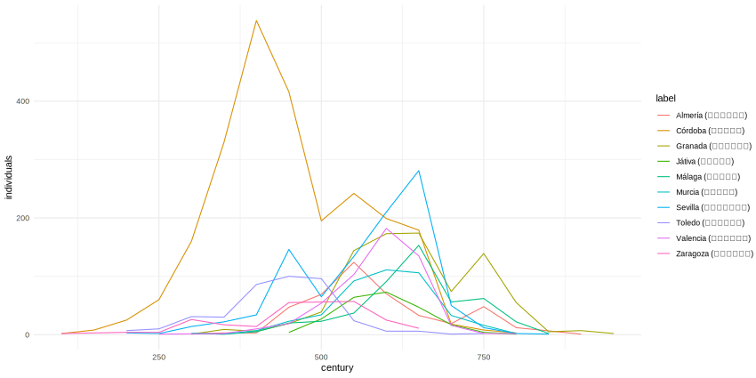

## Other types of graphs

Let's look as the examples of most useful graphs. (We will leave maps and networks for later, since they are more complicated and require preparing data in a specific manner.)

- introduce major types of graphs;
- give examples; create “simple” graphs: students' task #1 is to make them detailed and fully annotated; 

### 1. Scatter plots

Let's try something very simple. First, the correlation between the date of birth and the date of death—this is a silly example, because we do know that the later one is born, the later one dies; but it will show you how a correlation looks visually. Remember, you can save it into a file with: `ggsave("PUAR_scatterplot01.png", w = 6, h = 5)`

```R
ggplot(personajeLite) +
  geom_point(aes(x = nacimiento, y = muerte))

```


**Note**: this can also be done like this: you supply the data into `ggplot()`, and then simply use `aes()` with the geom. This approach is used more commonly, but the one above is more convenient when you may want to combine different datasets into one graph. this is particularly useful with maps.

```R
ggplot(personajeLite) +
  geom_point(aes(x = nacimiento, y = muerte))
```

Now, let's try something more interesting. Is there a correlation between the age and the date of death. In other words, do people live longer in later periods? 
```R
ggplot() +
  geom_point(data = personajeLite,
			 aes(x = nacimiento, y = muerte))
```

From the graph below, we can say is that there is no correlation between these two variables. At least not in our PUA data.


Now, let's try something else. Do people who travel a lot live longer than those who do not travel much, or at all? In other words, we need to build a scatter plot between the number of places that an individual visited and their ages when they died. We need to prepare data.

```R
lugares_visitados <- PUA$personaje_lugar %>%
  group_by(idPersonaje) %>%
  summarize(lugaresVisitados = n())
  
datos_para_el_grafico <- personajeLite %>%
  left_join(lugares_visitados, by = join_by(idPersonaje)) %>%
  select(idPersonaje, lugaresVisitados, edad) %>%
  filter(!is.na(edad)) %>%
  filter(!is.na(lugaresVisitados))
```

We only have c. 1,920 individuals with the data, which is only about 15% of all data. But graphing is now easy:

```R
lugares_y_edad <- ggplot(datos_para_el_grafico) +
  geom_point(aes(x = edad, y = lugaresVisitados), alpha = 0.2)
```


You can add *jitter* parameter to avoid overplotting:

```R
ggplot(datos_para_el_grafico) +
  geom_point(aes(x = edad, y = lugaresVisitados),
             position = position_jitter(width=0.5, height=0.5),
             alpha = 0.2)
```


**HW**: add detailed annotation to the graph, similar to the main example above.

**Note:** `plot()` can be quite useful for quick scatter plots. The code below shows how the same graphs (although they will look slightly different) can be produced with `plot()`. Try that.

```{r eval=FALSE, include=TRUE}
plot(x = personajeLite$edad, y = personajeLite$muerte)
plot(x = personajeLite$nacimiento, y = personajeLite$muerte)
```

### 2. Line charts

We already have an example of a line chart.

```R
ggplot() +
  geom_line(data = lugarSummary, aes(x = century, y = individuals), color = "black", linewidth = 0.5) +
  facet_wrap(~ label, ncol = 2)
```


**HW:**

- create a fully-annotated chronological chart for top 10 professions (`actividad`);
- create two fully-annotated charts for top 10 professions in two cities of your choice;

### 3. Bar charts

Let's graph bars of individuals in the top 10 Andalusian cities. We will need to do some data processing though.

```R
lugarPersonaje <- lugarSummary %>%
  group_by(label) %>%
  summarize(personaje = sum(individuals))

ggplot(lugarPersonaje) +
  geom_col(aes(label, personaje))
```


**HW:**
- add annotation to the cities graph;
- create a fully-annotated bar chart for 10 most common professions
	- for the entire al-Andalus;
	- and for the top 10 cities;

### 4. Histograms

Histograms are best for understanding the distribution of values. For example, ages (`edad`)

```R
ggplot() +
  geom_histogram(data = personajeLite, aes(x = edad))
```


```R
ggplot() +
  geom_histogram(data = personajeLite, aes(x = edad),
				 binwidth = 10)
```


**Note:** this is where `hist()` may also be very useful: `hist(personajeLite$edad)`

**HW:**

- create a fully annotated histogram of the distribution of ages;
- create a fully annotated histogram for the number of places visited by each individual in the PUA database;

### 5. Wordclouds

Everyone seems to want to use wordclouds, but wordclouds are most commonly misused. Any issues with the following wordcloud? (Think of it this way: well-designed visualizations use position, color, shape, tile, and size in informative ways — ideally, each of them must encode/convey some information.)

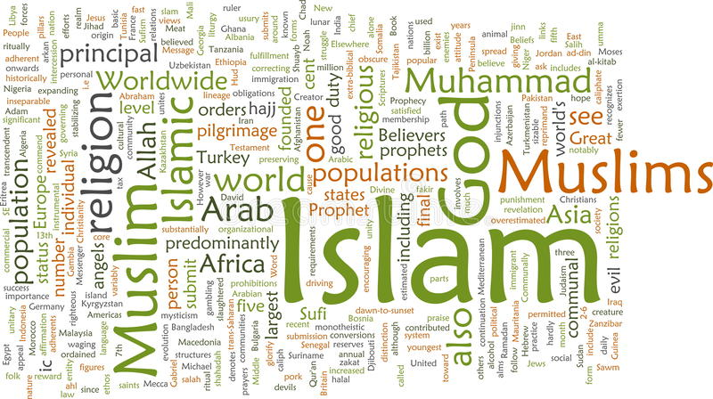

Better variants with R (unfortunately, does not work with Arabic text.). First, prepare data: places and frequencies (sizes).

```R
lugarFreqs <- lugar %>%
  group_by(idLugar) %>%
  summarize(total = n()) %>%
  left_join(lugarNombres, by = join_by(idLugar))
```

The graphing is somewhat different, since we need to use a different library—not `ggplot()`—and a different way of saving graphs.

```R
library(wordcloud)
library(RColorBrewer)

set.seed(786) # for replication

png(file = "PUAR_wordcloud_Castellano.png",
    width = 10, height = 10, res = 300, units = "cm")

wordcloud(words = lugarFreqs$nombre_castellano,
		  freq = lugarFreqs$total,
          min.freq = 1, max.words = 200,
		  random.order = FALSE, rot.per = 0, 
          colors=brewer.pal(8, "Dark2"),
		  family = "Brill")

dev.off()
```


As you can see below, it does not work for Arabic. I will get back to you if I find a solution...

**Update!** I found the way to make it work (thanks to Till Grallert). We need to use the same library `ragg` as we did before for ggplot graphs, but here we need to use a slightly different command to save our graph: `agg_png()` instead of `png()`

```R
library(ragg)

set.seed(786) # for replication

agg_png(file = "PUAR_wordcloud_arabe.png",
    width = 10, height = 10, res = 300, units = "cm")

wordcloud(words = lugarFreqs$nombre, freq = lugarFreqs$total,
          min.freq = 1, max.words = 200, random.order = FALSE, rot.per = 0, 
          colors=brewer.pal(8, "Dark2"), family = "Amiri")

invisible(dev.off())
```

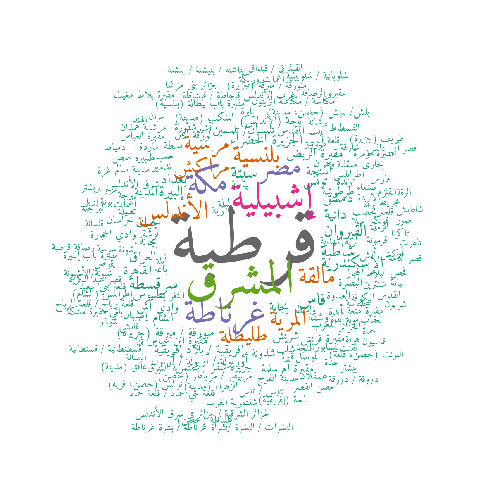

**HW**
- ! you cannot annotate these wordclouds in a similar manner.
- create wordclouds of professions
	- for the entire al-Andalus;
	- for top ten cities;

## Homework assignment

Your homework assignment is given in the section above.

<!--

## Final word

In conclusion, this lesson on graphs and graphing with R and ggplot has provided a detailed presentation of the power and versatility of data visualization. We explored the fundamentals of plotting, learned how to create various types of graphs, and discovered how to customize them using the ggplot2 package.

By using R and ggplot2, we gained the ability to transform raw data into meaningful visual representations. We covered essential concepts such as data aesthetics, layers, and mappings, enabling us to effectively convey insights and patterns hidden within our datasets.

Throughout the lesson, we practiced constructing bar plots, line plots, scatter plots, and more, while incorporating labels, titles, and annotations to enhance the clarity and interpretability of our visualizations. We also delved into the concepts of faceting and theming, further expanding our capabilities in creating professional-looking plots.

By mastering the art of graphing, we have acquired a valuable tool for data exploration, analysis, and communication. The ability to create visually appealing and informative graphs equips us to effectively present our findings, engage our audience, and make data-driven decisions.

As we continue to delve into the realm of data science and analysis, the knowledge gained from this lesson will prove invaluable. Armed with the skills to harness R and ggplot2 for graphing, we are well-equipped to tackle complex datasets, unravel trends, and tell compelling stories through our visualizations.

Remember, practice is key to further honing these skills. So, continue exploring the vast possibilities of graphing with R and ggplot2, experimenting with different plot types, customization options, and creative ways to display your data. The world of graphs is at your fingertips, ready to amplify your data analysis journey.

-->


<!--

## Graphing Data

Let's now combine our newly acquired knowledge of tibble manipulations (last class :) with the possibilities that `ggplot2` offers us. It allows you to create various types of charts, including:

1.  Scatter plots;
2.  Line charts;
3.  Bar charts;
4.  Histograms;
5.  Box plots (option: Violin plots);
6.  Density plots;
7.  Area charts;
8.  Heatmaps;
10. Radial charts: great for representing complex objects with multiple characteristics (distribution of genre signals in a book);
11. Wordclouds (not with ggplot2 though); not a very great visualization either; unless done properly
12.  Pie charts should be avoided at all costs! If you use them knowledgeable people will know right away you know nothing about visualization of data. A much better alternative is a table with absolute numbers and percentages (you can knit ones into markdown code with knitr).

The most useful charts depend on the context and the data you are working with. Some common chart types that are helpful in a wide range of scenarios include:

1.  **Scatter plots**: For visualizing the relationship between two continuous variables. *Example:* correlation between the length of a book and the amount of text reuse in it;
2.  **Line charts**: For visualizing trends over time or continuous variables. *Example*: numbers of books over periods; *alternative*: barbell chart --- to highlight gaps; 
3.  **Bar charts**: For comparing discrete categories or showing proportions. *Example*: number of books by genres in the corpus; split into centuries; 
4.  **Histograms**: For understanding the distribution of a single continuous variable. Example?
5.  **Box plots**: For visualizing the distribution of a continuous variable across different categories. *Example*: distribution of lengths of books by genres; by periods;

As for charts to avoid, pie charts are generally not recommended in general because they are less effective at communicating information than other types of charts. This is because it's harder to accurately compare the size of pie slices than bars or points in other types of charts.

Remember that the most important aspect of data visualization is to convey information effectively. Always choose the chart type that best represents your data and makes it easy for your audience to understand the insights you are trying to communicate.

1. need to discuss issues of our perception: shapes, colors, etc. -- Kieran Healey's book;
1. Unique books per period (50 AH years or 100 AH years?);
2. Books by genres per period (50 AH years or 100 AH years?);
3. Need to show different types of graphs:
	1. line chart --- unique books per period; books by genres per period;
	2. bar chart --- books by genres; books by periods;
	3. barbell charts? --- to highlight gaps;
	4. pie charts: use a table with absolute numbers and percentages > show how to make one with typeset it with knitr;
	5. radial charts: compound genre signal in books an in authors;
	6. histograms: distribution of what?
	7. scatterplots: text reuse (simplified data) > the larger the book, the higher the possibility of text reuse;
4. Map of the Islamic world:
	1. base map > for reuse;
	2. data to be added on top;
	3. focusing on specific provinces;
5. Network example:
	2. social network;
	1. geographical network;

-->

## Appendices

### Appendix 1: When a “Simple” Table May Suffice

> The **gt** package is all about making it simple to produce nice-looking display tables. Display tables? Well yes, we are trying to distinguish between data tables (e.g., tibbles,`data.frame`s, etc.) and those tables you’d find in a web page, a journal article, or in a magazine. Such tables can likewise be called presentation tables, summary tables, or just tables really. For more: <https://gt.rstudio.com/articles/intro-creating-gt-tables.html>


More links of on `gt()` and `gtExtra()`:
- <https://gt.rstudio.com/articles/intro-creating-gt-tables.html>
	- Latest update: <https://posit.co/blog/new-formatting-functions-in-gt-0-9-0/>
	- Extension package `gtExtras`: https://jthomasmock.github.io/gtExtras/
	- A digital “book” on creating `gt` tables: <https://gt.albert-rapp.de/>
- This is primarily for your records; just flip through its digital pages so that you have an idea what kind of things you can create with this library. When you have a specific project or idea, you can always come back to that book and work your way through relevant chapters to present your data in a similar manner.

As a quick example, let's summarize our `personajeLite` table:

```R
personajeLite <- PUA$personaje %>%
  select(idPersonaje, idFamilia, nombreA,
		 nacimiento, muerte, edad) %>%
  mutate(nacimiento = na_if(nacimiento, 0)) %>%
  mutate(muerte = na_if(muerte, 0)) %>%
  mutate(edad = na_if(edad, 0)) %>%
  mutate(idFamilia = na_if(idFamilia, 0)) %>%
  mutate(muerteCE = ifelse(is.na(muerte), NA, round(muerte - muerte/33 + 622)))
```

Now, we can get a quick and nice-looking summary in the following manner:

```R
library(gt)
library(gtExtras)

gt_plt_summary(personajeLite) 
```


## Appendix: Interactive Graphs

If you want to create an interactive graph, you can use `plotly` library —it can add some interactivity to a `ggplot` graph (<https://plotly.com/ggplot2/>); or 2) you can use a slightly different syntax to create `plotly` graphs directly (<https://plotly.com/r/>).

> Example: a Genre Classification Experiment on OpenITI texts, <https://maximromanov.shinyapps.io/adhfais_app2/> 


### Appendix: Checklist for Creating Visualizations

Creating effective visualizations involves taking into account several factors related to human perception and design principles. Here are some key issues to consider when designing charts, graphs, or other visualizations:

1.  Choose the **right chart type**: Select the most appropriate chart type that effectively represents the data and relationships you want to convey. Different chart types are better suited for different kinds of data and purposes.
2.  Maintain **simplicity**: Avoid clutter and unnecessary elements in your visualizations. A clean and simple design helps the viewer to focus on the main message of the chart.
3.  Use **color** wisely: Use color to highlight important aspects or to distinguish between different data points or categories. However, avoid using too many colors, which can make the chart confusing. Be mindful of color-blind users and choose color schemes that are easily distinguishable for them.
4.  Label **axes** and provide **legends**: Clearly label the axes of your chart and provide a legend to explain symbols, colors, or patterns used in the visualization. This helps viewers understand the context and meaning of the data.
5.  Use consistent **scales**: Ensure that the scales of your axes are consistent and appropriate for the data being presented. This makes it easier for viewers to compare values and understand trends.
6.  **Be cautious with 3D effects**: Although 3D charts can look visually appealing, they can also introduce distortions and make it difficult for viewers to accurately perceive the data. Stick to 2D charts whenever possible.
7.  Maintain **aspect ratio**: Choose an appropriate aspect ratio for your chart to prevent distortion and misinterpretation of the data. For example, using a square aspect ratio for a scatter plot can help viewers accurately perceive the relationship between variables.
8.  **Tell a story**: Focus on the main message you want to convey with your visualization. Emphasize the key insights, trends, or relationships within the data to make the chart informative and engaging.
9.  **Test with your audience**: To ensure that your visualization is effective, share it with a sample of your intended audience and gather feedback. This can help you identify any issues or confusion that may arise and refine the visualization accordingly.


## Appendix: Scientific Notation

Sooner or later you will run into numbers that are expressed with *scientific notation*. Here's an example of a number in scientific notation and its equivalent representation without scientific notation:

- Scientific notation: `3.25e+03`
- Without scientific notation: `3250`

In scientific notation, the number is expressed as a product of a coefficient (3.25) and a power of 10 (10<sup>3</sup>). This notation is especially useful for representing very large or very small numbers in a more compact form. In this example, `3.25e+03` means `3.25` times `10` raised to the power of `3`, which is equal to `3250`.

Since such notation will be problematic for most of us, it may be best to switch it off.  In R, you can turn off scientific notation by setting the `scipen` option to a large positive value. This will force R to display numbers in fixed-point notation instead of scientific notation. You can set the `scipen` option using the `options()` function:

```R
options(scipen = 999)
```

By setting `scipen` to 999, you're essentially telling R to avoid using scientific notation unless the number is extremely large or extremely small. To reset the option to its default value, you can set `scipen` back to 0:

```R
options(scipen = 0)
```

Keep in mind that these settings only affect how the numbers are displayed in R, not how they are stored or used in calculations.

## Homework solutions (partial)

Solutions are given only to the data problems; you should be able to figure out prettification assignments on your own.

### Line charts

- create a fully-annotated chronological chart for top 10 professions (`actividad`);

The code is actually pretty much the same as we used above to graph top 10 Andalusian cities. We just need to swap the tables on places with tables on activities. Keep in mind that we are filtering out people for whom we do not have chronological information, even if those individuals are representing the top 10 professions. This means that you will need to make a note about that in an annotation to the graph and make sure to discuss this in your academic prose (for example: there are X representatives of profession Y, but only Z are shown on the graph (Z%) since others do not have chronological information.).

```R
# get readable names of activities
actividadNombres <- PUA$actividad %>%
  select(idActividad, nombre, nombre_castellano)

# count people by activities
actividad <- PUA$personaje_actividad %>%
  select(idActividad, idPersonaje) %>%
  left_join(personajeLite, by = c("idPersonaje" = "idPersonaje")) %>%
  select(-nombreA, -nacimiento, -edad) %>%
  mutate(century = plyr::round_any(muerte, 50, f = ceiling)) %>%
  filter(!is.na(century))

# select the top 10 activities
actividadTop <- actividad %>%
  group_by(idActividad) %>%
  summarize(total = n()) %>%
  arrange(desc(total)) %>%
  top_n(10, wt = total) %>%
  left_join(actividadNombres)

  
# creating the summary
actividadSummary <- actividad %>%
  group_by(idActividad, century) %>%
  summarize(individuals = n()) %>%
  filter(idActividad %in% actividadTop$idActividad) %>%
  left_join(actividadNombres) %>%
  mutate(label = paste0(nombre_castellano, " (", nombre, ")")) %>%
  ungroup() %>%
  select(label, individuals, century)


actividadSummaryNew <- actividadSummary %>%
  pivot_wider(names_from = century, values_from = individuals) %>%
  pivot_longer(!label, names_to = "century", values_to = "individuals") %>%
  mutate(century = as.numeric(century))
```

Now, graphing. Again, quite the same if compared to the code on top 10 Andalusian cities.

```R

actividadGraph <- ggplot() +
  geom_line(data = actividadSummaryNew,
            aes(x = century, y = individuals),
            color = "black", linewidth = 0.5) +
  labs(
    title = "Top 10 Andalusian professions over time",
    subtitle = "Chronological and geographical distribution of Andalusian scholars by professions",
    caption = "Based on “Prosopografía de ulemas de al-Andalus” (MICINN, FFI2010-20428)",
    x = "", y = "", position = "left"
  ) +
  scale_x_continuous(breaks = xChronValues, labels = xChronLabels) +
  facet_wrap(~ label, ncol = 2) +  # , scales = "free_y"
  theme_set(theme_minimal())+
  theme(text = element_text(family = "Amiri"),
        panel.grid.major.y = element_blank(),
        panel.grid.minor.y = element_blank(),
        axis.ticks = element_line(linewidth = 0.5),
        axis.ticks.length.y = unit(.25, "cm"),
        axis.ticks.length.x = unit(.25, "cm"),
        legend.position = "none", legend.title = element_blank(),
  )

actividadGraph


ggsave(
  filename = file.path("PUA_top10_AndalusianProfessions_OverTime_01.svg"),
  plot = actividadGraph,
  device = "svg", scale = 1, width = 30, height = 30, units = c("cm")
)

```

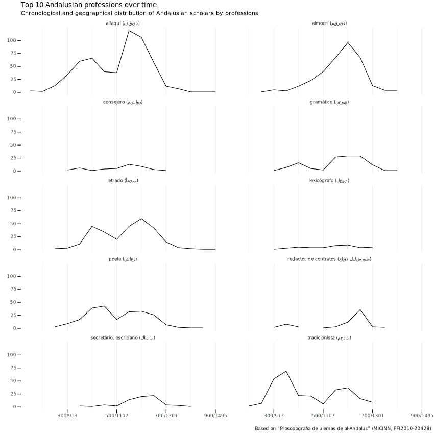

- create two fully-annotated charts for top 10 professions in two cities of your choice;

I will limit this to a single city—Cordoba; you should be able to get another city on your own. We already have the code for professions.

We can reuse the code from above, but we ned pre-filter our `personajeLite`, keeping only those with connections to Cordoba.

```{r eval=FALSE, include=TRUE}

cordobans <- PUA$personaje_lugar %>%
  filter(idLugar == 4) # you can find that the id of Cordoba is 4

personajeLiteCordoba <- personajeLite %>%
  filter(idPersonaje %in% cordobans$idPersonaje)
```

Now, the light version of what we did for cities and professions above:

```{r eval=FALSE, include=TRUE}

# count people by professions
actividadCordoba <- PUA$personaje_actividad %>%
  select(idActividad, idPersonaje) %>%
  left_join(personajeLiteCordoba, by = c("idPersonaje" = "idPersonaje")) %>%
  select(-nombreA, -nacimiento, -edad) %>%
  mutate(century = plyr::round_any(muerte, 50, f = ceiling)) %>%
  filter(!is.na(century))

# creating the summary
actividadSummaryCordoba <- actividadCordoba %>%
  group_by(idActividad, century) %>%
  summarize(individuals = n()) %>%
  filter(idActividad %in% actividadTop$idActividad) %>%
  left_join(actividadNombres) %>%
  mutate(label = paste0(nombre_castellano, " (", nombre, ")")) %>%
  ungroup() %>%
  select(label, individuals, century)

actividadSummaryCordobaNew <- actividadSummaryCordoba %>%
  pivot_wider(names_from = century, values_from = individuals) %>%
  pivot_longer(!label, names_to = "century", values_to = "individuals") %>%
  mutate(century = as.numeric(century))
```

And, now, the graph:

```R


actividadGraphCordoba <- ggplot() +
  geom_line(data = actividadSummaryCordobaNew,
            aes(x = century, y = individuals),
            color = "black", linewidth = 0.5) +
  labs(
    title = "Top 10 Cordoban professions over time",
    subtitle = "Chronological distribution of Cordoban scholars by professions",
    caption = "Based on “Prosopografía de ulemas de al-Andalus” (MICINN, FFI2010-20428)",
    x = "", y = "", position = "left"
  ) +
  scale_x_continuous(breaks = xChronValues, labels = xChronLabels) +
  facet_wrap(~ label, ncol = 2) +  # , scales = "free_y"
  theme_set(theme_minimal())+
  theme(text = element_text(family = "Amiri"),
        panel.grid.major.y = element_blank(),
        panel.grid.minor.y = element_blank(),
        axis.ticks = element_line(linewidth = 0.5),
        axis.ticks.length.y = unit(.25, "cm"),
        axis.ticks.length.x = unit(.25, "cm"),
        legend.position = "none", legend.title = element_blank(),
  )

actividadGraphCordoba


ggsave(
  filename = file.path("PUA_top10_CordobanProfessions_OverTime_01.svg"),
  plot = actividadGraphCordoba,
  device = "svg", scale = 1, width = 30, height = 30, units = c("cm")
)
```


### 3. Bar charts

- add annotation to the cities graph;
- create a fully-annotated bar chart for 10 most common professions
	- for the entire al-Andalus;
	- and for the top 10 cities;

I will add only a graph for all professions. The previous solutions should help you to produce bar charts for the top ten cities. (Essentially, you need to pre-filter `personajeLite` to include only people from the top ten cities; and then to apply the code that we used for the entire al-Andalus.)

```r
actividad <- PUA$personaje_actividad %>%
  select(idActividad, idPersonaje) %>%
  left_join(personajeLite, by = c("idPersonaje" = "idPersonaje")) %>%
  select(-nombreA, -nacimiento, -edad) %>%
  group_by(idActividad) %>%
  summarize(total = n()) %>%
  arrange(desc(total)) %>%
  top_n(10, wt = total) %>%
  left_join(actividadNombres) %>%
  mutate(label = paste0(nombre_castellano, " (", nombre, ")")) %>%
  ungroup() %>%
  select(label, total)
```

And now the graph:

```R
ggplot(actividad) +
  geom_col(aes(label, total)) + 
#  geom_col(aes(label, personaje))
  coord_flip() +
  labs(
    title = "Top 10 Andalusian Professions",
    subtitle = "Overall counts for top Andalusian professions",
    caption = "Based on “Prosopografía de ulemas de al-Andalus” (MICINN, FFI2010-20428)",
    x = "", y = "", position = "left"
  ) +
  theme_set(theme_minimal())+
  theme(text = element_text(family = "Amiri"),
        panel.grid.major.y = element_blank(),
        panel.grid.minor.y = element_blank(),
        axis.ticks = element_line(linewidth = 0.5),
        axis.ticks.length.y = unit(.25, "cm"),
        axis.ticks.length.x = unit(.25, "cm"),
        legend.position = "none", legend.title = element_blank())
        
        
ggsave(
  filename = file.path("PUA_top10_AndalusianProfessions_Total01.svg"),
  plot = last_plot(),
  device = "svg", scale = 1, width = 30, height = 10, units = c("cm")
)
```

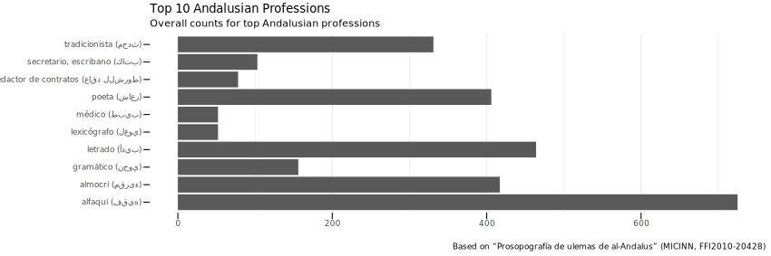

We can also build a slightly different looking graph. **Note:** for some reason, on my computer R crashes if I use Amiri font—for this specific graph only. So, I switched to a different font here. *Modifications*: I have added counts to the labels; bars look a bit more subtle (line + point); data is arranged by frequencies, not alphabetically as in the first example. 

```R
actividadNew <- actividad %>%
  mutate(label = paste0("[", total, "] ", label))


ggplot(actividadNew) +
  geom_point(aes(y=reorder(label, desc(total)), x = total)) +
  geom_segment(aes(y=reorder(label, desc(total)), yend=reorder(label, desc(total)), x=0, xend=total), linewidth=0.5) +
  labs(
    title = "Top 10 Andalusian Professions",
    subtitle = "Overall counts for top Andalusian professions",
    caption = "Based on “Prosopografía de ulemas de al-Andalus” (MICINN, FFI2010-20428)",
    x = "", y = "", position = "left"
  ) +
  theme_set(theme_minimal()) +
  theme(text = element_text(family = "Brill"),
        panel.grid.major.y = element_blank(),
        panel.grid.minor.y = element_blank(),
        axis.ticks = element_line(linewidth = 0.5),
        axis.ticks.length.y = unit(.25, "cm"),
        axis.ticks.length.x = unit(.25, "cm"),
        legend.position = "none", legend.title = element_blank())
        
        
ggsave(
  filename = file.path("PUA_top10_AndalusianProfessions_Total02.svg"),
  plot = last_plot(),
  device = "svg", scale = 1, width = 30, height = 10, units = c("cm")
)
```

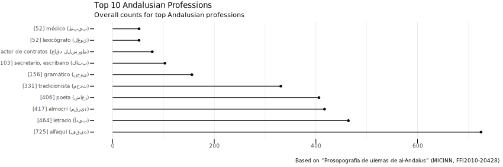

### 4. Histograms

- create a fully annotated histogram of the distribution of ages;
- create a fully annotated histogram for the number of places visited by each individual in the PUA database;

Only the second one here. This, in fact, is super easy. **Note**: using `summary()` on the vector of values would provide additional details.

```r

visits <- PUA$personaje_lugar %>%
  group_by(idPersonaje) %>%
  summarize(places = n())

visitors <- personajeLite %>%
  left_join(visits) %>%
  select(idPersonaje, places) %>%
  mutate(places = replace_na(places, 0))

ggplot(visitors) +
  geom_histogram(aes(places), binwidth = 1) +
  # the rest is just the layers of prettification
    labs(
    title = "Histogram of Visited Places per Person",
    subtitle = "The histogram shows the density of travels, as based on data",
    caption = "Based on “Prosopografía de ulemas de al-Andalus” (MICINN, FFI2010-20428)",
    x = "", y = "", position = "left"
  ) +
  theme_set(theme_minimal()) +
  theme(text = element_text(family = "Brill"),
        panel.grid.major.y = element_blank(),
        panel.grid.minor.y = element_blank(),
        axis.ticks = element_line(linewidth = 0.5),
        axis.ticks.length.y = unit(.25, "cm"),
        axis.ticks.length.x = unit(.25, "cm"),
        legend.position = "none", legend.title = element_blank())

ggsave(
  filename = file.path("PUA_density_of_travels.svg"),
  plot = last_plot(),
  device = "svg", scale = 1, width = 30, height = 10, units = c("cm")
)
```

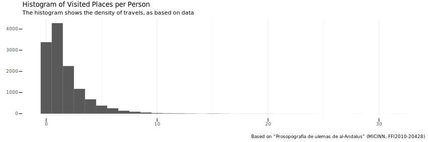


### 5. Wordclouds - Homework

- ! you cannot annotate these wordclouds in a similar manner.
- create wordclouds of professions:
	- for the entire al-Andalus;
	- for top ten cities;

The solution is for the entire al-Andalus. Wordclouds for the top 10 cities should be easy to get using the main solution. This is actually a great case where you can give a visual comparison to the professional profiles of the cities. (Keep in mind that there is an issue with these graphs here — you might remember that there are several different ways with which ‘jurists’ are described; the data needs to be normalized.)

```r

# count people by professions
actividadWordcloud <- PUA$personaje_actividad %>%
  select(idActividad, idPersonaje) %>%
  left_join(personajeLite, by = c("idPersonaje" = "idPersonaje")) %>%
  select(-nombreA, -nacimiento, -edad) %>%
  group_by(idActividad) %>%
  summarize(total = n()) %>%
  arrange(desc(total)) %>%
  left_join(actividadNombres)
```

Now, the graphs:

```R
# ARABIC WORDCLOUD
library(ragg)

set.seed(786) # for replication

agg_png(file = "PUAR_wordcloud_professions_arabe.png",
    width = 10, height = 10, res = 300, units = "cm")

wordcloud(words = actividadWordcloud$nombre, freq = actividadWordcloud$total,
          min.freq = 2, max.words = 200, random.order = FALSE, rot.per = 0, 
          colors=brewer.pal(8, "Dark2"), family = "Amiri")

invisible(dev.off())
```


```R
# SPANISH WORDCLOUD
library(ragg)

set.seed(786) # for replication

agg_png(file = "PUAR_wordcloud_professions_castellano.png",
    width = 10, height = 10, res = 300, units = "cm")

wordcloud(words = actividadWordcloud$nombre_castellano, freq = actividadWordcloud$total,
          min.freq = 2, max.words = 200, random.order = FALSE, rot.per = 0, 
          colors=brewer.pal(8, "Dark2"), family = "Amiri")

invisible(dev.off())
```

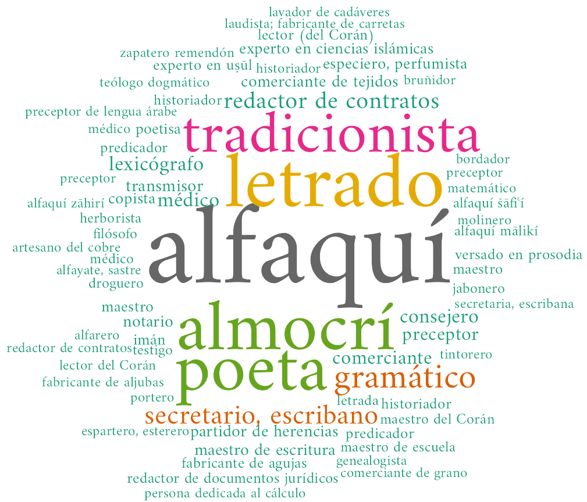

**Note**: There is one important thing to keep in mind about wordclouds. When you save them into a file, make sure to make the graph big enough (width, height), otherwise some words on the sides may be dropped without you knowing. It is safer to save a very large graph and then manually trim it. Below is an example of a wordcloud whose size was too small to fit all words (`width = 5, height = 5`).


<!--chapter:end:080-Class08.Rmd-->

# Overview of the PUA dataset

The original data has been collected into a MySQL database. The researchers who have been creating this data in the course of some thirty to forty years shared their MySQL file. This file is 7,7 Mb and, in fact, can be open in a text editor:

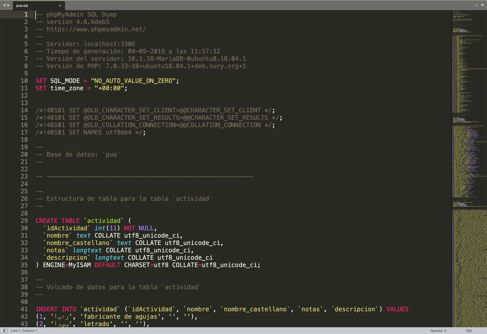

The best way to extract data from this file is to connect to it as a database and extract all the tables into separate files.


## The initial SQL Database: extraction of tables

**Note:** you do not really need to worry much about the following steps, as you will have access to the extracted data. However, it is helpful at least to have some idea about steps that might be necessary when your initial data is not provided in the format that you need. And in my experience, you never get data in the format that you need.  

The best way to proceed it to extract the tables from the MySQL database file and save them as separate files. Unfortunately, we cannot extract the model of the database from the MySQL file, since connections between tables have not been encoded explicitly. This means that we will have to look closely at all the tables and recreate those connections (database model/structure).

But first, we need to extract the tables. The following recipe is for Mac; the installation and starting of MySQL will be different for Windows, but `mysql` commands should be exactly the same.

- make sure that MySQL is installed: `brew info mysql`
- if not: `brew install mysql`
- next, start mysql server: `mysql.server start`
- next, start mysql (in the folder with the database file): `mysql -u root`
- (the server can be stopped: `mysql.server stop`)

The following commands should be the same on all systems, since these are `mysql` commands. So, run these commands to create a database. You only need to run these commands once. Later, the `SHOW DATABASES` command will show all created databases, including the PUA database.

```
mysql> CREATE DATABASE 'pua';
mysql> CREATE USER 'user_pua'@'localhost' IDENTIFIED BY 'pua_pass';
mysql> GRANT SELECT ON pua.* TO 'user_pua'@'localhost';
mysql> USE pua;
mysql> SOURCE file.sql;
mysql> SHOW TABLES;
mysql> EXIT;
```

a few more commands:

- `SHOW DATABASES;` :: will show all databases;
- `DROP nameOfDB;` :: will remove a database;

After this it should be possible to connect to the database from R;

## Extracting tables with R

You will need to set working directory to the folder where mysql file is. Also, create a subfolder `/tables_new/`—this is where all the tables will be exported.

This script connects to a local mysql database, retrieves all tables, and exports them as TSV files in the `tables_new` directory.

```r
library(RMariaDB)
library(dbplyr)
library(dplyr)

# provide working directory --- where the pua.sql file is
workingDirectory <- "path_to_where_you_want_to_save_tables"
setwd(workingDirectory)

con <- DBI::dbConnect(RMariaDB::MariaDB(),
                      dbname = 'pua',
                      host = 'localhost',
                      port = 3306,
                      user = 'user_pua',
                      password = 'pua_pass')

tables <- DBI::dbListTables(con)
str(tables)

library(tidyverse)
library(readr)

folderForTables <- "tables_extracted"
dir.create(folderForTables)

for(t in tables) {
  pathForTable <- file.path(folderForTables, paste0(t, ".tsv"))
  tbl(con, t) %>% 
    collect() %>%
    write_delim(pathForTable, delim = "\t")
}

DBI::dbDisconnect(con)

```

The steps can be explained in the following manner:

This script is written in R and is used to connect to a MariaDB database, extract data from the tables within that database, and then write each table to a separate .tsv file in a specified directory. Here's a detailed breakdown of the code:

1. Libraries are loaded using `library()`. RMariaDB, dbplyr, and dplyr are packages that provide a connection to a MariaDB database and operations on the database. tidyverse is a package that includes several tools for data manipulation, and readr is a package used for reading rectangular data.

```R
library(RMariaDB)
library(dbplyr)
library(dplyr)
library(tidyverse)
library(readr)
```

2. A working directory is set. This should be the path where you want to save your .tsv files.

```R
workingDirectory <- "path_to_where_you_want_to_save_tables"
setwd(workingDirectory)

```

3. A connection to a MariaDB database is established using `DBI::dbConnect()`. The dbname, host, port, user, and password are all parameters to establish the connection.

```R
con <- DBI::dbConnect(RMariaDB::MariaDB(),
                      dbname = 'pua',
                      host = 'localhost',
                      port = 3306,
                      user = 'user_pua',
                      password = 'pua_pass')
```

4. The list of tables in the connected database is retrieved using `DBI::dbListTables(con)`, and then the structure of this object is printed to the console using `str(tables)`.

```R
tables <- DBI::dbListTables(con)
str(tables)
```

5. A directory is created in the working directory for saving the .tsv files. If the directory already exists, `dir.create()` will return a warning.

```R
folderForTables <- "tables_extracted"
dir.create(folderForTables)
```

6. A loop is created to iterate over each table in the `tables` list. Inside the loop, each table is read from the database connection using `tbl(con, t)`. The table is collected into memory using `collect()`, and then written to a .tsv file in the `folderForTables` directory using `write_delim()`. The filename for each .tsv file is the name of the table with `.tsv` appended to it.

```R
for(t in tables) {
  pathForTable <- file.path(folderForTables, paste0(t, ".tsv"))
  tbl(con, t) %>% 
    collect() %>%
    write_delim(pathForTable, delim = "\t")
}
```

7. Finally, the connection to the database is closed using `DBI::dbDisconnect(con)`.

```R
DBI::dbDisconnect(con)
```

Upon completion of this script, we will have all the tables extracted into a subfolder. The files are names after the names of the tables in the original database file (i.e., they are in Spanish). This code can be useful for backing up a database into a more portable and human-readable format, or for processing the data from the database using R's powerful data analysis and manipulation tools.  

### Looking at the data

As was noted above, we do not have the model of the database in the database file, which makes it a bit more complicated. Essentially, we need to look at the tables and figure out how are they connected. This is crucial, since we need to know what is connected to what. Luckily, we can find out that rather easily by identifying the same columns in different tables. As a result, we have the structure that we looked at in the previous lesson with:

1. the main table (`personaje`);
2. connection tables (`personaje_x`);
3. entities tables (`x`);
4. metadata tables;

### Reorganization: Conceptual Model For Your Data

The model that you should choose depends significantly on what exactly you are doing. When the data is already collected and you are just reorganizing it for more efficiency, a much wider variety of approaches can be used. This is the case when the use of a relational database will be fully justified and very easy to implement, since the data is already collected—the most difficult and time-consuming part is already done.

It is a completely different case when you are only beginning to collect your data. In cases when your objects have a very clear set of attributes and information on all or most of those attributes is available or relatively easily acquirable, the reliance on relational databases could be quite efficient. The cases of such objects include actual physical objects and the set of their attributes include descriptions of their physical properties. For example, editions, manuscripts, etc.

In cases, when the set of attributed is not clear, relational databases will be significantly less efficient. Biographical/prosopographical data is one of such cases, mainly for the following reason. It is practically impossible to know beforehand what attributes will be of actual relevance; even though one may think that there is a clear set of attributes, the actual data from the sources may be skewed in a variety of ways not providing one with relevant data on most attributes. On the other hand, working with a particular source one inevitably discovers attributes that were not included in the initial thinking about a given problem, but happened to be important for thinking about specific groups of people. Relational databases are rather inflexible for modifications and would require significant re-design to be realigned with new realities of research.


In the previous lesson, I have mentioned the `subject-predicate-object` model, with which you can describe pretty much everything that you can describe with a subject-predicate-object sentence. The traditional `SPO` model, however, is not exactly perfect for our purposes, especially if we want to record conflicting information from different sources. For this purpose a somewhat different model has been proposed by Tara Andrews, the Professor of Digital Humanities at the University of Vienna. since she is also a historian, working on the medieval Armenian history, she is interested in recording both the provenance, i.e. where the information is taken from, and the authority, i.e. who is making this assertion—since even the same information in the same source may be read differently by two different scholars. To solve this issue, she proposed the structured assertion model (`STAR`), that you see on the right. Thus, with this model, we would have a five column table, instead of a three-column one.

Let's take a look at how STAR method is used in the OpenITI project. We can use the following piece of information as an example of how biographical data can be encoded using STAR method in plain text format:

>  al-Ḏahabī was a teacher (*tafaqqaha ʿalay-hi*) of al-Subkī in Damascus from 699 till 715 AH. (Source: a made-up example with the reference code `220607114503`)

Now, in order to do the actual encoding we use an ordered structure, URIs, and patterned statements. The ordered structure means that the category of data is defines by its location in our encoding statement (for example, the first element is always the subject, the second—always the predicate, etc.). The patterned statement means that we encode certain types of data with a sequence of characters that can be described with generalized patterns (`regular expressions`), which can later be used to both extract and interpret encoded data. The end result may look like the following statement, where five elements are connected with `@`, and details on all the coded information being available/collected in additional files (*linked local data*):

> `[0748Dhahabi@]teacherOf_tafaqqahaCalayhi@0771Subki;DIMASHQ_363E335N_S;699_XXX_XX-715_XXX_XX@MGR@MacrufDahabi1976s_1_345`


- The first element is the *subject*, which is recorded using the Author URI—`0748Dhahabi`; in order to simplify things, we most commonly omit the subject, since it is implied by the name of the file in which metadata is collected (more on this in the discussion of YML files with metadata);
- The second element is our *predicate*—`teacherOf_tafaqqahaCalayhi`. We use unrestricted vocabulary, since we are still at the research stage and this appears to be more productive to explore possibilities; the normalization of predicates will take place periodically during the revisions of metadata. As you may have noticed, there is a pattern in the predicate—there are two parts connected with the “underscore”, which allows us to record the predicate with the reference to its original form in Arabic (although, one can also use simply `teacherOf`, if no Arabic equivalent is available). This kind of encoding is particularly important for developing classification schemes, where one has to keep track of the original vocabulary (for example, relationships among books—different types of abridgments, continuations, commentaries, etc.). <!--Add a visualization?--> 
- The third element is our objects, of which we have three: 1) the “direct object”, which is a person also encoded with the Author URI (`771Subki`)—all individuals are to be encoded using such URIs;[^2206100431] 2) the “object of place”, which is encoded with the URI from an affiliated project al-Ṯurayyā (<https://althurayya.github.io/>)—all geographical entities are to be encoded with such URIs; 3) the “object of time”, which is encoded following a specific pattern `YYYY_MMM_DD` where sub-elements are also divided with an underscore. From this pattern we know that the first sub-element is the year, the second—the month, and the third—the day. In case, any of sub-elements are unknown, they are encoded with `X`s. For the encoding of a period of time, two date statements are connected with “-” (hyphen).
- The fourth element is authority, encoded with the pattern `AUTH_ContributorURI`, with `ContributorURIs` recorded in a separate file that contains additional information on all contributors to the project.
- The last, fifth element contains references, which can be encoded in a variety of ways. Here, we use `MacrufDahabi1976s_1_345`, which consists of three elements separated with `_`.   The first element is the `bibTeX` code of a publication (with the detailed information on the edition stored in a bibTex file with all the used bibliography), while the other two are the volume and page number. (**Note**: this reference is not real.)

**Note**: even if some elements seem complicated for you at the moment because you do not have enough skills to process them and convert them into something more useful, you should always strive for consistency in how you encode your data—if you want to be able to analyze that data computationally. For example, the reference `MacrufDahabi1976s_1_345` may seem weird, but it is structurally solid: there are three elements, separated with `_` and it is very easy to break this coded piece of information into distinct elements. You already know how to do that with R, where, using `tidyverse` approach (more specifically, functions from the family of `stringr`) you can break such references into three separate columns: reference, volume, page(s). Even if you do not know now how to do that, it is always important to plan ahead and focus on encoding your data in a consistent manner.

[^2206100431]: We are primarily interested in the relationships within the OpenITI projects, i.e., among works and among authors, but the coverage can be easily expanded to include non-authors.

Now, let’s talk a bit about how to practically implement these models. The STAR model is meant to fit into existing standards, like CIDOC-CRM or/and FRBR-OO (see, <https://cidoc-crm.org/collaborations>), and implement Linked Open Data (LOD) approach, i.e. linking into existing online datasets. Since we are focusing more on Linked Local Data (LLD) approach, we also want a more pragmatic—i.e., simple—implementation of the STAR model (CIDOC-CRM is a rather complicated standard, see below for an example).

|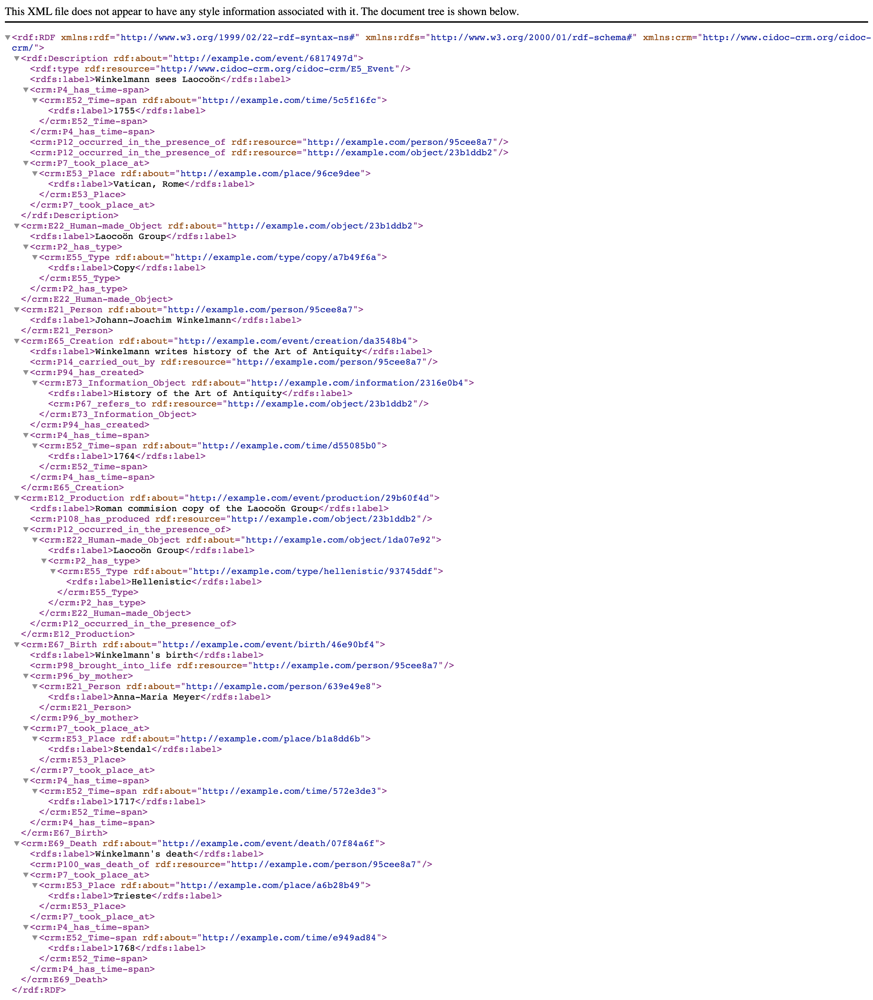|
|:-:|
|CIDOC-CRM Encoding Example in RDF XML (`*.xml`).<br> Source: <https://www.cidoc-crm.org/sites/default/files/Winkelmann_time_label_1.xml>|

In fact, depending on your sources and your final goals, you can opt for one of the following three variations.

1. As we discussed the simplest variation will be the `S-P-O` model, with `SUBJECT`, `PREDICATE`, and `OBJECT`. (As you can see, the `SUBJECT` is repeated many times, so, technically, one can simplify the data encoding even further, by keeping separate files for each person, and then having only `PREDICATE` and `OBJECT` columns—the `SUBJECT` will be encoded in the name of the file.):

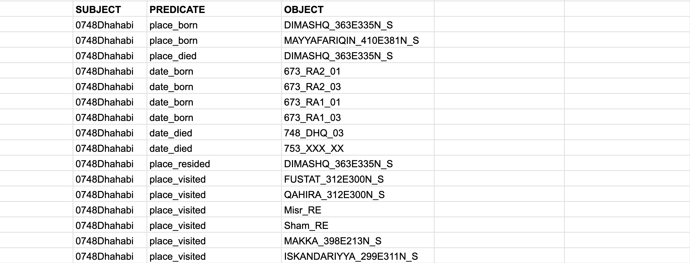

2. If your assertions are simple (i.e., they have single objects), you can use a “simple” STAR model, where we add `PROVENANCE` and `AUTHORITY`:

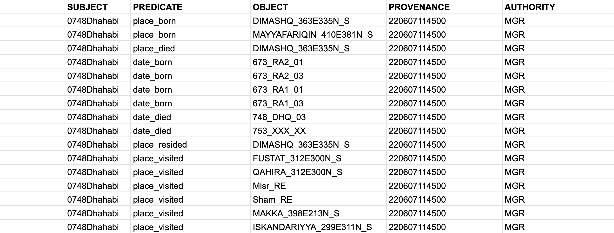

3. If your assertions have multiple objects, then we would need a “robust”  STAR model with an additional column for `AssertionID`. The complex event has id `17`, where we describe that “al-Ḏahabī was a teacher (*tafaqqaha ʿalay-hi*) of al-Subkī in Damascus from 699 till 715 AH. (Source: a made-up example with the reference code `220607114503`)”:

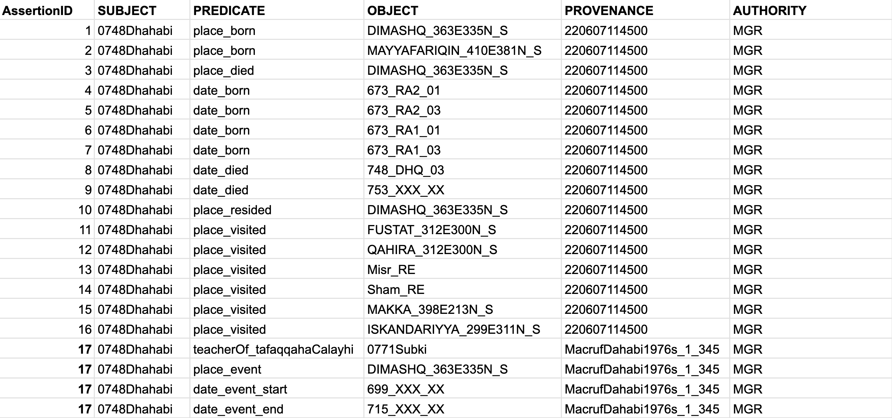

**Note:** Please, watch Tara Andrews’ presentation “How Might We Make Data Collections More Useful for Historians?”  (<https://www.youtube.com/watch?v=JcBdthObApY>) on the STAR model.

**The advantages of such models:**

- they are *symmetrical*, i.e. you always know which column contains which data. This means you can easily manipulate this data in R.
	- when you load this kind of data into R, you can recursively query your dataset. For example, if you want to find people who died in, say, Qurṭubaŧ, you can filter `OBJECT` to find all instances of `QURTUBA_047W379N_S`; then limit your results to `PREDICATE` == `place_died`. Then you would get all the unique IDs from `SUBJECT`. Then you will filter  `date_died` (in `PREDICATE`) by the unique IDs that you got in the previous step. And now you have all the death dates of people who died in Qurṭubaŧ (don't forget to pick a single date from `date_died` data!).
- they are *expandable*, since you can easily encode new types of information by simply introducing new predicates, and without changing the main structure of your data.
	- Please, note how predicates are named: a broader category is followed by a subcategory, separated with `_`; This will allow you to easily pull out dates, places, etc.
	- Keep in mind that there is no single correct way of modeling your predicates. this is something that you should periodically revise and improve. It helps to keep a visual scheme of your predicates and playing around with it, until you arrive to some stable scheme that allows you to encode everything you need.
- they allow to *implement the Linked Data approach locally* (i.e., Linked Local Data):
	- for example, for places, I used settlement IDs from the al-Ṯurayyā Gazetteer (<https://althurayya.github.io/>); you can download and keep al-Ṯurayyā data in a TSV file and you can get coordinates and settlement classifications from this file easily. If some places are missing, you can expand the original al-Ṯurayyā dataset by adding new places into it (and assigning new IDs following the same pattern, but perhaps adding some suffix that would indicate that this place was not originally in al-Ṯurayyā).
	- for authorities, if you have many of those, you can also keep a file with all the additional descriptions that would be connected to the IDs used in the main table.
	- similarly for predicates (`PREDICATE`) and references (`PROVENANCE`), as well as other columns, as need arises.
	- you will want to keep a master document where you would describe all other conventions that you adopt for your research project (for example, date encoding.)


### Improving PUA Data

After close examination one is likely to discover that PUA data will benefit from some modifications that will allow to get much more out of it during different analyses. These improvements can be broken down into three categories: 

- cosmetic modifications do not change any data, but rather transform the existing information into different representations;
- normalizing modifications are meant to do bring a bit more order and consistency to the used categories;
- modeling modifications are meant to introduce meta categories that would allow to group existing categories into larger analytical categories, thus allowing us to get larger sub-groups of data and through that more meaningful results. While cosmetic and normalizing modifications are meant to improve the quality of structured and normalized data, modeling modifications are intended as an additional research tool that may have multiple alternative and/or complementary categorizations, each meant to address specific research questions.  

Detailed descriptions:

- *cosmetic* modifications:
	- automatic Arabic name transcription, extrapolating from transcribed examples;
	- translation of data from Spanish to English;
- *normalizing* modifications:
	- cleaning of data tables:
		- merging duplicate items: toponyms, *nisbaŧ*s, offices, activities, etc.;
			- conflating records on the same toponyms;
			- conflating gendered descriptions: these must be split into two --- explicit information on gender, that should be attached to persons, and conflating gendered descriptors (like, for example, *adīb* and *adībaŧ* must be conflated into *adīb*, and gendered information moved to personal descriptions)
		- grouping closely related items:
			- particularly, for toponyms, where too many different levels are used; most commonly, toponyms like city quarters, markets, etc. must be conflated into the cities they belong to;
		- refactoring *nisbaŧ*s and dates of offices:
			- geographical *nisbaŧ*s should be converted into places, with a new type of relationship (for example, we can classify it as *onomastic*); this will allow to include more people into geospatial analyses;
				- some *nisbaŧ*s will cause problems (like al-Ṭarābulusī, which may refers to two different cities);
			- offices: there are occasional dates on when one got an office; there is possibility that those dates could be moved into personal information, which will be useful especially when we do not have birth/death dates for that person. These dates must be classified as *date_of_office*, of something like that.
		- main strategy:
			- categories must be analyzed quantitatively and the priority must be given to most frequent ones, while those with very low frequencies might be excluded altogether (for example, those with frequency 1). 
- *modeling* modifications:
	- introducing meta categories for analytical purposes:
		- toponyms: grouped into larger geographical entities as provinces, districts, etc. (at the moment we only have classification into Andalusian and non-Andalusian locations);
	- `actividad` can be divided into different “industries”, “social spheres”, etc.
	- `cargo` can be grouped into “social spheres”, etc.
	- essentially, every categorical table must be reviewed from this perspective. 


<!--

### From the previous lesson

#### PUA [Tidy] Data:

> perhaps this should be move to the first lesson that deals with PUA --- something like "Tiding PUA Data"

Multiple extensive tables can and should be converted into a simpler structure (following: @RomanovAlgorithmic2017, <https://www.journals.uchicago.edu/doi/full/10.1086/693970>)

- **ID of a biographee**: these must be unique across the dataset;
- **category**: any number of categories can be easily accommodated;
- **value**: a specific value for the selected category; any number of values for the same category can be accommodated;

This tripartite model is particularly convenient and efficient for encoding objects whose data may vary significantly in richness. For example, some biographies may have only two or three values for encoding, while others may have dozens of values. If we use a more conventional “symmetrical” format—a table where we have a column for each category of data to be encoded, we will end up with lots of empty cells, and, at the same time, we will have difficulties in cases when we have multiple values for the same category (in the case of biographies, a person may often have multiple geographical *nisbaŧ*s). Here we can take a look at the main original data table of the PUA --- and count how many cells are empty and how many cells include multiple values (i.e., not tidy).

**Note:** not all tables must be merged together; quite the opposite, it makes sense to keep some data in separate tables and merge with the main data table only when necessary. For example, it makes sense to keep the following data separately (it will make it also easier to update and extend, especially when it has to be done manually):

- additional information on toponyms;
- additional information on professions;
- additional information on sources;

Essentially, most of the tables that were kept separately in the original dataset should remain isolated; only the main prosopographical table should be converted into this tripartite model.

-->

<!--chapter:end:090-Class09.Rmd-->

# Understanding Geographical Maps


## Creating Base Maps

A base map is the foundational layer of your map with necessary contextual information. It provides context for additional layers---those with analytical information---that are added on top of the base map. Most commonly, base maps provide location references for features that do not change often like shorelines, boundaries, rivers, lakes, roads.

<!--

-A base map is a layer with geographic information that serves as a background. A base map provides context for additional layers that are overlaid on top of the base map. Base maps usually provide location references for features that do not change often like boundaries, rivers, lakes, roads, and highways. Even on base maps, these different categories of information are in layers. Usually a base map contains this basic data, and then extra layers with a particular theme, or from a particular discipline, are overlaid on the base map layers for the sake of analysis. (<https://rdkb.sgrc.selkirk.ca/Help/Content/Client_APIs/SV_User/SVU_AboutBaseMaps.htm>)

- A basemap provides a user with context for a map. You can add information to a basemap by overlaying other information on top of it. (<https://nhd.usgs.gov/userGuide/Robohelpfiles/NHD_User_Guide/Interactive_Tutorials/Module_1/Basemaps_Overlays/Popups/What_is_a_Basemap_.htm>)

-->

<!--
- ~~Projections; examples; <https://thetruesize.com/>~~
- ~~Understanding main map components: layers of points, lines, polygons and rasters~~
- Construct a base map, step by step.
  - adding main layers
  - customizing map with additional goodies
  - saving maps
- Examples of maps:
  - Europe
  - Islamic world provinces
- PS: Maps as Art:
  - Vienna
-->


## Core concepts and their practical implementations

### Projection Issues

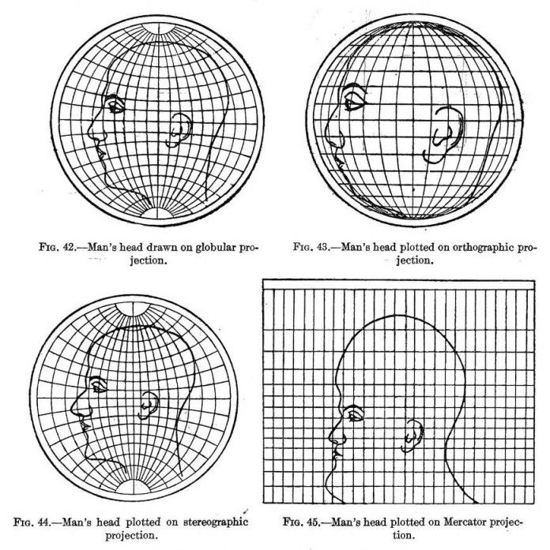

<!--

-->

See, <https://en.wikipedia.org/wiki/List_of_map_projections>.

Website <https://thetruesize.com/> is a nice tool for demonstrating how projection affects our perceprion of reality. On te following two screenshots you can see how the "sizes" of Russia (~17,1 mln km^2^) and China (c. 9,6 mln. km^2^) change when they change places.

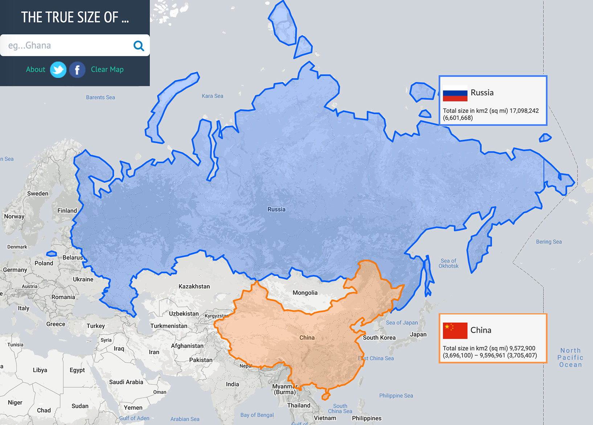


### A Digital Map: Layers of Goodness


* Layers:
	* Analytical Layer
	* Our Data
	* Annotation/Legend
* Social Geography
	* Political Boundaries
	* Settlements, etc.
* Physical Geography
	* Types of surface (*raster*)
	* Continents / Coastal Line
	* Elevation profile (*raster*)
	* Rivers, Lakes, etc.
* Base Layer: Graticule

## Main Types of Data: Points, Lines, Polygons


**SOURCE**: There are 3 types of vector objects: points, lines or polygons. Each object type has a different structure. Image Source: Colin Williams (NEON), via: [www.earthdatascience.org](https://www.earthdatascience.org/courses/earth-analytics/spatial-data-r/intro-vector-data-r/)

* Analytical Layers:

	* Our Data
		* Points:
			* item1, x**[1]**, point(lat, lon)**[2]**; item2, x**[1]**, point(lat, lon)**[2]**; item3, x**[1]**, point(lat, lon)**[2]**; ... itemX, x**[1]**, point(lat, lon)**[2]**;
		* Lines:
			* line1, x**[1]**, {from(lat, lon)**[2]**, to(lat, lon); from(lat, lon)**[2]**, to(lat, lon); from(lat, lon)**[2]**, to(lat, lon); ... from(lat, lon)**[2]**, to(lat, lon);}**[2]** ... lineX ...
		* Polygons:
			* polygon1, x, area(lat1, lon1; lat2, lon2; ... latX, lonX; ... lat1, lon1)**[2]** ... polygonX ...

	* Annotation/Legend

**[1]** where x is a categorical parameter; **[2]** lat/lon: decimal coordinates (not DMS)

## Base maps

Base map is essentially the foundation map on which you will be adding data that you want to analyze. It is good to have the base map put together and ready for reuse.

For a detailed walkthrough for creating a base map, see <https://maximromanov.github.io/rgis_univie2021/l08-gis-ii.html>. Here we will use a shortened version.

### New libraries

```R
library(tidyverse)

library(sf)
library(rnaturalearth)
library(rnaturalearthdata)

library(ggspatial)
library(ggrepel)
```

#### Geospatial layers

First, download necessary geospatial data. `world` is loaded from `rnaturalearth` libraries, while the other three files are preprocessed and prepared by me. Download them and place them into your course folder according to the paths given below!

```R
world <- ne_countries(scale = "medium", returnclass = "sf")
rivers_df <- readRDS("./Data/map_objects/rivers_df.rds")
aral_sea_df <- readRDS("./Data/map_objects/aral_sea_df.rds")
routes_df <- readRDS("./Data/map_objects/routes_df.rds")
```

and, let's load the PUA data (still working with the old data):

```R
PUA <- readRDS("./Data/PUA_processed/PUA_allDataTables_asList.rds")
```

### Compiling the base map

With the following code we can generate our first base map. you can adjust a number of parameters to change the look of your map. The main ones are: colors and map limits.

```R
waterColor <- "lightsteelblue2" #
roadColor  <- "grey90"
xlim <- c(-12,80); ylim <- c(10,50)

ggplot(data = world) +
  geom_sf(fill="white", color="white") +
  # routes from Althurayya
  geom_path(data = routes_df,aes(x = long, y = lat, group = group), color = roadColor, linewidth = .2) +
  # rivers and the aral sea
  geom_path(data = rivers_df,aes(x = long, y = lat, group = group), color = waterColor, linewidth = .2) +
  geom_polygon(data = aral_sea_df,aes(x = long, y = lat, group = group), color = waterColor, fill = waterColor, linewidth = .2) +
  # map limits and theme
  coord_sf(xlim = xlim, ylim = ylim, expand = FALSE) +
  theme(panel.background = element_rect(fill = waterColor))
```

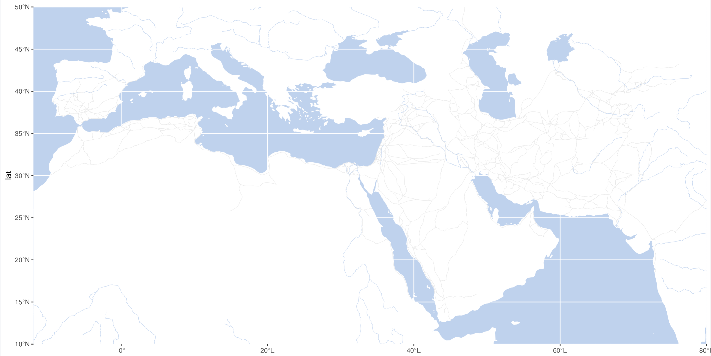

We can add a scale bar. This we can do with the library `ggspatial` (location parameters are as follows: `tl`, `tr`, `bl` and `br`—for top left, top right, bottom left, and bottom right).

```R
ggplot(data = world) +
  geom_sf(fill="white", color="white") +
  # routes from Althurayya
  geom_path(data = routes_df,aes(x = long, y = lat, group = group), color = roadColor, linewidth = .2) +
  # rivers and the aral sea
  geom_path(data = rivers_df,aes(x = long, y = lat, group = group), color = waterColor, linewidth = .2) +
  geom_polygon(data = aral_sea_df,aes(x = long, y = lat, group = group), color = waterColor, fill = waterColor, linewidth = .2) +
  # annotation scale
  annotation_scale(location = "bl", width_hint = 0.25) +
  annotation_north_arrow(location = "bl", which_north = "true", pad_x = unit(0.0, "in"), pad_y = unit(0.2, "in"), style = north_arrow_fancy_orienteering) +  
  # map limits and theme
  coord_sf(xlim = xlim, ylim = ylim, expand = FALSE) +
  theme(panel.background = element_rect(fill = waterColor), axis.title.y=element_blank(), axis.title.x=element_blank())
```

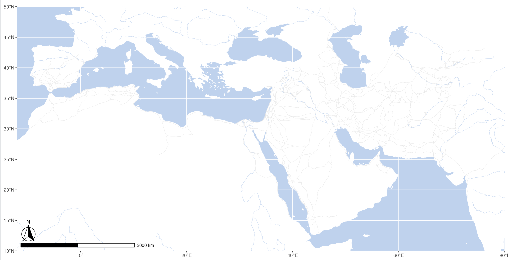

For convenience, we can store the main layers into variables:

```R
baseplot <- ggplot(data = world) +
  geom_sf(fill="white", color="white") +
  # routes from Althurayya
  geom_path(data = routes_df,aes(x = long, y = lat, group = group), color = roadColor, linewidth = .2) +
  # rivers and the aral sea
  geom_path(data = rivers_df,aes(x = long, y = lat, group = group), color = waterColor, size = .2) +
  geom_polygon(data = aral_sea_df,aes(x = long, y = lat, group = group), color = waterColor, fill = waterColor, size = .2) +
  # annotation scale
  annotation_scale(location = "bl", width_hint = 0.25) +
  annotation_north_arrow(location = "bl", which_north = "true", pad_x = unit(0.0, "in"), pad_y = unit(0.2, "in"), style = north_arrow_fancy_orienteering) +  
  # map limits and theme
  coord_sf(xlim = xlim, ylim = ylim, expand = FALSE)

themeParameters <- theme(panel.background = element_rect(fill = waterColor), axis.title.y=element_blank(), axis.title.x=element_blank(), panel.grid.major = element_line(color = waterColor, linetype = "dotted", linewidth = 0.5))
```

And then, call `baseplot + themeParameters` to print out the map. We can add a layer of additional data between these two layers to visualize some our our research data.

### Adding data

We can add some of the PUA data on our base map to get the final view. But first we may want to also refocus our on al-Andalus, which can be done by changing xlim and ylim parameters. 

```R
xlimAnd=c(-10,5); ylimAnd=c(35,45)

baseplotAnd <- ggplot(data = world) +
  geom_sf(fill="white", color="white") +
  # routes from Althurayya
  geom_path(data = routes_df,aes(x = long, y = lat, group = group), color = roadColor, linewidth = .2) +
  # rivers and the aral sea
  geom_path(data = rivers_df,aes(x = long, y = lat, group = group), color = waterColor, size = .2) +
  geom_polygon(data = aral_sea_df,aes(x = long, y = lat, group = group), color = waterColor, fill = waterColor, size = .2) +
  # annotation scale
  annotation_scale(location = "bl", width_hint = 0.25) +
  annotation_north_arrow(location = "bl", which_north = "true", pad_x = unit(0.0, "in"), pad_y = unit(0.2, "in"), style = north_arrow_fancy_orienteering) +  
  # map limits and theme
  coord_sf(xlim = xlimAnd, ylim = ylimAnd, expand = FALSE)
```


Let's try to map all the Andalusian locations:

```R
cities <- PUA$lugar %>%
  filter(FLAG_alandalus == 1)

graph01 <- baseplot + 
  geom_point(data = cities, aes(x=lng, y=lat), alpha = 0.5, col="grey", size = 0.5) +
  scale_size(range=c(0.01, 2)) +
  geom_text_repel(data = cities, aes(x=lng, y=lat, label = nombre_castellano), force = 2, segment.alpha = 0) + 
  themeParameters

graph01
```

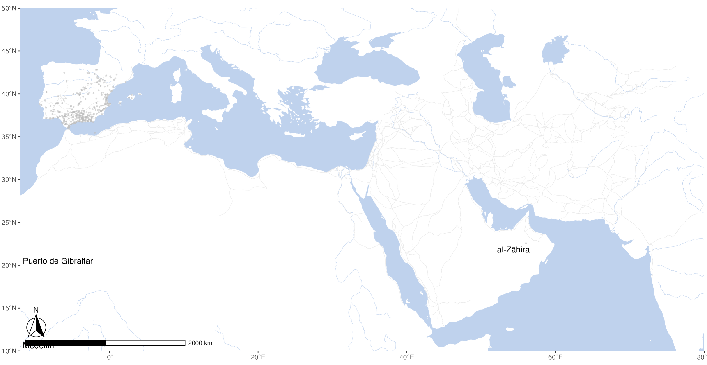

We can see here that PUA data has some more flaws, as some Andalusian locations are not in al-Andalus. Something that needs to be fixed (Cova & Ensar).

For now we can implement some quick fix:

- filter our cities by coordinates;
- focus on high frequency locations; (not using fixed data yet!)

```R
citiesTop <- PUA$personaje_lugar %>%
  group_by(idLugar) %>%
  summarize(count = n()) %>%
  left_join(cities) %>%
  filter(lat >= ylimAnd[1] & lat <= ylimAnd[2]) %>%
  filter(lng >= xlimAnd[1] & lng <= xlimAnd[2]) %>%
  mutate(label = ifelse(count > 100, nombre_castellano, NA))

graph02 <- baseplotAnd + 
  geom_point(data = citiesTop, aes(x=lng, y=lat, size = count), alpha = 0.5, col="grey") +
  scale_size(range=c(0.01, 10)) +
  geom_text_repel(data = citiesTop, aes(x=lng, y=lat, label = label), size = 4, force = 2, segment.alpha = 0) + 
  themeParameters

graph02
```

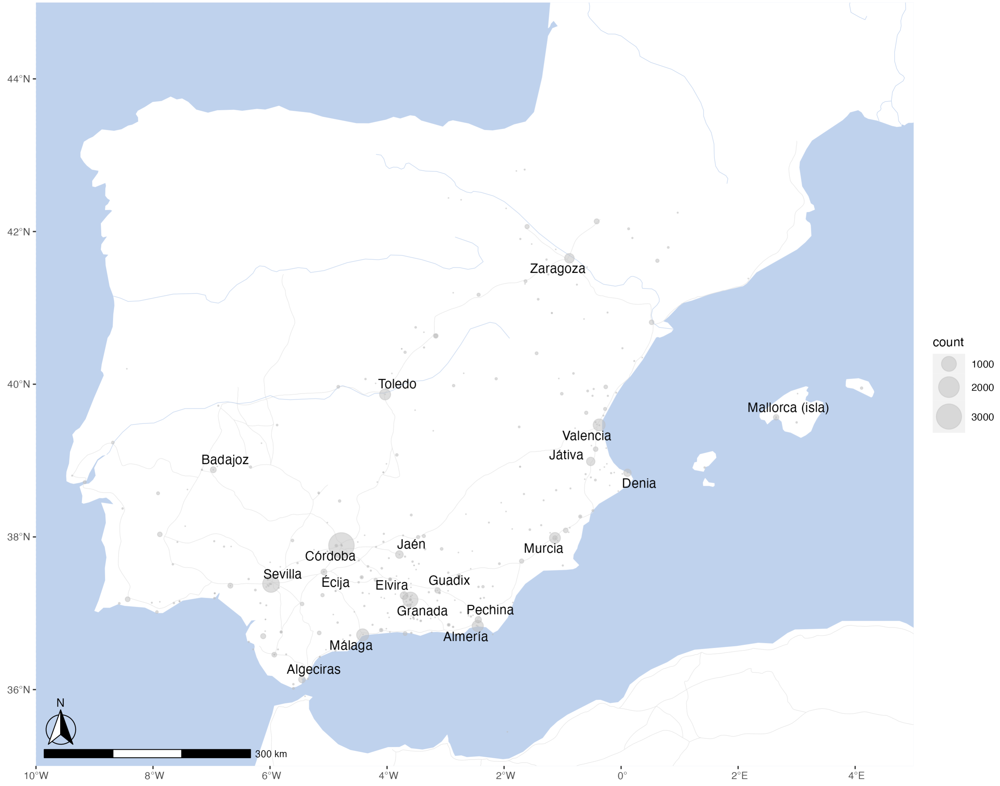

You can save maps in the following manner. Like with graphs before, you may need to play around with sizing to get the best possible view for your map.

```R
ggsave("./Classes/Class_09/PUAR_Cl09_Map01.png", plot=graph02, width = 420, height = 297, units = "mm", dpi = "retina")
ggsave("./Classes/Class_09/PUAR_Cl09_Map01.svg", plot=graph02, width = 10, height = 10, units = "in")
```

## Reusable Base Map for al-Andalus

We can also save our base map, which we can then quickly re-load whenever we need it. In this case we need to use `.RData` format, rather than `.RDS`. 

```{r eval=FALSE, warning=FALSE, include=TRUE}

world <- ne_countries(scale = "medium", returnclass = "sf")
rivers_df <- readRDS("./data/map_objects/rivers_df.rds")
aral_sea_df <- readRDS("./data/map_objects/aral_sea_df.rds")
routes_df <- readRDS("./data/map_objects/routes_df.rds")

# focus on al-Andalus: we simply need to change xlim and ylim parameters:
xlimAnd=c(-10,5); ylimAnd=c(35,44)

base_plot_andalus <- ggplot(data = world) +
  geom_sf(fill="white", color="white") +
  # routes from Althurayya
  geom_path(data = routes_df,aes(x = long, y = lat, group = group),
            color = roadColor, linewidth = .2) +
  # rivers and the aral sea
  geom_path(data = rivers_df,aes(x = long, y = lat, group = group),
            color = waterColor, linewidth = .2) +
  geom_polygon(data = aral_sea_df,aes(x = long, y = lat, group = group),
               color = waterColor, fill = waterColor, size = .2) +
  # annotation scale
  annotation_scale(location = "bl", width_hint = 0.25) +
  annotation_north_arrow(location = "bl", which_north = "true",
                         pad_x = unit(0.0, "in"), pad_y = unit(0.2, "in"),
                         style = north_arrow_fancy_orienteering) +
  # map limits and theme
  coord_sf(xlim = xlimAnd, ylim = ylimAnd, expand = FALSE)

save(base_plot_andalus, file = "./data/basemap/base_plot_andalus.RData")


# NOW TRY THEMED
waterColor <- "lightsteelblue2" #
roadColor  <- "grey90"

themeParameters <- theme(panel.background = element_rect(fill = waterColor),
                         axis.title.y=element_blank(),
                         axis.title.x=element_blank(),
                         panel.grid.major = element_line(color = waterColor,
                                                         linetype = "dotted",
                                                         linewidth = 0.5))

base_plot_andalus_themed <- base_plot_andalus + themeParameters
save(base_plot_andalus_themed, file = "./data/basemap/base_plot_andalus_themed.RData")

```

A base map saved in such a way can be reloaded in the following manner:

```{r message=FALSE, warning=FALSE}
load("./data/basemap/base_plot_andalus_themed.RData")
base_plot_andalus_themed
```

## Raster base maps

There are other options for base maps that rely on raster data. Since practically all raster data is moderns, we do not have much use for it.
Yet, if you work on maps of cities, modern data (both raster and vector) may be quite handy in order to map old entities into the modern realities of cities.
You can check how to use that here: <https://maximromanov.github.io/rgis_univie2021/l08-gis-ii.html>.

## Homework

Try to map different subsets of data (go back to the examples of previous lessons):

- for example, jurists vs some other group;
- use Arabic names for settlements;
- for those who are up for a challenge, check <https://maximromanov.github.io/rgis_univie2021/l09-gis-iii.html>
	- try to create maps by periods as explained in the lesson;
	- try to create an animated map; 

**NB**: I am not throwing you under the bus here, but rather wanting you to try a real life scenario, when, in order to do something that you want you need to find something similar and adapt it to your data.


<!--chapter:end:100-Class10.Rmd-->

# Modeling Complex Entities

## Modeling Regions

Let's begin with loading necessary libraries and the PUA data.

```{r message=FALSE, warning=FALSE}

library(tidyverse)

library(sf)
library(rnaturalearth)
library(rnaturalearthdata)

library(ggmap)
library(ggspatial)
library(ggrepel)

PUA <- readRDS("./data/PUA_processed/PUA_allDataTables_asList.rds")
```

We now can load the prepared basemap and then customize its appearance with a theme, or load a basemaps with a theme already applied. This way we can now focus only on the data that needs to be added to the basemap.

```{r message=FALSE, warning=FALSE}
load("./data/basemap/base_plot_andalus_themed.RData")
base_plot_andalus_themed
```

We have discussed an option of grouping toponyms into regions by some kind of historical administrative divisions. However, we also ran into a problem of instability of such aggregations, which complicates this task.

Another option---or, perhaps, a complimentary option---is to aggregate smaller toponyms into larger places algorithmically. Namely, we can select a certain number of settlements that would act as magnets (let's call them gravitons), absorbing smaller places (let's call them satellites). We can make a selection of gravitons based on their importance: for example, based on how many people we find associated with those places in the PUA data. Then, we can then use some algorithmic solution to associate all minor places with the closest graviton. For example, we can calculate distances* from each sattelite to all the gravitons; then we can associate each satellite with the closest graviton. This appraach will not necessarily create the best representation of sub-regions, but it is fast and quite transparent. After creating this algorithmic divisions we can always tweak associations of individual satellites according to our additional knowledge which we did not factor in into the algorithmic implementation. The advantage of such an approach is also in its flexibility: not only can we can always readjust these divisions, we can also experiment with different variations until we find the most optimal one.

Let's find our top places first. We can pick them from a map that we generated before. Looking at a map is always a good idea, since we may want to combine two prominent locations that are very close to each other into a single graviton; and we might want to single out a minor location as a graviton in order to preserve a representation of some remote region that does not have locations with high frequencies.

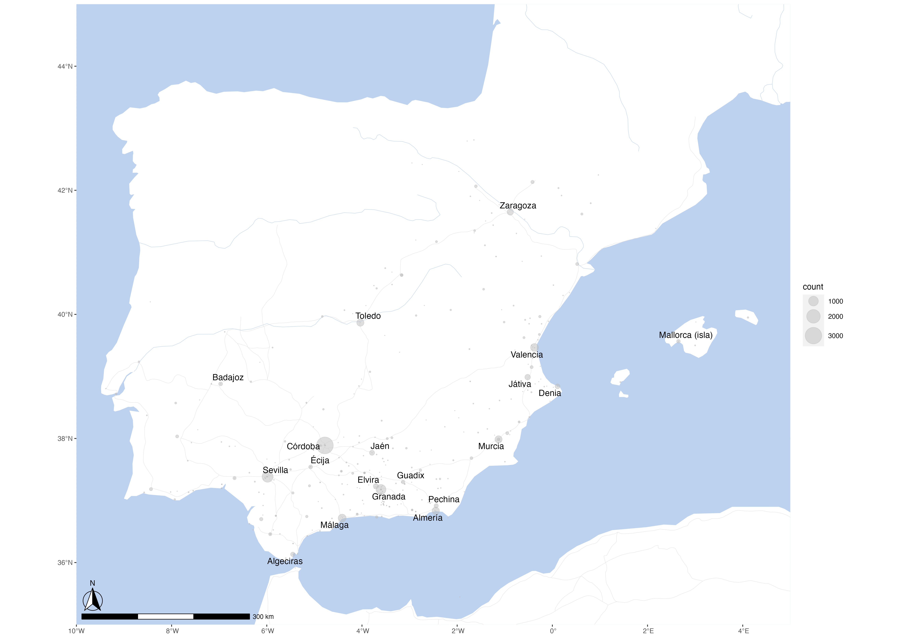

Based on the map, I would start with a the following vector (roughly, west to east):

```{r}

imanes_vector <- c("Silves", "Badajoz", "Sevilla", "Algeciras", "Córdoba",
                   "Málaga", "Toledo", "Granada", "Almeria", "Murcia",
                   "Valencia", "Zaragoza", "Mallorca (isla)")

imanes <- PUA$lugar %>%
  filter(nombre_castellano %in% imanes_vector) %>%
  rename(region = nombre_castellano, latR = lat, lngR = lng) %>%
  select(region, latR, lngR)

imanes
```

Now we need to aggregate all locations with these magnets. A way to do that is to calculate the distance between all the places and these magnets. (BTW, feel free to change this list!). In the code below we will connect our `PUA$lugar` with our magnets (`imanes`) in such a way that each place in our table will get joined with each and every magnet.


```{r}

lugares_con_imanes <- PUA$lugar %>%
  merge(imanes, by = NULL) %>%
  # REMOVE ALL PLACES WITH NA
  filter(!is.na(lat)) %>%
  filter(FLAG_alandalus == 1) %>%
  arrange(idLugar) %>%
  select(-notas, -descripcion)

lugares_con_imanes <- as_tibble(lugares_con_imanes)

lugares_con_imanes
```

Now, we need a way to calculate distances between the places. The issue here is that we need to use a special complex formula that would allow us to calculate the length of so-called “great circles” (or arcs), which is the shortest distance over the earth's surface, giving "as-the-crow-flies" distance between each pair of points. For that we need to use the [Haversine formula](https://en.wikipedia.org/wiki/Haversine_formula). We can write a function that would do the calculations and then apply it to the table. 
This is where ChatGPT can be very helpful, since you can ask it to implement the formula in R:

```{r}
# Haversine function to calculate distance between two coordinates

haversine <- function(long1, lat1, long2, lat2) {
  # Convert degrees to radians
  long1 <- long1 * pi / 180
  lat1 <- lat1 * pi / 180
  long2 <- long2 * pi / 180
  lat2 <- lat2 * pi / 180

  # Haversine formula
  dlon <- long2 - long1
  dlat <- lat2 - lat1
  a <- sin(dlat / 2)^2 + cos(lat1) * cos(lat2) * sin(dlon / 2)^2
  c <- 2 * atan2(sqrt(a), sqrt(1 - a))

  # Radius of the earth in kilometers
  r <- 6371.0

  # Distance in kilometers
  return(r * c)
}
```

> **Note:** since ChatGPT is a generative model, it will always try to give you some answer, but it does not mean that the answer will be correct. One should always keep this in mind and cross-examine ChatGPT results. In this specific case we can simply google distances between specific places and check how close those results are to what we have calculated with the ChatGPT-provided function. One other thing to keep in mind: ChatGPT often tries to use some libraries as shortcuts to solving specific problems, but this approach tends to fail quite often with R. For example, ChatGPT initially suggested code that uses some obscure R library---and it did not work. Instead I asked to implement the Harvestine formula from scratch and wrap it into a function that can be reused.

Now, let's calculate these distances in our data and pick the closest graviton (i.e., a prominent location for which we have the shortest distance):

```{r message=FALSE, warning=FALSE}

lugares_con_imanes_ultimas <- lugares_con_imanes %>%
  mutate(distancia = haversine(lng, lat, lngR, latR)) %>%
  group_by(idLugar) %>%
  top_n(-1, wt = distancia)

lugares_con_imanes_ultimas
```

Keep in mind that this is not necessarily intended to be the final version. You can play around with this data and manually move some locations from one region to another; you can also include other “magnets” and re-classify all places. 

Let's now try to visualize these regions:

```{r message=FALSE, warning=FALSE}

modeledAndalusianRegions <- base_plot_andalus_themed + 
  geom_point(data = lugares_con_imanes_ultimas,
             aes(x = lng, y = lat, col = region),
             size = 2, alpha = 0.85)

ggsave("PUAR_Cl10_Map01.png", plot = modeledAndalusianRegions,
       width = 200, height = 150, units = "mm", dpi = "retina")

modeledAndalusianRegions
```

Now, we can use `lugares_con_imanes_ultimas` instead of `PUA$lugar` to group multiple locations into our modeled regions.  

By the way, we can save this data back into our `PUA` data and reuse it later. But let's keep the original file intact, just in case.

```{r eval=FALSE, message=FALSE, warning=FALSE, include=TRUE}

PUA$lugares_con_imanes <- lugares_con_imanes_ultimas
saveRDS(PUA, "./data/PUA_processed/PUA_allDataTables_asList_UPDATED.rds")

```

## Modeling Periods

Another important task that we may want to consider is modifying our data in such a way that individuals would be included not only into a specific decade when they died, but rather into all the decades when they lived. Here we have a bit of a problem. For some individuals we have both birth and death dates, so there we can easily get their life spans. What do we do with others for whom we know only death dates?

There is a variety of ways we can go about this issue. We will try the following: for every individual without date of birth (or age), we will assign a life span by randomly sampling ages that we have in the data.

```{r}

ages <- PUA$personaje %>%
  filter(edad != 0) %>%
  filter(!is.na(edad)) %>%
  select(edad)

length(ages$edad)
summary(ages$edad)

```

As we see above, we have age information for about 2,000 individuals.

Now, we want to add some kind of value to age. Actually, we want to create a new column with `ifelse`:

- if we have age, we keep it;
- else, we add some value;

```{r}

PUA_personaje_fechas <- PUA$personaje %>%
  select(idPersonaje, nacimiento, muerte, edad) %>%
  mutate_all(~replace(., . == 0, NA))

```

Now, the question is what value we should add? We can randomly pull age values from our existing data and assign them to individuals who do not have age information. Doing this, we can reproduce the same distribution as we have in the original data.

This is how we can check if we got the distribution right. Essentially, we can visualize both vectors as histograms and check if their shapes are similar or not. If similar, we got the distribution right.

```{r}

missingAgesNumber <- PUA_personaje_fechas %>%
  filter(is.na(edad)) %>%
  nrow() # 10815 missing ages
  
agesExisting <- ages$edad # 1998 available ages
agesExtrapolated <- sample(agesExisting, size = missingAgesNumber, replace = TRUE)

# now, we visualize two AGE vectors as histograms. Their shapes must be very similar:
par(mfrow = c(1, 2))
hist(agesExisting)
hist(agesExtrapolated)
par(mfrow = c(1, 1))

```

We can also run `summary()` on both vectors. As you can see, our extrapolated vector is just a teeny-tiny bit different.

```{r}
summary(agesExisting)
summary(agesExtrapolated)
```
A better way may be to apply this period by period, for example going by 100-year time spans. This way we can also get the chronological distribution with more nuance.

```{r}

agesByAges <- PUA_personaje_fechas %>%
  filter(!is.na(edad)) %>%
  mutate(century = ceiling(as.numeric(muerte / 100)) * 100)

valuesPerCentury <- agesByAges %>%
  group_by(century) %>%
  summarize(count = n())

ggplot(agesByAges, aes(x = as.factor(century), y = edad)) +
  geom_boxplot() +
  labs(x = "Century", y = "Age at Death") +
  theme_minimal()  # Optional: Apply a minimal theme

```

But let's go with the simpler approach. Let's extrapolate ages:

```{r}

set.seed(786)
agesExtrapolated <- sample(agesExisting, size = missingAgesNumber, replace = TRUE)

PUA_personaje_fechas_modelled <- PUA_personaje_fechas %>%
  filter(is.na(edad)) %>%
  add_column(edad_extrapolated = agesExtrapolated)

PUA_personaje_fechas_existing <- PUA_personaje_fechas %>%
  filter(!is.na(edad)) %>%
  mutate(edad_extrapolated = edad)


PUA_personaje_decadas <- PUA_personaje_fechas_modelled %>%
  add_row(PUA_personaje_fechas_existing) %>%
  arrange(idPersonaje) %>%
  filter(!is.na(muerte)) %>%
  mutate(nacimiento1 = ifelse(!is.na(nacimiento), nacimiento, muerte - edad_extrapolated)) %>%
  mutate(decada_n = ceiling(as.numeric(nacimiento1 / 10)) * 10) %>%
  mutate(decada_m = ceiling(as.numeric(muerte / 10)) * 10) %>%
  select(idPersonaje, decada_n, decada_m) %>%
  group_by(idPersonaje) %>%
  summarize(decadas = list(seq(from = decada_n, to = decada_m, by = 10))) %>%
  unnest(decadas)

PUA_personaje_decadas

```

Now, let's compare two graphs: the graph of people when we do it only by their death dates, and another --- where we consider people who is alive in those decades:

```{r}
muerte_decadas <- PUA_personaje_fechas %>%
  filter(!is.na(muerte)) %>%
  mutate(decadas = ceiling(as.numeric(muerte / 10)) * 10) %>%
  group_by(decadas) %>%
  summarize(count = n())

ggplot() +
  geom_line(data = muerte_decadas, aes(x = decadas, y = count), linewidth = 1) +
  xlim(c(0, 950)) +
  theme_minimal()
```

```{r}
vida_decadas <- PUA_personaje_decadas %>%
  group_by(decadas) %>%
  summarize(count = n())

ggplot() +
  geom_line(data = vida_decadas, aes(x = decadas, y = count), linewidth = 1) +
    xlim(c(0, 950)) +
  theme_minimal()
```

As you can see on the graph above, we now have more data---each decade is now much more robust---and a much smoother curve.

### A 1000 And 1 Tries

As you can see, with extrapolated ages we have much more data and the graph is much smoother. There is a bit of a problem in our data, however. Since there is quite a lot of generated data, this curve is just one of the possible states. A possible solution to this can be a creation of, say, 1,000 of such distributions and finding some average between them. For this, we essentially will need to loop all the previous steps.

```{r eval=FALSE, include=TRUE}

vida_decadas_modelled <- vida_decadas %>%
  mutate(version = 0, .before = decadas)

for (i in seq(1, 1000, 1)){
  # here we do not use set.seed !
  agesExtrapolated <- sample(agesExisting, size = missingAgesNumber, replace = TRUE)

  PUA_personaje_fechas_modelled <- PUA_personaje_fechas %>%
    filter(is.na(edad)) %>%
    add_column(edad_extrapolated = agesExtrapolated)

  PUA_personaje_fechas_existing <- PUA_personaje_fechas %>%
    filter(!is.na(edad)) %>%
    mutate(edad_extrapolated = edad)

  PUA_personaje_decadas <- PUA_personaje_fechas_modelled %>%
    add_row(PUA_personaje_fechas_existing) %>%
    arrange(idPersonaje) %>%
    filter(!is.na(muerte)) %>%
    mutate(nacimiento1 = ifelse(!is.na(nacimiento), nacimiento, muerte - edad_extrapolated)) %>%
    mutate(decada_n = ceiling(as.numeric(nacimiento1 / 10)) * 10) %>%
    mutate(decada_m = ceiling(as.numeric(muerte / 10)) * 10) %>%
    select(idPersonaje, decada_n, decada_m) %>%
    group_by(idPersonaje) %>%
    summarize(decadas = list(seq(from = decada_n, to = decada_m, by = 10))) %>%
    unnest(decadas)

  vida_decadas_temp <- PUA_personaje_decadas %>%
    group_by(decadas) %>%
    summarize(count = n()) %>%
    mutate(version = i, .before = decadas)

  vida_decadas_modelled <- vida_decadas_modelled %>%
    add_row(vida_decadas_temp)
}

```

```{r eval=FALSE, include=FALSE}
saveRDS(vida_decadas_modelled, "./data/PUA_processed/1000extrapolations.rds")
```

```{r eval=TRUE, include=FALSE}
vida_decadas_modelled <- readRDS("./data/PUA_processed/1000extrapolations.rds")
```

Now, let's graph is and see how 1,000 iterations would be different from a single iteration. Thus, on the graph below we have two lines: 1) a light blue line of varying width, which represents the results of 1,000 iterations; and 2) a black line that represents a single variation.

```{r message=FALSE, warning=FALSE}

ggplot() +
  geom_line(data = vida_decadas_modelled,
            aes(x = decadas, y = count,
                group = as.factor(version)),
            linewidth = 0.5, alpha = 0.5,
            col = "lightblue") +
  geom_line(data = vida_decadas, aes(x = decadas, y = count), linewidth = 0.5, col = "black") +
  xlim(c(0, 950)) +
  theme_minimal() + 
  theme(legend.position = "none") 

```

For the most part, the black line seems to be within the range of the blue lines, suggesting that the single extrapolation is not an extreme outlier. There are more robust techniques that can be used to improve this distribution, but for our purposes here we may consider a single extrapolation more or less acceptable. The most important value of this extrapolation is that now for each date we have an estimate of individuals who are alive at that moment in time.

[**#TODO**: other techniques should be discussed, explained, and demonstrated.]

<!--

**NOTE:** a more complex “age assignment” can be done based on sampling ages of different groups, like Cordobans would have one distribution, while jurists may have a different one; a person who is both a Cordoban and a jurist should have their probable age pulled from both samples, perhaps multiple times; then a single age should be pulled randomly from such pools of ages created for each individual. 

-->

<!--

IMPROVEMENTS:

1. Blue Lines: Each blue line represents a possible extrapolation of ages for the 10,000 individuals. Since there are multiple blue lines, we can understand that there are numerous potential age distributions for these individuals based on the knowledge from the 2,000 with known ages.

2. Black Line: This is a single extrapolation, essentially one possible age distribution for the 10,000 individuals.

Given this understanding, you want to determine if a single extrapolation (the black line) is representative enough or if it falls within the general range of the 10,000 extrapolations (the blue lines).

Here are some suggestions and observations:

1. Visual Inspection:

- For the most part, the black line seems to be within the range of the blue lines, suggesting that the single extrapolation is not an extreme outlier. However, there are periods (like the middle of the x-axis) where the black line falls outside the densest region of the blue lines, indicating potential divergence.

2. Statistical Analysis:

- To quantitatively determine the "acceptability" of the black line, you might consider calculating summary statistics (mean, median, standard deviation, etc.) for each period across the 10,000 blue lines. This will provide a range (confidence interval) for each period. You can then check if the black line's value for each period falls within this range.
If you find that the black line frequently falls outside these ranges, it might suggest that a single extrapolation might not be representative.

3. Smoothing:

- Consider applying a smoothing function (like a moving average) to the lines to better visualize trends and reduce noise. This can help in more easily identifying periods where the single extrapolation diverges from the majority.

4. Shading:

- Using shading (or a ribbon) to indicate the range between, for example, the 5th and 95th percentiles of the blue lines can visually show where most of the extrapolations lie. This can provide a clear visual cue to assess if the black line is within this range.

5. Sampling More:

- If computational resources allow, consider performing more than one single extrapolation (perhaps 100 or 1,000) and see how often they fall within the general range of the 10,000 extrapolations. This can give you a better idea of the variability of single extrapolations.

6. Domain Knowledge:

- Consult with experts in the domain or field to understand if there are specific periods or reasons why the extrapolation might diverge. Sometimes, there might be historical or contextual reasons for such deviations.
In conclusion, while visual inspection can provide some insights, combining it with quantitative analyses will give you a more comprehensive understanding of the acceptability of the single extrapolation.

-->

Another approach that we can potentially try is “moving sum”. We can use the `zoo` package---a versatile package for working with time series data. (Make sure to install it first!). Let's try to apply the moving sum for 3, 5, 7, 8, and 9 decades---and check how the results may look. **Note:** `align = "left"` means that the current value is summed with the values from the next X decades.

```{r}
library(zoo)

alignValue <- "left"

muerte_decadas_MA <- muerte_decadas %>%
  arrange(decadas) %>%
  mutate(moving_sum_3 = rollsum(count, k = 3, fill = NA, align = alignValue)) %>%
  mutate(moving_sum_5 = rollsum(count, k = 5, fill = NA, align = alignValue)) %>%
  mutate(moving_sum_7 = rollsum(count, k = 7, fill = NA, align = alignValue)) %>%
  mutate(moving_sum_8 = rollsum(count, k = 8, fill = NA, align = alignValue)) %>%
  mutate(moving_sum_9 = rollsum(count, k = 9, fill = NA, align = alignValue)) %>%
  pivot_longer(!decadas, names_to = "types", values_to = "values")

muerte_decadas_MA
```

The following code will give us a visualization, which will help us to check the results:

```{r message=FALSE, warning=FALSE}

ggplot(muerte_decadas_MA) +
    geom_line(data = vida_decadas_modelled,
            aes(x = decadas, y = count,
                group = as.factor(version)),
            linewidth = 0.5, alpha = 0.5,
            col = "lightblue") +
  geom_line(aes(x = decadas, y = values, col = types), linewidth = 0.5) +
  geom_line(data = vida_decadas, aes(x = decadas, y = count), linewidth = 0.5, col = "black") +
  xlim(c(0, 950)) +
  theme_minimal()
```

The rolling summary of 8 decades gives us a curve which is most close to the our modeled curve. However, here we can see that results of the “moving sum” are much more extreme, often leaving the zone of 1,000 extrapolation curves. Keeping this in mind, our age-based extrapolated curve is a better fit. Additionally, our age-based model gives us more flexibility, since the data here is highly detailed (for each individual), while the "rolling sum" approach only gives us cumulative numbers for each decade.

## Intermediate Summary

Now we have two important datasets that we can use for further analysis:

- we have modeled regions of al-Andalus, which will allow us to aggregate data;
- we have extrapolated chronological data, which will give us more dense chronological snapshots;

We can save both tables into our updated PUA dataset:

```{r eval=FALSE, include=TRUE}

PUA <- readRDS("./data/PUA_processed/PUA_allDataTables_asList.rds")

PUA$lugar_con_imanes <- lugares_con_imanes_ultimas
PUA$personaje_decadas_modeladas <- PUA_personaje_decadas

saveRDS(PUA, "./data/PUA_processed/PUA_allDataTables_asList_UPDATED.rds")

```


<!--chapter:end:110-Class11.Rmd-->

# Chronological Cartograpms

Let's now create a series of maps on all the people that we have in PUA within al-Andalus across the covered period. (Following the US cities example from the previous lesson).

```{r}

PUA <- readRDS("./data/PUA_processed/PUA_allDataTables_asList_UPDATED.rds")

personaje_with_dates <- PUA$personaje_decadas_modeladas

personaje_with_places <- PUA$personaje_lugar %>%
  filter(idPersonaje %in% personaje_with_dates$idPersonaje) %>%
  select(idPersonaje, idLugar) %>%
  left_join(PUA$lugar) %>%
  select(idPersonaje, idLugar, lat, lng) %>%
  left_join(PUA$lugar_con_imanes) %>%
  filter(!is.na(region)) %>%
  select(idPersonaje, idLugar, lat, lng, region, latR, lngR)

personaje_with_places
```
Now, let's `left_join` with modeled decades. Essentially, this will create lots of “duplicates” for each person---a single person-place row will be duplicated as many times as there are decades for that individual.  

```{r eval=TRUE, message=FALSE, warning=FALSE, include=TRUE}
personaje_with_places_and_dates <- personaje_with_places %>%
  left_join(personaje_with_dates)

personaje_with_places_and_dates
```

Now we can split this table into two: one will have the minor places count, while the other will have counts for our magnets.

```{r}

minor_places_over_time <- personaje_with_places_and_dates %>%
  group_by(idLugar, lat, lng, decadas, region) %>%
  summarize(people = n()) %>%
  arrange(decadas) %>%
  pivot_wider(names_from = decadas, values_from = people) %>%
  pivot_longer(cols = "20":"930", names_to = "decadas", values_to = "people") %>%
  ungroup()

imanes_decadas <- personaje_with_places_and_dates %>%
  group_by(region, latR, lngR, decadas) %>%
  summarize(people = n()) %>%
  arrange(decadas) %>%
  pivot_wider(names_from = decadas, values_from = people) %>%
  pivot_longer(cols = "20":"930", names_to = "decadas", values_to = "people") %>%
  mutate(decadas = as.numeric(decadas)) %>%
  ungroup()

```

We can now use both layers to map data at two scales:

```{r message=FALSE, warning=FALSE}

andalus <- base_plot_andalus_themed + 
  geom_point(data = imanes_decadas,
             aes(x = lngR, y = latR, size = people, col = region),
             alpha = 0.5, show.legend = FALSE) +  
  geom_point(data = minor_places_over_time,
             aes(x = lng, y = lat, size = people, col = region),
             alpha = 0.75, show.legend = FALSE) +
  geom_text(data = imanes_decadas,
            aes(x = lngR + 0.05, y = latR + 0.05, label = region),
            size = 3, alpha = 0.5) +
  scale_size_continuous(range = c(0.05, 20))

andalus
```

### Animated Map Approach

Animating the map can be quite annoying. however, below is the code. Keep in mind that it takes a while to generate animation. While you are developing it, it is worth reducing the quality of the animation: 1) reduce the duration to 10-20 seconds; 2) reduce the width and height; 3) reduce the resolution to 100 or less. If your animation looks like what you want, you can then select all the high quality parameters and generate the final result. 

```{r eval=FALSE, include=TRUE}

library(gganimate)
library(gifski)

andalusAnimated <- andalus +
  transition_states(decadas) +
  labs(title = "al-Andalus: {closest_state} AH")

anim_save("./images/generated/Andalus_Animated_01.gif", animation = andalusAnimated,
          duration = 60, fps = 2, end_pause = 10,
          rewind = FALSE, height = 5, width = 7, units = "in", res = 200)

```

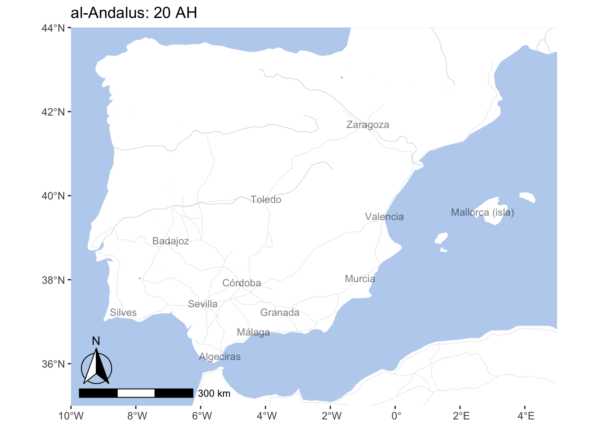

### “Frame-by-Frame” Approach

Alternatively, one can generate individual maps of each and every decade and aggregate them into an animation using other means. However, in most cases, static maps of specific periods would be of much greater use, both for presentations and for publications. We can generate such maps using a loop. We can either loop over all the decades (which we have in the vector `imanes_decadas$decadas`), or, we can reduce the number of decades for which we generate maps (using for example this vector: `seq(100, 900, 100)`).

**Note:** we need to add some modification to the scaling parameters, expressed in the `global_range` variable. Essentially, we need to adjust our scaling to the values *for all the periods*.

```{r eval=FALSE, include=TRUE}

global_range <- range(imanes_decadas$people, minor_places_over_time$people, na.rm = TRUE)

for (d in seq(100, 900, 100)) {
  
  # TEMP DATA
  imanes_decadas_temp <- imanes_decadas %>%
    filter(decadas == d)
  minor_places_over_time_temp <- minor_places_over_time %>%
    filter(decadas == d)
  
  # TEMP MAP
  map_temp <- base_plot_andalus_themed + 
    geom_point(data = imanes_decadas_temp,
             aes(x = lngR, y = latR, size = people, col = region),
             alpha = 0.5, show.legend = FALSE) +  
    geom_point(data = minor_places_over_time_temp,
             aes(x = lng, y = lat, size = people, col = region),
             alpha = 0.75, show.legend = FALSE) +
    geom_text(data = imanes_decadas_temp,
            aes(x = lngR + 0.05, y = latR + 0.05, label = region),
            size = 3, alpha = 0.5, family = "Brill") +
    scale_size_continuous(range = c(0.05, 20), limits = global_range) +
    ggtitle(paste0("al-Andalus in ", d, "AH")) +
    theme(plot.title = element_text(family = "Brill"))

  # SAVE TEMP MAP
  fileName <- paste0("PUA_Andalus_BubbleMap_",
                     stringr::str_pad(d, width = 4, side = "left", pad = "0"),
                     ".png")
  fullPath <- paste0("./images/generated/", fileName)
  ggsave(fullPath, plot = map_temp, width = 160, height = 120,
         units = "mm", dpi = "retina")
  
}

```

Our results are for the following time frames: 100, 200, 300, 400, 500, ... 900 AH.


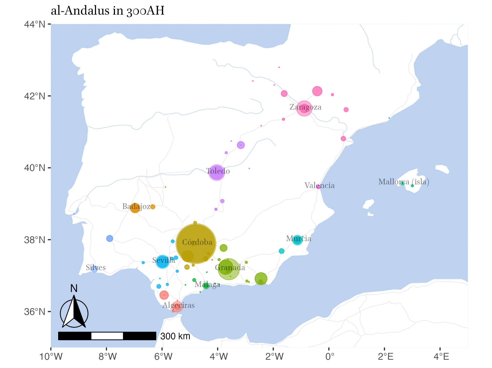


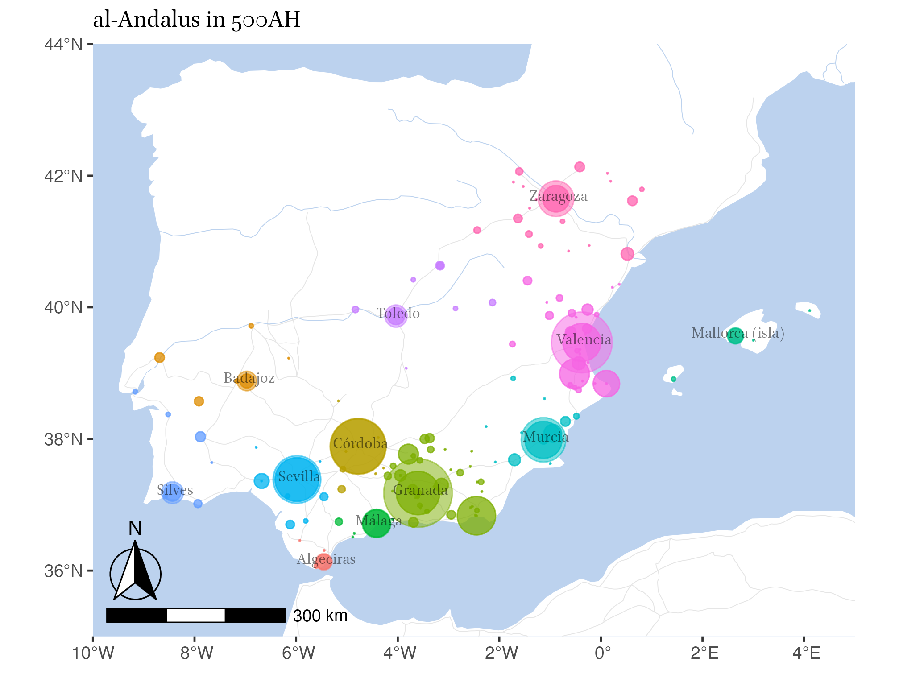


## Chrono-Geographical Information without Maps

We can visualize our data by regions in a manner we have already used:

```{r message=FALSE, warning=FALSE}

andalus_01 <-  ggplot() + 
  geom_line(data = imanes_decadas, aes(x = as.integer(decadas), y = people, color = region), linewidth = 1) +
  facet_wrap(~ region) +
  theme_minimal() +
  labs(title = "Andalusian regions over time")
  
andalus_01
```

Alternatively, we can also arrange this tabular format in such a way that would visually resemble the geography of al-Andalus. For this we can use the library `geofacet` that also has a nice interface for arranging the grid:

```{r eval=FALSE, include=TRUE}
library(geofacet)

andalusGridInitial <- tibble(
  code = seq(1,12),
  name = unique(imanes_decadas$region),
  row = seq(1,12),
  col = seq(1,12),
) 

grid_design(data = andalusGridInitial)
```


Using this convenient interface, one can easily rearrange squares into a more geographically suggestive table. In our case it may look like the following:


```{r message=FALSE, warning=FALSE}

andalusGrid <- data.frame(
  code = c(" 1", "11", " 8", " 9", " 4", " 2", "12", " 3", " 7", " 5", " 6", "10"),
  name = c("Zaragoza", "Valencia", "Toledo", "Murcia", "Córdoba", "Badajoz", "Mallorca (isla)", "Silves", "Sevilla", "Granada", "Algeciras", "Málaga"),
  row = c(1, 2, 2, 3, 3, 3, 2, 4, 4, 4, 5, 5),
  col = c(4, 4, 3, 4, 3, 2, 6, 1, 2, 3, 2, 3),
  stringsAsFactors = FALSE
)

# run this line separately , if you want to open grid editor;
# no need to have it uncommented, if you want to generate a notebook
geofacet::grid_preview(andalusGrid)

```

Now, we can use this grid to visualize our geographical curves:

```{r message=FALSE, warning=FALSE}

imanes_decadas_test <- imanes_decadas %>%
  rename(name = region)

andalusGridGraph <- ggplot(data = imanes_decadas_test,
                           aes(x = as.integer(decadas), y = people)) +
  geom_line(linewidth = 1) +
  facet_geo(~ name, grid = andalusGrid, label = "name") +
  labs(title = "al-Andalus of the Islamic Period, c. 100-900 AH",
    caption = "Data Source: `PUA Database`",
    x = "Decade", y = "People", family = "Brill") +
  theme_minimal() +
  theme(axis.text.x = element_text(angle = 90))

andalusGridGraph

ggsave("./images/generated/andalusGridGraph.png",
       plot = andalusGridGraph, width = 420, height = 297,
       units = "mm", dpi = "retina")

```

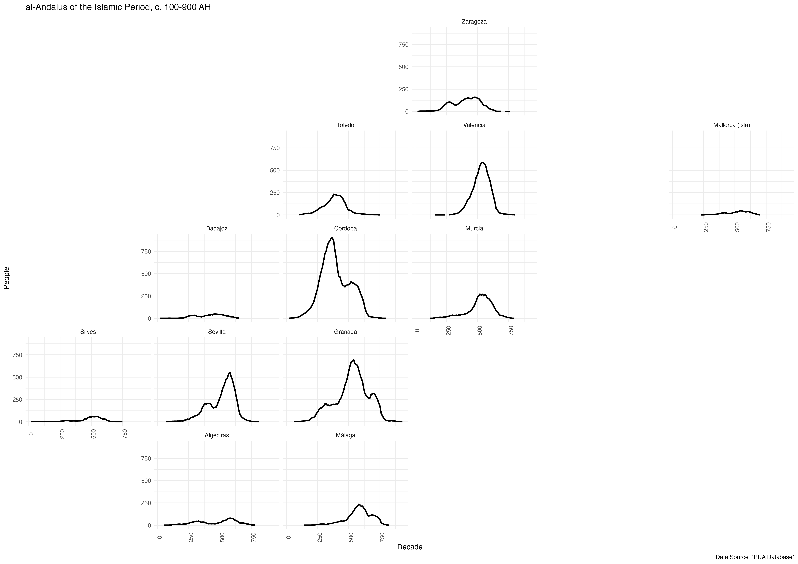

<!--chapter:end:120-Class12.Rmd-->

# Geographical Networks

- Orbis-esque functionality
- Networks of connections


<!--chapter:end:130-Class13.Rmd-->

# Social Networks

- modeling social networks from the PUA data


<!--chapter:end:140-Class14.Rmd-->

`r if (knitr::is_html_output()) '
# Glossary of Computer Terms
'`

**NB:** The idea is to create a detailed glossary in multiple languages to facilitate understanding. Languages: English, German, Arabic, Persian, Turkish, etc. Entries may be supplied by illustration for more efficiency and clarity.

## General Computer Terms

- **file manager**: a software application that provides a user interface to manage files and directories.
  - *German*: Dateimanager;
  - *Arabic*: مدير الملفات (Mudīr al-mulafāt);
  - *Persian*: مدیر پرونده (Modir-e Parvandeh);
- **command line**: A text-based interface where users input commands to control the computer.
  - *German*: Befehlszeile;
  - *Arabic*: سطر الأوامر (satr al-awamir);
  - *Persian*: خط فرمان (xatt-e farman);
- **path**: a reference to a specific location in a file system, typically consisting of a sequence of directories leading to a specific file or directory.
  - *German*: Pfad;
  - *Arabic*: مسار (masar);
  - *Persian*: مسیر (masir);
- **folder**: a virtual container within a file system used to store and organize files and other folders.
  - *German*: Ordner;
  - *Arabic*: مجلد (majallad);
  - *Persian*: پوشه (poshe);
- **file**: A digital container for storing data or information on a computer system.
  - *German*: Datei;
  - *Arabic*: ملف (malaf);
  - *Persian*: فایل (file);

## R-Specific Terms

...


## NLP and Linguistics

- **natural language processing (NLP)**: The branch of artificial intelligence focused on enabling computers to understand, interpret, and generate human language.
  - *German*: Natürliche Sprachverarbeitung;
  - *Arabic*: معالجة اللغة الطبيعية (mu‘ālajat al-lughah al-ṭabī‘īyah);
  - *Persian*: پردازش زبان طبیعی (pardazesh-e zabān-e tabi'i);
- **ngram**: A contiguous sequence of n items (such as letters, words, or symbols) from a given sample of text or speech.
  - *German*: N-Gramm;
  - *Arabic*: ن-جرام (n-gram);
  - *Persian*: ن-گرام (n-gram);
- **token**: A sequence of characters in text that represents a unit of meaning, often corresponding to a word or a symbol.
  - *German*: Token;
  - *Arabic*: رمز (ramz);
  - *Persian*: توکن (token);
- **corpus**: A large and structured set of texts, often used for linguistic research and natural language processing tasks.
  - *German*: Korpus;
  - *Arabic*: مدونة (madwana);
  - *Persian*: متن‌نگار (matn-negar);
- **corpus linguistics**: The study of language based on large collections of "real life" language use stored in corpora.
  - *German*: Korpuslinguistik;
  - *Arabic*: علم اللغة المدوني (‘ilm al-lughah al-madwani);
  - *Persian*: زبان‌شناسی متنی (zabān-shenāsi-ye matni);
- **computational linguistics**: An interdisciplinary field concerned with the computational aspects of the human language capacity and the application of computational methods to linguistic questions.
  - *German*: Computerlinguistik;
  - *Arabic*: اللسانيات الحاسوبية (al-lisāniyāt al-ḥāsūbīyah);
  - *Persian*: زبان‌شناسی محاسباتی (zabān-shenāsi-ye moḥāsebatī);

## Machine Learning

- machine learning
- deep learning
- optical character recognition (OCR)
- handwritten tet recognition (HTR)
- training a model
- artificial intelligence

<!--chapter:end:997-glossary.Rmd-->

`r if (knitr::is_html_output()) '
# Appendices
'`

## Appendix I: Importance of basic computer skills for humanists

### Importance of basic computer skills for humanists

The importance of basic computer skills for historians lies in several key areas:

1.  Access to information: Historians rely heavily on accessing various sources of information, such as archives, databases, and digital libraries. Basic computer skills enable historians to efficiently search, navigate, and retrieve relevant documents and data from these sources.
2.  Organization and management of research material: Historians often work with vast amounts of data and documents. Basic computer skills help them to efficiently organize, categorize, and manage their research material using tools such as file management systems, bibliographic software, and spreadsheets.
3.  Communication and collaboration: In today's interconnected world, historians need to communicate their research findings effectively with peers, students, and the general public. Basic computer skills enable them to use various communication tools, such as email, video conferencing, and social media, as well as collaborative platforms like Google Docs or Microsoft Teams.
4.  Data analysis and visualization: Increasingly, historians are using digital tools to analyze and visualize data to uncover trends, patterns, and relationships within their research. Basic computer skills enable historians to work with software programs, such as Excel or R, for quantitative analysis and visualization of data, helping them to gain new insights and perspectives on historical events and processes. This is closely connected to the notion of “Digital humanities”, which now combines traditional humanities research with digital tools and methods. Basic computer skills allow historians to engage with this interdisciplinary field, exploring innovative ways to analyze, interpret, and present historical data using computational techniques.
5.  Presentation and publication: Historians need to present their research findings in various formats, such as papers, presentations, or online publications. Basic computer skills enable them to use word processing, presentation software, and content management systems to create well-structured, visually appealing, and accessible materials.
6.  Professional development: As technology continues to advance, historians must stay up-to-date with new tools and methods relevant to their field. Basic computer skills facilitate their ongoing professional development by making it easier to learn and adopt new software, platforms, and digital research methods.
    
In summary, basic computer skills are essential for historians in the digital age. They help to streamline research processes, enable effective communication and collaboration, and open up new possibilities for data analysis and visualization. As a result, historians with strong computer skills are better positioned to uncover new insights and contribute to the ongoing advancement of historical research.

### Access to information

Access to information is a critical aspect of historical research. Historians need to consult a wide range of sources to gather evidence and build a comprehensive understanding of the past. With the digitization of archives, databases, and libraries, basic computer skills have become increasingly important for historians to access, search, and navigate these sources effectively. Here are some ways basic computer skills can facilitate access to information for historians:

1.  Search engines and databases: Basic computer skills enable historians to use search engines like Google, specialized databases like JSTOR or Project MUSE, and online catalogs of libraries and archives to locate relevant books, articles, and primary sources. Knowing how to use advanced search functions and apply filters to refine search results can save time and improve the accuracy of search results.
2.  Navigating digital archives and libraries: Many archives and libraries around the world have digitized their collections and made them available online, providing historians with unprecedented access to primary sources. Basic computer skills allow historians to navigate these digital repositories, view high-resolution scans of documents and images, and download or request copies of materials for further analysis.
3.  Using metadata and finding aids: Understanding how to work with metadata and finding aids is essential for locating specific documents or collections within digital archives and libraries. Basic computer skills enable historians to interpret metadata, search finding aids, and use controlled vocabularies to locate relevant materials more efficiently.
4.  Optical Character Recognition (OCR) and text mining: OCR technology allows historians to convert scanned images of text into searchable and editable documents. Basic computer skills enable historians to use OCR software and apply text mining techniques to search for specific keywords or phrases within large volumes of text, greatly improving the efficiency of their research.
5.  Accessing subscription-based resources: Many valuable resources, such as academic journals and databases, require a subscription or institutional access. Basic computer skills help historians to manage their subscriptions, log in to restricted resources, and navigate paywalls to access the information they need.
6.  Utilizing online forums and communities: Historians can benefit from participating in online forums, discussion groups, and social media platforms where scholars and experts share resources, knowledge, and insights. Basic computer skills enable historians to join these communities, contribute to discussions, and tap into the collective expertise of their peers.
7.  Staying up-to-date with new resources: As new digital resources and tools become available, basic computer skills help historians stay informed about the latest developments in their field. This includes learning about new digital archives, databases, or software that can improve their research process and facilitate access to information.
    
In summary, basic computer skills are essential for historians to effectively access, search, and navigate the vast array of digital resources available today. These skills not only save time and effort but also open up new research possibilities by providing easier access to primary and secondary sources that may have been difficult or impossible to access in the past.

### Organization and management of research material

Organization and management of research material are crucial skills for historians, as they often deal with a large number of documents, data, and other resources. Effective organization and management of these materials enable historians to work more efficiently and improve the quality of their research. Here are some strategies and tools historians can use to better organize and manage their research material:

1.  File organization: Creating a well-structured file organization system is essential for easy access and retrieval of research materials. This can include creating separate folders for different projects or topics, organizing files by date, type, or source, and using clear, descriptive file names.
2.  Bibliography/Document management software: Using document management software, such as Zotero, Mendeley, or EndNote, can help historians to collect, organize, and annotate various types of research materials, including articles, books, and websites. These tools also facilitate creating bibliographies and managing citations, making it easier to keep track of sources and references throughout the research process.
3.  Note-taking, outlining, writing tools: Effective note-taking is crucial for capturing and organizing key ideas, arguments, and evidence from research materials. Tools like Evernote, OneNote, or Notion allow historians to create and organize notes digitally, making it easier to search, link, and cross-reference information. Outlining tools like Scrivener or OmniOutliner can also help structure and organize research material in a more coherent and accessible way. Obsidian is a great solution for academic writing using the Zettelkasten approach; combining Obsidian with markdown, bibLaTeX, and Pandoc will allow anyone to write most complex research projects and convert the final document in whatever format that one might need to use in different scenarios (html, PDF, MS Word, etc.).
4.  Spreadsheets and databases: Historians can use spreadsheets (e.g., Excel, Google Sheets) or database software (e.g., Microsoft Access, Airtable) to manage and organize large amounts of data or quantitative information. These tools enable historians to filter, sort, and analyze data, as well as to visualize trends and patterns within the information.
5.  Cloud storage and synchronization: Using cloud storage services like Google Drive, Dropbox, or OneDrive allows historians to store, access, and share research materials across different devices and locations. This ensures that research materials are always up-to-date, secure, and easily accessible, facilitating collaboration with colleagues and students.
6.  Version control: Keeping track of changes and revisions to research materials can be challenging, especially when working with collaborators. Version control systems like Git or Subversion enable historians to manage multiple versions of documents and track changes over time, making it easier to collaborate and maintain a clear revision history.
7.  Task and project management: Managing research projects often involves coordinating multiple tasks and deadlines. Task and project management tools like Trello, Asana, or Basecamp can help historians to break down complex projects into smaller tasks, set deadlines, and track progress, ensuring that all aspects of the research process are well-organized and on schedule.  

By effectively organizing and managing research materials, historians can streamline their research process, reduce the risk of losing or overlooking important information, and enhance the overall quality of their work. Utilizing digital tools and strategies for organization and management can greatly improve the efficiency and effectiveness of historical research.

### File Organization

File organization is essential for managing research materials, projects, and documents effectively. Implementing best practices in file organization can help save time, reduce stress, and improve the overall efficiency of your work. Here are some best practices for file organization:

1.  Establish a clear hierarchy: Create a well-structured folder hierarchy based on your needs and workflow. This can include organizing folders by projects, topics, or themes, and then subdividing them into subfolders for specific aspects or components. A clear hierarchy makes it easier to locate and navigate files quickly.
2.  Use descriptive and consistent naming conventions: Choose clear, descriptive names for files and folders that convey their contents and purpose. Implement a consistent naming convention, which can include elements like dates, version numbers, and keywords. Consistency makes it easier to search for and identify files.
3.  Include dates in file names: Incorporate dates (in a consistent format like YYYY-MM-DD) in file names to easily track when documents were created or modified. This is particularly helpful when dealing with multiple versions or drafts of a document.
4.  Use version control: Keep track of different versions of documents by incorporating version numbers in file names or using version control software like Git or Subversion. This practice helps maintain an organized revision history and prevents confusion caused by multiple copies of similar files.
5.  Separate ongoing and completed work: Create separate folders for ongoing and completed projects or tasks to keep your workspace organized and focused. This also makes it easier to archive completed work or share it with colleagues.
6.  Avoid excessively nested folders: While creating a folder hierarchy is essential, avoid nesting folders too deeply, as this can make it difficult to navigate and locate files. Aim for a balance between simplicity and organization.
7.  Regularly review and clean up files: Set aside time to periodically review and clean up your files and folders. This can involve deleting or archiving old files, updating folder structures, and renaming files for better clarity.
8.  Backup your files: Develop a regular backup routine to protect your files from data loss due to hardware failures or accidents. Use a combination of local backups (external hard drives, USB drives) and cloud-based storage services (Google Drive, Dropbox, OneDrive) for added security.
9.  Use tags or labels: Many operating systems allow you to add tags or labels to files, making it easier to search for and group related files across different folders. This can be particularly useful for organizing research materials that span multiple projects or themes.
10.  Document your organization system: Maintain a document or guide that explains your file organization system, naming conventions, and folder hierarchy. This can be helpful for your reference, as well as for colleagues or collaborators who need to navigate your files.

By following these best practices for file organization, you can create a more efficient and streamlined workspace, making it easier to locate, access, and manage your files and documents.

### Finding your way around the computer

#### Explanation of file system and directories

A **file system** is a method used by an operating system (OS) to organize, store, and manage files and directories (also known as folders) on a storage device, such as a hard drive, SSD, or USB flash drive. The file system controls how data is stored, accessed, and retrieved, enabling users to create, modify, and delete files and directories.

**Directories** (or folders) are containers used to organize files hierarchically, making it easier to manage and navigate files within the file system. A directory can contain other directories, creating a tree-like structure that starts from a root directory.

Here is an explanation of file systems and directories using a simple example:

1.  Root directory: This is the top-level directory in a file system hierarchy. On Windows, the root directory is usually represented as `C:` (or another letter for additional drives), while on macOS and Linux systems, it is represented as `/`.

Example:

-   Windows: `C:\`
-   macOS or Linux: `/`

2.  Subdirectories: Subdirectories (or subfolders) are directories that are contained within other directories. They can be nested within each other to create a hierarchical structure that groups related files together.

Example:

-   Projects (a top-level directory)
    -   History_Project (a subdirectory within the Projects directory)
        -   Research (a subdirectory within the History_Project directory)
        -   Drafts (another subdirectory within the History_Project directory)

3.  File paths: A file path is a representation of the location of a file or directory within the file system hierarchy. It shows the sequence of directories that must be navigated to reach a specific file or folder.

Example:

-   Windows: `C:\Projects\History_Project\Research\primary_source.pdf`
-   macOS or Linux: `/Projects/History_Project/Research/primary_source.pdf`

4.  File extensions: File extensions are short suffixes (usually three or four characters) added to the end of a file name, preceded by a period. They indicate the file type and determine which programs can open and edit the file.

Example:

-   Document: `report.docx` (Microsoft Word document)
-   Image: `photo.jpeg` (JPEG image)
-   Spreadsheet: `budget.xlsx` (Microsoft Excel spreadsheet)

Understanding file systems and directories is essential for organizing, managing, and navigating files on a computer. By creating a well-structured directory hierarchy and using clear naming conventions for files and folders, users can easily locate and access the information they need.

**Notes**:

An **operating system** (OS) is a collection of software that manages computer hardware resources and provides a range of services and functions for the computer's software applications. The OS acts as an intermediary between the user and the computer hardware, making it possible for users to interact with the computer and run various software programs.

Some key functions of an operating system include:

1.  Managing hardware resources: The OS is responsible for managing the computer's hardware, such as the CPU, memory, storage devices, and input/output devices like the keyboard, mouse, and display. It allocates resources to different software applications and ensures that they can access the hardware they need to function properly.
2.  Task management: The OS is responsible for managing the execution of processes and threads on the computer. It schedules tasks, assigns priority levels, and ensures that processes do not interfere with each other.
3.  Memory management: The OS is responsible for managing the computer's memory, including allocating and deallocating memory for applications and handling memory fragmentation. It also manages virtual memory, which allows the computer to use disk space as additional memory when needed.
4.  File system management: The OS provides a file system that organizes and manages files and directories on storage devices. It controls how files are created, accessed, modified, and deleted, and it maintains metadata about the files, such as their location, size, and creation date.
5.  User interface: The OS provides a user interface that allows users to interact with the computer and run software applications. This can be a graphical user interface (GUI), which uses windows, icons, menus, and pointers, or a command-line interface (CLI), which uses text-based commands and keyboard input.
6.  Security and access control: The OS is responsible for managing user accounts, authentication, and access control, ensuring that only authorized users can access specific resources and applications on the computer.
7.  Networking and communication: The OS manages the computer's networking capabilities, including connecting to the internet, setting up local networks, and facilitating communication between different devices and applications.

Some popular operating systems include Microsoft Windows, macOS, Linux, iOS, and Android. Each OS has its own unique features, user interface, and compatibility with specific hardware and software applications.

### Common file formats and extensions

File formats and extensions are used to identify the type and structure of a file, which helps determine the appropriate software to open, edit, and manipulate the file. Below are some common file formats and extensions, along with the important things to know when using them on Windows and Mac operating systems:

1.  Document formats:
    -   `.doc` and `.docx` (Microsoft Word): Word processing files used for creating text documents, reports, and letters. Microsoft Word is the primary software for opening these files, but other applications like Google Docs, LibreOffice, and Apple Pages can also open and edit them.
    -   `.pdf` (Portable Document Format): A widely used format for sharing documents, maintaining their original layout and formatting. PDF files can be opened with Adobe Acrobat Reader, web browsers, and various other applications on both Windows and Mac.
2.  Spreadsheet formats:
    -   `.xls` and `.xlsx` (Microsoft Excel): Spreadsheet files used for calculations, data analysis, and creating charts. Microsoft Excel is the primary software for opening these files, but other applications like Google Sheets and LibreOffice Calc can also open and edit them.
3.  Presentation formats:
    -  `.ppt` and `.pptx` (Microsoft PowerPoint): Presentation files used for creating slideshows and visual presentations. Microsoft PowerPoint is the primary software for opening these files, but other applications like Google Slides and Apple Keynote can also open and edit them.
4.  Image formats:
    -   `.jpeg` or `.jpg` (Joint Photographic Experts Group): A common format for digital photos and images, with good quality and compression. Can be opened and edited with various image editors and viewers, such as Microsoft Paint, Adobe Photoshop, and Apple Preview.
    -   `.png` (Portable Network Graphics): A widely used format for images that supports transparency and lossless compression. Can be opened and edited with most image editors and viewers on Windows and Mac.
    -   `.gif` (Graphics Interchange Format): An image format commonly used for simple animations and small graphics on the web. Can be opened and edited with most image editors and viewers on Windows and Mac.
5.  Audio formats:
    -   `.mp3` (MPEG Audio Layer-3): A popular audio format with lossy compression, widely used for music and other audio content. Can be played on most media players and devices, such as Windows Media Player, VLC, and iTunes.
    -   `.wav` (Waveform Audio File Format): An uncompressed audio format that maintains high-quality audio. Can be played on most media players and devices on Windows and Mac.
6.  Video formats:
    -   `.mp4` (MPEG-4 Part 14): A popular video format used for streaming and sharing video content. Can be played on most media players and devices, such as Windows Media Player, VLC, and QuickTime Player.
    -   `.avi` (Audio Video Interleave): A widely used video format for storing video and audio data in a single file. Can be played on most media players and devices on Windows and Mac.

When working with files on Windows and Mac, it's important to know the appropriate software and applications needed to open and edit specific file formats. Additionally, understanding how file formats affect the quality and compatibility of files can help you choose the best format for your needs. If you need to share a file with someone who has a different operating system or software, consider using a widely supported file format or exporting the file in a format that can be opened by their software.

Both Mac and Windows may hide file extensions and you may want to change settings of your file manager (Windows Explorer on Windows or Finder on MacOS) to show this information. How exactly this should be done may differ from one version of the same operating system to another. It is always best to “google” information relevant to your OS.

### Organizing files and folders for research projects

Organizing files and folders for research projects is crucial for efficient project management and easy access to relevant information. A well-organized structure helps you keep track of your work, collaborate with others, and prevent loss of data. Here are some tips for organizing files and folders for research projects:

1.  Create a main project folder: Start by creating a main folder for the entire research project. Name it clearly and descriptively, so you can easily identify it among other folders.

2.  Establish a consistent folder structure: Within the main project folder, create subfolders for different components of the research project, such as data, literature, drafts, and presentations. It's essential to establish a consistent folder structure that is easy to understand and navigate.

Example of a folder structure:

```
PROJECT/
    ├── Data/
    │   ├── Raw_Data/
    │   └── Processed_Data/
    ├── Literature/
    │   ├── Articles/
    │   └── Books/
    ├── Classes/
    │   ├── Class_01/
    │   ├── Class_02/
    │   └── Class_03/
    ├── Presentations/
    └── Meeting_Notes/
```

3.  Use clear and descriptive file and folder names: When naming files and folders, use clear, descriptive, and concise names that provide context and indicate the content. Avoid using vague or generic names, and try to include relevant information like dates, version numbers, or authors.

Example of clear file names:

-   `2021-05-01_Interview_Transcript_JaneDoe.docx`
-   `Literature_Review_v3.pdf`

4.  Use version control: When working on drafts or revising documents, use version numbers or dates in file names to keep track of different iterations. This practice helps you maintain a clear history of changes and makes it easier to locate previous versions if needed.

Example of version control in file names:

-   `Research_Paper_v1.docx`
-   `Research_Paper_v2.docx`
-   `Research_Paper_v3_Final.docx`

5.  Keep raw and processed data separate: When working with data, create separate folders for raw data (unaltered, original files) and processed data (cleaned or transformed data). This practice helps prevent accidental changes to the original data and makes it easier to track the data processing steps.

6.  Regularly backup your data: To prevent data loss, regularly backup your project files and folders to an external storage device or a cloud storage service. Schedule routine backups and ensure that all team members are aware of the backup process.

7.  Document your organization system: Create a readme file or a project documentation file that explains the organization system, including the folder structure, file naming conventions, and any other relevant information. This documentation helps maintain consistency and makes it easier for team members or future researchers to understand and navigate the project files.

### Demonstration of file navigation using a file explorer (Windows) or Finder (Mac)

**Windows**

Here is a step-by-step description of screenshots demonstrating file navigation using the File Explorer on Windows:

1.  Screenshot 1 - Opening File Explorer: The first screenshot shows the taskbar at the bottom of the screen, with the File Explorer icon highlighted. This is typically represented by a folder icon. The user clicks on the icon to open File Explorer.

2.  Screenshot 2 - File Explorer Window: The second screenshot displays the open File Explorer window, showing the default view when the application is launched. In Windows, this could be the "Quick access" or "This PC" view, with a list of frequently used folders, drives, and network locations.

3.  Screenshot 3 - Navigating to a Specific Folder: The third screenshot shows the user clicking on one of the available drives (e.g., "C:") or folders listed in the left-hand navigation pane, which then displays the contents of the selected drive or folder in the main window.

4.  Screenshot 4 - Opening a Folder: The fourth screenshot demonstrates the user double-clicking on a folder within the main window to open it and view its contents. The folder path is displayed at the top of the window, indicating the user's current location within the file system.

5.  Screenshot 5 - Navigating Within a Folder: The fifth screenshot shows the user browsing through the contents of the open folder, which may include files and subfolders. The user can click on column headers (e.g., "Name," "Date modified," or "Type") to sort the contents alphabetically, chronologically, or by file type.

6.  Screenshot 6 - Using the Back Button: The sixth screenshot shows the user clicking the "Back" button (a left-pointing arrow) in the upper-left corner of the File Explorer window to return to the previous folder or drive.

7.  Screenshot 7 - Searching for Files or Folders: The seventh screenshot demonstrates the user entering a keyword or phrase in the search bar located in the upper-right corner of the File Explorer window. As the user types, a list of matching files and folders appears in the main window.

8. Screenshot 8 - Getting Path of the Open Folder: The eighth screenshot demonstrates the user clicking on the path bar (top part of the window), where, after a click, the proper path appears --- now, it can be copied and used as a universal reference to the folder.
    

By following these steps and using the features available in File Explorer, Windows users can effectively navigate and manage their files and folders.


**Mac**

Here is a step-by-step description of screenshots demonstrating file navigation using Finder on Mac:

1.  Screenshot 1 - Opening Finder: The first screenshot shows the Dock at the bottom of the screen, with the Finder icon highlighted. This is typically represented by a blue, smiling face icon. The user clicks on the icon to open Finder.
    
2.  Screenshot 2 - Finder Window: The second screenshot displays the open Finder window, showing the default view when the application is launched. In macOS, this could be the "Recents" view or a list of locations such as "iCloud Drive," "AirDrop," "Applications," "Desktop," "Documents," and "Downloads" in the left-hand sidebar.
    
3.  Screenshot 3 - Navigating to a Specific Folder: The third screenshot shows the user clicking on one of the available locations or folders listed in the left-hand sidebar, which then displays the contents of the selected location or folder in the main window.
    
4.  Screenshot 4 - Opening a Folder: The fourth screenshot demonstrates the user double-clicking on a folder within the main window to open it and view its contents. The folder path is displayed at the bottom of the window, indicating the user's current location within the file system.
    
5.  Screenshot 5 - Navigating Within a Folder: The fifth screenshot shows the user browsing through the contents of the open folder, which may include files and subfolders. The user can click on the "Sort By" button (represented by a gear icon) in the upper-right corner of the Finder window to sort the contents by various criteria such as "Name," "Date Modified," "Date Created," "Size," or "Kind."
    
6.  Screenshot 6 - Using the Back Button: The sixth screenshot shows the user clicking the "Back" button (a left-pointing arrow) in the upper-left corner of the Finder window to return to the previous folder or location.
    
7.  Screenshot 7 - Searching for Files or Folders: The seventh screenshot demonstrates the user entering a keyword or phrase in the search bar located in the upper-right corner of the Finder window. As the user types, a list of matching files and folders appears in the main window.

8. Screenshot 8 - Getting Path of the Open Folder: The eighth screenshot demonstrates the user right-clicking on the folder and selecting option to copy folder as a path (OPTION must be pressed): “Copy FOLDER as Pathname” --- now, the path can used as a universal reference to the folder.

By following these steps and using the features available in Finder, Mac users can effectively navigate and manage their files and folders.

### Command Line Basics

#### General Introduction

Command line basics refer to the fundamental concepts and commands used when working with a command-line interface (CLI) on an operating system. The CLI allows users to interact with the computer by entering text-based commands instead of using a graphical user interface (GUI). Here is an outline of command line basics:

1.  Understanding the Command Line Interface (CLI)
    -   Difference between CLI and GUI
    -   Advantages and disadvantages of using CLI
    -   Common command-line environments (e.g., Command Prompt and PowerShell on Windows, Terminal on macOS and Linux)
2.  Navigating the Command Line Interface
    -   Opening the command-line environment (e.g., Terminal, Command Prompt, or PowerShell)
    -   Understanding the command prompt (e.g., user@hostname:~$ on Linux/macOS, C:\Users\Username> on Windows)
    -   Basic anatomy of a command (command, options, and arguments)
3.  Essential Commands
    -   Navigation commands
        -   `cd` (change directory)
        -   `ls` or `dir` (list directory contents)
        -   `pwd` or `cd` (print working directory)
    -   File and directory management commands
        -   `mkdir` (make directory)
        -   `rmdir` or `rd` (remove directory)
        -   `cp` or `copy` (copy files and directories)
        -   `mv` or `move` (move or rename files and directories)
        -   `rm` or `del` (remove files)
    -   File content and manipulation commands
        -   `cat`, `more`, `less`, or `type` (view file contents)
        -   `grep` (search for text in files)
        -   `nano`, `vi`, or `notepad` (edit files using a text editor)
4.  Advanced Commands
    -   Input/output redirection
        -   `>` (redirect output to a file)
        -   `<` (redirect input from a file)
        -   `>>` (append output to a file)
    -   Pipes
        -   `|` (pipe output from one command as input to another)
    -   Command substitution
        -   `$(command)` or `` `command` `` (execute a command and use its output as an argument)
5.  Command Line Customization
    -   Customizing the command prompt appearance
    -   Creating command aliases
    -   Setting environment variables
6.  Scripting Basics
    -   Understanding shell scripts (e.g., .sh for Unix-based systems or .bat for Windows)
    -   Creating and executing a basic script
    -   Script variables and control structures (loops, conditionals)

By mastering these command line basics, users can become more efficient and proficient at navigating and managing files, directories, and processes within their operating system.

### Introduction to command line interfaces

#### Windows Command Prompt

In the world of computing, there are two primary ways to interact with an operating system: graphical user interfaces (GUI) and command line interfaces (CLI). While graphical user interfaces have become the norm due to their ease of use and visual appeal, command line interfaces remain a powerful and versatile tool, especially for advanced users and system administrators. In this introduction, we will focus on the Windows Command Prompt, a widely used command line interface for the Windows operating system.

The Windows Command Prompt, also known as "cmd.exe" or simply "cmd," provides a text-based interface for interacting with your computer. By entering commands into the Command Prompt, you can navigate the file system, manage files and directories, launch applications, and perform various system tasks without using a mouse or any visual elements. For many users, the Command Prompt can offer more precise control and enable faster, more efficient operations.

To open the Command Prompt in Windows, press the "Win + R" keys on your keyboard to open the "Run" dialog box, then type "cmd" and hit "Enter" or click "OK." Alternatively, you can search for "Command Prompt" in the Windows search bar and select the corresponding result.

Once the Command Prompt window is open, you will see a text-based prompt, usually displaying the current user's name and the current directory (e.g., "C:\Users\Username>"). This is where you can begin entering commands.

Some basic commands to help you get started with the Command Prompt include:

-   `cd`: Change the current directory
-   `dir`: List the contents of the current directory
-   `mkdir`: Create a new directory
-   `rmdir`: Remove an existing directory
-   `copy`: Copy files from one location to another
-   `move`: Move or rename files
-   `del`: Delete files
-   `cls`: Clear the Command Prompt screen

As you become more familiar with the Command Prompt, you can begin to explore more advanced commands, such as input/output redirection, piping, and scripting. These techniques can greatly enhance your productivity and enable you to perform complex tasks with relative ease.

In conclusion, the Windows Command Prompt is a powerful tool for users who wish to interact with their computer through a text-based interface. With practice and knowledge of various commands, you can unlock the full potential of the Command Prompt, making it an invaluable asset in your computing toolkit.

#### Mac Terminal

Introduction to Command Line Interfaces - Mac Terminal

In the world of computing, there are two primary ways to interact with an operating system: graphical user interfaces (GUI) and command line interfaces (CLI). While graphical user interfaces have become the norm due to their ease of use and visual appeal, command line interfaces remain a powerful and versatile tool, especially for advanced users and system administrators. In this introduction, we will focus on the Mac Terminal, a widely used command line interface for the macOS operating system.

The Mac Terminal, simply referred to as "Terminal," provides a text-based interface for interacting with your computer. By entering commands into the Terminal, you can navigate the file system, manage files and directories, launch applications, and perform various system tasks without using a mouse or any visual elements. For many users, the Terminal can offer more precise control and enable faster, more efficient operations.

To open the Terminal in macOS, navigate to the "Applications" folder, then the "Utilities" folder, and double-click on "Terminal." Alternatively, you can use Spotlight search by pressing "Cmd + Space" on your keyboard, typing "Terminal," and hitting "Enter" or selecting the corresponding result.

Once the Terminal window is open, you will see a text-based prompt, usually displaying the current user's name, hostname, and the current directory (e.g., "user@hostname:~$"). This is where you can begin entering commands.

Some basic commands to help you get started with the Terminal include:

-   `cd`: Change the current directory
-   `ls`: List the contents of the current directory
-   `pwd`: Print the current directory path
-   `mkdir`: Create a new directory
-   `rmdir`: Remove an existing directory
-   `cp`: Copy files from one location to another
-   `mv`: Move or rename files
-   `rm`: Delete files
-   `clear`: Clear the Terminal screen

As you become more familiar with the Terminal, you can begin to explore more advanced commands, such as input/output redirection, piping, and scripting. These techniques can greatly enhance your productivity and enable you to perform complex tasks with relative ease.

In conclusion, the Mac Terminal is a powerful tool for users who wish to interact with their computer through a text-based interface. With practice and knowledge of various commands, you can unlock the full potential of the Terminal, making it an invaluable asset in your computing toolkit.

### Command Line: Basic Commands

#### Windows Command Prompt

Here is a list of basic commands for the Windows Command Prompt that will help you get started with navigating and managing files and directories:

1.  `cd`: Change directory
    -   Usage: `cd <directory>`
    -   Example: `cd C:\Users\Username\Documents`
    -   To switch to a different drive, simply type the letter of the drive followed by colon: `D:` or `C:`, after that you can use `cd` command to navigate to the folder that you need
1.  `dir`: List the contents of the current directory
    -   Usage: `dir`
    -   Example: `dir`
2.  `mkdir`: Create a new directory
    -   Usage: `mkdir <directory_name>`
    -   Example: `mkdir NewFolder`
3.  `rmdir`: Remove an existing directory
    -   Usage: `rmdir <directory_name>`
    -   Example: `rmdir OldFolder`
4.  `copy`: Copy files from one location to another
    -   Usage: `copy <source> <destination>`
    -   Example: `copy C:\Users\Username\Documents\file.txt C:\Users\Username\Desktop`
5.  `move`: Move or rename files
    -   Usage: `move <source> <destination>`
    -   Example: `move C:\Users\Username\Documents\file.txt C:\Users\Username\Desktop`
6.  `del`: Delete files
    -   Usage: `del <file_name>`
    -   Example: `del C:\Users\Username\Documents\file.txt`
7.  `cls`: Clear the Command Prompt screen
    -   Usage: `cls`
    -   Example: `cls`
8.  `echo`: Display text on the screen
    -   Usage: `echo <text>`
    -   Example: `echo Hello, World!`
9.  `type`: Display the contents of a text file
    -   Usage: `type <file_name>`
    -   Example: `type C:\Users\Username\Documents\file.txt`
10.  `find`: Search for a text string in a file
    -   Usage: `find "<text_to_find>" <file_name>`
    -   Example: `find "search term" C:\Users\Username\Documents\file.txt`

These basic commands will help you navigate and manage files and directories using the Windows Command Prompt. As you become more familiar with the Command Prompt, you can explore more advanced commands and techniques to further enhance your productivity.

#### Mac Terminal

Here is a list of basic commands for the Mac Terminal that will help you get started with navigating and managing files and directories:

1.  `cd`: Change directory
    -   Usage: `cd <directory>`
    -   Example: `cd /Users/Username/Documents`
2.  `ls`: List the contents of the current directory
    -   Usage: `ls`
    -   Example: `ls`
3.  `pwd`: Print the current directory path
    -   Usage: `pwd`
    -   Example: `pwd`
4.  `mkdir`: Create a new directory
    -   Usage: `mkdir <directory_name>`
    -   Example: `mkdir NewFolder`
5.  `rmdir`: Remove an existing directory
    -   Usage: `rmdir <directory_name>`
    -   Example: `rmdir OldFolder`
6.  `cp`: Copy files from one location to another
    -   Usage: `cp <source> <destination>`
    -   Example: `cp /Users/Username/Documents/file.txt /Users/Username/Desktop`
7.  `mv`: Move or rename files
    -   Usage: `mv <source> <destination>`
    -   Example: `mv /Users/Username/Documents/file.txt /Users/Username/Desktop`
8.  `rm`: Delete files
    -   Usage: `rm <file_name>`
    -   Example: `rm /Users/Username/Documents/file.txt`
9.  `clear`: Clear the Terminal screen
    -   Usage: `clear`
    -   Example: `clear`
10.  `echo`: Display text on the screen
    -   Usage: `echo <text>`
    -   Example: `echo Hello, World!`
11.  `cat`: Display the contents of a text file
    -   Usage: `cat <file_name>`
    -   Example: `cat /Users/Username/Documents/file.txt`
12.  `grep`: Search for a text string in a file
    -   Usage: `grep "<text_to_find>" <file_name>`
    -   Example: `grep "search term" /Users/Username/Documents/file.txt`

These basic commands will help you navigate and manage files and directories using the Mac Terminal. As you become more familiar with the Terminal, you can explore more advanced commands and techniques to further enhance your productivity.

### Creating, moving, renaming, and deleting files and folders

#### Windows Command Prompt

In this short tutorial, you will learn how to create, move, rename, and delete files and folders using the Windows Command Prompt. This will help you manage your files and directories more efficiently using a text-based interface.

**Navigating file system:**

1.  **Go to a specific folder**: To navigate to a specific folder, use the `cd` command followed by the folder path. For example, if you want to go to the folder `C:\Users\YourUsername\Documents\Projects`, type:  `cd C:\Users\YourUsername\Documents\Projects`
2.  **Go to a parallel folder**: To navigate to a parallel folder, first go back to the parent directory using `cd ..`, and then go to the parallel folder. For example, if you are currently in `C:\Users\YourUsername\Documents\Projects` and want to go to `C:\Users\YourUsername\Documents\Photos`, type:  `cd ..\Photos`
3.  **Go two levels up**: To go up two levels in the directory structure, use the `cd` command with double dots (`..`) twice. For example, if you are in the folder `C:\Users\YourUsername\Documents\Projects\Project1` and want to go up two levels to `C:\Users\YourUsername\Documents`, type: `cd ..\..`

**Creating Files and Folders:**

1.  Create a new folder using the `mkdir` command:
    -   Usage: `mkdir <folder_name>`
    -   Example: `mkdir MyNewFolder`
2.  Create a new empty file using the `type nul >` command:
    -   Usage: `type nul > <file_name>`
    -   Example: `type nul > example.txt`

**Moving and Renaming Files and Folders:**

1.  Move a file or folder from one location to another using the `move` command:
    -   Usage: `move <source> <destination>`
    -   Example: `move example.txt MyNewFolder`
2.  Rename a file or folder using the `rename` or `ren` command:
    -   Usage: `rename <old_name> <new_name>` or `ren <old_name> <new_name>`
    -   Example: `rename example.txt new_example.txt`

**Deleting Files and Folders:**

1.  Delete a file using the `del` command:
    -   Usage: `del <file_name>`
    -   Example: `del new_example.txt`
2.  Delete an empty folder using the `rmdir` command:
    -   Usage: `rmdir <folder_name>`
    -   Example: `rmdir MyNewFolder`
3.  Delete a folder with all its contents using the `rmdir` command with the `/s` and `/q` options:
    -   Usage: `rmdir /s /q <folder_name>`
    -   Example: `rmdir /s /q MyNewFolder`

By following this tutorial, you can create, move, rename, and delete files and folders using the Windows Command Prompt. Practice these commands to improve your file management skills and gain confidence in using the Command Prompt.

#### Mac Terminal

In this short tutorial, you will learn how to create, move, rename, and delete files and folders using the Mac Terminal. This will help you manage your files and directories more efficiently using a text-based interface.

**Navigating file system:**

1.  **Go to a specific folder**: To navigate to a specific folder, use the `cd` command followed by the folder path. For example, if you want to go to the folder `/Users/YourUsername/Documents/Projects`, type: `cd /Users/YourUsername/Documents/Projects`
2.  **Go to a parallel folder**: To navigate to a parallel folder, first go back to the parent directory using `cd ..`, and then go to the parallel folder. For example, if you are currently in `/Users/YourUsername/Documents/Projects` and want to go to `/Users/YourUsername/Documents/Photos`, type: `cd ../Photos`
3.  **Go two levels up**: To go up two levels in the directory structure, use the `cd` command with double dots (`..`) twice. For example, if you are in the folder `/Users/YourUsername/Documents/Projects/Project1` and want to go up two levels to `/Users/YourUsername/Documents`, type: `cd ../..`

**Creating Files and Folders:**

1.  Create a new folder using the `mkdir` command:
    -   Usage: `mkdir <folder_name>`
    -   Example: `mkdir MyNewFolder`
2.  Create a new empty file using the `touch` command:
    -   Usage: `touch <file_name>`
    -   Example: `touch example.txt`

**Moving and Renaming Files and Folders:**

1.  Move a file or folder from one location to another using the `mv` command:
    -   Usage: `mv <source> <destination>`
    -   Example: `mv example.txt MyNewFolder`
2.  Rename a file or folder using the `mv` command:
    -   Usage: `mv <old_name> <new_name>`
    -   Example: `mv example.txt new_example.txt`

**Deleting Files and Folders:**

1.  Delete a file using the `rm` command:
    -   Usage: `rm <file_name>`
    -   Example: `rm new_example.txt`
2.  Delete an empty folder using the `rmdir` command:
    -   Usage: `rmdir <folder_name>`
    -   Example: `rmdir MyNewFolder`
3.  Delete a folder with all its contents using the `rm` command with the `-r` option:
    -   Usage: `rm -r <folder_name>`
    -   Example: `rm -r MyNewFolder`

By following this tutorial, you can create, move, rename, and delete files and folders using the Mac Terminal. Practice these commands to improve your file management skills and gain confidence in using the Terminal.

### Tips for efficient command line usage

Here is a list of tips for efficient command line usage that can help you improve your productivity and make your command line experience more enjoyable:

1.  **Learn keyboard shortcuts:** Familiarize yourself with keyboard shortcuts for common tasks, such as copying, pasting, and moving between words or lines. For example, Ctrl+C and Ctrl+V for copying and pasting, respectively, or Ctrl+Left/Right to move between words.
    
2.  **Use command history:** Both Windows Command Prompt and Mac Terminal keep a history of commands you have previously executed. Use the Up and Down arrow keys to navigate through your command history and avoid retyping the same commands repeatedly.
    
3.  **Auto-completion:** Use the Tab key to auto-complete file and folder names, command names, or command options. Pressing Tab once will complete the name if it is unique or show the available options if multiple choices exist. Pressing Tab twice will display all the matching options.
    
4.  **Pipelining and redirection:** Learn how to use pipes (`|`) and redirection (`>`, `>>`, `<`) to combine commands and manipulate input/output. For example, you can pipe the output of one command as input to another command or redirect the output of a command to a file.
    
5.  **Batch scripting or shell scripting:** Automate repetitive tasks by creating batch scripts (Windows) or shell scripts (Mac/Linux). These scripts can execute multiple commands in sequence or even include control structures like loops and conditionals.
    
6.  **Aliases and custom functions:** Create aliases or custom functions for frequently used commands or command sequences. This can help you save time and avoid typing long commands repeatedly.
    
7.  **Learn grep, awk, and sed:** Familiarize yourself with text processing utilities like `grep`, `awk`, and `sed` to filter, transform, and manipulate text data efficiently.
    
8.  **Version control systems:** Learn to use version control systems like Git to manage your code and projects. It helps you keep track of changes and collaborate with others effectively.
    
9.  **Explore command-line tools:** Discover and experiment with command-line tools and utilities available for your operating system. Many tools can help you accomplish tasks more efficiently than using graphical applications.
    
10.  **Customize your environment:** Customize your command line environment by tweaking settings, appearance, and behavior to suit your preferences. This can make your command line experience more enjoyable and personalized.
    

By incorporating these tips into your command line usage, you can become more efficient and productive while navigating and managing tasks using the command line interface.


<!--chapter:end:998-appendices.Rmd-->

`r if (knitr::is_html_output()) '
# Bibliography
'`

<!--chapter:end:999-references.Rmd-->

